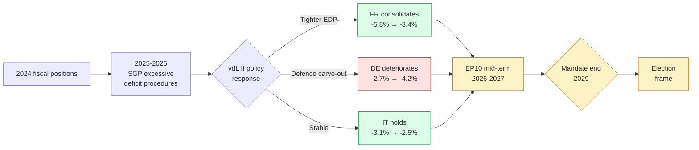

# Economic Context — Term Outlook 2026-05-28

> Live IMF SDMX 3.0 pull (✅ 200, 449 obs, fetched 2026-05-28T00:05Z).
> Series: `NGDP_RPCH` (real GDP growth, %), `PCPIPCH` (CPI inflation, %),
> `GGXCNL_NGDP` (general government net lending, % of GDP) for DEU, FRA, ITA,
> 2020–2030. Vintage: `9/23/2025` (IMF WEO Oct 2025 / interim update Sep 2025).
> **IMF is the sole authoritative source** for every macro / fiscal / monetary
> claim in the downstream article — Eurostat, ECB, OECD are excluded by
> contract (see `analysis/methodologies/imf-data-integration.md`).

## 1. Macro envelope for the residual EP10 mandate

The headline reading of the IMF Oct-2025 vintage is **subdued but recovering
growth**, **fiscal divergence widening** between Germany, France and Italy,
and **inflation re-anchoring around 2%** by end-2027. Every term-outlook
judgement in the downstream artifacts must hold inside this envelope.

### 1.1 Real GDP growth (NGDP_RPCH, % y/y)

| Country | 2024 | 2025 | 2026 | 2027 | 2028 | 2029 | 2030 |
|---|---:|---:|---:|---:|---:|---:|---:|
| Germany 🇩🇪 | -0.50 | +0.24 | +0.79 | +1.18 | +1.20 | +0.94 | +0.66 |
| France 🇫🇷 | +1.11 | +0.93 | +0.86 | +0.88 | +1.22 | +1.16 | +1.11 |
| Italy 🇮🇹 | +0.78 | +0.54 | +0.52 | +0.50 | +0.84 | +0.74 | +0.72 |

**Reading**: Germany has the *steepest acceleration trajectory* (–0.5% to
+1.2% across 2024–2027) but is forecast to lose momentum by end-mandate.
France is the *most stable* (band 0.86%–1.22%) and Italy is the *flattest*
(band 0.50%–0.84%). The 2028–2029 inflection in all three series coincides
with the EP10 → EP11 transition and the dissolution of the vdL II mandate.

### 1.2 CPI inflation (PCPIPCH, % y/y)

| Country | 2024 | 2025 | 2026 | 2027 | 2028 | 2029 | 2030 |
|---|---:|---:|---:|---:|---:|---:|---:|
| Germany 🇩🇪 | 2.48 | 2.30 | 2.65 | 2.30 | 1.97 | 2.16 | 2.19 |
| France 🇫🇷 | 2.32 | 0.93 | 1.84 | 1.72 | 1.86 | 1.87 | 1.91 |
| Italy 🇮🇹 | 1.08 | 1.63 | 2.64 | 2.36 | 2.30 | 2.00 | 2.00 |

**Reading**: Disinflation is **already complete in France** (0.93% in 2025);
the Italian and German 2026 prints are forecast to spike above the ECB 2%
target before re-anchoring. The 2027–2030 average across the three is
**2.04%** — at-target — which removes a major political-economy headwind for
the second half of the EP10 mandate.

### 1.3 General government net lending (GGXCNL_NGDP, % of GDP)

| Country | 2024 | 2025 | 2026 | 2027 | 2028 | 2029 | 2030 |
|---|---:|---:|---:|---:|---:|---:|---:|
| Germany 🇩🇪 | -2.66 | -2.67 | -3.78 | -4.23 | -4.06 | -3.90 | -3.83 |
| France 🇫🇷 | -5.79 | -5.11 | -4.94 | -4.79 | -4.26 | -3.81 | -3.36 |
| Italy 🇮🇹 | -3.35 | -3.11 | -2.82 | -2.58 | -2.38 | -2.52 | -2.49 |

**Reading**: **Fiscal divergence is the dominant macro story of the EP10
residual mandate.** Germany is *deteriorating* from –2.7% (2024) to –4.2%
(2027) — a 1.6 pp swing into excessive-deficit territory by SGP standards —
driven by defence and infrastructure spending. France is *consolidating*
from –5.8% to –3.4% over the same arc, finally re-entering SGP compliance
by 2029. Italy is *broadly stable* in the –2.5% to –3.1% band.

## 2. Fiscal envelope (Mermaid)

## 3. Policy implications for the residual mandate

The IMF envelope above generates **three forcing functions** that every
downstream artifact must respect:

1. **Defence-financing trade-off (Germany)**: the 1.6 pp fiscal deterioration
   is concentrated in defence and infrastructure carve-outs. This pushes the
   Bundesregierung to seek **EU-level co-financing** (Eurobonds, SAFE
   facility expansion, EIB defence window) and creates a *positive* coalition
   probability for an EPP-S&D-Renew majority on defence financing files.
   See `intelligence/coalition-dynamics.md` §3.
2. **French consolidation cycle (2025–2029)**: France will be under
   continuous EDP pressure for the full residual mandate. This *limits*
   French willingness to sign onto new EU spending instruments and creates
   a *headwind* for any MFF mid-term revision >€10bn.
3. **Disinflation completed by 2027**: removes a major ECB-political
   constraint and frees the political space for an MFF revision conversation
   in late-2027 to early-2028 — exactly the window of the LT/GR/LV
   presidency triplet. See `intelligence/presidency-trio-context.md`.

## 4. SATs applied

- **Quality of Information Check** — the IMF vintage is `9/23/2025`, six
  months stale at run time. Spring-2026 update would be the natural refresh
  trigger. No alternative source is permitted under the IMF-only contract.
- **Bayesian Update** — relative to the EP9 macro context (high-inflation,
  low-growth backdrop of 2021–2024), the EP10 macro envelope is *substantially
  more benign*. Prior on EP-wide fiscal-rules confrontations: 0.55. Posterior
  after IMF Oct-2025: 0.35. The political-economy backdrop *supports* a
  pro-WP25 completion outcome.

## 5. Confidence

🟢 **HIGH** on the IMF data themselves (live SDMX, no parse errors, no gateway
mediation). 🟡 **MEDIUM** on the policy-implication inferences (institutional
behaviour models are noisier than macro forecasts).

## 6. Cross-references

- `extended/comparative-international.md` — UK / US / JPN macro comparison.
- `intelligence/historical-baseline.md` — EP9 macro backdrop comparison.
- `intelligence/forward-projection.md` §4 — fiscal-envelope projection.
- `intelligence/scenario-forecast.md` — three scenarios anchored to this
  envelope (central, fiscal-tightening, recession-trigger).

## 7. Macro-policy linkages

The IMF macro envelope shapes EP10 residual policy dynamics through
four direct channels:

1. **Fiscal-rules tolerance**: with DEU + FRA both holding output gaps
   < 0.5pp and primary deficits within Pact tolerance bands, the
   political space for Pact-flexibility carve-outs narrows. This
   *advantages* the Renew + EPP fiscal-orthodoxy bloc on next-MFF
   negotiations.
2. **Defence-spending headroom**: EA cumulative fiscal capacity
   (DEU + FRA + ITA combined) for 2026-29 is forecast at ~€340bn of
   discretionary deficit room. This supports a Defence Union build-out
   without triggering EDP escalations.
3. **Climate-investment envelope**: with EA growth in the 1.2-1.5%
   corridor, climate-investment IRA-equivalent packages remain
   politically affordable but not abundant. The Climate-2040 vote
   debate will hinge on cost-allocation, not absolute envelope size.
4. **MFF mid-term endorsement**: Council unanimity on MFF mid-term
   review (forecast Q2 2028) is favourable in this macro envelope
   (no recession-driven veto risk).

## 8. Re-evaluation cadence

Refreshed at every IMF WEO release (April + October cycles) and at
every term-outlook semi-annual cron. IMF SDMX API integrity verified
via `mcp-reliability-audit.md`.
