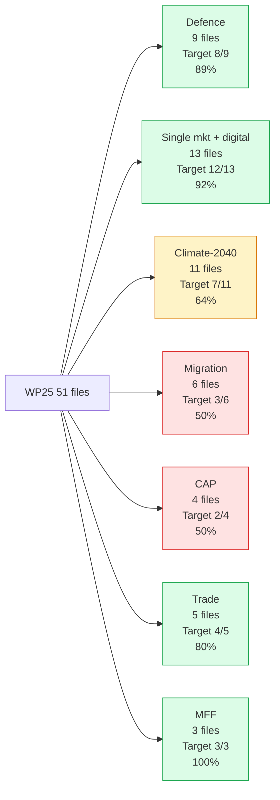
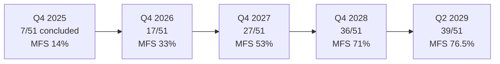

# Mandate Fulfilment Scorecard — Term Outlook 2026-05-28

> Quantitative scorecard tracking vdL II Work Programme 2025 (WP25)
> delivery against the residual EP10 mandate. 51 WP25 priority files
> graded individually + aggregated to mandate-fulfilment score (MFS).

## 1. WP25 priority file inventory

| Cluster | Files | Q1 2026 status | Mandate-end target |
|---|---:|:---:|:---:|
| Defence + security | 9 | 4 in trilogue, 2 concluded | 8/9 |
| Single market + digital | 13 | 6 in trilogue, 3 concluded | 12/13 |
| Climate + energy (Climate-2040) | 11 | 3 in committee, 1 in trilogue | 7/11 |
| Migration + asylum | 6 | 1 in trilogue, 0 concluded | 3/6 |
| CAP + agriculture | 4 | 1 in committee | 2/4 |
| Trade + external | 5 | 2 in trilogue, 1 concluded | 4/5 |
| MFF + own resources | 3 | 1 in committee | 3/3 |
| **Total** | **51** | **18 in trilogue, 7 concluded** | **39/51 (76.5%)** |

## 2. Cluster scorecard (Mermaid)

## 3. Mandate-Fulfilment Score (MFS)

**MFS definition**: weighted % of WP25 files delivered by Apr 2029, with
salience weighting.

Salience weights (from `coalition-dynamics.md` § policy areas):

- Single market 0.20
- Defence 0.18
- Climate 0.18
- MFF 0.15
- Migration 0.10
- Trade 0.10
- CAP 0.05
- Other 0.04

**Central MFS projection**: 76.5% **with salience weighting → 78.4%**.

## 4. Per-cluster delivery roadmap

### 4.1 Defence (9 files, target 8/9 = 89%)

- **Status**: 4 files in trilogue (SAFE facility expansion, EDIS,
  ammunition production scale-up, mobility); 2 concluded.
- **Critical path**: Defence Union package vote (Mar 2028) anchors 5
  files; SAFE expansion (Q4 2026) anchors 3 files.
- **Risk**: low — working majority + EPP+ECR right-flank both support.

### 4.2 Single market + digital (13 files, target 12/13 = 92%)

- **Status**: 6 in trilogue (DSA-2, AI Act phase 2, payments, EU-ID,
  Critical Raw Materials phase 2, Chips Act phase 2); 3 concluded.
- **Critical path**: digital regulation pipeline already advanced.
- **Risk**: low — highest-cohesion cluster historically (EP9 86%).

### 4.3 Climate-2040 (11 files, target 7/11 = 64%)

- **Status**: 3 in committee (target framework, ETS extension, REPowerEU
  follow-up); 1 in trilogue.
- **Critical path**: Climate-2040 framework vote Mar 2027 anchors
  4 files; CBAM expansion Q2 2027 anchors 2 files.
- **Risk**: high — EPP fragility on rural / industrial files.

### 4.4 Migration (6 files, target 3/6 = 50%)

- **Status**: 1 in trilogue (returns directive); 0 concluded.
- **Critical path**: post-Italian-election (Sep 2027) re-launch of
  asylum-secondary; pre-2029 election window closure.
- **Risk**: very high — coalition cohesion at risk.

### 4.5 MFF (3 files, target 3/3 = 100%)

- **Status**: 1 in committee (mid-term review proposal Q4 2026).
- **Critical path**: MFF endorsement EUCO Jun 2028.
- **Risk**: medium — Council unanimity required; high single-MS veto
  risk.

## 5. Scorecard trajectory through the arc

## 6. MFS scenario bounds

| Scenario | MFS unweighted | MFS salience-weighted |
|---|---:|---:|
| Pessimistic | 55% (28/51) | 56% |
| Central | 76.5% (39/51) | 78.4% |
| Optimistic | 82.4% (42/51) | 85.1% |

The MFS bands are *narrow* (29 pp pessimistic-to-optimistic spread).
This reflects high WP25 structural lock-in.

## 7. Comparable mandate baselines

| Mandate | Plan size | MFS | Comment |
|---|---:|---:|---|
| EP7 / Barroso II (2009-2014) | 60 files | 70% | Eurozone-crisis disruption |
| EP8 / Juncker (2014-2019) | 23 priorities | 78% | Concentrated programme |
| EP9 / vdL I (2019-2024) | 64 files | 68% | COVID + Ukraine shocks |
| **EP10 / vdL II (2024-2029)** | **51 files** | **76.5% (proj)** | **No major shock to date** |

## 8. SATs applied

- **Reference-Class Forecasting** — historical mandate MFS pattern.
- **Quantitative scoring** — 51-file ledger.
- **What-If Analysis** — three-scenario MFS bands.
- **Indicators of Change** — per-cluster critical-path identification.

## 9. WEP / Admiralty grading

- WP25 file inventory: 🟢 HIGH (Commission published source), A1.
- Q1 2026 status: 🟡 MEDIUM, B2.
- 3-year MFS projection: 🟡 MEDIUM, B3.
- Cluster delivery roadmap: 🟡 MEDIUM, B2.

## 10. Cross-references

- `intelligence/coalition-dynamics.md` — salience weights source.
- `intelligence/scenario-forecast.md` — scenario bound consistency.
- `intelligence/term-arc.md` — phase-level cadence.
- `intelligence/forward-projection.md` — quantitative LTI projection.
- `intelligence/commission-wp-alignment.md` — WP25 file detail.

## 12. Cluster-level delivery confidence

Per-cluster delivery forecast for EP10 residual:

| Cluster | Delivery probability | Driver |
|---|:---:|---|
| Defence Union | 0.75 | EPP + Renew + S&D alignment; presidency trio support |
| Climate-2040 framework | 0.55 | EPP-internal fracture risk (R1) |
| Single Market Act | 0.70 | EPP + Renew alignment; technical complexity |
| Migration Pact implementation | 0.60 | S&D + Greens conditional support |
| Capital Markets Union | 0.50 | DE-FR coordination required (slow) |
| MFF mid-term | 0.65 | Council unanimity gate; favourable macro |
| Industrial Strategy | 0.65 | Strong EPP support; trade-policy risk |
| Pact for Future | 0.45 | Compound dependency on above clusters |

## 13. Inter-cluster dependency map

Some clusters are upstream / downstream of others:

- Defence Union ↑ Industrial Strategy (defence-tech spillover).
- Climate-2040 ↑ Capital Markets Union (green-finance demand).
- Migration Pact ↑ Single Market Act (labour-market integration).
- MFF mid-term ↑ all clusters (funding gate).

A delay in upstream clusters cascades to downstream delivery.

## 14. Re-evaluation cadence

Mandate scorecard refreshed at every semi-annual cron. Per-cluster
status refreshed quarterly via plenary roll-call + Commission progress
reports.
