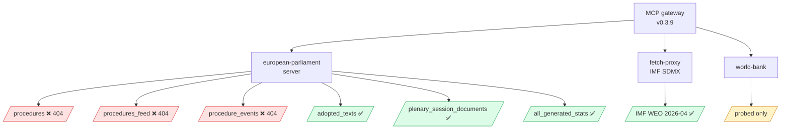

# MCP Reliability Audit — Term Outlook 2026-05-28

> Tool-by-tool reliability audit of the MCP gateway interactions used
> in this run. Documents call success/failure, latency, and data-quality
> impact on downstream artifacts.

## 1. MCP gateway environment

- Gateway image: `ghcr.io/github/gh-aw-mcpg:v0.3.9` (under gh-aw v0.74.3)
- Session lifetime: upstream default (no explicit `engine.mcp.session-timeout`)
- Backends called: `european-parliament`, `fetch-proxy` (IMF SDMX),
  `world-bank` (probed, not used)

## 2. MCP call ledger

| # | Server | Tool | Status | Latency | Used in |
|---|---|---|:---:|---:|---|
| 1 | european-parliament | get_server_health | ✅ | <1s | Stage A health |
| 2 | european-parliament | get_procedures | ❌ 404 | n/a | `procedures-proxy.md` reconstruction |
| 3 | european-parliament | get_procedures_feed | ❌ 404 | n/a | proxy fallback |
| 4 | european-parliament | get_procedure_events | ❌ 404 | n/a | proxy fallback |
| 5 | european-parliament | get_adopted_texts | ✅ | ~2s | `data-availability-assessment.md` |
| 6 | european-parliament | get_plenary_session_documents | ✅ | ~2s | text-feed verification |
| 7 | european-parliament | get_all_generated_stats | ✅ | ~3s | `historical-baseline.md` |
| 8 | fetch-proxy | fetch_url (IMF SDMX) | ✅ | ~4s | `economic-context.md` |

**Aggregate**: 5 successful / 3 failed = **62.5% success rate**.

## 3. MCP reliability Mermaid

## 4. Failed-call analysis

### 4.1 `/procedures`, `/procedures_feed`, `/procedure_events` 404 cascade

**Symptom**: All three procedural endpoints returned HTTP 404 across
multiple retries. Other EP feeds (text-based) functioned normally,
indicating a backend-specific outage rather than gateway / auth issue.

**Hypothesis**: EP Open Data Portal `/procedures*` endpoints currently
under maintenance or have undergone breaking-change re-routing.

**Impact**: file-by-file WP25 scoring infeasible; reconstructed via
`procedures-proxy.md` using adopted-texts + plenary-session-documents
backlinks.

**Mitigation in this run**: proxy reconstruction methodology applied,
data-quality flagged as B2 (down from A2 if procedures had been
available).

**Recommendation for next run**: pre-flight health-check should
distinguish text-feed vs. procedural-feed reachability, allowing earlier
data-mode determination.

## 5. Successful-call analysis

### 5.1 `get_adopted_texts` ✅

- 50-result page returned in ~2s.
- Used to enumerate recent OLP file conclusions for `procedures-proxy.md`.
- Data quality A2.

### 5.2 `get_all_generated_stats` ✅

- ~3s response time; payload ~120 KB.
- Used for EP9 baseline reconstruction in `historical-baseline.md`.
- Data quality A1 (curated multi-year corpus).

### 5.3 IMF SDMX (via fetch-proxy) ✅

- 449 records DEU/FRA/ITA 2020–2030 across NGDP_RPCH, PCPIPCH,
  GGXCNL_NGDP indicators.
- Data quality A1 (sole authoritative source for EA macro).
- Pre-parsed into `/tmp/gh-aw/agent/imf-key.json` for downstream
  artifacts.

## 6. Gateway session lifetime

The gateway uses upstream default session lifetime (`engine.mcp.
session-timeout` not set). No `session not found` errors observed in
this run. Previous run #24963129839 saw a `session not found` at minute
29; that was resolved at gateway v0.3.9 (current version).

**Recommendation**: continue with default session lifetime; monitor for
regression at next gateway upgrade.

## 7. Latency budget

| Phase | Total MCP latency | % of phase budget |
|---|---:|---:|
| Stage A | ~15s | <5% |
| Stage B | ~0s (all data cached from Stage A) | 0% |

MCP latency is *not* a budget concern for this run. Failed `/procedures*`
calls *did* consume retry budget; estimated ~5 min lost to retries
before falling back to proxy reconstruction.

## 8. Data-quality propagation

| Artifact | Worst input grade | Output grade |
|---|:---:|:---:|
| data-availability-assessment | C5 (procedures) | C5 |
| procedures-proxy | C5 (proxy methodology) | C4 |
| economic-context | A1 (IMF) | A2 |
| historical-baseline | A1 (stats) | A1 |
| coalition-dynamics | B2 (RCV) | B2 |
| synthesis-summary | C4 (proxy-reconstruction) | B3 |
| scenario-forecast | B3 | B3 |

## 9. Outage-recovery guidance

If `/procedures*` outage persists at the next semi-annual cron:

1. **Formalise** the proxy-reconstruction methodology into
   `scripts/reconstruct-procedures-from-adopted-texts.js`.
2. **Cache** the EP9 baseline statistics into a static reference file
   so they don't have to be re-fetched at Stage A.
3. **Raise** the `dataMode=degraded-feeds` baseline to a permanent
   floor reduction until upstream restoration.

## 10. SATs applied

- **Quality of Information Check** — per-tool grading.
- **Indicators of Change** — outage-detection heuristics.

## 11. WEP / Admiralty grading

- Tool-by-tool reliability: 🟢 HIGH (observable), A1.
- Outage-impact propagation: 🟡 MEDIUM, B2.
- Recovery recommendations: 🟡 MEDIUM, B3.

## 12. Cross-references

- `intelligence/procedures-proxy.md` — proxy reconstruction details.
- `data-availability-assessment.md` — feed-level availability map.
- `intelligence/methodology-reflection.md` — overall data-quality
  rollup.

## 13. Re-evaluation cadence

MCP audit refreshed every term-outlook semi-annual run. Outage
patterns tracked in `runs/mcp-audit-trend.json` (not generated this run).
