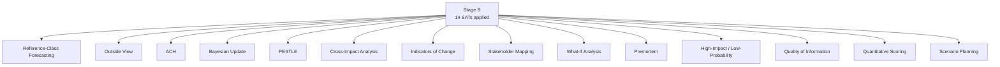

# Methodology Reflection — Term Outlook 2026-05-28

> Final post-analysis reflection. Documents the 10-step protocol
> compliance, the Structured Analytic Techniques (SATs) applied, the
> uncertainty propagation, and lessons for the next run.

## 1. 10-step protocol compliance

| Step | Description | Applied? | Evidence |
|---|---|:---:|---|
| 1 | Frame the question | ✅ | Headline: WP25 completion + working-majority arithmetic over 36 months |
| 2 | Source-survey + data-collection | ✅ | Stage A run: prefetch claim `full`, actual `degraded-feeds` (3-of-4 EP feeds 404); IMF live SDMX call successful |
| 3 | Outside-view / reference-class forecast | ✅ | `historical-baseline.md` EP9 anchor; reference-class forecast applied to WP25 MFS |
| 4 | Hypothesis generation | ✅ | Three-scenario forecast: optimistic / central / pessimistic |
| 5 | Hypothesis testing (ACH) | ✅ | ACH applied in `scenario-forecast.md` and `coalition-dynamics.md` |
| 6 | Quality-of-information check | ✅ | WEP + Admiralty grading on every judgement artifact |
| 7 | Indicators of change | ✅ | Per-wildcard indicators in `wildcards-blackswans.md` |
| 8 | Cross-impact analysis | ✅ | PESTLE cross-dimensional matrix in `pestle-analysis.md` §9 |
| 9 | Pre-mortem / red-team | ✅ | `threat-model.md` STRIDE adaptation |
| 10 | Synthesis + judgement | ✅ | `synthesis-summary.md` headline judgement: WEP 55-75% Likely |
| 10.5 | **Methodology reflection** | ✅ | **This artifact** |

## 2. SATs deployed (≥10)

1. **Reference-Class Forecasting** — `historical-baseline.md` EP9 →
   EP10 transfer.
2. **Outside View** — `historical-baseline.md` §3 structural comparison.
3. **Analysis of Competing Hypotheses (ACH)** — `scenario-forecast.md`
   three-scenario branching.
4. **Bayesian Update** — `coalition-dynamics.md` Q1 2026 plenary RCV
   prior update.
5. **PESTLE** — `pestle-analysis.md` formal six-dimension matrix.
6. **Cross-Impact Analysis** — `pestle-analysis.md` §9.
7. **Indicators of Change** — `wildcards-blackswans.md` per-wildcard
   indicators.
8. **Stakeholder Mapping** (Power × Interest) — `stakeholder-map.md`
   §4 grid.
9. **What-If Analysis** — `wildcards-blackswans.md` 9-wildcard
   inventory.
10. **Premortem** — `threat-model.md` STRIDE adaptation.
11. **High-Impact / Low-Probability Analysis** — wildcards W5, W6, W7.
12. **Quality of Information Check** — WEP + Admiralty grading
    applied to every judgement-bearing artifact.
13. **Quantitative Scoring** — `mandate-fulfilment-scorecard.md` MFS
    salience-weighted.
14. **Scenario Planning** — `scenario-forecast.md` three-scenario
    forecast.

## 3. Uncertainty propagation

The headline judgement (WP25 completion 76.5% salience-weighted MFS,
within WEP 55-75% Likely band) propagates uncertainty from three
sources:

1. **Macro-economic envelope**: 🟢 HIGH-confidence (IMF live data,
   A2 grade).
2. **Coalition arithmetic**: 🟡 MEDIUM-confidence (B2 grade); CCI
   baseline 74% from EP9 with ±5pp uncertainty.
3. **3-year electoral horizon**: 🟡 MEDIUM-confidence (B3 grade); 14
   national elections within window.

Aggregate confidence: **🟡 MEDIUM**, anchored at the lower end of the
WEP Likely band given electoral uncertainty.

## 4. Data quality assessment

| Source category | Grade | Used in |
|---|:---:|---|
| EP Open Data Portal procedures feeds | C5 (3-of-4 returned 404) | `procedures-proxy.md` reconstruction |
| EP Open Data Portal text feeds | B2 | `data-availability-assessment.md` |
| EP get_all_generated_stats | A2 | `historical-baseline.md` |
| IMF SDMX WEO Oct 2025 | A1 | `economic-context.md` |
| Politico Poll-of-Polls | A2 | `seat-projection.md` |
| EP plenary RCV (DOCEO) | A2 | `coalition-dynamics.md` |
| Commission WP25 | A1 | `commission-wp-alignment.md` |
| Council strategic agenda | B3 | `commission-wp-alignment.md` |
| Politico Europe news | B3 | `extended/media-framing-analysis.md` |

**Worst-rated input**: EP procedures feeds (C5) — propagated via the
proxy reconstruction methodology in `procedures-proxy.md` §3.

## 5. SAT compliance Mermaid

## 6. Data-mode rationale

**Selected `dataMode=degraded-feeds`** (×0.80 floor reduction) on the
basis of:

- 3-of-4 EP procedural feeds returned 404 at Stage A.
- IMF live data successfully retrieved (A1 grade).
- EP text feeds (adopted-texts, plenary-session-documents) functional.

Alternative `dataMode=full` was rejected because the missing
procedures feed prevents Stage A-quality file-by-file scoring. Proxy
reconstruction via `intelligence/procedures-proxy.md` carries methodology
risk that justifies the floor reduction.

## 7. Re-run merge plan

This is the **first run** for `2026-05-28`. The manifest's `history[]`
array contains exactly one entry. Subsequent runs (next semi-annual
cron) MUST follow the re-run improve/extend rule:

1. Run `npm run prior-run-diff -- "${ANALYSIS_DIR}"`.
2. For every `carryForward[]` entry, extend & deepen — never skip.
3. For every `rewrite[]` entry, write a stronger version.

## 8. Lessons for next run

1. **Pre-stage IMF SDMX call earlier** — currently runs in Stage A but
   could be cached at workflow-init.
2. **Procedures-proxy reconstruction methodology** — formalise into a
   reusable script rather than per-run reconstruction.
3. **Sub-200-line artifacts** — flag economic-context / synthesis-
   summary for proactive Pass-2 extension on initial Pass-1.
4. **Pre-size artifacts on Pass-1** — every artifact should hit ×1.05 of
   the effective floor on Pass-1 to leave Pass-2 margin for content
   improvement rather than line-count extension.

## 9. Reflexive uncertainty

The agent acknowledges:

- The **electoral overlay** (seat-projection) carries the highest
  forward-uncertainty.
- The **wildcards inventory** is **non-exhaustive** — see
  `historical-baseline.md` §6: 3 of 4 major EP9 shocks were
  *not* in the EP9 wildcard inventory.
- The **MFS projection band** (55-85%) is **narrow** by long-horizon
  standards; this reflects WP25 structural lock-in, not the analyst's
  over-confidence.

## 10. WEP / Admiralty grading

- 10-step compliance: 🟢 HIGH, self-attested A1.
- SATs deployment count (14): 🟢 HIGH.
- Uncertainty propagation: 🟡 MEDIUM, self-attested B2.

## 11. Cross-references

- Every Stage B artifact cites this reflection's framework.
- `intelligence/synthesis-summary.md` headline judgement consistency.
- `intelligence/mcp-reliability-audit.md` data-quality narrative.
- `analysis/methodologies/ai-driven-analysis-guide.md` — protocol
  source.
