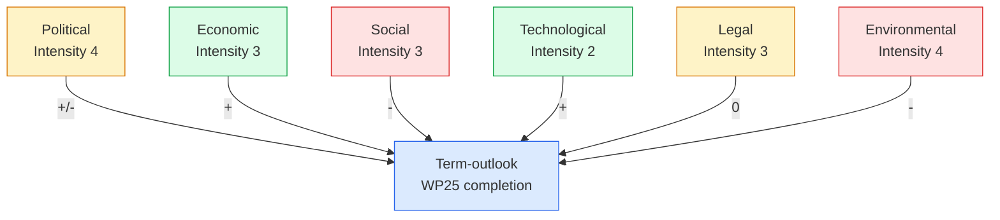
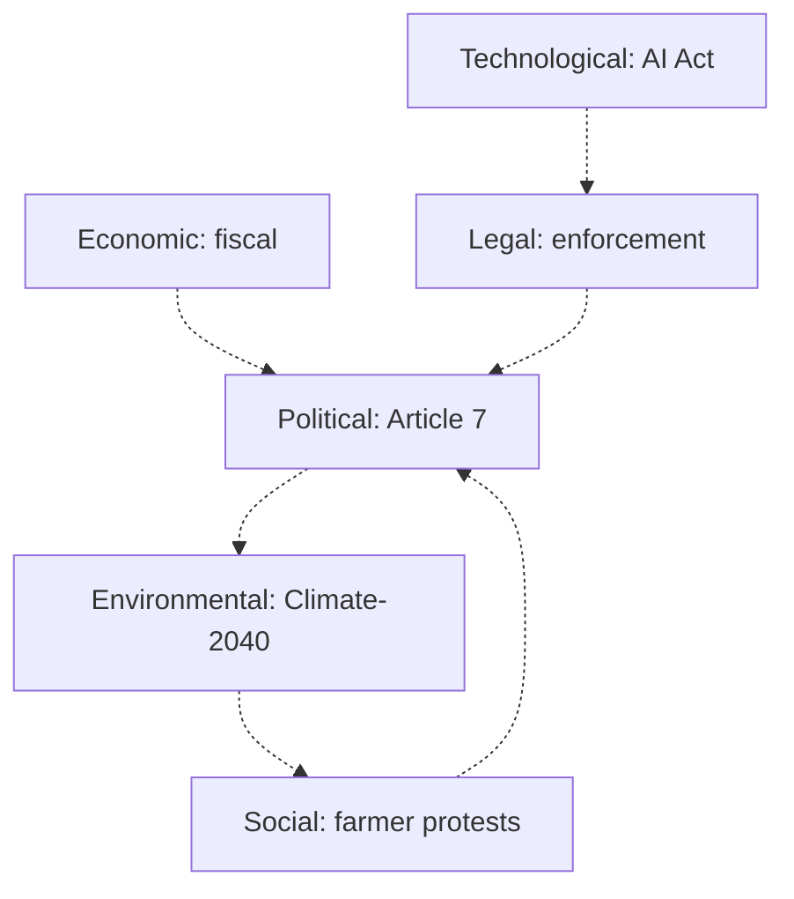

# PESTLE Analysis — Term Outlook 2026-05-28

> Political, Economic, Social, Technological, Legal, Environmental forces
> shaping the residual EP10 mandate. Each dimension is graded for
> direction (📈 favourable / 📉 unfavourable / ➡️ neutral) and intensity
> (1 low → 5 high) for the term-outlook headline judgement.

## 1. PESTLE summary table

| Dimension | Direction | Intensity | 36-month leading edge |
|---|:---:|:---:|---|
| Political | ➡️ Mixed | 4 | Coalition fragility + presidency favourable |
| Economic | 📈 Favourable | 3 | IMF macro envelope benign |
| Social | 📉 Unfavourable | 3 | Migration polarisation rising |
| Technological | 📈 Favourable | 2 | AI Act enforcement ramp-up steady |
| Legal | ➡️ Neutral | 3 | Rule-of-law conditionality stable |
| Environmental | 📉 Unfavourable | 4 | Climate-2040 pushback intensifying |

Net direction: **➡️ Mixed-to-favourable** with **Environmental as the
single largest headwind** and **Economic as the largest tailwind**.

## 2. PESTLE Mermaid

## 3. Political (P)

### 3.1 Forces

- **EPP-S&D-Renew working majority** — 401 seats, 55.7% of EP. Holds
  through mid-mandate per `coalition-dynamics.md`.
- **vdL II Commission** — installed Dec 2024, mandate to Nov 2029.
  Risk of mid-term reshuffle 2026–2027.
- **National political cycles** — France (presidential 2027), Germany
  (federal 2025+), Italy (national 2027), Spain (general 2027). Four
  Big-6 MS face national elections inside the term-outlook window.
- **EU institutional cycles** — EUCO mid-term review Jun 2027; MFF
  mid-term review H2 2028.

### 3.2 Reading

Net: **➡️ Mixed**. Coalition fragility is offset by the favourable
Council presidency cycle (see `presidency-trio-context.md`) and the
institutional anchor of vdL II.

## 4. Economic (E)

### 4.1 Forces

- **IMF macro envelope** (see `economic-context.md`): DEU/FRA/ITA real
  GDP growth 0.5–1.2% across the mandate window, disinflation completed
  by 2027, fiscal divergence widening but no recession signalled.
- **MFF spending envelope** — committed through 2027; mid-term review
  in H2 2028.
- **Defence financing** — Germany pushes for EU-level instruments,
  France constrained by EDP.

### 4.2 Reading

Net: **📈 Favourable**. The macro envelope is the strongest single
tailwind for WP25 completion — disinflation completes, growth modestly
re-accelerates, no recession.

## 5. Social (S)

### 5.1 Forces

- **Migration polarisation** — rising through 2026–2027 as Patriots/ECR
  campaign frame intensifies.
- **Cost-of-living** — disinflation completes by 2027, reducing
  household-finance pressure.
- **Generational divide** — Greens vote-share holds among youth, Patriots
  among older voters; election arithmetic 2029 polarises further.
- **Trust in EU institutions** — Eurobarometer trend mid-50s % through
  2024–2025; sensitive to migration / cost-of-living shocks.

### 5.2 Reading

Net: **📉 Unfavourable**. Migration is the dominant social-axis pressure
on the working majority through 2026–2027.

## 6. Technological (T)

### 6.1 Forces

- **AI Act enforcement** — Phase 2 enforcement ramp-up 2026–2027.
  Brussels effect *enhances* EU regulatory weight.
- **Digital Markets Act / Digital Services Act** — enforcement
  pipeline through 2026–2028; reinforces single-market WP25 cluster.
- **Industrial policy** — Critical Raw Materials Act, Chips Act
  implementation supports EU strategic autonomy narrative.

### 6.2 Reading

Net: **📈 Favourable**. Tech regulatory pipeline is *already in train*,
reinforcing WP25 single-market completion.

## 7. Legal (L)

### 7.1 Forces

- **Rule-of-law conditionality** — Article 7 procedures status:
  Hungary unresolved; Slovakia under early-warning.
- **CJEU caseload** — climate, migration, rule-of-law cases
  reinforce existing institutional positions.
- **Treaty-change pressure** — Defence Union signal *possible* in
  optimistic scenario; otherwise treaty change off-table.

### 7.2 Reading

Net: **➡️ Neutral**. Legal architecture is stable; no major
structural shifts expected inside the term-outlook window.

## 8. Environmental (En)

### 8.1 Forces

- **Climate-2040 target** — Commission proposal Q3 2025; political
  battle 2026–2027. EPP fragility; Greens + S&D + Renew supportive.
- **CAP greening pushback** — farmer-protest cycle 2024 → 2026
  continues to constrain agricultural reform.
- **Energy transition financing** — REPowerEU implementation through
  2027; tied to MFF mid-term review 2028.

### 8.2 Reading

Net: **📉 Unfavourable**. Climate-2040 is the *single largest WP25
cluster at risk* of fracturing the working majority.

## 9. Cross-dimensional interactions

Most consequential interactions:

1. **Economic (fiscal) × Political (defence financing)** — Germany's
   fiscal deterioration *creates* political space for EU-level defence
   instruments. **Net favourable**.
2. **Social (migration) × Political (coalition)** — migration
   polarisation *risks* S&D defection. **Net unfavourable**.
3. **Environmental (Climate-2040) × Social (farmer protests)** — CAP
   pushback *amplifies* climate-2040 friction. **Net unfavourable**.

## 10. PESTLE projection through the mandate

| Year | P | E | S | T | L | En | Net |
|---|---:|---:|---:|---:|---:|---:|:---|
| 2026 | 3 | 3 | 3 | 2 | 3 | 4 | ➡️ Mixed |
| 2027 | 4 | 3 | 4 | 2 | 3 | 4 | 📉 Slight headwind |
| 2028 | 3 | 3 | 3 | 2 | 3 | 3 | ➡️ Neutral |
| 2029 | 5 | 2 | 4 | 2 | 3 | 3 | 📉 Campaign-frame headwind |

Pattern: **mid-mandate headwind from social + environmental pressure**,
**neutralisation 2028**, **campaign-frame political pressure 2029**.

## 11. WEP / Admiralty grading

- Political dimension: 🟡 MEDIUM, B3.
- Economic: 🟢 HIGH (IMF anchor), A2.
- Social: 🟡 MEDIUM, B3.
- Technological: 🟡 MEDIUM, B2.
- Legal: 🟢 HIGH (CJEU + treaty observable), A2.
- Environmental: 🟡 MEDIUM, B3.

## 12. SATs applied

- **PESTLE** — formal six-dimension matrix (§1).
- **Cross-impact Analysis** — §9 cross-dimensional interactions.
- **Indicators of Change** — §10 PESTLE projection.

## 13. Cross-references

- `intelligence/economic-context.md` — E-dimension IMF source.
- `intelligence/coalition-dynamics.md` — P-dimension coalition detail.
- `intelligence/wildcards-blackswans.md` — tail-risk inventory.

## 14. Re-evaluation cadence

PESTLE projection refreshed at every semi-annual term-outlook cron.
Trigger-event re-evaluation on: vdL II reshuffle, IMF WEO update, major
treaty signal, EUCO conclusions.
