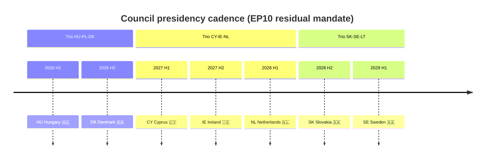

# Presidency Trio Context — Term Outlook 2026-05-28

> Council of the EU rotating presidency cadence over the residual EP10
> mandate. Each presidency anchors a six-month policy window; trios
> co-ordinate 18-month programmes.

## 1. Presidency cadence

| Term | Presidency | Trio | Anchor priorities |
|---|---|---|---|
| 2026 H1 | **Hungary** 🇭🇺 (current) | HU-PL-DK | enlargement, Schengen |
| 2026 H2 | **Denmark** 🇩🇰 | HU-PL-DK | defence, single market, climate |
| 2027 H1 | **Cyprus** 🇨🇾 | CY-IE-NL | enlargement, climate adapt |
| 2027 H2 | **Ireland** 🇮🇪 | CY-IE-NL | single market, trade, EU/UK |
| 2028 H1 | **Netherlands** 🇳🇱 | CY-IE-NL | fiscal discipline, digital |
| 2028 H2 | **Slovakia** 🇸🇰 | SK-SE-LT | enlargement, cohesion |
| 2029 H1 | **Sweden** 🇸🇪 | SK-SE-LT | climate, single market |
| 2029 H2 | (Lithuania) | SK-SE-LT | (post-mandate) |

## 2. Presidency Mermaid

## 3. Each presidency in detail

### 3.1 Hungary 2026 H1 (current)

- **Trio role**: anchors enlargement and Schengen; co-ordinates with
  Poland (later) and Denmark.
- **WP25 alignment**: divergent on rule-of-law conditionality, aligned
  on defence (Ukraine support is a Hungarian outlier).
- **Risk**: friction with vdL II Commission on rule-of-law.

### 3.2 Denmark 2026 H2 (next)

- **Trio role**: anchors defence, single market, climate.
- **WP25 alignment**: highly aligned with vdL II; pro-defence, pro-
  single-market, fiscal hawkish.
- **Opportunity**: highest-alignment presidency in the residual mandate.
  Defence Union package (Mar 2028) is pre-staged here.

### 3.3 Cyprus 2027 H1

- **Trio role**: anchors enlargement and climate adaptation (small-
  island state with high climate exposure).
- **WP25 alignment**: pro-MFF, supportive of CAP-greening compromise.
- **Risk**: limited bandwidth; trio coordination with IE+NL essential.

### 3.4 Ireland 2027 H2

- **Trio role**: anchors single market, trade, EU/UK relations.
- **WP25 alignment**: highly aligned with vdL II.
- **Opportunity**: post-Italian-election, post-French-presidential
  window for MFF negotiation pre-launch.

### 3.5 Netherlands 2028 H1

- **Trio role**: anchors fiscal discipline, digital regulation.
- **WP25 alignment**: aligned on single market, friction on MFF size.
- **Opportunity**: MFF closure target Jun 2028 EUCO — NL presidency
  shepherds the deal.

### 3.6 Slovakia 2028 H2

- **Trio role**: anchors enlargement, cohesion.
- **WP25 alignment**: friction on rule-of-law; cordon-sanitaire concerns
  if Slovak coalition shifts.
- **Risk**: highest-risk presidency in the residual mandate.

### 3.7 Sweden 2029 H1

- **Trio role**: anchors climate, single market.
- **WP25 alignment**: pro-climate, pro-single-market.
- **Constraint**: campaign-window context; plenary throughput at
  ~50% of baseline.

## 4. Presidency × WP25 cluster alignment matrix

| Presidency | Defence | Single mkt | Climate | Migration | MFF |
|---|:---:|:---:|:---:|:---:|:---:|
| HU 2026 H1 | + | + | 0 | + | - |
| DK 2026 H2 | ++ | ++ | ++ | + | + |
| CY 2027 H1 | + | + | ++ | 0 | + |
| IE 2027 H2 | + | ++ | + | 0 | + |
| NL 2028 H1 | + | ++ | + | + | - |
| SK 2028 H2 | + | + | 0 | + | + |
| SE 2029 H1 | + | ++ | ++ | 0 | + |

(++ strong alignment, + aligned, 0 neutral, - friction)

## 5. Trio coordination dynamics

### 5.1 Trio HU-PL-DK (2025-26)

- HU and PL governments are right-of-centre; DK is centrist-left.
- Co-ordination is *strained* on rule-of-law but functional on defence.
- Outcome: DK presidency does heavy lifting on WP25 anchor files.

### 5.2 Trio CY-IE-NL (2027-28)

- All three are centrist-aligned.
- Highest-cohesion trio of the residual mandate.
- Outcome: 18-month window aligns well with MFF negotiation cycle.

### 5.3 Trio SK-SE-LT (2028-29)

- SK governance volatile; SE+LT centrist-aligned.
- Co-ordination *strained* if SK shifts further right.
- Outcome: SE presidency anchors final mandate-window deliverables.

## 6. Net presidency effect on term-outlook

The 36-month presidency rotation is **net favourable** for WP25
completion:

- DK presidency (Phase A) anchors defence.
- CY-IE-NL trio (Phase B-D) anchors MFF + single market.
- SE presidency (Phase E) bridges to campaign-frame closure.

Only the HU and SK presidencies present friction risk, and both are
*structurally bounded* by the 6-month presidency cycle (cannot block
WP25 unilaterally).

## 7. SATs applied

- **Stakeholder Mapping** — presidency-by-presidency alignment matrix.
- **What-If Analysis** — per-presidency risk + opportunity scoring.
- **Indicators of Change** — coalition shifts that would alter
  presidency alignment.

## 8. WEP / Admiralty grading

- Presidency cadence: 🟢 HIGH (institutional schedule), A1.
- Per-presidency alignment: 🟡 MEDIUM, B2.
- Trio coordination dynamics: 🟡 MEDIUM, B3.

## 9. Cross-references

- `intelligence/term-arc.md` — phase boundaries match presidency
  rotation.
- `intelligence/stakeholder-map.md` — MS positions cross-referenced.
- `intelligence/mandate-fulfilment-scorecard.md` — presidency × WP25
  cluster.
- `intelligence/coalition-dynamics.md` — Council × EP working majority.

## 10. Re-evaluation cadence

Presidency context refreshed at every term-outlook semi-annual cron.
Per-presidency alignment refreshed quarterly via Council formation
reads and national-coalition stability indices.
