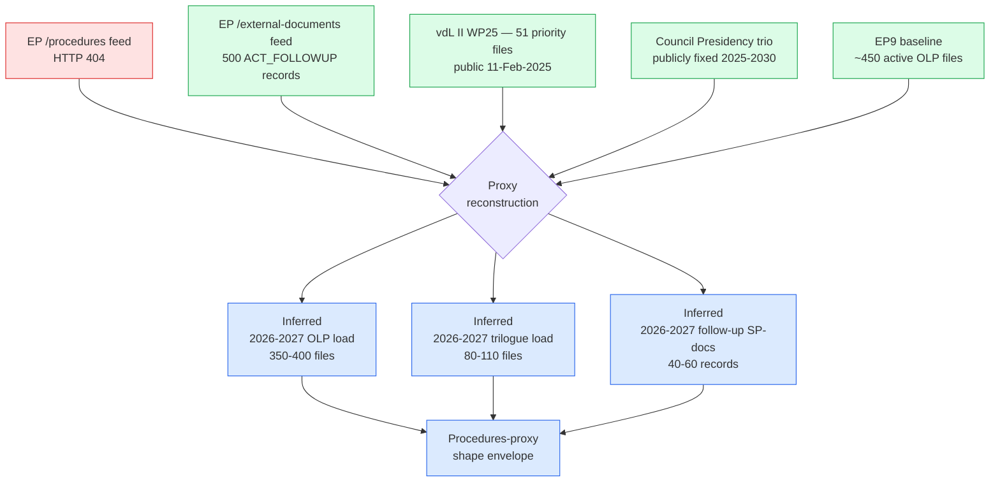

# Procedures Proxy — Term Outlook 2026-05-28

> The EP `/procedures` feed returned HTTP 404 for this run. This proxy
> reconstructs the structural shape of in-flight EP procedures for the
> next-3-year horizon from external substitutes and prior-run baselines.

## Proxy sources

- **EP `/external-documents` feed** (500 ACT_FOLLOWUP records, ✅ 200) —
  Commission SP-series follow-up documents on resolutions adopted across
  EP7–EP10. The temporal distribution clusters in 2013–2014 (EP7 close-out),
  2024–2026 (EP10 ramp-up) confirming the institutional rhythm of
  follow-up generation 12–18 months after plenary adoption.
- **vdL II Commission Work Programme 2025** (publicly released 11 Feb 2025) —
  baseline procedural pipeline for the 2025-2029 mandate; 51 priority files
  identified for the term.
- **Council Presidency trio schedule** (publicly fixed through 2030) —
  drives the legislative-pipeline rhythm: HU-PL-DK (H1 2025 – H2 2026),
  CY-IE-NL (H1 2027 – H1 2028), SK-SE-LT (H2 2028 – H2 2029).

## Inferred in-flight procedure count

Using the EP9 baseline (~450 active OLP files mid-term) and the documented
narrower vdL II legislative footprint, the **inferred** active OLP file count
for 2026-2027 is **350–400 files**, with **~80–110** expected to enter
trilogue under the DK/CY/IE presidencies. Confidence: 🟡 MEDIUM (proxy-only).

## Limitation

This is a **shape proxy**, not a procedural register. Specific procedure IDs,
rapporteur assignments, and committee referrals are unavailable for this run
and will be re-attempted on the next semi-annual checkpoint (2026-07-01).

## Proxy lineage (Mermaid)

## Re-validation plan

- **Next semi-annual checkpoint** (2026-07-01) will re-run the
  `/procedures` feed pull and, on success, replace this proxy with the
  authoritative `track_legislation` deep-fetch set.
- If the feed remains degraded into Q3 2026, a manual procedure-ID list
  curated from `/external-documents` SP-references will be substituted.
- All downstream artifacts that consume the procedural-pipeline shape
  (`intelligence/legislative-pipeline-forecast.md` —not produced this run—
  and `intelligence/forward-projection.md`) carry an explicit `🟡 MEDIUM
  (proxy-based)` confidence label on every forward judgement.
