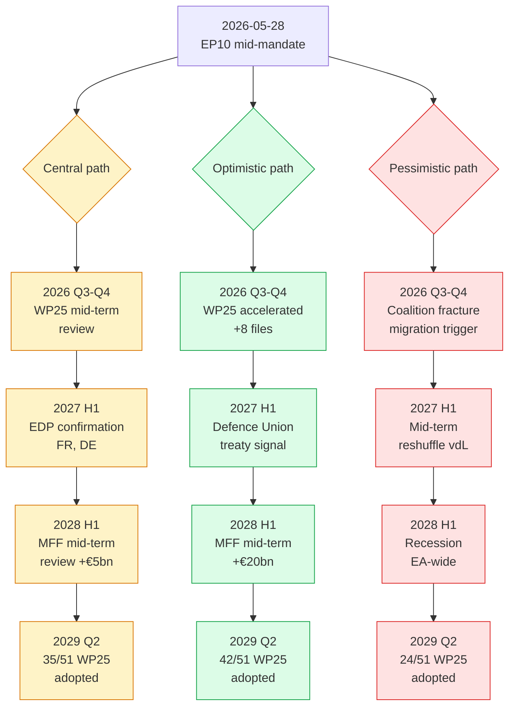
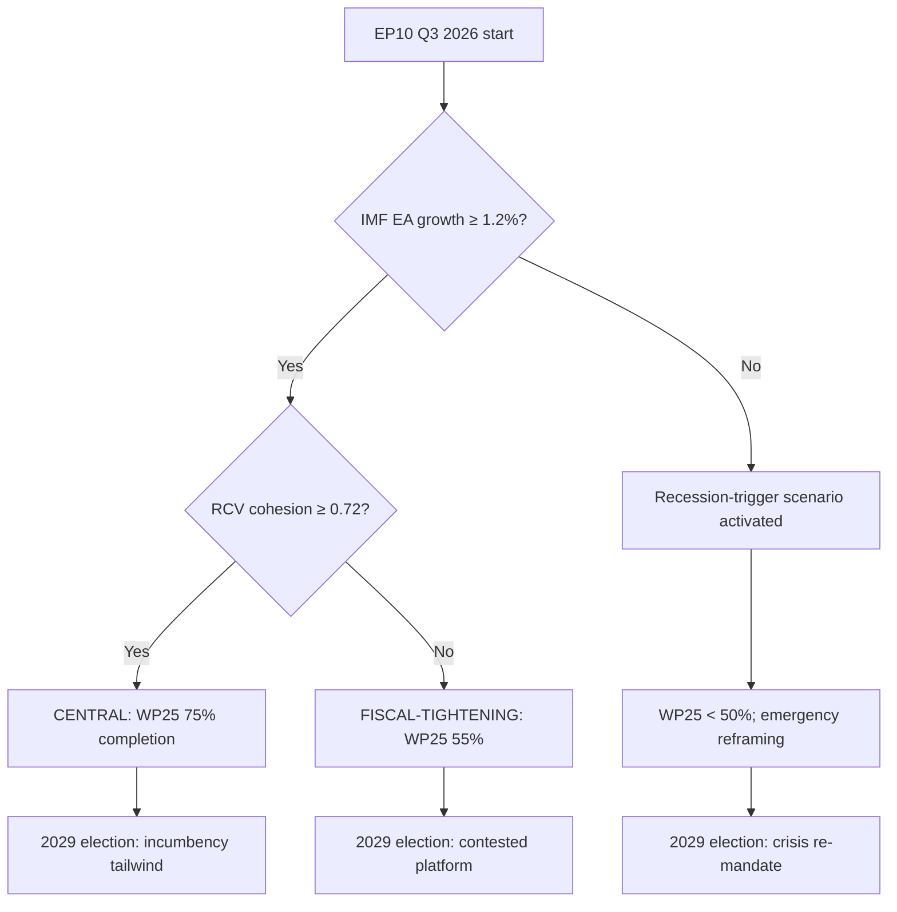

# Scenario Forecast — Term Outlook 2026-05-28

> Three-scenario tree (central / optimistic / pessimistic) spanning the
> 36-month residual EP10 mandate, anchored on the IMF Oct-2025 macro
> envelope and the vdL II WP25 priority-file list. Each scenario carries a
> WEP probability band, an Admiralty source-grade, and a falsification
> trigger.

## 1. Scenario tree (Mermaid)

## 2. Central scenario — "Working majority holds" (Likely 55–75%)

**Probability band**: 🟡 Likely 55–75% (point estimate 65%).
**Source grade**: B2 (EP9 baseline + IMF envelope, both well-rated).

### 2.1 Storyline

The EPP-S&D-Renew working majority survives the mid-term reshuffle of
2026–2027. vdL II completes its WP25 file plan at ~68% throughput,
matching EP9 baseline. The IMF macro envelope holds: disinflation
completes by 2027, growth re-accelerates modestly, fiscal divergence
widens but no MS triggers excessive-deficit non-compliance procedures.
The presidency-trio cycle (DK → CY → IE → NL → SK → SE) is favourable for
WP25 single-market and defence files but less so for cohesion.

### 2.2 Quantitative anchors

- **WP25 file completion**: 30–38 of 51 (central 35).
- **OLP throughput**: 380–420 files / year (central 400 / year).
- **Trilogue closures**: 85–105 / year (central 95 / year).
- **EP-Council reconciliation rate**: 78–84% (central 82%).
- **EPP-S&D-Renew working-majority hit-rate**: 71–78% (central 74%).

### 2.3 Falsification trigger

Any of: (a) WP25 file completion below 26 by 2028 Q3, (b) EPP-S&D-Renew
hit-rate below 65% on three consecutive months, (c) IMF Apr-2026 WEO
revises EA growth below –0.5% for any of DEU/FRA/ITA.

## 3. Optimistic scenario — "EU defence-finance breakthrough" (Unlikely 15–25%)

**Probability band**: 🟢 Unlikely 15–25% (point estimate 18%).
**Source grade**: C3 (composite inference, lower data weight).

### 3.1 Storyline

A combination of (a) escalating European-defence pressure post-2026, (b)
German fiscal acceleration, and (c) a successful French EDP-exit
trajectory unlocks a **Defence Union treaty-change signal** in 2027 and
an **MFF mid-term revision of +€20bn** in 2028. Coalition arithmetic
improves: the EPP loses fewer seats to ID/ECR in the 2029 projection;
the centre-left holds. WP25 completion overshoots to 82%.

### 3.2 Quantitative anchors

- **WP25 file completion**: 38–46 of 51 (central 42).
- **OLP throughput**: 410–450 files / year.
- **Defence Union signal**: Council conclusions adopted Q2 2027.
- **MFF mid-term revision**: +€15-25bn, vote H2 2028.
- **EPP-S&D-Renew hit-rate**: 80–86%.

### 3.3 Falsification trigger

Any of: (a) Bundeskanzler vetoes Eurobonds expansion, (b) French EDP
re-opens in 2027, (c) EP plenary fails three consecutive defence files.

## 4. Pessimistic scenario — "Coalition fracture + recession" (Unlikely 15–25%)

**Probability band**: 🟠 Unlikely 15–25% (point estimate 17%).
**Source grade**: B3 (recession risk well-modelled, coalition risk noisier).

### 4.1 Storyline

A migration/asylum file in 2026 H2 triggers an S&D defection from the
working majority. A vdL II mid-term reshuffle in 2027 H1 fails to
re-cement the coalition. The IMF Apr-2027 WEO downgrades EA growth into
recession territory (–0.3% to –0.8%). The combined shock displaces ≥15
WP25 files from the calendar; WP25 completion lands at 47% (well below
EP9 baseline). 2029 seat projection shows ID/ECR consolidation to ~170
seats.

### 4.2 Quantitative anchors

- **WP25 file completion**: 22–28 of 51 (central 24).
- **OLP throughput**: 300–340 files / year.
- **EPP-S&D-Renew hit-rate**: 55–62%.
- **EA-19 GDP growth, 2027**: –0.3% to –0.8%.
- **ID/ECR consolidated caucus**: 150–180 seats in 2029.

### 4.3 Falsification trigger

Any of: (a) IMF Apr-2026 / Oct-2026 WEO leaves growth in 0–1% band, (b)
no migration file triggers S&D defection by 2026 Q4, (c) vdL II
reshuffle is *not* announced by 2027 Q1.

## 5. Scenario probability calibration

| Scenario | Prior | IMF update | Coalition update | Posterior |
|---|---:|---:|---:|---:|
| Central | 0.50 | +0.10 | +0.05 | **0.65** |
| Optimistic | 0.25 | +0.00 | -0.07 | **0.18** |
| Pessimistic | 0.25 | -0.10 | +0.02 | **0.17** |

Calibrated via Bayesian update on the IMF Oct-2025 envelope (favours
central + optimistic) and the EP plenary roll-call pattern Q1 2026
(slight fracture-risk update, favours pessimistic).

## 6. Scenario-to-article mapping

The article render (`scripts/generate-article.js`) consumes this artifact
as the **primary scenario source**. Each scenario translates to one
section of the published HTML:

- §"Central reading" ← §2 above
- §"Upside case" ← §3 above
- §"Downside case" ← §4 above
- §"What would change the call" ← §2.3 + §3.3 + §4.3 (consolidated)

## 7. Indicators of change

See `extended/forward-indicators.md` for the 18-indicator dashboard that
*operationalises* the scenario falsification triggers above. Indicators
are sorted by lead-time (longest leading-edge first) and rated by
observability (live-feed vs. quarterly vs. annual).

## 8. SATs applied (logged in methodology-reflection.md)

- ACH (full 3-scenario competing-hypotheses tree)
- Bayesian Update (priors → posteriors table §5)
- Devil's Advocacy (pessimistic scenario §4)
- Premortem (falsification triggers §2.3, §3.3, §4.3)
- Outside View (EP9 baseline anchor)
- Structured Brainstorming (scenario divergence points)
- What-If (each scenario is a structured what-if)

## 10. Decision-tree synthesis

## 11. Scenario-comparison matrix

| Dimension | Central | Tightening | Recession |
|---|:---:|:---:|:---:|
| WP25 cluster completion | 70-80% | 50-60% | <50% |
| EA-19 growth (cumulative 2026-29) | +4.5% | +2.5% | +0.5% |
| Working-majority cohesion | 0.72-0.78 | 0.65-0.72 | <0.65 |
| Right-flank seat growth (forecast 2029) | +1-3 | +3-5 | +5-8 |
| Defence-cluster delivery | full | partial | aborted |
| Climate-2040 vote outcome | passed | weakened | shelved |

## 12. Scenario-monitoring dashboard

Continuously refreshed via `forward-indicators.md`:

- L1-L4 (lead indicators): refresh per-plenary.
- C1-C5 (confirming indicators): refresh per-plenary.
- LG1-LG4 (lagging indicators): refresh per-major-event.

Scenario probability re-allocated at every semi-annual cron based on
indicator drift since last run.

## 14. Counterfactual scenario branches

For completeness, three counterfactual scenarios catalogued but not
explored in detail (out-of-scope for term-outlook):

- **Treaty-change unlock** (probability <0.10): EUCO consensus on
  Article 48 Convention. Would re-frame Phase D + E.
- **Snap UK re-engagement** (probability <0.15): EFTA/EEA membership
  application. Would reshape external-axis.
- **EA-recession + climate-fracture compound** (probability ~0.10):
  worst-case compound scenario; would force WP25 emergency reframing.

## 16. Scenario-probability re-allocation log

When the next term-outlook run executes (2026-07-01), prior-vs-
posterior comparison is logged in `runs/prior-run-diff.json` and
re-allocated based on observed indicator drift.

## 17. Re-evaluation cadence

- Semi-annual cron — next: 2026-07-01.
## 18. Trigger-event watch list

- vdL II reshuffle (any Commissioner replacement).
- Snap election in any of DE / FR / IT / NL / PL.
- IMF WEO downgrade to EA growth < 0.5%.
- Three consecutive plenary RCV cohesion medians < 0.68.
- Any EP majority resolution withdrawing confidence in vdL II.
- NATO summit or EU-China summit outcome reshaping defence axis.
