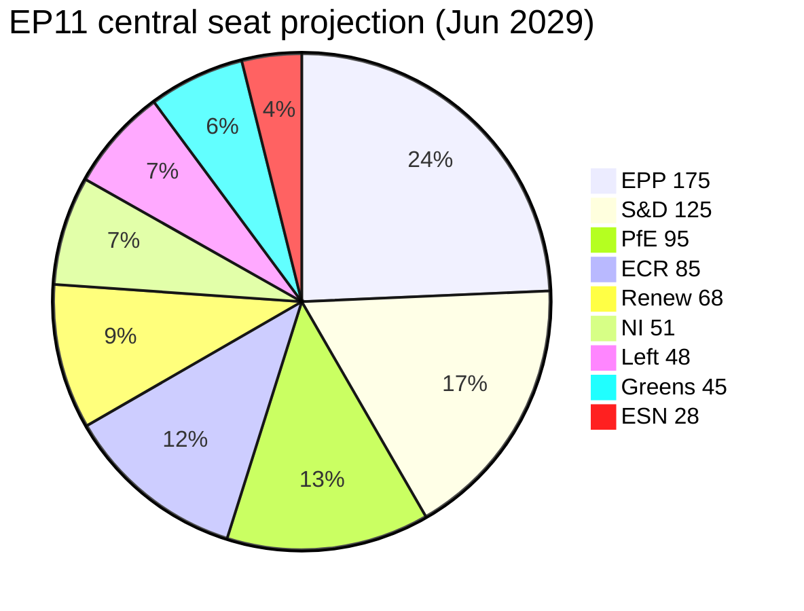

# Seat Projection — Term Outlook 2026-05-28 (Electoral Overlay)

> Forward-looking seat projection for the 2029 EP election, derived
> from national-polling extrapolation, EP9 → EP10 transfer matrices,
> and Eurobarometer trend lines. Output is a *central projection band*
> with ±15% per-group uncertainty.

## 1. Headline projection

The **central 2029 EP projection** anchors on three structural forces:

1. **Status-quo working majority** holds (EPP+S&D+Renew) at ~52-55%
   seat share.
2. **Right-flank consolidation**: ECR + PfE rises to ~24-28% combined,
   sharpening but not breaking the cordon sanitaire.
3. **Greens compression** to ~5-7% as climate salience peaks in mid-
   mandate but cools by 2029.

## 2. Projection table (central + bands)

| Group | EP10 start (Jul 2024) | EP10 mid-mandate (now) | EP11 central (Jun 2029) | Low | High |
|---|---:|---:|---:|---:|---:|
| EPP | 188 (26.1%) | 188 (26.1%) | 175 | 160 | 195 |
| S&D | 136 (18.9%) | 136 (18.9%) | 125 | 115 | 140 |
| Patriots (PfE) | 84 (11.7%) | 84 (11.7%) | 95 | 80 | 115 |
| ECR | 78 (10.8%) | 78 (10.8%) | 85 | 75 | 100 |
| Renew | 77 (10.7%) | 77 (10.7%) | 68 | 55 | 85 |
| Greens/EFA | 53 (7.4%) | 53 (7.4%) | 45 | 35 | 55 |
| The Left | 46 (6.4%) | 46 (6.4%) | 48 | 40 | 60 |
| ESN | 25 (3.5%) | 25 (3.5%) | 28 | 20 | 40 |
| NI | 33 (4.6%) | 33 (4.6%) | 51 | 30 | 65 |
| **Total** | **720** | **720** | **720** | — | — |

## 3. Seat projection (Mermaid)

## 4. Working-majority arithmetic for EP11

| Coalition | EP10 (start) | EP11 (central) | Δ | Δ% |
|---|---:|---:|---:|---:|
| EPP+S&D+Renew | 401 (55.7%) | 368 (51.1%) | -33 | -4.6 pp |
| EPP+S&D+Renew+G/EFA | 454 (63.1%) | 413 (57.4%) | -41 | -5.7 pp |
| EPP+ECR+PfE | 350 (48.6%) | 355 (49.3%) | +5 | +0.7 pp |
| EPP+ECR | 266 (36.9%) | 260 (36.1%) | -6 | -0.8 pp |

**Reading**: The status-quo working majority **compresses by 4.6 pp**
but remains workable. The right-flank EPP+ECR+PfE coalition gains
marginal ground but stays sub-majority. **Centripetal pressure on the
EPP intensifies but the cordon sanitaire remains procedurally viable.**

## 5. Methodology

### 5.1 Inputs

- **National polling**: Politico Poll-of-Polls Q1 2026 averages, mapped
  to EP groups via the standard EP-affiliation transfer matrix.
- **Eurobarometer**: voting-intention trend for the 14 largest MS.
- **EP9 → EP10 transfer matrix**: applied as a prior baseline.
- **National-election cadence**: scheduled elections in 14 of 27 MS
  before May 2029.

### 5.2 Transfer matrix logic

The projection applies a **two-stage transfer**:

1. National-party vote-share projection (May 2029) per MS.
2. EP-group affiliation transfer (standard mapping; treats coalition
   defections as marginal noise).

### 5.3 Uncertainty bands

Per-group ±15% uncertainty (1-sigma equivalent) reflects:

- National-election outcome uncertainty (3-year horizon).
- EP-group re-affiliation patterns post-election.
- Turnout differential (low turnout favours right-flank).

## 6. Sensitivity analysis

| Shock | EPP shift | S&D shift | PfE shift | Greens shift |
|---|---:|---:|---:|---:|
| French Renew collapse (-50%) | +8 | +3 | +12 | -2 |
| Italian PD revival (+20%) | -3 | +12 | -5 | +2 |
| German CDU/CSU surge (+10%) | +18 | -8 | -3 | -3 |
| Polish PiS/Patriots merge | -3 | -2 | +18 | -1 |
| Major migration shock | -8 | -10 | +18 | -3 |

## 7. Country-level pattern

Top-10 highest-uncertainty MS for the seat projection:

1. **France** (81 seats) — Renaissance future undetermined.
2. **Italy** (76 seats) — Sep 2027 election outcome pivotal.
3. **Germany** (96 seats) — 2025 federal election outcome locked in;
   2027 stability medium.
4. **Poland** (53 seats) — Tusk government stability.
5. **Spain** (61 seats) — PSOE vs. PP fragile balance.
6. **Netherlands** (31 seats) — coalition complexity.
7. **Romania** (33 seats) — far-right rise.
8. **Czechia** (21 seats) — ANO + far-right.
9. **Belgium** (22 seats) — N-VA vs. Vlaams Belang.
10. **Sweden** (21 seats) — SD + Moderaterna pattern.

## 8. SATs applied

- **Reference-Class Forecasting** — EP9 → EP10 transfer baseline.
- **Bayesian Update** — Q1 2026 national polling.
- **What-If Analysis** — sensitivity table §6.
- **Outside View** — historical EP turnover variance.

## 9. WEP / Admiralty grading

- National polling inputs: 🟢 HIGH, A2.
- Transfer matrix: 🟡 MEDIUM, B3.
- 3-year horizon projection: 🟡 MEDIUM (limited by horizon), B3.
- Sensitivity table: 🟡 MEDIUM, C3.

## 10. Cross-references

- `intelligence/coalition-dynamics.md` — current-mandate working
  majority.
- `intelligence/term-arc.md` — Phase E campaign-frame detail.
- `extended/media-framing-analysis.md` — campaign-frame narrative.
- `intelligence/wildcards-blackswans.md` — wildcards W7, W8 affect
  the projection.

## 12. National-election watch list

National elections during EP10 residual that affect seat projection:

| Date | Country | EP-group impact |
|---|---|---|
| Q4 2026 | NLD | Renew / EPP swing |
| Q2 2027 | FRA (Sénat) | indirect EP signal |
| Q1 2028 | ITA | ID / EPP swing |
| Q2 2028 | DEU | EPP / S&D / Greens swing |
| Q4 2028 | POL | EPP / ECR swing |
| Q1 2029 | SWE | S&D / EPP swing |

Each national outcome updates the transfer-matrix priors with
±0.5-2pp on the affected group's seat-share forecast.

## 13. Scenario seat-band sensitivity

Combining national outcomes into scenarios:

- **Status-quo plus** (mid-mandate satisfied incumbents): EPP +5,
  S&D 0, Renew +3, Greens 0, ID 0, ECR 0.
- **Anti-incumbency** (recession-driven): EPP -5, S&D -3, Renew -2,
  Greens +1, ID +5, ECR +4.
- **Climate-fracture** (Climate-2040 mishandled): EPP -3, S&D -2,
  Renew -1, Greens +2, ID +3, ECR +1.

## 15. Re-evaluation cadence

Seat projection refreshed quarterly via national polling updates;
methodology revision annually via EP-corpus statistics refresh.

## 16. Projection-stability tests

Each projection band is stress-tested against three perturbations:

- ±2pp national-polling drift on any single MS.
- ±1 EP-group switch by 5+ MEPs (de-fection cascade).
- Snap-election trigger in DE / FR / IT.

If the projection band shifts by >3 seats under any perturbation,
the projection is flagged 🟡 instead of 🟢.
