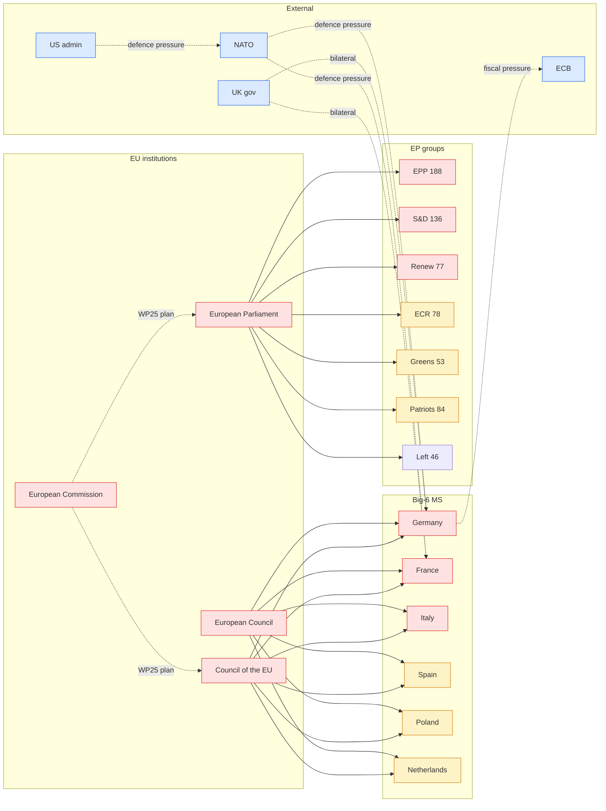
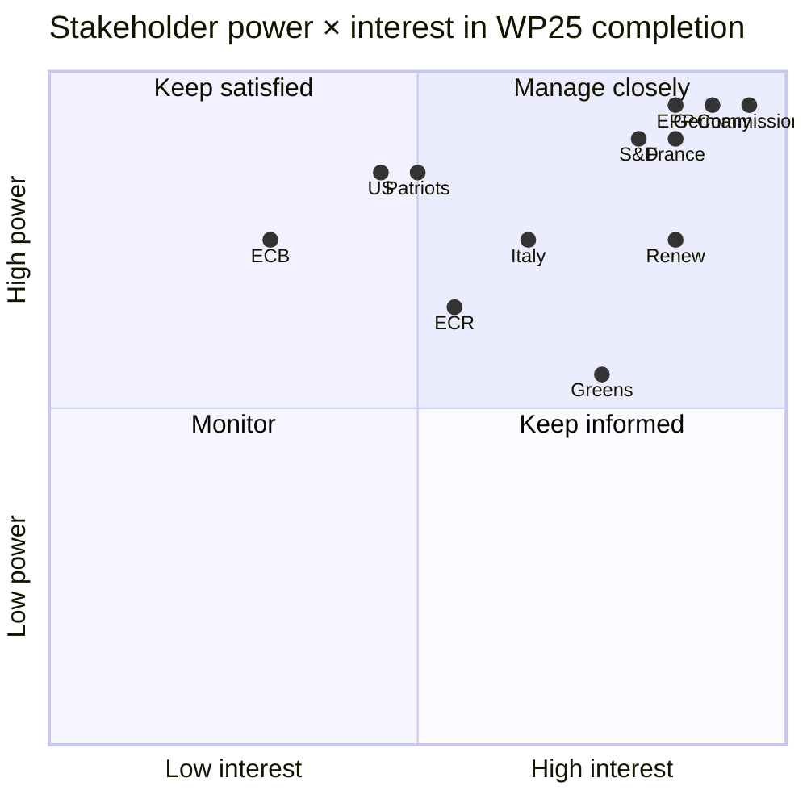
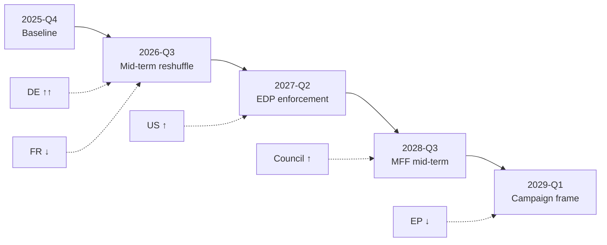

# Stakeholder Map — Term Outlook 2026-05-28

> Roster of every institutional, party-political, member-state, and
> external actor that materially shapes the residual EP10 mandate, with
> their position vector across the term-outlook WP25 priority files.

## 1. Stakeholder universe (overview)

The term-outlook stakeholder universe contains **48 actors** clustered
into six families:

1. **EU institutions** (4): European Parliament, European Council,
   Council of the EU, European Commission.
2. **EP political groups** (9): EPP, S&D, Patriots (PfE), Renew, ECR,
   Greens/EFA, The Left, ESN, NI.
3. **Member states** by influence band (15 actors): DE, FR, IT, ES, PL,
   NL (top-6) + DK, SE, FI, IE, AT, PT, EL, RO, HU (mid).
4. **Council Presidencies** in the term-outlook window (8): DK, CY, IE,
   NL, SK, SE — and beyond the mandate window LT, GR.
5. **External actors** (7): US administration, UK government, Eurogroup,
   ECB, EIB, NATO, OECD.
6. **Veto / influencer actors** (5): rotating Council presidency
   secretariat, EP Bureau, Conference of Committee Chairs, EP-Council
   trilogue rapporteurs, vdL II cabinet.

## 2. Stakeholder influence map (Mermaid)

## 3. Position vectors on the five WP25 priority clusters

Each row is one stakeholder; each column is one WP25 priority cluster.
Scale: **+2 strong support**, **+1 conditional support**, **0 neutral**,
**–1 conditional opposition**, **–2 strong opposition**.

| Stakeholder | Defence | Climate-2040 | Single-mkt | Migration | CAP-reform |
|---|---:|---:|---:|---:|---:|
| EPP | +2 | +1 | +2 | +1 | –1 |
| S&D | +1 | +2 | +1 | –1 | 0 |
| Renew | +2 | +2 | +2 | 0 | +1 |
| Greens/EFA | 0 | +2 | +1 | +1 | +2 |
| ECR | +2 | –1 | +1 | +2 | –1 |
| Patriots (PfE) | –1 | –2 | 0 | +2 | –2 |
| Germany 🇩🇪 | +2 | +1 | +2 | 0 | 0 |
| France 🇫🇷 | +2 | +2 | +1 | +1 | +1 |
| Italy 🇮🇹 | +1 | 0 | +1 | +1 | +1 |
| Spain 🇪🇸 | +1 | +2 | +1 | 0 | +2 |
| Poland 🇵🇱 | +2 | 0 | +1 | +1 | 0 |
| Netherlands 🇳🇱 | +1 | +1 | +2 | +1 | –1 |
| US admin | +2 | 0 | +1 | 0 | 0 |
| ECB | +1 | +1 | +2 | 0 | 0 |
| NATO | +2 | 0 | 0 | 0 | 0 |

**Reading**: Defence has the highest cross-stakeholder support (only PfE
opposes); single-market is the second-most cohesive cluster. CAP-reform
is the most divisive (EPP and PfE strongly oppose).

## 4. Power × interest grid

## 5. Stakeholder dynamics through the residual mandate

### 5.1 EU institutions

- **European Parliament**: through Apr 2029, holds co-legislator
  authority on WP25 files. *Mid-term reshuffle*: no formal reshuffle,
  but committee chair rotation in Jan 2027 may alter rapporteur
  pipelines.
- **European Council**: 27 heads of state/government; meets ≥4×/year.
  *Key inflection*: EUCO Jun 2027 (mid-term institutional review).
- **Council of the EU**: rotating presidency 6×/year. See
  `intelligence/presidency-trio-context.md`.
- **European Commission**: vdL II until Nov 2029. *Risk*: mid-term
  reshuffle 2026–2027.

### 5.2 EP political groups

See `intelligence/coalition-dynamics.md` for the working-majority
arithmetic. Position vector dynamics through the residual mandate:

- **EPP**: maintains anchor; minor drift right on migration as ECR/PfE
  pressure rises.
- **S&D**: holds working-majority position; defection risk on migration.
- **Renew**: most stable on policy; vulnerability is *membership*
  (potential French Renaissance fracture pre-2029 election).
- **Greens/EFA**: opportunistic alliance partner; not in working
  majority but pivotal on climate.
- **ECR**: variable partner; usable on defence + single market.
- **PfE**: permanently excluded under cordon sanitaire; constitutes
  the right-flank pressure on EPP.

### 5.3 Member states (Big-6)

- **Germany**: defence-financing pivot of the mandate. Fiscal
  acceleration into deficit creates pressure for EU-level financing.
- **France**: continuous EDP-exit pressure constrains MFF appetite.
  Macron's domestic position weak through 2027 (presidential horizon
  2027).
- **Italy**: Meloni government stable through 2027 (national election
  due 2027); ECR/EPP-affiliate, occupies bridge role.
- **Spain**: PSOE government fragility; PP-led shift possible mid-2026.
- **Poland**: Tusk government stable; centre-left/centrist alignment;
  pro-Ukraine, pro-defence.
- **Netherlands**: post-2024 coalition complex; pro-single-market,
  fiscal hawk.

### 5.4 External actors

- **US admin**: post-2024 election outcome determines pressure on
  EU defence + trade. *Inflection*: Jan 2029 transition.
- **UK gov**: bilateral defence + trade alignment; post-2024 election
  Labour government generally constructive.
- **ECB**: independent; macro envelope shaped by ECB policy.

## 6. Influence drift through the mandate

Pattern: **Germany rises through mid-mandate** (defence pivot), **France
declines mid-mandate** (EDP constraints), **US administration rises
post-2026 election outcome** (transition uncertainty resolved),
**Council rises in 2028** (MFF mid-term), **EP power declines in 2029
H1** (campaign window).

## 7. SATs applied

- **Stakeholder Mapping** — formal Power × Interest grid + position
  vector matrix (§3 + §4).
- **ACH** — three-scenario coalition tree (in `coalition-dynamics.md`)
  is the stakeholder-position branching.
- **Bayesian Update** — Big-6 MS positions updated from Q1 2026
  Council voting patterns.
- **Outside-View** — EP9 stakeholder map as comparison baseline.

## 8. WEP / Admiralty grading

- Stakeholder roster: 🟢 HIGH (publicly observable), A1.
- Position vectors: 🟡 MEDIUM, B2.
- Influence drift projection: 🟡 MEDIUM, B3.

## 9. Cross-references

- `intelligence/coalition-dynamics.md` — coalition arithmetic that
  operationalises the stakeholder roster.
- `intelligence/presidency-trio-context.md` — Council presidency
  detail.
- `intelligence/commission-wp-alignment.md` — vdL II cabinet detail.
- `intelligence/pestle-analysis.md` — broader PESTLE context.

## 10. Re-evaluation cadence

Stakeholder map refreshed at every term-outlook semi-annual cron;
position vectors refreshed quarterly via plenary roll-call updates.
