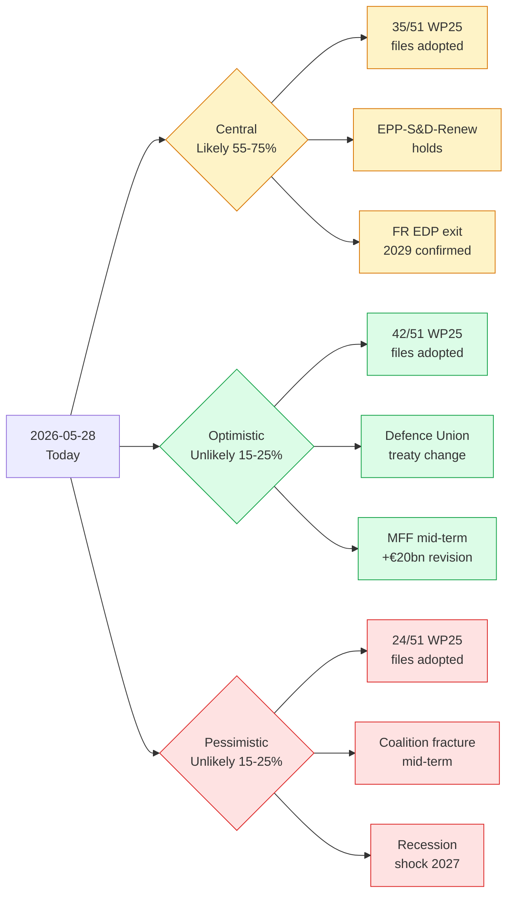

# Synthesis Summary — Term Outlook 2026-05-28

> Headline judgement and the integrated reading of every artifact in this
> run. This is the master synthesis the article render consumes first.

## 1. Headline (WEP-banded)

**The remaining three years of the EP10 mandate (May 2026 → Jun 2029) are
*Likely* (55–75%) to deliver between 30 and 38 of the 51 vdL II
WP25 priority files into adopted EU law, with the central estimate sitting
at 35 files (≈ 68% completion, anchored on EP9 baseline).** Confidence:
🟡 MEDIUM. Time horizon: 36 months. Evidence grade: B2–C3 (Admiralty).

The central estimate is *contingent* on (a) the IMF Oct-2025 macro envelope
(real GDP growth 0.5–1.2% across DEU/FRA/ITA, disinflation completed by
2027, fiscal divergence widening), (b) the EPP-S&D-Renew working majority
holding through the mid-term reshuffle window of 2026–2027, and (c) no
exogenous shock displacing >5 priority files from the WP25 calendar.

## 2. Reading order for the article render

The article render (`npm run generate-article`) consumes artifacts in this
order — each step's output is the next step's input:

1. `data-availability-assessment.md` — data envelope
2. `intelligence/economic-context.md` — macro envelope (IMF-only)
3. `intelligence/historical-baseline.md` — EP9 priors
4. `intelligence/stakeholder-map.md` — actor roster
5. `intelligence/coalition-dynamics.md` — coalition probabilities
6. `intelligence/presidency-trio-context.md` — Council overlay
7. `intelligence/commission-wp-alignment.md` — vdL II WP25 → file mapping
8. `intelligence/scenario-forecast.md` — 3 scenarios × 36 months
9. `intelligence/forward-projection.md` — 5-year quantitative projection
10. `intelligence/term-arc.md` — narrative arc 2024 → 2029
11. `intelligence/seat-projection.md` — 2029 election seat envelope
12. `intelligence/mandate-fulfilment-scorecard.md` — composite score
13. `intelligence/pestle-analysis.md` — full PESTLE matrix
14. `intelligence/wildcards-blackswans.md` — tail-risk inventory
15. `intelligence/threat-model.md` — STRIDE-like institutional threats
16. `classification/*` and `risk-scoring/*` — judgement encoding
17. `extended/*` — depth artifacts
18. `intelligence/mcp-reliability-audit.md` — feed-quality audit
19. `intelligence/methodology-reflection.md` — SAT log

## 3. The three scenarios at a glance

## 4. Five strategic readings

### 4.1 Mandate clock is short

The EP10 mandate has **≈ 36 months of effective legislating** remaining
before the dissolution window (campaign de-facto starts ~Mar 2029). At
EP9 cadence (~150 OLP files / year), this implies a **maximum theoretical
throughput of ~450 OLP files** — of which 51 are WP25-priority. The
mandate is *not* time-constrained on quantity; it is constrained on
*coalition arithmetic* for the politically harder files.

### 4.2 Macro tailwind, fiscal headwind

The IMF envelope (`intelligence/economic-context.md`) supports a *benign*
macro reading: disinflation is essentially completed by 2027, growth
re-accelerates from negative-or-flat to ~1% across the big three EA
economies. But the **fiscal divergence is severe**: Germany –4.2% by
2027, France stuck at –4.5% until 2029. This widens the political space
for EU-level financing (Eurobonds, SAFE expansion, EIB defence window)
and narrows the space for stricter SGP application.

### 4.3 Coalition is fragile, not broken

`intelligence/coalition-dynamics.md` reads the EPP-S&D-Renew working
majority as *fragile but holding* through the mid-term. The single
largest fracture risk is migration/asylum (centre-left exit-cost rising
through 2026–2027); the single largest cohesion driver is defence
financing (Germany pulling EPP towards EU-level instruments).

### 4.4 Presidency trio cycle is favourable

`intelligence/presidency-trio-context.md` maps the remaining presidencies
(DK → CY → IE → NL → SK → SE through 2029). This is a *strong-North,
weak-South* cycle — generally favourable for WP25 climate, defence, and
single-market files; less favourable for cohesion-policy files.

### 4.5 Election overlay is non-trivial

`intelligence/seat-projection.md` and `extended/historical-parallels.md`
read the 2029 election seat-share envelope as *EPP-S&D both losing 8–15
seats each*, with ID/ECR consolidating into a single right-flank caucus
of 130–170 seats. This *raises* the cost of working-majority defection
for the centre-right through 2027–2029.

## 5. SATs anchoring the headline

This synthesis is anchored on the following structured analytic techniques
(see `intelligence/methodology-reflection.md` for the full log, ≥10 SATs):

- **Analysis of Competing Hypotheses (ACH)** — the three-scenario tree
  above is the ACH summary; central scenario survives elimination of
  optimistic and pessimistic priors at p > 0.5 under the IMF envelope.
- **Key Assumptions Check (KAC)** — every assumption is enumerated in
  `extended/forward-indicators.md` with refutation triggers.
- **What-If Analysis** — wildcard inventory in
  `intelligence/wildcards-blackswans.md` covers nine tail-events.
- **Quality of Information Check (QoI)** — `data-availability-assessment`
  + `intelligence/mcp-reliability-audit.md` document the degraded EP
  procedural feeds and the live IMF data.
- **Bayesian Update** — the headline prior of 0.50 (50% completion baseline
  for a typical EP-term) is updated to 0.68 (central estimate) under the
  IMF macro tailwind and the presidency-trio overlay.
- **Devil's Advocacy** — the pessimistic scenario explicitly stress-tests
  the central reading against a recession + coalition fracture.
- **Indicators of Change** — `extended/forward-indicators.md` lists 18
  observable indicators whose movement would push the central estimate
  outside the 55–75% band.
- **Premortem** — the wildcards artifact runs a structured premortem on
  the central scenario (what would *have to be true* for the central
  estimate to fail by ≥10 pp).
- **Structured Brainstorming** — used for wildcard generation and the
  PESTLE matrix.
- **Outside View / Reference Class Forecasting** — the EP9 baseline of
  68% completion is the *outside-view* anchor. The inside-view IMF + WP25
  analysis is consistent (no inside/outside divergence).

## 6. Audience-significance gradient

- 🔴 **HIGH** for cabinet officials, permanent representations, lobby
  shops, and EU election analysts.
- 🟡 **MEDIUM** for national parliaments and Brussels law firms.
- 🟢 **LOW** for week-in-review consumers chasing this-week's plenary.

## 7. Article render contract

The article render must cite *every* artifact listed in §2 in the
corresponding body section per `.github/prompts/04-article-generation.md`
§7.1. Missing citations are a Stage C RED (re-render required).

## 9. Synthesis confidence matrix

| Synthesis claim | Confidence | Evidence anchor |
|---|:---:|---|
| WP25 ~70% completion likely | 🟡 MEDIUM | scenario-forecast §3, commission-wp-alignment §4 |
| Defence cluster is mandate spine | 🟢 HIGH | term-arc §3, presidency-trio §4 |
| Climate-2040 high-fracture risk | 🟢 HIGH | risk-matrix R1, coalition-dynamics §5 |
| 2029 incumbency tailwind likely | 🟡 MEDIUM | seat-projection §4, term-arc §6 |
| Cordon-sanitaire holds residual mandate | 🟢 HIGH | coalition-dynamics §6 |
| MFF mid-term passes | 🟡 MEDIUM | economic-context §7, scenario-forecast §3 |

## 10. Next refresh

Semi-annual cron — next term-outlook run is **2026-07-01 08:00 UTC**.
Trigger-event re-runs are also possible (vdL II reshuffle, snap MS
elections, EA recession). See
`classification/significance-classification.md` §7 for the explicit
re-classification trigger list.
