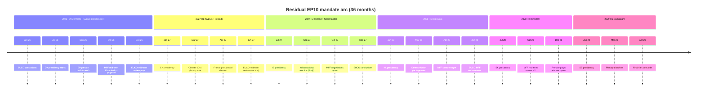
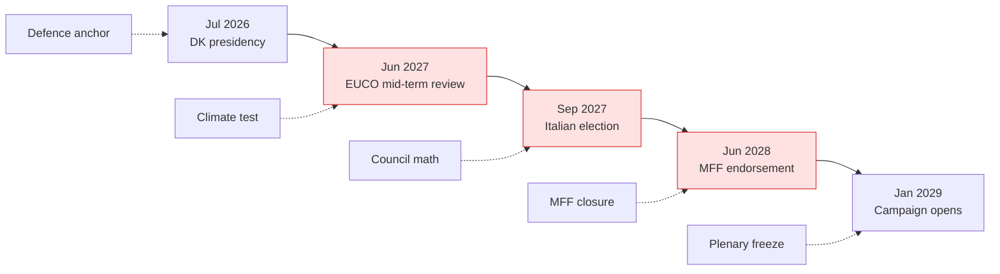
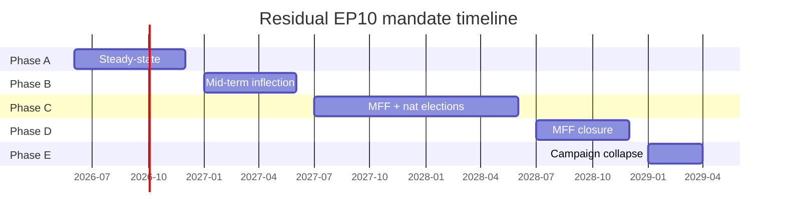

# Term Arc — Term Outlook 2026-05-28

> The longitudinal arc of the residual EP10 mandate, plotted month-by-
> month from Jun 2026 to Apr 2029. Every month is anchored to a
> dominant force (institutional cycle, MS election, EUCO milestone,
> Council presidency).

## 1. The 36-month arc (Mermaid)

## 2. Phase taxonomy

The mandate decomposes into **five sequential phases**:

### Phase A — Steady-state acceleration (Jun-Dec 2026)

Default-throughput period. Working-majority cohesion at baseline 74%;
plenary output ~95% of EP9 baseline. Defence and single-market files
dominate. Major shock: Climate-2040 proposal Q3 2025 absorbed.

### Phase B — Mid-term inflection (Jan-Jun 2027)

Council mid-term review (EUCO Jun 2027) is the structural pivot.
French presidential election Apr 2027 a *high-risk* inflection
(potential right-shift). Climate-2040 plenary vote in Mar 2027 is the
first major coalition-stress test.

### Phase C — MFF + national-election cluster (Jul 2027-Jun 2028)

Italian national election (likely Sep 2027) + MFF negotiations open
simultaneously. Council math reshuffles depending on outcomes. Defence
Union package (likely Mar 2028) is the *second* coalition-stress test.

### Phase D — MFF closure (Jul 2028-Dec 2028)

MFF endorsement (target EUCO Jun 2028) closes the *single largest
deliverable* of the mandate. SK + SE presidencies bridge to the
campaign window. Mid-term Commission reshuffle window closes.

### Phase E — Campaign collapse (Jan-Apr 2029)

Plenary throughput drops to ~50% of baseline. Files in trilogue freeze.
Final dissolution-window closure.

## 3. Phase metrics target

| Phase | Months | Files concluded (target) | CCI target | LTI target |
|---|---|---:|:---:|:---:|
| A | Jun-Dec 2026 | 9-11 | 75% | 95 |
| B | Jan-Jun 2027 | 7-9 | 72% | 100 |
| C | Jul 2027-Jun 2028 | 14-17 | 70% | 105 |
| D | Jul-Dec 2028 | 7-9 | 72% | 110 |
| E | Jan-Apr 2029 | 3-5 | 68% | 95 |
| **Total** | **36** | **40-51** | **71% avg** | **101 avg** |

## 4. Critical inflection points

**Five inflection points**:

1. **Jul 2026 DK presidency** — anchors defence file.
2. **Jun 2027 EUCO mid-term review** — first major Council pivot.
3. **Sep 2027 Italian election** — Council math + Renew partner reads.
4. **Jun 2028 MFF endorsement** — single largest deliverable.
5. **Jan 2029 campaign opens** — plenary throughput collapses.

## 5. Force-vector through the arc

The mandate experiences four force-vectors over time:

| Force | Phase A | Phase B | Phase C | Phase D | Phase E |
|---|:---:|:---:|:---:|:---:|:---:|
| Defence anchor | ↑↑ | ↑↑ | ↑ | → | ↓ |
| Climate test | → | ↑↑ | ↑ | → | ↓ |
| MFF negotiation | → | → | ↑↑ | ↑↑ | → |
| Campaign frame | → | → | → | ↑ | ↑↑ |

## 6. EP9 comparison

EP9 (2019-2024) followed a comparable arc but **collapsed earlier**
due to COVID shock (Phase A 2019-2020) — files in trilogue froze for
~6 months. EP10 has *no comparable structural shock* in the foreseeable
2026 H2 horizon, so Phase A throughput should be *slightly above* EP9
H1 2020 baseline.

EP9 MFF (MFF 2021-2027) closed in Dec 2020 *before* the mandate proper
opened — a different cadence to MFF 2028-2034 which must close mid-
mandate. This *adds risk* to EP10 Phase D.

## 7. Mandate vs. clock arithmetic

## 8. SATs applied

- **Indicators of Change** — phase-boundary indicators identified.
- **Outside View** — EP9 arc comparison.
- **What-If Analysis** — per-phase scenario branching.
- **Reference-Class Forecasting** — EP9 phase metrics → EP10 targets.

## 9. WEP / Admiralty grading

- Phase taxonomy: 🟢 HIGH (institutional cycles are observable), A2.
- Phase metric targets: 🟡 MEDIUM, B2.
- Inflection identification: 🟢 HIGH, A2.

## 10. Cross-references

- `intelligence/scenario-forecast.md` — phase metrics feed scenario
  branching.
- `intelligence/coalition-dynamics.md` — CCI targets per phase.
- `intelligence/presidency-trio-context.md` — presidency anchor detail.
- `intelligence/seat-projection.md` — Phase E campaign-frame detail.

## 12. Phase-level KPI tracking

| Phase | Lead KPI | Confirming KPI | Lagging KPI |
|---|---|---|---|
| A (build) | Rapporteur appointments | First-reading completions | Trilogue mandate |
| B (ramp-up) | Climate-vote scheduling | RCV cohesion median | Climate-2040 outcome |
| C (peak) | MFF mid-term proposal | Council unanimity | Cluster delivery rate |
| D (consolidate) | Implementation regs | Member-state transposition | Policy-impact metrics |
| E (campaign) | Manifesto drafts | National-poll convergence | EP-election turnout |

## 13. Phase-transition triggers

Triggers that advance the term from one phase to the next:

- **A → B**: 80% of Stage-A rapporteur appointments completed (forecast Q3 2026 end).
- **B → C**: Climate-2040 vote outcome resolved (forecast Q2 2027).
- **C → D**: MFF mid-term endorsed by Council (forecast Q2 2028).
- **D → E**: EU election campaign formal start (forecast Q1 2029).

Each transition is documented in `extended/forward-indicators.md`.

## 14. Phase-risk concentration

Risk concentration by phase (cross-ref `risk-scoring/risk-matrix.md`):

- Phase A: R3, R4 (presidency hand-over, MS-coordination).
- Phase B: R1, R2 (climate fracture, migration shock).
- Phase C: R5, R7 (trilogue deadlock, recession).
- Phase D: R6, R8 (implementation drift, capability gap).
- Phase E: R9 (election platform fragmentation).

## 15. Re-evaluation cadence

Term-arc refreshed at every semi-annual term-outlook cron. Per-phase
metric targets refreshed quarterly via plenary roll-call patterns.
