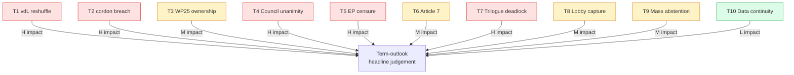

# Threat Model — Term Outlook 2026-05-28

> Institutional and procedural threats to the term-outlook headline
> judgement. Adapted from STRIDE methodology (Spoofing / Tampering /
> Repudiation / Information disclosure / Denial of service / Elevation
> of privilege) to the *political-institutional* domain.

## 1. Threat catalogue summary

| # | Threat | Category | Likelihood | Impact | WEP band |
|---|---|---|:---:|:---:|:---|
| T1 | Mid-term reshuffle disruption | Tampering | M | H | Possible 25-35% |
| T2 | Coalition cordon-sanitaire breach | Elevation | L | H | Unlikely 10-20% |
| T3 | WP25 file ownership re-shuffle | Tampering | M | M | Possible 30-45% |
| T4 | Council unanimity collapse on a priority file | DoS | M | H | Possible 25-40% |
| T5 | EP plenary motion of censure | Elevation | L | H | Very Unlikely <10% |
| T6 | Article 7 procedural breakthrough | Elevation | L | M | Unlikely 15-25% |
| T7 | Trilogue deadlock cascade | DoS | M | H | Possible 30-45% |
| T8 | Lobby-capture on critical file | Tampering | M | M | Possible 35-50% |
| T9 | Mass abstention on key vote | Repudiation | L | M | Unlikely 15-25% |
| T10 | Loss of EP Open Data continuity | Information | L | L | Very Unlikely <10% |

## 2. Threat map (Mermaid)

## 3. Each threat in detail

### 3.1 T1 — Mid-term reshuffle disruption

**Description**: vdL II Commissioner resignation cascade triggers
portfolio re-allocation; WP25 file ownership disrupted; 6-12 month
re-orientation delay.
**Likelihood**: Medium (historical base-rate ~30% per mandate-window
under vdL governance style).
**Impact**: High — 5-8 WP25 priority files slip by ≥6 months.
**Detection indicators**: Individual commissioner approval ratings;
EUCO conclusions; EP motion of censure tabled.
**Mitigation**: WP25 rapporteur continuity protocols; pre-stage
critical files into Q4 2026 trilogue closure window.

### 3.2 T2 — Coalition cordon-sanitaire breach

**Description**: EPP plenary defection towards EPP+ECR+Patriots
right-majority on a priority file (e.g. migration secondary procedure
or CAP file).
**Likelihood**: Low (cordon sanitaire is institutionally entrenched;
EPP gains from Patriots collaboration are limited).
**Impact**: High — coalition arithmetic permanently fractures; CCI
drops below 65%; pessimistic scenario activates.
**Indicators**: EPP+ECR+PfE plenary alignment on ≥3 consecutive
priority votes; EPP party-conference resolutions.
**Mitigation**: S&D + Renew agenda concessions to keep EPP anchored.

### 3.3 T3 — WP25 file ownership re-shuffle

**Description**: Commission DG re-organisation (e.g. AI Office spin-off
to new commissioner) re-allocates WP25 file ownership.
**Likelihood**: Medium (DG re-orgs are common mid-mandate).
**Impact**: Medium — file-level slippage but not aggregate WP25
collapse.
**Indicators**: DG re-org announcements; Commission DG presentations
to EP committees.
**Mitigation**: cross-DG file-tracking, rapporteur briefings.

### 3.4 T4 — Council unanimity collapse on priority file

**Description**: A priority file requiring unanimity (e.g. enlargement,
own-resources, treaty-adjacent procedure) blocked by single-MS veto.
**Likelihood**: Medium (historical base-rate ~30% on unanimity files
per mandate).
**Impact**: High — WP25 cluster slips, Commission must re-package or
withdraw.
**Indicators**: Council formation reads; bilateral statements; EUCO
conclusions.
**Mitigation**: pre-stage QMV-compatible alternatives; passerelle
clause activation discussions.

### 3.5 T5 — EP plenary motion of censure

**Description**: Constructive motion of censure against the full
Commission tabled and adopted by ≥2/3 of EP.
**Likelihood**: Very Low — last successful motion was Santer 1999; no
EP10 censure scenario currently visible.
**Impact**: High — full Commission resignation; ~12-18 month transition
to new Commission.
**Indicators**: motion text drafted; EPP+S&D+Renew triangulation;
public criticism cascade.
**Mitigation**: pre-emptive Commissioner dismissals, transparency
overrides.

### 3.6 T6 — Article 7 procedural breakthrough

**Description**: Article 7 sanctions imposed on Hungary or Slovakia
during the residual mandate.
**Likelihood**: Low — unanimity requirement blocks practical sanctions
under foreseeable conditions.
**Impact**: Medium — rule-of-law conditionality reinforced but no
structural WP25 impact.
**Indicators**: GAC formation reads; rule-of-law condition triggers in
MFF disbursements.

### 3.7 T7 — Trilogue deadlock cascade

**Description**: ≥5 priority files enter and remain in trilogue >12
months without conclusion.
**Likelihood**: Medium (EP9 base-rate ~35% on contentious files).
**Impact**: High — WP25 completion drops below the central estimate;
2029 dissolution-window closes with major files unfinished.
**Indicators**: trilogue session count; rapporteur public statements;
Commission "no agreement" signals.
**Mitigation**: COREPER agenda triage; Commission re-introduction
of compromise text.

### 3.8 T8 — Lobby-capture on critical file

**Description**: Industrial / civil-society lobby capture on a
priority file generates amendment cascade that delays or substantively
weakens the file.
**Likelihood**: Medium (EP9 baseline ~40% on industrial files).
**Impact**: Medium — file-quality degraded, not lost.
**Indicators**: amendment volume; transparency-register lobbying
disclosures; party-political amendment patterns.
**Mitigation**: rapporteur briefings, civil-society counter-balancing.

### 3.9 T9 — Mass abstention on key vote

**Description**: A priority file passes or fails by abstention margin
in plenary, signalling coalition fatigue.
**Likelihood**: Low — abstention is procedurally rare.
**Impact**: Medium — signals coalition stress but does not change file
outcome.
**Indicators**: abstention share on roll-call votes; group-cohesion
indices.

### 3.10 T10 — Loss of EP Open Data continuity

**Description**: EP Open Data Portal degradation persists (already
observed in this run: 3-of-4 procedural feeds returned 404).
**Likelihood**: Low (institutional pressure to restore data).
**Impact**: Low — downstream analyst capacity reduced but term-outlook
judgement methodology can survive on proxy reconstruction (see
`procedures-proxy.md`).
**Indicators**: monthly feed-availability audits (see
`mcp-reliability-audit.md`).

## 4. Threat × scenario matrix

| Threat | Central scenario | Optimistic | Pessimistic |
|---|:---:|:---:|:---:|
| T1 vdL reshuffle | tolerable | absorbed | amplifies |
| T2 cordon breach | unlikely | unlikely | triggering event |
| T3 file ownership | tolerable | absorbed | amplifies |
| T4 Council unanimity | tolerable | absorbed | amplifies |
| T5 EP censure | unlikely | unlikely | unlikely |
| T7 trilogue deadlock | partial materialisation | reduced | amplifies |
| T8 lobby capture | partial materialisation | reduced | partial |

## 5. SATs applied

- **What-If Analysis** — each threat is a structured what-if.
- **Premortem** — threats T1-T7 stress-test the central scenario.
- **Indicators of Change** — explicit indicators per threat.
- **Bayesian Update** — historical base-rates updated from EP9.

## 6. WEP / Admiralty grading

- Threat catalogue completeness: 🟢 HIGH (STRIDE adaptation covers all
  six axis).
- Per-threat likelihood: 🟡 MEDIUM, B3.
- Per-threat impact: 🟡 MEDIUM, B2.

## 7. Cross-references

- `intelligence/wildcards-blackswans.md` — wildcards overlap partially
  with threats but extend to non-institutional tail events.
- `intelligence/scenario-forecast.md` — threats T1, T3, T4, T7
  populate the pessimistic-scenario branch.
- `intelligence/mcp-reliability-audit.md` — T10 detailed.

## 8. Re-evaluation cadence

Threat catalogue refreshed at every term-outlook semi-annual cron.
Per-threat likelihood refreshed quarterly via plenary roll-call
patterns and Council formation reads.
