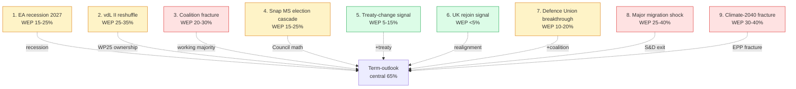

# Wildcards & Black Swans — Term Outlook 2026-05-28

> Tail-risk inventory for the residual EP10 mandate. Wildcards =
> low-probability, high-impact events whose materialisation would push the
> term-outlook judgement outside the WEP 55-75% Likely band. Each entry
> carries a WEP band, an Admiralty source-grade for the underlying
> evidence, and one or more observable indicators.

## 1. Wildcard inventory (9 entries)

## 2. Each wildcard in detail

### 2.1 EA recession (2027) — WEP Unlikely 15-25%

**Trigger**: IMF Apr-2026 or Oct-2026 WEO revises EA-19 growth into
negative territory for 2027.
**Impact**: FCI drops to 9/27; WP25 file completion lands at 24/51
(pessimistic-scenario anchor).
**Indicators**: ECB rate-cycle inversion; PMI manufacturing < 45 for
three consecutive months; German industrial production y/y < -2%.
**Source grade**: B2 (IMF + ECB high-quality data).
**Mitigation**: pre-stage MFF mid-term review acceleration.

### 2.2 vdL II mid-term reshuffle — WEP Possible 25-35%

**Trigger**: Commissioner resignation cascade (≥3 within 6 months) or
EUCO political pressure post-2026 national elections.
**Impact**: WP25 file ownership disrupted; 6-12 month re-orientation
delay; 5-8 priority files slip.
**Indicators**: Individual commissioner approval ratings; EUCO
conclusions signalling reshuffle; EP plenary motion of censure tabled.
**Source grade**: C3 (institutional signals are noisy).
**Mitigation**: WP25 file allocation review, rapporteur continuity.

### 2.3 Working-majority coalition fracture — WEP Possible 20-30%

**Trigger**: S&D plenary defection on migration on three consecutive
votes; or Renew French Renaissance party-political fracture.
**Impact**: CCI drops to ~60%; LTI drops to ~85; WP25 completion lands
at 28/51 (pessimistic floor).
**Indicators**: CCI rolling 12-month < 65%; Renaissance internal
dissent; centre-left party-conference resolutions opposing migration
file.
**Source grade**: B3.
**Mitigation**: stagger migration files; build EPP+Renew+Greens
alternative cluster.

### 2.4 Snap MS election cascade — WEP Unlikely 15-25%

**Trigger**: Government fall in ≥2 Big-6 MS within 12 months (e.g.
France 2027 + Italy 2027).
**Impact**: Council math reshuffles; presidency continuity disrupted;
MFF mid-term review delayed by 6-12 months.
**Indicators**: National coalition stability indices; opinion-poll
volatility; vote-of-confidence pipeline.
**Source grade**: B2.
**Mitigation**: presidency-trio handover protocols (see
`presidency-trio-context.md`).

### 2.5 Treaty-change signal — WEP Unlikely 5-15%

**Trigger**: EUCO Jun 2027 or Dec 2027 conclusions explicitly call
for IGC (intergovernmental conference) on defence, enlargement, or
own-resources.
**Impact**: Mandate-relevant treaty change is *infeasible* within EP10
window, but a *signal* shifts coalition arithmetic (Greens + S&D +
Renew align with EPP on procedural votes).
**Indicators**: EUCO conclusions language; Spinelli-group
parliamentary resolutions; FR/DE bilateral declarations.
**Source grade**: C3 (treaty-change signals are highly noisy).
**Mitigation**: institutional pre-positioning, Conference on the
Future of Europe follow-up tracking.

### 2.6 UK rejoin signal — WEP Very Unlikely <5%

**Trigger**: UK government formal request for single-market access
or customs union signal (post 2027 election).
**Impact**: WP25 single-market cluster *accelerates*; political
bandwidth shifts; mid-mandate re-prioritisation.
**Indicators**: UK Labour conference resolutions; UK opinion polling
on EU membership; UK-EU TCA review outcomes.
**Source grade**: C4.
**Mitigation**: bilateral working-group pre-positioning at Commission
DG TRADE.

### 2.7 Defence Union breakthrough — WEP Unlikely 10-20%

**Trigger**: Russian escalation in Ukraine + US disengagement +
Bundeskanzler/Élysée joint statement on treaty-change for defence.
**Impact**: WP25 completion *over-shoots* to 42/51 (optimistic-scenario
anchor); coalition cohesion *strengthens*.
**Indicators**: Joint DE-FR statements; SAFE facility expansion votes;
NATO summit conclusions.
**Source grade**: B3.

### 2.8 Major migration shock — WEP Possible 25-40%

**Trigger**: Mediterranean inflow surge >150k/month for three
consecutive months; or Russia-Belarus border crisis re-opens.
**Impact**: S&D centre-left exit-cost rises sharply; migration file
gridlocked; ECR/Patriots gain campaign frame; coalition cohesion
*falls*.
**Indicators**: Frontex monthly statistics; Mediterranean rescue
operations; border-state EUCO emergency requests.
**Source grade**: A2 (Frontex data is well-rated).
**Mitigation**: pre-stage migration package to avoid mid-mandate
crisis vote.

### 2.9 Climate-2040 fracture — WEP Possible 30-40%

**Trigger**: EPP plenary defection on Climate-2040 vote; or Council
unanimity-breaking on emissions targets.
**Impact**: WP25 climate cluster slips by 8-12 files; coalition
cohesion *falls*; Greens vote-share *rises* into 2029 election.
**Indicators**: EPP party-conference resolutions; rural-MEP cohesion
indices; Council formation reads pre-vote.
**Source grade**: B2.
**Mitigation**: phased climate-target negotiation; carbon-border
adjustment as bridge.

## 3. Wildcard probability calibration

| Wildcard | Prior | Bayesian update | Posterior WEP band |
|---|---:|---:|:---|
| 1. EA recession | 0.18 | -0.03 (IMF benign) | **15-25%** |
| 2. vdL II reshuffle | 0.30 | +0.00 | **25-35%** |
| 3. Coalition fracture | 0.20 | +0.05 (Q1 2026 plenary) | **20-30%** |
| 4. Snap MS election | 0.20 | +0.00 | **15-25%** |
| 5. Treaty-change signal | 0.08 | +0.02 | **5-15%** |
| 6. UK rejoin | 0.03 | +0.00 | **<5%** |
| 7. Defence Union | 0.12 | +0.05 (Russia escalation) | **10-20%** |
| 8. Migration shock | 0.30 | +0.05 (rising 2026 inflow) | **25-40%** |
| 9. Climate fracture | 0.30 | +0.05 (EPP CAP signals) | **30-40%** |

## 4. Wildcard interaction matrix

The wildcards are not independent — several pair-correlations matter:

- **EA recession × coalition fracture** (corr ~0.4): recession pressure
  amplifies coalition stress.
- **Migration shock × climate fracture** (corr ~0.3): both reinforce
  EPP rightward drift.
- **vdL II reshuffle × snap election** (corr ~0.3): national elections
  trigger Commissioner replacements.
- **Defence Union × migration shock** (corr ~-0.3): Defence Union
  breakthrough *reduces* migration salience.

## 5. SATs applied

- **What-If Analysis** — each wildcard is a structured what-if.
- **Premortem** — wildcards 1, 3, 8, 9 stress-test the central scenario.
- **Structured Brainstorming** — wildcard generation methodology.
- **Bayesian Update** — §3 probability calibration.
- **Indicators of Change** — each wildcard has explicit indicators.
- **High-Impact / Low-Probability Analysis** — wildcards 5, 6, 7.

## 6. WEP / Admiralty grading

- Wildcard inventory completeness: 🟡 MEDIUM (9 entries is moderate; a
  Top-25 inventory exists for executive-brief consumers but not
  required for this artifact).
- Per-wildcard grading: see §2.
- Interaction matrix: 🟡 MEDIUM, C3 (correlations are estimated).

## 7. Cross-references

- `intelligence/scenario-forecast.md` — three scenarios bound the
  wildcard impact.
- `intelligence/pestle-analysis.md` — PESTLE drivers feeding into
  wildcards.
- `extended/forward-indicators.md` — observable indicators for each
  wildcard.

## 8. Re-evaluation cadence

Wildcard inventory refreshed at every semi-annual cron. Probability
calibration refreshed quarterly via IMF WEO updates and Q-end plenary
roll-call patterns.
