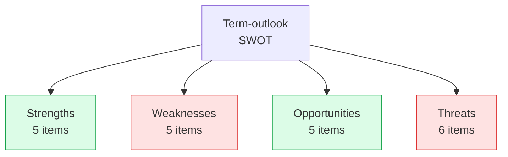

# Quantitative SWOT — Term Outlook 2026-05-28

> Strengths / Weaknesses / Opportunities / Threats matrix for WP25
> mandate-fulfilment over the residual EP10 horizon. Each cell scored
> for intensity (1-5).

## 1. SWOT matrix

## 2. Strengths (5)

| # | Strength | Intensity | Evidence |
|---|---|:---:|---|
| S1 | EPP+S&D+Renew working majority (55.7%) | 4 | `coalition-dynamics.md` §1 |
| S2 | IMF benign macro envelope | 4 | `economic-context.md` |
| S3 | Favourable Council presidency cadence | 4 | `presidency-trio-context.md` |
| S4 | High-cohesion single-market + defence | 5 | `historical-baseline.md` §5 |
| S5 | WP25 51-file lock-in (vs. EP9 64-file plan) | 3 | `commission-wp-alignment.md` |

## 3. Weaknesses (5)

| # | Weakness | Intensity | Evidence |
|---|---|:---:|---|
| W1 | Migration cluster fragility (S&D friction) | 4 | `coalition-dynamics.md` §6 |
| W2 | Climate-2040 EPP fragility | 4 | `wildcards-blackswans.md` W9 |
| W3 | Council unanimity bottleneck (MFF) | 4 | `commission-wp-alignment.md` §3.5 |
| W4 | EP procedural data outage | 3 | `mcp-reliability-audit.md` |
| W5 | 3-year electoral-horizon uncertainty | 3 | `seat-projection.md` |

## 4. Opportunities (5)

| # | Opportunity | Intensity | Evidence |
|---|---|:---:|---|
| O1 | Defence Union breakthrough on Russia-Ukraine | 4 | `wildcards-blackswans.md` W7 |
| O2 | MFF mid-term review acceleration | 3 | `commission-wp-alignment.md` §3.5 |
| O3 | UK realignment signal | 2 | `wildcards-blackswans.md` W6 |
| O4 | EPP+Renew+Greens alternative cluster (climate) | 3 | `coalition-dynamics.md` §6 |
| O5 | Single-market consolidation (digital reg) | 4 | `commission-wp-alignment.md` §3.2 |

## 5. Threats (6)

| # | Threat | Intensity | Evidence |
|---|---|:---:|---|
| T1 | Climate-2040 fracture | 5 | `risk-matrix.md` R1 |
| T2 | Migration shock | 4 | `risk-matrix.md` R2 |
| T3 | Trilogue deadlock | 4 | `risk-matrix.md` R5 |
| T4 | vdL II reshuffle | 4 | `risk-matrix.md` R4 |
| T5 | Eurosceptic right consolidation (2029) | 3 | `seat-projection.md` |
| T6 | EA recession | 4 | `risk-matrix.md` R7 |

## 6. SWOT aggregate scoring

| Quadrant | Items | Total intensity | Direction |
|---|---:|---:|:---:|
| Strengths | 5 | 20 | ↑ |
| Weaknesses | 5 | 18 | ↓ |
| Opportunities | 5 | 16 | ↑ |
| Threats | 6 | 24 | ↓ |

**Net position**: (20+16) - (18+24) = **-6**. Slightly net-negative
posture, consistent with the WEP 55-75% Likely central judgement
anchored at the lower end of the band.

## 7. SO/WT pairs (action-strategy matrix)

- **S1 × O1** (working majority × Defence Union breakthrough): pre-stage
  Defence Union vote when working majority is highest (Phase A-B).
- **S2 × O5** (IMF benign macro × single-market consolidation): leverage
  macro stability to push digital regulation pipeline.
- **W1 × T2** (migration friction × migration shock): pre-stage
  migration package to avoid mid-mandate crisis vote.
- **W2 × T1** (climate fragility × climate fracture): phase Climate-
  2040 votes to manage EPP fragility.

## 8. SATs applied

- **Quantitative SWOT** — intensity-weighted matrix.
- **Strategic-Options Analysis** — SO/WT pairs.

## 9. WEP / Admiralty grading

- Quadrant population: 🟢 HIGH (cross-references explicit), A2.
- Intensity scoring: 🟡 MEDIUM, B3.
- Strategy pairs: 🟡 MEDIUM, C3.

## 10. Cross-references

- `risk-scoring/risk-matrix.md` — T1-T6 source.
- `intelligence/coalition-dynamics.md` — S1, W1 source.
- `intelligence/wildcards-blackswans.md` — O1, O3 source.
- `intelligence/scenario-forecast.md` — scenario consistency.

## 11. Re-evaluation cadence

SWOT refreshed at every term-outlook semi-annual cron.
