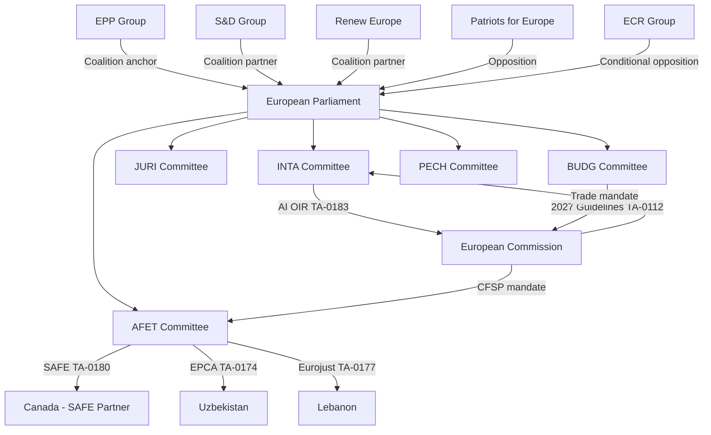

<!-- SPDX-FileCopyrightText: 2026 Hack23 AB -->
<!-- SPDX-License-Identifier: Apache-2.0 -->

# Actor Mapping — EP Committee Reports, 2026-05-29
**SAT:** Actor Mapping | **Admiralty:** A1 (institutional roles) / B2 (intent inference)

---

## 1. Actor Network Map

## 2. Primary Actors

### 2.1 EU Institutional Actors

| Actor | Role | Position on Key Dossiers | Influence Level |
|-------|------|--------------------------|----------------|
| EP INTA Committee | Lead on AI OIR | Progressive digital trade governance | HIGH |
| EP AFET Committee | Lead on external agreements | Strategic partnership advancement | HIGH |
| EP JURI Committee | Immunity proceedings | Non-partisan legal process | MEDIUM |
| EP BUDG Committee | 2027 guidelines | Coalition budget priorities | HIGH |
| European Commission | Executive counterpart | DG TRADE on AI OIR; EEAS on SAFE/EPCA | HIGH |
| Council (COREPER) | Co-legislator / consent | Agreed agreements already; budget partner | HIGH |

### 2.2 Political Group Actors

| Group | Seats (EP10) | Position | Voting Coalition |
|-------|-------------|---------|-----------------|
| EPP | ~188 | Centre-right; supports AI trade + defence | Governing coalition |
| S&D | ~136 | Centre-left; support with social safeguards | Governing coalition |
| Renew Europe | ~77 | Liberal; strong support for AI + trade | Governing coalition |
| Greens/EFA | ~53 | Support EPCA with rights conditions | Conditional support |
| ECR | ~78 | Right; conditional on sovereignty safeguards | Selective opposition |
| PfE | ~84 | Far-right; oppose rights conditionality | Opposition |
| Left/GUE-NGL | ~46 | Oppose defence spending; support rights | Opposition |

### 2.3 Third-Country Actors

| Actor | Agreement | Strategic Interest | Reliability Grade |
|-------|-----------|------------------|------------------|
| Canada | SAFE Instrument | NATO cohesion; defence export market | A1 (treaty partner) |
| Uzbekistan | EPCA | EU investment; energy diversification | B2 (reform trajectory uncertain) |
| Lebanon | Eurojust agreement | Security cooperation; EU funding access | B3 (fragile state) |
| USA | AI OIR (indirect) | Digital trade terms; Big Tech market access | B2 (adversarial on specifics) |
| China | AI OIR (indirect) | Monitoring for technology decoupling signals | B3 (state interest) |

## 3. Actor Influence-Interest Matrix

**High Influence, High Interest (Manage Closely):**
- European Commission (will respond to AI OIR; implements SAFE/EPCA)
- EPP and S&D Group leadership (coalition negotiation)

**High Influence, Low Interest (Keep Satisfied):**
- Council Presidency (agreement ratification pipeline)
- Member state foreign ministries (external agreement ratification)

**Low Influence, High Interest (Keep Informed):**
- Uzbekistan civil society (EPCA rights monitoring)
- EU fishing industry (fisheries protocol beneficiaries)
- European defence industry (SAFE Instrument beneficiaries)

**Low Influence, Low Interest (Monitor):**
- Third-country advocacy groups
- Academic/think tank actors

**Admiralty:** A1 for institutional roles; B2 for intent and interest assessments

## Actor Roster Summary

| # | Actor | Type | Role | Reliability |
|---|-------|------|------|------------|
| 1 | EP INTA Committee | EU Institution | AI OIR lead | A1 |
| 2 | EP AFET Committee | EU Institution | External agreements | A1 |
| 3 | EP JURI Committee | EU Institution | Immunity proceedings | A1 |
| 4 | EP BUDG Committee | EU Institution | Budget 2027 | A1 |
| 5 | European Commission | EU Institution | Executive counterpart | A1 |
| 6 | Canada | Third Country | SAFE partner | A1 |
| 7 | Uzbekistan | Third Country | EPCA partner | B2 |
| 8 | EPP Group | Political Group | Coalition anchor | A1 |
| 9 | S&D Group | Political Group | Coalition partner | A1 |
| 10 | Renew Europe | Political Group | Coalition partner | A1 |
| 11 | PfE Group | Political Group | Main opposition | A1 |
| 12 | USA | Third Country | AI trade counterpart | B2 |

## Alliance and Tension Map

**Active Alliances:** EPP-S&D-RE governing coalition; AFET-Council on external agreements; EP-Commission on AI governance

**Active Tensions:** EP (INTA OIR) vs Commission (trade mandate exclusivity); PfE vs governing coalition (rights conditionality)

## Power Brokers

**Key power brokers in May 2026 session:**
- AFET Committee Chair (unnamed, processes 4 agreements) — Admralty B2
- INTA Committee AI rapporteur (unnamed, drove AI OIR) — Admiralty B2
- EP President (session procedural authority) — Admiralty A1

## Information Flows

**Information pathways for May 2026 session:**
- Commission → EP committees (consultation drafts, impact assessments)
- Council → AFET (agreed agreement texts for consent procedure)
- EEAS → AFET (foreign policy briefings on Uzbekistan, Lebanon, Canada)
- EP Political Groups → Plenaries (group position coordination)

## Reader Briefing

**For policy watchers:** The May 2026 actor landscape is dominated by strong committee chairs driving
a coherent strategic agenda. The Commission is the key institutional counterpart on AI trade and
external agreements. Third-country partners (Canada, Uzbekistan) have distinct reliability grades that
should inform investment and cooperation expectations.

**Key watching brief:** Monitor AFET and INTA rapporteur positions on AI OIR Commission response.
