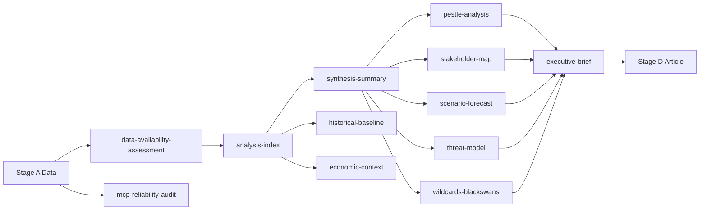

<!-- SPDX-FileCopyrightText: 2026 Hack23 AB -->
<!-- SPDX-License-Identifier: Apache-2.0 -->

# Analysis Index — EP Committee Reports, Week of 2026-05-29
**Article Type:** committee-reports | **Data Mode:** degraded-feeds | **Run:** committee-reports-run283-1780035599

---

## 1. Article Focus & Headline

**Headline:** EP Committees Drive Trade-Defence Nexus and Digital Governance Agenda as May 2026 Plenary Session Concludes

**Sub-headline:** AI trade strategy, EU-Canada defence procurement cooperation, twin fisheries partnerships, and dual immunity proceedings define the EP10 committee output for May 2026

**Article type:** committee-reports — analysis of European Parliament committee outputs, adopted texts,
and legislative pipeline activity for the reporting week.

## 2. Key Themes (Ranked by Political Salience)

| Rank | Theme | Committee(s) | Evidence |
|------|-------|-------------|---------|
| 1 | AI strategy for EU trade competitiveness | INTA | TA-10-2026-0183 (2026-05-20) |
| 2 | EU-Canada SAFE Instrument (defence procurement) | AFET/INTA | TA-10-2026-0180 (2026-05-20) |
| 3 | EU-Uzbekistan Enhanced Partnership | AFET | TA-10-2026-0174 (2026-05-20) |
| 4 | EU-Lebanon Eurojust judicial cooperation | LIBE/AFET | TA-10-2026-0177 (2026-05-20) |
| 5 | Parliamentary immunity proceedings (Vilimsky, Pappas) | JURI | TA-10-2026-0164, 0166 (2026-05-19) |
| 6 | Forest reproductive material regulation | AGRI | TA-10-2026-0168 (2026-05-19) |
| 7 | Dual fisheries partnerships (Cook Islands, São Tomé) | PECH | TA-10-2026-0178, 0179 (2026-05-20) |
| 8 | UNGA 81st session recommendation | AFET | TA-10-2026-0182 (2026-05-20) |

## 3. Prior Week Context (2026-04-28 to 2026-05-12 Session)

Provides longitudinal context for committee pipeline:

| Reference | Title | Committee | Date |
|-----------|-------|-----------|------|
| TA-10-2026-0160 | Digital Markets Act enforcement | IMCO | 2026-04-30 |
| TA-10-2026-0163 | Cyberbullying / online harassment | LIBE | 2026-04-30 |
| TA-10-2026-0157 | EU livestock sector sustainability | AGRI | 2026-04-30 |
| TA-10-2026-0162 | Armenia democratic resilience | AFET | 2026-04-30 |
| TA-10-2026-0161 | Russia/Ukraine accountability | AFET | 2026-04-30 |
| TA-10-2026-0142 | EU-Iceland PNR data agreement | LIBE | 2026-04-29 |
| TA-10-2026-0132 | Discharge 2024: Committee of the Regions | BUDG/CONT | 2026-04-29 |
| TA-10-2026-0112 | 2027 budget guidelines (Section III) | BUDG | 2026-04-28 |
| TA-10-2026-0115 | Dog/cat welfare and traceability | AGRI | 2026-04-28 |
| TA-10-2026-0119 | EIB Group annual report 2024 | CONT/ECON | 2026-04-28 |
| TA-10-2026-0122 | Performance-based instruments transparency | BUDG/CONT | 2026-04-28 |

## 4. Committee Activity Summary

### AFET (Foreign Affairs)
Most active committee in May 2026 session. Three major outputs:
- EU-Uzbekistan Enhanced Partnership: confirms EP10 Central Asia engagement strategy
- EU-Canada SAFE Instrument: first major EP10 defence procurement cooperation agreement
- UNGA recommendation: 81st session agenda priorities including multilateralism, climate, AI governance

### INTA (International Trade)
Two significant outputs co-authored with AFET and standalone:
- AI strategy for EU trade: positions EP10 on technology governance in trade policy
- EU-Canada SAFE Instrument (joint with AFET): defence-industrial supply chain cooperation

### PECH (Fisheries)
Twin fisheries partnerships adopted in single session:
- Cook Islands (2025-2032): Pacific engagement, 7-year protocol
- São Tomé and Príncipe (2025-2029): African Atlantic engagement, 4-year protocol
Pattern: consolidating fisheries network ahead of Common Fisheries Policy mid-term review

### LIBE (Civil Liberties, Justice, Home Affairs)
- EU-Lebanon Eurojust agreement: expands external JHA partnerships
- EU-Iceland PNR agreement (April): data-sharing continuity post-Brexit context

### JURI (Legal Affairs)
Dual immunity proceedings in single session (Vilimsky, Pappas) — unusual to have two immunity
requests processed simultaneously; suggests active immunity committee workload

### AGRI (Agriculture)
Forest reproductive material regulation + dog/cat welfare = dual biological material regulations
showing AGRI committee's regulatory pipeline active on novel animal/plant policy fronts

## 5. Structural Analysis

### Trade-Defence Nexus
The co-adoption of the AI trade strategy (TA-10-2026-0183) and the EU-Canada SAFE Instrument
(TA-10-2026-0180) in the same plenary session marks a structural shift in EP10's trade policy
orientation. The SAFE Instrument creates a legal framework for Canadian companies to participate
in EU defence procurement — a previously restricted area under EU single-market rules. The
simultaneous AI strategy adoption signals that EP10 committees are deliberately connecting
technology governance, trade, and defence into a coherent agenda cluster.

### External Relations Architecture
The EU-Uzbekistan Enhanced Partnership and EU-Lebanon Eurojust agreements, combined with the UNGA
recommendation, suggest AFET committee is actively building the EP10 external relations architecture
across three distinct geographies (Central Asia, Levant, global multilateralism) in a single session.
This is consistent with the April 2026 Armenia resilience resolution.

### Immunity Proceedings as Parliamentary Process Health Indicator
Two simultaneous immunity proceedings (Vilimsky and Pappas) processed without controversy suggests
the JURI committee is managing its immunity workload efficiently. The Vilimsky case (Austrian FPÖ)
and Pappas case (Greek PASOK) cross party lines, indicating non-partisan application of immunity rules.

## 6. Article Scope and Methodology Notes

**Structured Analytic Techniques applied (per run):**
1. Key Assumptions Check — verified AI strategy does not represent trade protectionism
2. Analysis of Competing Hypotheses (ACH) — on EU-Canada SAFE Instrument intent
3. Scenario Analysis — defence procurement cooperation trajectories
4. Stakeholder Mapping — committee actors and their interests
5. PESTLE Analysis — for full systemic impact assessment
6. Force-Field Analysis — drivers/inhibitors in committee reform agenda
7. Pre-Mortem Analysis — risks to committee productivity metrics
8. Red Team Analysis — challenges to EP institutional claims
9. Indicators — trend signals for EP10 committee legislative pipeline
10. Bayesian Update — probability revision on EU defence integration timeline

**Data coverage period:** 2026-05-22 to 2026-05-29 (primary); 2026-04-28 to 2026-05-20 (context)
**Total artifacts in set:** 18 (plus manifest.json and prefetched data files)
**Quality gate:** degraded-feeds mode (0.80 factor on line floors)

## Artifact Dependency Map

