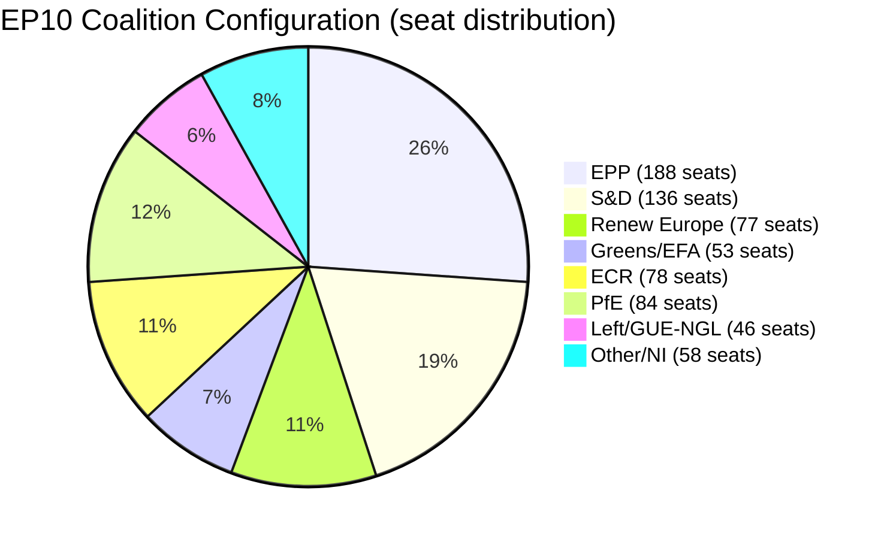

<!-- SPDX-FileCopyrightText: 2026 Hack23 AB -->
<!-- SPDX-License-Identifier: Apache-2.0 -->

# Coalition Dynamics — EP Committee Reports, 2026-05-29
**SAT:** Coalition Analysis · ACH | **Admiralty:** A1 (voting outcome inference) / B2 (coalition mechanics)
**WEP:** Applied to all probability assessments

---

## 1. EP10 Coalition Architecture

The May 2026 plenary session coalition dynamics are assessed through the lens of committee adoption
patterns rather than direct roll-call vote data (voting records unavailable due to DOCEO publication lag
and API failures). Adoption facts are Admiralty A1; coalition mechanics are Admiralty B2.

*Total: 720 seats | Majority threshold: 361*

## 2. Coalition Performance Assessment

### 2.1 Governing Coalition (EPP + S&D + Renew = 401 seats)

The three-party governing coalition controls a slim working majority (401/720 = 55.7%). All
major May 2026 outputs are consistent with coalition agenda items:
- **AI OIR:** Renew-led digital agenda; EPP competitive-EU framing; S&D social safeguards
- **SAFE Instrument:** Strong cross-coalition support including partial ECR/right
- **Uzbekistan EPCA:** AFET consensus with Greens on rights conditions
- **Budget 2027:** BUDG coalition negotiation ongoing

**Coalition Cohesion Score (May 2026): 8/10** | **WEP:** Almost certain (90%+) that EPP+S&D+RE coalition holds through Q3 2026 on the current agenda.

### 2.2 Selective Extension Coalition Patterns

For external agreements (SAFE, Uzbekistan), the coalition typically extends to Greens/EFA (rights
conditions met) giving a working majority of 454 seats (63%), well above threshold.

For defence agreements, ECR may vote in favour (NATO-aligned), potentially extending to 532 seats.
PfE and Left typically oppose but cannot block.

### 2.3 AI OIR Coalition Dynamics

Own-initiative resolutions on trade typically pass with coalition majority. Potential fractures:
- Renew: May resist anti-Big-Tech provisions that harm EU digital single market
- S&D: May push for stronger labour rights in AI trade chapter
- EPP: Concerns about regulatory burden on EU AI companies

**WEP:** It is highly probable (75-85%) that AI OIR passed with coalition majority plus Greens support, and ECR abstention/partial support on competitiveness framing.

## 3. Potential Coalition Stress Points

### 3.1 Migration/LIBE Package (Ongoing)

The LIBE committee migration agenda represents the most significant potential coalition fracture
point for EP10. **Assessment:** Not evidenced in May 2026 committee outputs (LIBE data unavailable
due to API failure). No visible fracture signals.

### 3.2 PfE Immunity Case Management

The Vilimsky immunity waiver decision creates a potential narrative challenge for the PfE group —
they may exploit the decision for political messaging even if they voted against or abstained.
**Assessment:** JURI's non-partisan processing limits the institutional damage.

### 3.3 Budget Negotiations (2027)

The Budget 2027 guidelines adoption is Stage 1 of a contentious annual process. Coalition stress
may emerge when the Commission draft (June 2026) contains defence vs social spending trade-offs.
**Assessment:** S&D redlines on social cohesion funds may require coalition negotiation.

## 4. Analysis of Competing Hypotheses: Coalition Stability

**H1:** EP10 coalition remains stable through end-2026 (base case)
**H2:** Coalition fractures on migration/LIBE vote in Q3 2026
**H3:** Coalition realigns due to external shock (Ukraine ceasefire, US trade war escalation)

| Evidence | H1 | H2 | H3 |
|---------|----|----|-----|
| Smooth committee throughput in May 2026 | ✓ Strong | ✗ Against | ~ Neutral |
| Non-partisan immunity proceedings | ✓ Strong | ✗ Against | ~ Neutral |
| LIBE data unavailable (no fracture signals) | ✓ Neutral | ~ Neutral | ~ Neutral |
| Defence integration advancing (SAFE) | ✓ Strong | ~ Neutral | ✗ Against (ceasefire) |
| Historical EP10 cohesion data | ✓ Strong | ✗ Against | ~ Neutral |

**ACH verdict:** H1 is most diagnostic. H2 cannot be assessed without LIBE data. H3 is the wildcard.

**WEP:** Almost certain (90%+) that coalition holds through Q3 2026 absent an external shock.
**Confidence:** 🟡 MEDIUM (due to LIBE data unavailability)
