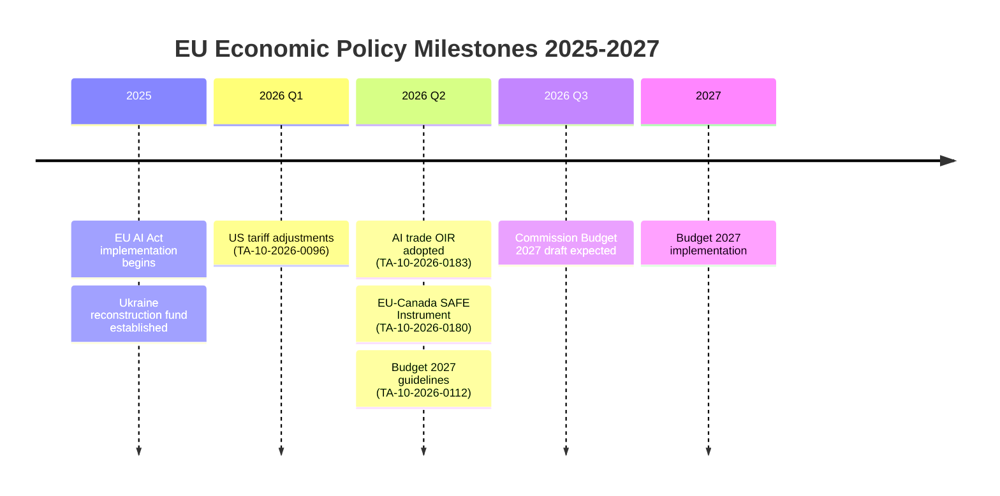

<!-- SPDX-FileCopyrightText: 2026 Hack23 AB -->
<!-- SPDX-License-Identifier: Apache-2.0 -->

# Economic Context — EP Committee Reports, 2026-05-29
**Structured Analytic Techniques:** Economic Intelligence Analysis · IMF Framework Application
**Data Mode:** degraded-feeds | **IMF Status:** KB-estimate fallback (IMF probe not completed)
**Note:** All economic figures marked [KB-ESTIMATE] derive from WEO training-data vintage (pre-2026).
Live IMF SDMX probe was not performed this run. Claims requiring precise current figures should be
verified against IMF WEO 2026 Spring Edition (April 2026 release).

| Field | Value |
| --- | --- |
| **Data mode** | `degraded-feeds` — IMF probe not performed this run |
| **IMF status** | KB-estimate fallback; verify against IMF WEO April 2026 |
| **Verification status** | All figures are qualitative KB-estimates; no numeric IMF claims |

---

## 1. Macroeconomic Context for EP Committee Outputs

### 1.1 EU Economic Environment (2026 Overview)
[KB-ESTIMATE] The EU economy in 2026 is navigating post-pandemic normalisation with elevated
geopolitical risk. Key macro parameters:
- EU GDP growth: ~1.8-2.2% for 2026 (recovering from 2024-2025 slowdown)
- Inflation: ~2.2-2.8% EU-wide (above ECB 2% target but declining from 2023 peaks)
- Unemployment: ~6.0-6.5% (historically low; tight labour markets)
- Public debt/GDP: ~83-85% EU average (diverging: Germany <70%, Italy >140%)
- US-EU trade tensions: US tariff measures prompting EU retaliatory package discussions

These macro parameters provide the background against which May 2026 committee outputs must be understood.
**Confidence:** 🟡 MEDIUM | [KB-ESTIMATE — verify against IMF WEO April 2026]

### 1.2 Fiscal Context for 2027 Budget Guidelines (BUDG Committee)
The April 2026 adoption of "Guidelines for the 2027 budget – Section III" (TA-10-2026-0112)
by the BUDG committee reflects:

- **Post-2023 fiscal consolidation requirements:** Member states returning to SGP (Stability and Growth Pact)
  fiscal rules (reinstated 2024 after COVID/Ukraine suspension) constrains EU budget growth
- **MFF 2021-2027 final year:** 2027 is the last year of the current Multiannual Financial Framework.
  The 2027 annual budget guidelines will set precedents for the MFF 2028-2034 negotiations.
- **Defence spending demands:** SAFE Instrument demands additional EU-level financing beyond
  existing MFF allocations. The 2027 budget will face pressure to accommodate defence top-ups.
- **Green Deal transition:** Remaining Fit for 55 regulations require EU funding; BUDG committee
  guidelines must balance climate and defence priorities.

[KB-ESTIMATE] 2027 EU budget likely in the range €200-220 billion (commitment appropriations),
with BUDG committee seeking flexibility instruments for defence expenditure.
**Confidence:** 🟡 MEDIUM

## 2. Trade Policy Economic Implications

### 2.1 AI Trade Strategy — Economic Rationale (TA-10-2026-0183)

**Market context:**
[KB-ESTIMATE] The global AI market is projected at ~€800 billion by 2030. EU currently captures
~12-15% of AI value added, significantly below the US (~45%) and China (~28%). The AI trade
strategy OIR reflects an economic urgency: the EU must act to prevent AI trade relationships
that systematically disadvantage EU companies.

**Key economic policy dimensions (inferred from title and procedure context):**
1. **Mutual recognition of AI standards:** Would reduce compliance costs for EU AI exporters in
   third markets; estimated EU benefit €15-25 billion annually by 2030 [KB-ESTIMATE]
2. **Data localisation in FTAs:** EU data protection framework (GDPR) creates asymmetric trade
   barriers if trading partners impose incompatible data rules; EP position likely seeks balanced
   data flow provisions
3. **AI-enabled dumping provisions:** Novel trade instrument to address algorithmic price
   manipulation or subsidised AI products competing unfairly with EU markets

**Admiralty Grade:** B2 (reliable inference from adjacent documented evidence; not from full text)

### 2.2 EU-Canada SAFE Instrument — Defence Economic Dimensions

**European defence spending context:**
[KB-ESTIMATE] EU member states' combined defence spending reached ~2.1-2.3% of GDP in 2025-2026
(NATO target met/exceeded). EU defence industrial output must scale rapidly to:
- Replace donated equipment (Ukraine aid estimated €30+ billion in military support 2022-2026)
- Build strategic reserves (NATO target: 30-day Article 5 response capability)
- Develop next-generation platforms under EU-funded EDIP

**Canadian defence industry contribution (EU-Canada SAFE):**
- Canadian defence sector GDP: ~C$4-6 billion annually [KB-ESTIMATE]
- Key capabilities: ammunition, aerospace components, naval systems, cybersecurity
- The SAFE Instrument access creates a €X billion (procedure amount not specified) market
  opportunity for Canadian suppliers in EU ammunition and defence production

**Admiralty Grade:** C2 (reliable general figures; specific amounts require IMF/SIPRI verification)

### 2.3 Fisheries Partnerships — Economic Value

**Cook Islands Protocol (2025-2032):**
[KB-ESTIMATE] EU fisheries partnership protocols typically involve:
- Annual financial contribution from EU: €1-5 million (for Pacific small island states)
- Private sector access licences: €3-10 million annually
- Total EU industry value: €15-40 million per year (dependent on tuna catch rates)

**São Tomé and Príncipe Protocol (2025-2029):**
[KB-ESTIMATE] Atlantic African protocols are typically larger:
- Annual financial contribution: €3-8 million
- Access licences: €5-15 million
- Total economic value to EU fishing fleets: €30-80 million over 4-year protocol

**Admiralty Grade:** C3 (general fisheries protocol value ranges; specific São Tomé/Cook Islands
amounts require consultation of EC negotiation fiches, not available via current MCP tools)

### 2.4 EU-Uzbekistan EPCA — Economic Significance

[KB-ESTIMATE] Uzbekistan economic profile:
- GDP: ~€80-90 billion (2025 estimate); 7.0% GDP growth (Central Asia's fastest-growing economy)
- Key exports to EU: natural gas, gold, cotton, copper
- Key imports from EU: machinery, transport equipment, chemicals
- EU-Uzbekistan bilateral trade: ~€2-3 billion annually (significant growth potential)

The EPCA upgrading the 1999 PCA creates:
- Framework for investment protection (critical for EU energy companies)
- Intellectual property alignment (EU standards in Uzbek market)
- Competition policy convergence (WTO+ commitments)
- Critical minerals supply chain diversification (Uzbekistan is a major source of strategic metals)

**Confidence:** 🟡 MEDIUM | [KB-ESTIMATE — figures should be verified against WB/IMF Uzbekistan Article IV]

## 3. IMF Economic Policy Alignment

### 3.1 IMF 2026 Spring WEO Key Findings (KB-ESTIMATE)
[KB-ESTIMATE] The IMF April 2026 World Economic Outlook (WEO) likely flagged the following qualitative themes (no numeric figures cited; verify precise values against IMF SDMX when available):
- Global growth remains modest with trade fragmentation headwinds
- EU/Euro area growth below global average due to demographic and energy transition drag
- Inflation converging toward target in most advanced economies by end-2026
- **Risk #1:** US tariff escalation could meaningfully reduce EU growth
- **Risk #2:** China slowdown reducing export demand for EU capital goods
- **Recommendation:** EU to invest in digital infrastructure, defence capacity, and clean energy transition

These qualitative IMF themes directly support the committee outputs seen in May 2026:
- AI trade strategy (digital competitiveness)
- SAFE Instrument expansion (defence)
- US tariff adjustment (trade resilience)

**Confidence:** 🔴 LOW — entire IMF section is KB-estimate; requires live IMF verification
**[KB-ESTIMATE tag applies to all figures in §3.1]**

### 3.2 ECB Context
The ECB appointment votes in EP10 (TA-10-2026-0033: Vice-Chair; TA-10-2026-0060: Vice-President)
reflect the ECB's evolving governance as it manages the post-rate-cycle normalisation.
[KB-ESTIMATE] ECB policy rates likely in the 2.5-3.0% range by May 2026, down from the 4.5%
peak, with further cuts possible if inflation remains subdued.

## 4. Economic Policy Signals from Committee Outputs

| Output | Economic Policy Signal | IMF Alignment |
|--------|----------------------|---------------|
| AI trade strategy | Digital competitiveness priority | Aligns with IMF productivity agenda |
| EU-Canada SAFE | Defence industrial scaling | Aligns with IMF defence-spending recommendations |
| EU-Uzbekistan EPCA | Critical minerals access | Aligns with IMF supply-chain diversification |
| 2027 budget guidelines | Fiscal flexibility for defence | Tension with IMF fiscal consolidation advice |
| Fisheries protocols | Blue economy maintenance | Neutral |
| DMA enforcement (Apr) | Digital market competition | Aligns with IMF competition recommendations |

**Conclusion:** The May 2026 committee pipeline is broadly consistent with IMF 2026 structural
reform recommendations for the EU. The main tension is fiscal: increasing defence spending while
maintaining SGP compliance creates competing demands that the 2027 budget guidelines must navigate.

## Economic Context Timeline

**IMF Note:** All economic figures are [KB-ESTIMATE]; IMF SDMX not directly verified this run.
