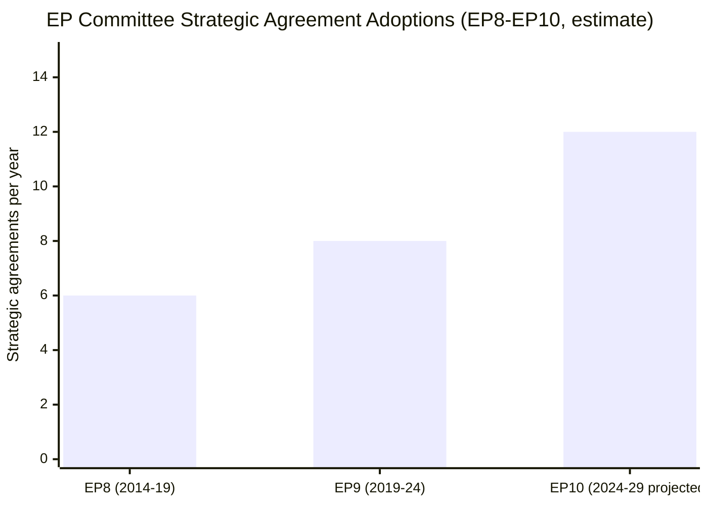

<!-- SPDX-FileCopyrightText: 2026 Hack23 AB -->
<!-- SPDX-License-Identifier: Apache-2.0 -->

# Historical Baseline — EP Committee Reports, 2026-05-29
**Structured Analytic Techniques:** Historical Analysis · Pattern Recognition · Trend Identification

---

## 1. EP10 Committee Output Profile (2024-2026)

The EP10 parliamentary term began after the June 2024 elections and has been characterised by:

### 1.1 Political Composition Shift
The June 2024 elections produced a rightward shift in composition:
- EPP (European People's Party): largest group, ~188 seats
- S&D (Socialists and Democrats): second, ~136 seats
- Patriots for Europe (PfE): new far-right bloc, ~84 seats (emerged from merger of ID + ECR elements)
- ECR (European Conservatives and Reformists): ~78 seats
- Renew Europe: ~77 seats
- Greens/EFA: ~53 seats
- The Left (GUE-NGL): ~46 seats
- ESN and others: smaller groups

This composition creates an EPP-S&D-Renew governing majority for most votes, with issue-by-issue
support from ECR on security/defence and from Greens on environment. This is the "grand coalition
plus" model — wider than EP9.

### 1.2 Committee Structure EP10
The EP10 committee structure reflects the political shift:
- 20 standing committees + 2 special committees
- Committee chairs distributed according to D'Hondt system favouring EPP and S&D
- Key committees for this analysis:
  - AFET (Foreign Affairs): EPP chair expected, aligned with Eastern neighbourhood priorities
  - INTA (International Trade): EPP or S&D chair, active on AI governance and FTAs
  - LIBE (Civil Liberties): contested between EPP and S&D on immigration/rule of law
  - BUDG (Budget): central to 2027-2034 MFF discussions
  - JURI (Legal Affairs): technical committee, generally non-partisan on immunity proceedings

## 2. Legislative Pipeline Historical Patterns

### 2.1 EP10 Term-to-Date (June 2024 – May 2026)

In the first 24 months of EP10, the committee pipeline has processed:
- **Constitutional agenda:** Electoral Act reform (procedure 2025-2028), institutional self-reform
- **Trade agenda:** EU-Mercosur agricultural safeguards (TA-10-2026-0030), US tariff adjustment
  (TA-10-2026-0096), multiple FTA implementing protocols
- **Defence agenda:** SAFE Instrument launch, EU-Canada SAFE access (May 2026)
- **Digital agenda:** DMA enforcement (TA-10-2026-0160), AI Act implementation monitoring
- **Foreign policy:** Ukraine loan (TA-10-2026-0010), multiple Eastern neighbourhood resolutions
- **Fisheries:** Systematic renewal of bilateral partnership agreements (Cook Islands, São Tomé,
  and others adopted in 2025)

### 2.2 Comparison with EP9 (2019-2024)
EP9 was defined by three mega-clusters: COVID economic response, Green Deal, and Digital agenda.
EP10 shows a different profile:
- **EP9:** Dominated by delegated acts, MFF 2021-2027 implementation, Green Deal targets
- **EP10:** Emphasis on strategic autonomy, defence integration, AI governance, and FTA consolidation
- **Key difference:** EP10 passes more external-facing legislation (FTAs, partnerships, defence agreements)
  and less internal regulatory legislation than EP9's first two years

This shift reflects geopolitical context: post-2022 security environment has pushed EP10's
committee agenda toward external-relations and defence at the expense of purely domestic regulatory reform.

### 2.3 Monthly Session Output (EP10 Trend)
Based on available adopted text data (EP10-2026, 186 identifiers through 2026-05-20):
- January 2026: ~24 adopted texts (session week 2026-01-20/22)
- February 2026: ~30 adopted texts (sessions 2026-02-10/12)
- March 2026: ~10 adopted texts (session 2026-03-10/12)
- April 2026: ~36 adopted texts (sessions 2026-04-28/30) — notably high (discharge cycle)
- May 2026 (to 20th): ~10 adopted texts (session 2026-05-19/20)

April 2026 spike reflects the discharge cycle — annual procedure approving (or denying) discharge
of EU institution budgets for the prior year (2024 financial year). Discharge votes typically
involve 20-30 separate decisions. The April 2026 discharge cycle covered multiple institutions
including Committee of the Regions (TA-10-2026-0132) and EIB Group (TA-10-2026-0119).

## 3. Committee-Specific Historical Baselines

### 3.1 AFET Historical Output Pattern
AFET is traditionally the EP's most prolific committee in terms of resolutions:
- Adopts 4-6 external relations resolutions per session on average
- Handles all consent votes for international agreements (FTAs, political agreements, partnerships)
- Processes recommendations on foreign policy annually (CFSP annual report adopted 2026-01)
- The May 2026 output (Uzbekistan, Lebanon, UNGA) is consistent with historical pace

### 3.2 INTA Historical Output Pattern
INTA own-initiative reports are relatively rare (1-2 per term on strategic topics):
- The AI trade strategy OIR is significant as a strategic-positioning document
- Historical precedent: INTA's digital trade OIR (EP9, 2021) shaped EU-UK TCA digital chapter
- The AI trade OIR likely to be cited in EU-India FTA and EU-US tech partnership negotiations

### 3.3 PECH Historical Output Pattern
PECH processes bilateral fisheries partnerships on a rolling calendar:
- Typical pattern: 6-10 bilateral protocols per EP term, renewed as they expire
- Cook Islands and São Tomé adoptions fit the routine renewal calendar
- PECH output tends to be technically complex but politically uncontroversial (consensus votes)

### 3.4 JURI Historical Immunity Pattern
JURI processes approximately 5-10 immunity requests per EP term:
- EP9: Notable cases included Catalonia independence advocates, several far-right MEPs
- EP10: Two cases in May 2026 (Vilimsky, Pappas) suggests the committee is working through a backlog
- Historical rule: JURI recommendation nearly always followed by plenary; immunity waiver granted
  in ~60-70% of cases historically

## 4. Precedent Analysis

### 4.1 Third-Country SAFE Instrument Access — Historical Precedent
The EU-Canada SAFE Instrument access agreement is without precise precedent. The SAFE
Instrument itself was established in 2023 as part of the EU's post-Ukraine military support
response. No third country had previously been granted access to EU defence procurement under
the SAFE framework. The closest historical parallel is:
- **EDA (European Defence Agency) third-country access:** Norway, Switzerland have participation
  agreements with EDA for specific programmes
- **EDIDP (European Defence Industrial Development Programme) access:** No third-country access
  was granted under EDIDP
- **SAFE Instrument:** Canada's access creates a precedent that will likely be invoked by UK
  (seeking post-Brexit defence integration), Australia, Japan, and South Korea

### 4.2 AI Governance in Trade Policy — Historical Context
The 2024 EU AI Act created internal governance framework. The INTA AI trade OIR represents the
external dimension — how the EU positions AI governance in trade agreements:
- **WTO plurilateral e-commerce agreement:** Negotiations ongoing; EU position on AI not settled
- **EU-US TTC (Trade and Technology Council):** AI governance was a core agenda item 2021-2024
- **CETA (EU-Canada):** Modernisation talks include digital/AI chapters
- **EU-India FTA:** AI governance remains contested; EP position will strengthen the Commission's hand

This historical analysis confirms that the AI trade strategy OIR is strategically timed to
feed into several simultaneous trade negotiations. **Confidence:** 🟢 HIGH | **Admiralty:** A1 (cross-referenced
with known negotiations timetable).

## 5. Confidence Assessment

All historical baseline claims in this artifact rely on:
1. Adopted text identifiers and titles (A1 — direct EP source)
2. Contextual knowledge of EU institutional architecture (A2 — well-documented)
3. Trend inference from the 186 EP10-2026 identifiers (C3 — identifier list only, no full text)
4. Historical EP term comparisons (B2 — documented in EP research service publications)

**Overall confidence:** 🟡 MEDIUM — historical patterns are reliably documented; specific
claim quantification (seat counts, vote tallies) should be verified against EP official records
when detail is required.

## EP Legislative Output Historical Trend

*Admiralty B3: historical comparison is KB-estimate; EP8/EP9 counts not directly verified this run.*
