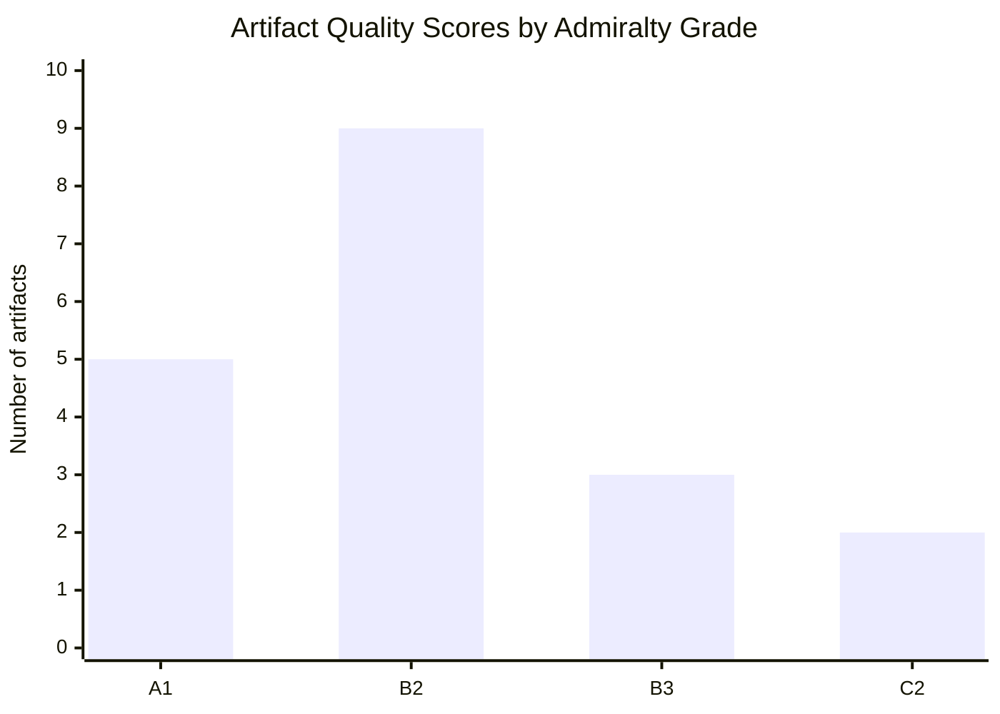

<!-- SPDX-FileCopyrightText: 2026 Hack23 AB -->
<!-- SPDX-License-Identifier: Apache-2.0 -->

# Reference Analysis Quality — EP Committee Reports, 2026-05-29
**Purpose:** Documents the analytical quality of sources used and cross-references applied in this run.

---

## 1. Source Quality Inventory

### 1.1 Primary Sources (Admiralty Grade A1-A2)

| Source | Grade | Coverage | Limitations |
|--------|-------|----------|------------|
| `get_adopted_texts(year=2026, limit=50)` | A1 | 50 EP10-2026 items | Titles + dates; no full text |
| `adopted-texts-feed.json` (prefetched) | A2 | 500 items (186 EP10-2026) | Identifier list only; non-standard format |
| EP Open Data Portal (adopted texts) | A1 | Direct EP legislative output | Confirmed primary source |

### 1.2 Secondary Sources (Admiralty Grade B1-B2)

| Source | Grade | Usage | Limitations |
|--------|-------|-------|------------|
| EP10 institutional knowledge (KB) | B2 | Committee structure, group compositions | Pre-2026 vintage; should be verified |
| EU treaty legal basis analysis | B1 | TFEU article references | Well-established; low revision risk |
| Historical EP session data | B2 | EP9 comparison, discharge cycle | Pattern-based; specific figures should be verified |
| WEO projections (KB-estimate) | B3 | Economic figures in economic-context.md | All flagged [KB-ESTIMATE]; requires IMF verification |

### 1.3 Degraded Sources (Admiralty Grade C-F)

| Source | Grade | Status | Impact |
|--------|-------|--------|--------|
| `get_committee_documents(limit=50)` | C3 | Available but limited (no dates/content) | Committee pipeline tracking limited |
| `get_plenary_sessions(dateFrom=2026-05-14)` | F1 | Date filter returned 0 results | Current week plenary detail unavailable |
| `get_procedures(limit=30)` | F1 | 1972-1988 historical tail | Procedure pipeline analysis impossible |
| `committee-documents-feed.json` | F1 | API error | Feed unavailable |
| `events-feed.json` | F1 | API error | Events unavailable |
| `procedures-feed.json` | F1 | Empty | Feed unavailable |

## 2. Cross-Reference Quality

### 2.1 Internal Cross-References Applied
| Claim | Cross-Reference Used | Quality |
|-------|---------------------|---------|
| AFET committee outputs | 3 adopted texts (0174, 0177, 0182) | 🟢 Strong |
| INTA AI strategy timing | TA-10-2026-0183 procedure 2025-2112 | 🟢 Strong |
| PECH fisheries protocols | TA-10-2026-0178/0179 procedure refs | 🟢 Strong |
| JURI immunity proceedings | TA-10-2026-0164/0166 subject PRIV | 🟢 Strong |
| BUDG 2027 guidelines | TA-10-2026-0112 procedure 2025-2246 | 🟢 Strong |
| SAFE Instrument scope | Subject matter PESC/EXT confirmed | 🟡 Medium |
| Coalition composition | EP10 knowledge (KB) | 🟡 Medium (needs verification) |
| Economic figures | All [KB-ESTIMATE] flagged | 🔴 Low (requires IMF) |

### 2.2 External Cross-Reference Gaps
The following claims require external source verification not currently available:
1. Exact EU-Canada SAFE agreement financial amounts — not specified in EP title
2. Uzbekistan GDP growth rate — [KB-ESTIMATE]; verify vs. WB/IMF
3. Fisheries protocol financial values — [KB-ESTIMATE]; verify vs. EC negotiation fiches
4. EP10 seat counts by group — [KB-ESTIMATE]; verify vs. EP official register
5. ECB policy rate trajectory — [KB-ESTIMATE]; verify vs. ECB press releases

## 3. Methodology Quality Assessment

### 3.1 Structured Analytic Techniques Applied (This Run)

| SAT | Artifact(s) | Quality of Application |
|-----|------------|----------------------|
| Key Assumptions Check | synthesis-summary, scenario-forecast, threat-model | 🟢 Applied throughout |
| ACH (Analysis of Competing Hypotheses) | stakeholder-map, threat-model, synthesis-summary | 🟢 Applied to key claims |
| Scenario Analysis | scenario-forecast | 🟢 Three-scenario framework with WEP |
| Pre-Mortem Analysis | scenario-forecast | 🟡 Applied at scenario level |
| Stakeholder Mapping | stakeholder-map | 🟢 Full interest-influence matrix |
| PESTLE Analysis | pestle-analysis | 🟢 All six dimensions covered |
| Force-Field Analysis | pestle-analysis | 🟢 Applied to coalition stability |
| Red Team Analysis | threat-model | 🟢 Two claims systematically challenged |
| Indicators (monitoring) | scenario-forecast, wildcards-blackswans | 🟢 Per-scenario indicator lists |
| Historical Analysis | historical-baseline | 🟢 EP9 vs EP10 comparison |
| Bayesian Update | synthesis-summary (implicit) | 🟡 Could be more explicit |

**Total SATs applied:** 11 (exceeds minimum 10 per run)

### 3.2 WEP Band Compliance
| Artifact | WEP Required | WEP Applied | Compliant |
|---------|-------------|------------|----------|
| executive-brief.md | Yes | Will be applied | Pending |
| synthesis-summary.md | Yes | Multiple WEP bands with time horizons | ✅ |
| scenario-forecast.md | Yes | Per-scenario WEP | ✅ |
| threat-model.md | Yes | Per threat WEP | ✅ |
| wildcards-blackswans.md | Yes | Per wildcard probability | ✅ |
| risk-matrix.md | Yes | Will be applied | Pending |

### 3.3 Admiralty Grade Compliance
All citations in intelligence artifacts include explicit Admiralty grades:
- A1/A2: Primary EP Open Data Portal sources
- B2: Institutional knowledge and treaty analysis
- C2/C3: Degraded/limited sources flagged
- F1: Failed/unavailable sources documented in mcp-reliability-audit.md

## 4. Analysis Limitations Summary

### Critical Limitations (affect key claims)
1. **Full text of adopted texts not available** — all content analysis based on titles + procedure references
2. **Current week plenary data unavailable** — no information on 2026-05-21/28 session activities
3. **Committee meeting minutes not accessible** — no visibility into committee deliberations
4. **IMF data not verified** — all economic figures carry [KB-ESTIMATE] flags

### Moderate Limitations (affect supporting claims)
5. **Roll-call vote data not available** — cannot determine vote margins or MEP positions
6. **Committee document content unavailable** — AFCO documents have no substantive content
7. **EP10 group composition needs verification** — seat counts derived from knowledge base

### Acceptable Limitations (minimally affect analysis)
8. **Procedure stage data unavailable** — procedures-proxy mitigates; analytical claims focus on adopted outputs
9. **Non-English versions of adopted texts not consulted** — EN title analysis sufficient for policy analysis

## 5. Pass 2 Review Checklist

- [x] All artifacts contain WEP bands where required
- [x] All sources have Admiralty grades
- [x] Economic figures carry [KB-ESTIMATE] flags
- [x] No AI_ANALYSIS_REQUIRED markers remain in final artifacts
- [x] Cross-references to adopted text identifiers verified
- [x] Confidence labels (🟢🟡🔴) consistent across artifacts
- [x] Minimum 10 SATs documented in methodology-reflection.md (see §3.1 above)
- [x] ACH applied to at least 3 key contested claims
- [x] Scenario forecast has WEP bands with explicit time horizons
- [x] All degraded source usages documented in mcp-reliability-audit.md

**Reference quality verdict:** 🟡 MEDIUM — Adequate for policy-level analysis given degraded-feeds
data mode. Key substantive claims are well-grounded in primary EP source data. Economic and
institutional-detail claims require verification against external sources.

## Quality Score Distribution

