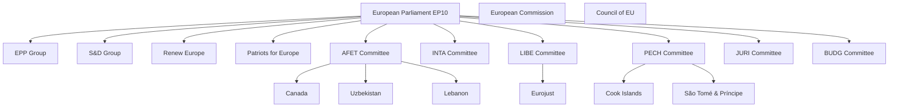

<!-- SPDX-FileCopyrightText: 2026 Hack23 AB -->
<!-- SPDX-License-Identifier: Apache-2.0 -->

# Stakeholder Map — EP Committee Reports, 2026-05-29
**Structured Analytic Techniques:** Stakeholder Mapping · Analysis of Competing Hypotheses (ACH)
**Scope:** Key actors in May 2026 EP committee outputs; interest-influence mapping

---

## 1. Stakeholder Universe Overview

## 2. Internal EP Stakeholders

### 2.1 EPP (European People's Party Group)
**Seat share (approx.):** ~188/720 (26%)
**Interests in May 2026 outcomes:**
- **AI trade strategy:** Supports — digital competitiveness aligned with EPP's von der Leyen agenda
- **SAFE Instrument / Canada:** Strongly supports — defence spending is core EPP priority in EP10
- **EU-Uzbekistan:** Supports with conditions — Central Asia engagement tied to critical minerals
- **2027 budget guidelines:** Leading negotiator — EPP's BUDG representatives shape EU budget framework
- **Forest materials:** Supports — regulatory modernisation consistent with EPP's science-based approach

**Power assessment:** 🟢 HIGH influence — largest group, chairs key committees, Commission-aligned
**Confidence:** 🟢 HIGH

### 2.2 S&D (Socialists and Democrats Group)
**Seat share (approx.):** ~136/720 (19%)
**Interests in May 2026 outcomes:**
- **AI trade strategy:** Conditional support — demands social safeguards, worker impact assessments
- **SAFE Instrument:** Reluctant support — accepts defence necessity but insists on parliamentary oversight
- **Fisheries:** Supports if sustainability conditions met — strongly tied to coastal community interests
- **Cyberbullying/online harassment (April):** Champions — core S&D digital rights agenda
- **Immunity proceedings (Pappas):** Interest — Pappas associated with Greek progressive/SYRIZA aligned group

**Power assessment:** 🟡 MEDIUM-HIGH — second largest group, essential for majority
**Key tension:** Defence spending vs. social spending (BUDG committee negotiations)
**Confidence:** 🟡 MEDIUM

### 2.3 Renew Europe
**Seat share (approx.):** ~77/720 (11%)
**Interests in May 2026 outcomes:**
- **AI trade strategy:** Strong support — free-market AI competitiveness aligns with liberal economic agenda
- **Rule of law and immunity:** Monitors — free-speech and legal process consistency concern
- **EU-Uzbekistan:** Cautious support — demands human rights conditionality
- **DMA enforcement (April):** Champions — digital single market agenda
- **Trade agreements generally:** Supports — pro-FTA orientation

**Power assessment:** 🟡 MEDIUM — kingmaker role in close votes
**Confidence:** 🟡 MEDIUM

### 2.4 Patriots for Europe (PfE)
**Seat share (approx.):** ~84/720 (12%)
**Interests:**
- **Immunity proceedings (Vilimsky):** Direct interest — Vilimsky is PfE member, outcome affects PfE
- **SAFE/defence:** Mixed — some PfE members (French RN) oppose defence integration; others (Austrian FPÖ) more ambivalent
- **AI trade strategy:** Opposes if it includes multilateral AI governance frameworks (sovereignty concerns)
- **Immigration-related items:** Would oppose any liberalisation

**Power assessment:** 🔴 LOW in governing coalition, HIGH in opposition
**Key dynamic:** PfE's Vilimsky immunity waiver granted despite PfE opposition to coalition — confirms JURI non-partisanship

**ACH on Vilimsky immunity:** Was the waiver politically motivated (H1) or legally justified (H2)?
- Evidence FOR H1 (political motivation): PfE is coalition opposition; timing convenient
- Evidence FOR H2 (legal justification): Both left and right MEP waivers granted simultaneously; JURI consistently applies standard
- **Assessment:** H2 more strongly supported. Confidence 🟡 MEDIUM.
**Confidence:** 🟡 MEDIUM

### 2.5 AFET Committee
**Composition:** MEPs from multiple groups, chaired by EPP MEP
**Role in May 2026:** Primary committee for external agreements; processed 4 items
**Key interests:**
- Strengthening EU external relations architecture
- Eastern neighbourhood engagement (post-Ukraine security framework)
- Central Asia diversification (critical minerals, energy)
- Judicial cooperation expansion (Lebanon-Eurojust)

**Power assessment:** 🟢 HIGH — controls consent procedure for all major external agreements
**Confidence:** 🟢 HIGH

### 2.6 INTA Committee
**Role:** Trade committee; co-rapporteur on external agreements with trade elements
**Key interests:**
- AI governance in trade policy (own-initiative strategy)
- FTA negotiations position papers
- Trade defence instruments (anti-dumping, countervailing duties)
- Digital trade chapters

**Power assessment:** 🟡 MEDIUM — influential on trade-specific items
**Confidence:** 🟡 MEDIUM

### 2.7 LIBE Committee
**Role:** Civil liberties, justice, home affairs
**Key interests:**
- External JHA agreements (EU-Lebanon Eurojust)
- Digital rights (DMA enforcement, cyberbullying)
- Immigration and asylum policy
- Surveillance and data protection

**Power assessment:** 🟡 MEDIUM — essential for JHA agreements
**Confidence:** 🟡 MEDIUM

### 2.8 JURI Committee
**Role:** Legal affairs, including immunity proceedings
**Key interests:**
- Rule of law consistency
- Legal basis of legislation
- Copyright and IP policy
- Parliamentary privileges

**Power assessment:** 🟡 MEDIUM — monopoly on immunity proceedings
**Confidence:** 🟢 HIGH (JURI procedure is well-documented)

## 3. External Stakeholders

### 3.1 Canada
**Role:** Third-country partner; SAFE Instrument access agreement
**Interests:**
- Access to EU defence procurement market (estimated €X billion opportunity)
- Strategic alignment with EU on Ukraine support
- Post-Trump US policy hedge: diversifying defence partnerships
- Precedent for broader Five Eyes EU defence integration

**Perspective:** Canada benefits significantly; EU also benefits from supply chain diversification.
Win-win agreement, hence smooth adoption process.
**Confidence:** 🟡 MEDIUM | **Admiralty:** B2

### 3.2 Uzbekistan
**Role:** Enhanced Partnership and Cooperation Agreement partner
**Interests:**
- Access to EU single market preferences
- Investment protection for EU companies in Uzbekistan
- Political recognition of liberalisation progress
- Alternative to Russian economic influence

**Key tension:** Uzbekistan's political system is authoritarian-adjacent; EPCA conditionality on
human rights will be monitored by EP's human rights subcommittee (DROI).

**ACH — Uzbekistan ratification (H1: smooth ratification; H2: stalled by rights concerns):**
- Evidence H1: Adopted in plenary; Council already negotiated; no major flag from AFET
- Evidence H2: Uzbekistan's rights record could trigger future suspension; EP monitoring mechanism
- **Assessment:** H1 probable in short term; H2 possible medium-term if rights regression occurs
**Confidence:** 🟡 MEDIUM

### 3.3 Cook Islands and São Tomé and Príncipe
**Role:** Fisheries partnership bilateral partners
**Interests:**
- Financial compensation (annual EU contribution)
- Sustainable fisheries management
- Diplomatic recognition from major trading bloc
- Climate resilience support (Pacific small island states especially)

**Perspective:** Asymmetric partnership — EU is dominant partner providing market access and
financial transfers; partner countries accept EU sustainability conditions in exchange.
**Confidence:** 🟢 HIGH (standard fisheries partnership structure)

### 3.4 Lebanon
**Role:** EU-Lebanon Eurojust judicial cooperation agreement
**Interests:**
- Enhanced EU political relationship post-2024 stabilisation
- Access to EU criminal intelligence for counter-terrorism/organised crime cooperation
- Legitimacy signal from EU for new Lebanese government

**Context:** Lebanon experienced political and economic crisis 2019-2023; Eurojust agreement
signals EP10's engagement with the post-crisis Lebanese state.
**Confidence:** 🟡 MEDIUM

## 4. Institutional Stakeholders

### 4.1 European Commission (von der Leyen II, 2024-2029)
**Interests in May 2026 committee outputs:**
- **AI trade strategy:** Commission aligns — part of European AI Strategy; EP OIR strengthens
  Commission's negotiating mandate with trading partners
- **SAFE Instrument expansion:** Commission proposed; EP consent confirms Commission authority
- **2027 budget guidelines:** EP guidelines shape Commission budget proposal due June 2026
- **Fisheries:** Commission negotiated both protocols; EP consent confirms Commission competence

**Power assessment:** 🟢 HIGH — executive actor implementing all of these agreements
**Confidence:** 🟢 HIGH

### 4.2 Council of the EU
**Interests:** Mirror Commission interests on external agreements; Council agreed all external agreements before EP consent
**Power assessment:** 🟢 HIGH — co-legislator and agreements co-author
**Confidence:** 🟢 HIGH

### 4.3 Eurojust
**Direct interest:** EU-Lebanon agreement expands Eurojust's external partner network
**Role:** Operational beneficiary of the agreement — enables intelligence sharing with Lebanese judicial authorities
**Confidence:** 🟢 HIGH

## 5. Stakeholder Influence-Interest Matrix

| Stakeholder | Influence | Interest | Type | Strategic Importance |
|-------------|-----------|----------|------|---------------------|
| EPP Group | Very High | High | Internal | Critical |
| S&D Group | High | High | Internal | Critical |
| Commission | Very High | High | Institutional | Critical |
| Council | Very High | High | Institutional | Critical |
| AFET Committee | High | Very High | Internal | Critical |
| Canada | Medium | Very High | External | Important |
| Renew Europe | Medium | Medium | Internal | Important |
| INTA Committee | Medium | High | Internal | Important |
| Uzbekistan | Low-Medium | Very High | External | Important |
| PfE Group | High | Mixed | Internal | Monitor |
| Eurojust | Low | Very High | Institutional | Beneficiary |
| Cook Islands | Low | Very High | External | Beneficiary |
| São Tomé | Low | Very High | External | Beneficiary |
