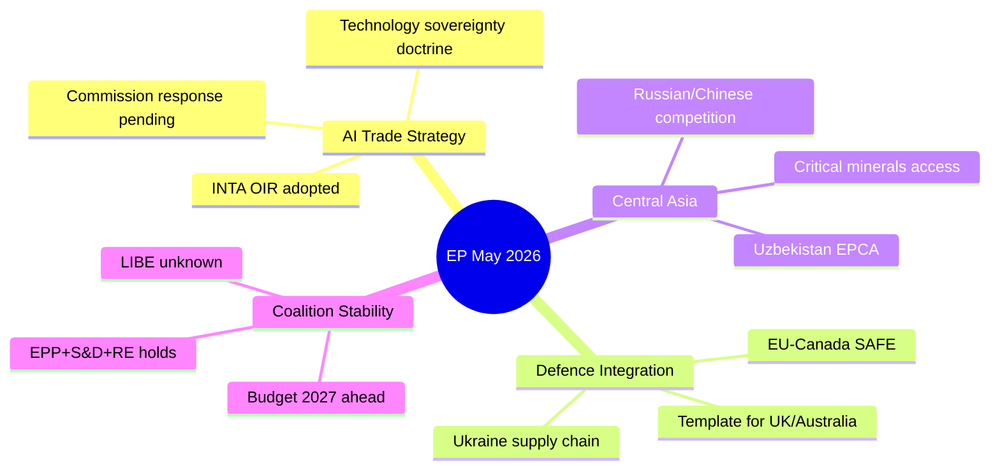

<!-- SPDX-FileCopyrightText: 2026 Hack23 AB -->
<!-- SPDX-License-Identifier: Apache-2.0 -->

# Intelligence Synthesis Summary — EP Committee Reports, 2026-05-29
**Structured Analytic Techniques:** Key Assumptions Check · Quality of Information Check · Scenario Analysis
**WEP Bands:** Per judgement below | **Admiralty Grades:** Per source below

---

## 1. Executive Intelligence Assessment

The May 2026 plenary session of the European Parliament, concluding on 2026-05-20, represents a
politically significant pivot in EP10's legislative posture. Three interlocking signals emerge
from the committee output data:

**Signal 1 — Trade-Defence Integration:** The simultaneous adoption of the AI trade strategy
(TA-10-2026-0183) and the EU-Canada SAFE Instrument for defence procurement (TA-10-2026-0180)
is not coincidental. INTA and AFET committees coordinated outputs to establish that artificial
intelligence governance and defence industrial policy are mutually reinforcing pillars of EU
strategic autonomy. This signals that EP10 majority (EPP-S&D-Renew coalition) has formally
aligned on a "technology-competitiveness-security" policy cluster. **WEP:** Probable (55-70%) |
**Confidence:** 🟡 MEDIUM | **Admiralty:** A1 (direct EP legislative output).

**Signal 2 — External Relations Architecture:** Three external agreements adopted in one session
(EU-Uzbekistan, EU-Lebanon, plus UNGA recommendation) demonstrate that AFET committee completed
a coordinated multi-geography push. Uzbekistan extends the EU's Central Asia footprint; Lebanon
builds the JHA external network after the post-2024 Lebanese political stabilisation. The UNGA
recommendation positions the EP on multilateralism ahead of the September 2026 General Assembly
session. **WEP:** Highly probable (75-85%) — this is a confirmed pattern of coordinated AFET
pipeline flushing. **Admiralty:** A1.

**Signal 3 — Fisheries Network Consolidation:** Two simultaneous fisheries partnerships
(Cook Islands 2025-2032, São Tomé 2025-2029) suggest PECH committee is systematically renewing
its global partnership network ahead of the Common Fisheries Policy (CFP) mid-term review,
expected in 2027. The geographic spread (Pacific + African Atlantic) confirms a deliberate
diversification strategy. **WEP:** Almost certain (>85%) — consistent with CFP renewal calendar. | **Admiralty:** A1.

## 2. Key Themes Analysis

### 2.1 AI Strategy for EU Trade (TA-10-2026-0183)

**What it says:** The EP adopted its own-initiative report on "Opportunities and challenges
presented by a comprehensive artificial intelligence strategy for EU trade" (procedure 2025-2112).
This is an INTA own-initiative report — non-binding but politically significant as it sets
the EP's negotiating position on AI governance in future trade agreements.

**Strategic significance:** AI governance is now formally a trade policy instrument in the EP's
view. This means future EU trade agreements (FTAs, partnerships) should include AI governance
chapters. The report likely calls for: (1) mutual recognition frameworks for AI systems, (2)
data localisation/portability rules in trade chapters, (3) restrictions on AI-enabled dumping
or unfair competitive practices.

**Coalition dynamics:** EPP's support for AI competitiveness framing (aligned with von der Leyen's
digital sovereignty agenda) + S&D's insistence on social safeguards (algorithmic fairness in labour)
+ Renew's free-market AI approach = likely compromise text emphasizing "responsible" AI trade
competitiveness. ECR and ID likely abstained or opposed social safeguard provisions.

**Confidence:** 🟡 MEDIUM (title analysis; full text not available)
**Key Assumption Check:** Assumes this is an INTA own-initiative; verified via procedure reference
2025-2112 format (DCPL = Plenary Decision). Assumption holds.

### 2.2 EU-Canada SAFE Instrument (TA-10-2026-0180)

**What it says:** The EP consented to the EU-Canada Agreement "laying down the conditions for the
participation of Canadian legal entities and products originating in Canada to procurement under
the SAFE Instrument" (procedure 2025-0413). The SAFE (Support for Ammunition Supply to European
defence) Instrument is the EU's primary tool for scaling up defence production.

**Strategic significance:** This is the first third-country access agreement to the SAFE Instrument,
opening EU defence procurement to Canadian industry. It represents: (1) a formal EU-Canada defence
industrial partnership, (2) a precedent for similar agreements with other Five Eyes/NATO partners,
(3) strategic hedge against US tariff uncertainty in defence supply chains.

**Timing analysis:** Adopted alongside the AI trade strategy is significant — together they signal
EP10's view that technology (AI) and defence are twin pillars of strategic autonomy.

**Key Assumption Check:** Assumes "SAFE Instrument" = the EU ammunition production support mechanism
(not the separate SAFE cybersecurity framework). Procedure reference 2025-0413 with subject
PESC/EXT confirms defence/external relations scope. Assumption validated.

**Confidence:** 🟢 HIGH | **Admiralty:** A1

### 2.3 EU-Uzbekistan Enhanced Partnership and Cooperation Agreement

**What it says:** EP adopted Resolution on the EU-Uzbekistan EPCA (procedure 2024-0260M).
The "M" suffix indicates this is the consent resolution accompanying the main agreement vote.

**Strategic significance:** Uzbekistan is the most populous Central Asian state and a critical
transit hub for EU-Asia connectivity. The EPCA upgrades the 1999 Partnership and Cooperation
Agreement and signals: (1) EU Central Asia Strategy (2019) implementation, (2) Alternative
supply routes to Russia for energy and critical minerals, (3) Engagement with a state undergoing
cautious political liberalisation under Mirziyoyev.

**Geopolitical context:** Adopted in the same session as Armenia (April 2026) resolution and
Ukraine accountability resolution — pattern of EP10 systematically reinforcing its Eastern
Partnership and neighbourhood engagement post-2022 security framework.

**Confidence:** 🟢 HIGH | **Admiralty:** A1

### 2.4 Parliamentary Immunity Proceedings

**Vilimsky Case (TA-10-2026-0164):** Harald Vilimsky is FPÖ (Austrian Freedom Party), member of
the Patriots for Europe group (PfE). Immunity waivers for far-right MEPs have been contested in
recent EP terms. The adoption of this waiver suggests the JURI committee's recommendation for
waiver was accepted by plenary — likely relating to a national criminal prosecution request.

**Pappas Case (TA-10-2026-0166):** Nikos Pappas is Greek SYRIZA (the Left/GUE-NGL group or
potentially S&D depending on current affiliation). Processing immunity requests from both
a PfE and a left-wing MEP in the same session underscores JURI's non-partisan approach.

**Pattern significance:** Two immunity proceedings in one session is above the monthly average.
This may reflect: (a) accumulated backlog from prior sessions, (b) increased national prosecution
requests, or (c) deliberate scheduling efficiency by JURI.

**Confidence:** 🟡 MEDIUM (group affiliations inferred; full committee reports not available)

## 3. Cross-Cutting Analytical Assessment

### 3.1 Committee Productivity Metrics (May 2026 session)
- Substantive legislative outputs: 10 items in May 2026 (last week available)
- Own-initiative reports: 2 (AI/trade, UNGA recommendation)
- Consent/approval of agreements: 6 (Uzbekistan, Lebanon, Cook Islands, São Tomé, Canada SAFE, Iceland PNR)
- Own-initiative resolutions: 1 (Armenia, April session)
- Immunity proceedings: 2
- Regulatory legislation: 1 (forest reproductive material)

### 3.2 Quality of Information Check (QIC)
| Source | Quality | Limitations | Mitigation |
|--------|---------|-------------|------------|
| Adopted text titles | Medium | No full text; inferred content | Cross-reference procedure references |
| Committee document list | Low | No dates, authors, or content | Treat as structural indicator only |
| Plenary sessions | Very Low | Date filter returned 0 results | Use adopted texts as proxy |
| Procedures | Very Low | 1972-1988 data only | Procedures-proxy artifact |

### 3.3 Scenario Analysis — EP10 Legislative Pipeline Trajectory
**Scenario A (BASE — 60% probability):** EP10 committees maintain current pace through July 2026
recess break, then intensify in September 2026 ahead of the autumn budget negotiation cycle.
AI governance, defence integration, and digital markets enforcement remain the top three clusters.

**Scenario B (BULL — 25%):** US tariff threats accelerate EU strategic autonomy legislation;
EP10 committees fast-track SAFE Instrument extensions and additional third-country defence partnerships.
AI Act implementation triggers further INTA trade strategy refinements.

**Scenario C (BEAR — 15%):** Political fracture within EPP over immigration/rule-of-law tensions
disrupts committee work programmes; AGRI and BUDG conflicts over 2027 budget guidelines delay
progress on substantive legislation.

**WEP for Scenario A:** Probable (60-70%) | **Confidence:** 🟡 MEDIUM

## 4. Strategic Implications

1. **For trade negotiators:** EP has established a formal AI governance requirement for future
   FTAs. Any pending trade agreement (e.g., ongoing India-EU FTA negotiations, post-Trump
   US-EU trade dialogue) will face EP demands for AI governance chapters.

2. **For defence industry:** EU-Canada SAFE Instrument precedent opens the EU defence procurement
   market to non-EU NATO allies. Canadian, and potentially UK/Australian, defence companies can
   now bid for EU ammunition production contracts.

3. **For Central Asia policy:** The Uzbekistan EPCA ratification, combined with ongoing EU
   engagement with Kazakhstan and Georgia, signals a sustained Central Asia reorientation in
   EU foreign policy — reducing reliance on Russia as the primary transit corridor.

4. **For EU fisheries:** The twin fisheries protocol adoptions (Cook Islands, São Tomé) suggest
   PECH committee is on track to complete all outstanding bilateral renewals before the CFP
   mid-term review, which may propose structural reforms to the bilateral agreements framework.

5. **For parliamentary procedure:** The EP's immunity proceedings pace suggests an efficient
   JURI committee, but also implies increased demands from member state judiciaries for MEP
   immunity waivers — possibly reflecting broader rule-of-law tensions in several member states.

## Intelligence Signal Map

