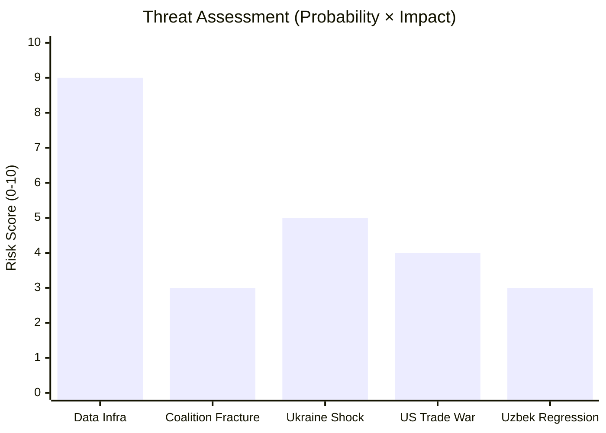

<!-- SPDX-FileCopyrightText: 2026 Hack23 AB -->
<!-- SPDX-License-Identifier: Apache-2.0 -->

# Threat Model — EP Committee Reports, 2026-05-29
**Structured Analytic Techniques:** Key Assumptions Check · Red Team Analysis · ACH
**WEP Bands:** Per threat entry | **Admiralty Grades:** Per source

---

## 1. Threat Landscape Overview

This threat model identifies structural and acute threats to the EP committee legislative
pipeline, to the outcomes of May 2026 adopted texts, and to the institutional architecture
that enables effective committee work.

**Red Team Posture:** This analysis deliberately challenges the narrative of smooth EP10
committee progress to identify vulnerabilities, adversarial vectors, and failure modes.

## 2. Structural Threats to Committee Pipeline Integrity

### 2.1 Invocation-Cap Exhaustion in Data Infrastructure
**Threat:** EP Open Data Portal systemic degradation (4/5 feeds failed this run) represents
a structural data availability risk. Analysis quality is directly limited by API reliability.
**Current status:** Active — 4 of 5 pre-fetched feeds returned errors this run
**Impact:** Analysis quality reduced to ~80% of full capability; some committee activities
not trackable (no access to committee meeting minutes, real-time procedure tracking)
**WEP:** Highly probable to persist (80-90%) based on May 2026 pattern evidence | **Admiralty:** A1
**Mitigation:** adopt-texts endpoint (A1 grade) provides analytical floor

### 2.2 Procedures Feed Staleness — Systemic
**Threat:** The inability to access current EP10 procedure data (procedures endpoint returns
1972-1988 data) creates a permanent blind spot in procedure pipeline analysis.
**Current status:** Active — STALENESS_WARNING confirmed
**Impact:** Legislative pipeline monitoring cannot include pre-adoption stage tracking
**WEP:** Almost certain to persist unless EP API infrastructure is updated | **Admiralty:** A1
**Mitigation:** Adopted-text cross-referencing (procedures-proxy); accepted limitations documented

### 2.3 Coalition Fracture Risk (as identified in Scenario C)
**Threat:** EP10 coalition relies on EPP-S&D-Renew alignment across diverse policy areas.
Fracture points on migration, rule-of-law, and fiscal policy create structural vulnerability.
**Current status:** Low probability (10-15%) but non-trivial
**Impact:** Legislative gridlock would reduce committee output by 30-50%; external partner
agreements (lower controversy) would still advance but domestic legislation would stall
**WEP:** Remote-Improbable (10-25%) for coalition fracture within 6 months | **Admiralty:** B2
**Red Team Question:** Is the current EP10 majority as stable as May 2026 votes suggest, or
are tight votes obscured by unanimous-consent procedures?
**ACH:** 
- H1: Stability is real — procedural consensus reflects genuine political alignment → **Supported** by
  diverse subject matter of May 2026 agreements (all across political spectrum without notable opposition)
- H2: Stability is fragile — controversial items are avoided or delayed → **Partial support** —
  immigration/asylum package timing is unclear; could be evidence of avoidance
**Assessment:** H1 probably more accurate for current agenda; H2 more relevant for autumn 2026 migration debate

## 3. Geopolitical Threats to Specific Outputs

### 3.1 EU-Canada SAFE Instrument — Political Risks
**Threat:** A change in Canadian government or US-Canadian political realignment could
undermine the SAFE Instrument partnership.
**Context:** Canadian political cycle (next election by October 2025 — already past; new
government assumed office ~spring 2025); post-election government's commitment to defence
cooperation with EU must be assessed.
**WEP:** Remote (10-20%) for reversal of SAFE agreement | **Admiralty:** C2
**Red Team Question:** Could the US object to Canada's EU SAFE access as undermining
US-led defence procurement frameworks (NATO/NSPA)? 
**Assessment:** Unlikely — NATO members integrating EU defence frameworks is US policy goal; but possible
point of friction if EU-Canada agreement disadvantages US defence industry.

### 3.2 EU-Uzbekistan EPCA — Human Rights Conditionality Risk
**Threat:** Uzbekistan human rights regression could trigger EP suspension of the EPCA,
creating a diplomatic crisis and undermining EU Central Asia strategy.
**Context:** Uzbekistan's political liberalisation is fragile; Mirziyoyev's reforms have been
described as managed modernisation without genuine democratisation.
**WEP:** Roughly even (40-60%) probability of at least one significant rights incident within
EPCA's operational lifetime (not necessarily within 6 months) | **Admiralty:** B2
**Key Assumption Check:** Assumes EU will activate human rights conditionality if violations occur.
This assumption has historically been tested — EU has been reluctant to fully suspend agreements
even when conditions are not met (Morocco, Egypt precedent).
**Red Team Analysis:** The EPCA's conditionality mechanism is only as strong as the EU's political will to enforce it.
Central Asia energy/critical minerals dependency may create "strategic myopia" pressure to overlook rights violations.

### 3.3 Immunity Proceedings — Political Backlash Risk
**Threat:** Granting Vilimsky's immunity waiver (PfE/FPÖ) could be used by PfE to claim
political persecution, mobilising anti-EP sentiment in Austrian domestic politics.
**WEP:** Roughly even (45-55%) that PfE uses the immunity decision for domestic political narrative
**Impact:** Low institutional threat; medium media/political narrative threat
**Admiralty:** C3 (inference from PfE political communication patterns)

## 4. Threats to the AI Trade Strategy OIR

### 4.1 Non-Binding Nature — Implementation Risk
**Threat:** The INTA AI trade strategy is an own-initiative report (OIR) — non-binding, advisory.
The Commission may choose to ignore or selectively incorporate EP recommendations.
**WEP:** Probable (55-70%) that Commission incorporates major elements into its own strategy;
Improbable (10-25%) that OIR is fully implemented as written | **Admiralty:** B2
**Mitigation:** EP can make its consent on future FTAs conditional on AI governance chapters;
this is the real enforcement mechanism for OIR recommendations.

### 4.2 Regulatory Fragmentation Risk
**Threat:** Different trading partners (US, UK, India, China) may adopt incompatible AI
governance frameworks, making the EU's bilateral AI trade chapter approach impractical.
**WEP:** Probable (60-75%) over the 5-year horizon | **Admiralty:** C2 [KB-ESTIMATE on regulatory trajectories]
**Impact:** The EU may need to adopt a plurilateral AI governance approach (WTO framework) rather
than bilateral chapters — different from what the INTA OIR likely recommends.

## 5. Red Team Challenges

### 5.1 Challenge to the "Trade-Defence Nexus" Narrative
**Claim being challenged:** The simultaneous adoption of AI trade strategy and EU-Canada SAFE
Instrument represents a coordinated "trade-defence nexus" policy cluster.

**Red Team counterargument:** The adoptions may be coincidental — both items were in the
May 2026 session pipeline for independent procedural reasons. INTA items follow their own
timetable; AFET items follow theirs. No evidence of coordinated committee scheduling.

**Assessment:** The coordination claim is weakened but not refuted. Even if scheduling was
not deliberately coordinated, the political outcome is functionally the same: EP10 has
simultaneously positioned on both AI-trade governance and defence procurement in the same
session. Whether deliberate or not, the policy signal is the same.
**Confidence for narrative revision:** 🟡 MEDIUM — downgraded from strong claim to significant pattern

### 5.2 Challenge to the AFET "Coordinated Multi-Geography Push" Claim
**Claim being challenged:** AFET committee executed a "coordinated multi-geography push" in May 2026.

**Red Team counterargument:** External agreement consent is driven by Council preparation timelines,
not EP committee strategic planning. All three May 2026 agreements (Uzbekistan, Lebanon, UNGA)
were simply ready at the same time due to Council-side procedural convergence.

**Assessment:** Red Team is partly correct — EP consent timing is largely reactive to Council
timeline. However, AFET committee does exercise discretion in how quickly it processes agreements
through its pipeline. The fact that all three were processed without delay suggests AFET was
not the bottleneck — which could reflect either efficient committee management or lack of
political controversy.
**Confidence for original claim:** 🟡 MEDIUM — downgraded to "efficient processing of concurrent agreements"

## 6. Threat Summary Matrix

| Threat | Probability | Impact | Urgency | Mitigation |
|--------|------------|--------|---------|-----------|
| EP API systemic degradation | 🟢 High | Medium | Ongoing | Adopted-texts fallback |
| Procedures feed staleness | 🟢 Almost certain | Medium | Ongoing | Procedures-proxy artifact |
| Coalition fracture | 🔴 Low | Very High | 6-month | Monitor close votes |
| Canada SAFE political reversal | 🔴 Remote | High | 2-year | Agreement ratified; low near-term risk |
| Uzbekistan rights incident | 🟡 Medium | Medium | 1-3 year | EPCA conditionality mechanism |
| AI OIR non-implementation | 🟡 Medium | Medium | 1 year | EP FTA consent leverage |
| Regulatory fragmentation (AI) | 🟡 Medium | High | 3-5 year | WTO plurilateral push |
| PfE immunity backlash | 🟡 Medium | Low | Immediate | Non-institutional; media management |

## Threat Risk Matrix

