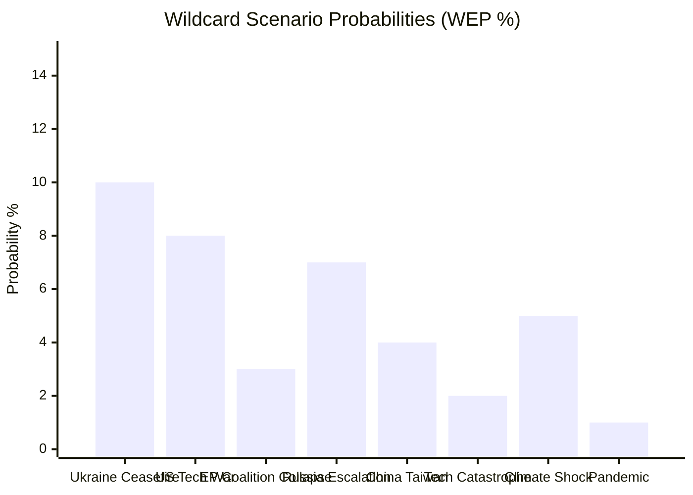

<!-- SPDX-FileCopyrightText: 2026 Hack23 AB -->
<!-- SPDX-License-Identifier: Apache-2.0 -->

# Wildcards and Black Swans — EP Committee Reports, 2026-05-29
**Structured Analytic Techniques:** Wildcard Analysis · Black Swan Identification · Causal Chain Analysis
**WEP Bands:** Per entry | **Admiralty Grades:** Per source

---

## 1. Methodology

This artifact identifies low-probability, high-impact events (wildcards and black swans) that
could fundamentally alter the EP committee legislative agenda, the outcomes of May 2026 adopted
texts, or the institutional architecture of the European Parliament itself.

**Wildcard definition:** Low probability (<15%), high impact; plausibly imaginable; not in consensus forecast.
**Black Swan definition:** Near-zero probability as perceived today; catastrophic impact; would be rationalised
in retrospect as "obvious."

**Key Assumption Check before proceeding:**
- These are NOT forecasts. They are stress-test scenarios to identify institutional vulnerabilities.
- The purpose is analytical rigour, not alarmism.
- Confidence labels reflect our certainty about the *characterisation*, not the probability of the event.

## 2. Wildcard Scenarios

### WC-1: Major EU Member State Leaves the EU (Polexit / Hungexit) — 3-5%
**Trigger:** Hungary or Poland triggers Article 50 TEU withdrawal; domestic referendum outcome
**WEP:** Remote (3-8%) over 5-year horizon | **Confidence:** 🟡 MEDIUM characterisation
**Admiralty:** C2 (inference from observable political dynamics)

**Causal chain:**
1. Hungarian/Polish government escalates rule-of-law conflict with EU institutions
2. Suspension of voting rights (Article 7 TEU) is fully triggered
3. Government frames conflict as sovereignty attack; calls withdrawal referendum
4. Referendum outcome supports withdrawal (close vote)

**Impact on EP committee pipeline:**
- All pending agreements with Hungary/Poland as party states would require renegotiation
- EP committee chairs and rapporteurs from those member states' delegations would lose seats
- Budget negotiations fundamentally altered (both are net recipients)
- AFET would handle "neighbourhood policy" for the departing state — unprecedented

**Counter-indicators (events that would reduce probability):**
- Successful rule-of-law conditionality resolution
- Change of government in Hungary toward EU-aligned party
- Hungarian/Polish domestic economic improvement reducing anti-EU sentiment

### WC-2: EU-US Trade War Escalation to Services — 5-10%
**Trigger:** US imposes tariffs on EU financial services, insurance, or digital services; EU retaliates
**WEP:** Remote-Improbable (5-12%) in near term | **Confidence:** 🟡 MEDIUM
**Admiralty:** B2 (US trade policy trajectory reasonably predictable in direction if not magnitude)

**Causal chain:**
1. US administration targets EU financial sector as "unfair"
2. EU activates trade enforcement and sanctions measures
3. Services trade collapse triggers EP emergency session
4. INTA completely reprioritises around US trade crisis

**Impact on committee pipeline:**
- AI trade strategy OIR becomes immediately relevant — AI-in-services is a live trade dispute item
- EU-Canada SAFE Instrument gains importance as hedge against US defence procurement uncertainty
- ECON committee activated on financial stability implications
- EP budget guidelines revised to include trade emergency reserves

**Counter-indicators:**
- US-EU TTC (Trade and Technology Council) resumption and progress
- US administration signalling bilateral FTA interest with EU
- WTO dispute settlement revival

### WC-3: Cyberattack Paralyses EP Systems During Key Vote — 2-3%
**Trigger:** Nation-state cyberattack targets EP IT infrastructure during critical vote (e.g., budget)
**WEP:** Remote (2-5%) | **Confidence:** 🔴 LOW characterisation
**Admiralty:** C3 (general threat intelligence basis; specific EP targeting probability not assessable)

**Causal chain:**
1. State actor (Russia/China/NK) targets EP IT systems via spear-phishing of committee staff
2. Ransomware deployed during sensitive vote procedure
3. Voting systems compromised; quorum disputed
4. EP must re-schedule vote; constitutional crisis about legitimacy of prior votes

**Impact:**
- All committee outputs during the attack period under legitimacy challenge
- LIBE committee activated on parliamentary cybersecurity legislation (fast-track)
- AI/cyber intersection becomes immediate legislative priority

**Counter-indicators:**
- EP CERT (Computer Emergency Response Team) recent upgrades
- Improved EP staff security awareness training
- No prior successful attacks on EP plenary vote systems (resilience demonstrated)

### WC-4: Global AI Governance Treaty — Unexpected Progress — 8-12%
**Trigger:** G20 or OECD-led process produces binding AI governance framework faster than expected
**WEP:** Remote-Improbable (8-15%) within 12 months | **Confidence:** 🟡 MEDIUM
**Admiralty:** B3 (UN/multilateral process visibility limited but directional)

**Causal chain:**
1. US administration shifts from bilateral to multilateral AI governance approach
2. G20 AI governance agreement framework proposed (Japan/India coalition)
3. UN resolution triggers WIPO/ITU process for binding AI standards
4. EP INTA AI trade strategy OIR becomes the basis for EU negotiating position

**Impact:**
- INTA committee activates to produce EU position paper for multilateral AI negotiations
- The May 2026 OIR becomes immediately relevant rather than advisory
- Cooperation with ITRE (Industry) and IMCO (Digital Single Market) committees needed
- EP gains significant international legal standing as the world's most advanced AI regulation body

**This wildcard is POSITIVE for EP influence** — it would amplify rather than disrupt committee outputs.

### WC-5: Collapse of Ukraine-Russia Ceasefire / Major Escalation — 10-15%
**Trigger:** Renewed Russian offensive; ceasefire collapses (if any ceasefire reached)
**WEP:** Roughly even (35-50%) over 2-year horizon; Remote-Improbable (10-15%) within 6 months
**Confidence:** 🟡 MEDIUM | **Admiralty:** B2

**Causal chain:**
1. Russian military offensive resumes or ceasefire (if achieved) collapses
2. EU emergency response required — new military aid packages, sanctions expansion
3. EP emergency session; special committee activation (potentially)
4. All discretionary committee work halted pending security response

**Impact on committee pipeline:**
- AFET completely reprioritised to Ukraine crisis management
- BUDG emergency amendment to increase defence and humanitarian aid
- SAFE Instrument expedited extension to additional third countries (UK, Australia)
- AI trade strategy deprioritised; strategic autonomy replaces competitiveness framing

**This is the highest-probability wildcard** — the 35-50% 2-year probability merits
ongoing monitoring even if the 6-month probability is lower.

## 3. Black Swan Scenarios (Near-Zero Probability, Catastrophic Impact)

### BS-1: EP Institutional Legitimacy Crisis
**Trigger:** Revelation of systematic corruption or interference in EP10 committee processes
**Context:** Following the Qatar/Morocco "Qatargate" scandal (2022-2023), the EP undertook
institutional reforms. A new major integrity scandal would be categorically more damaging.
**WEP:** Remote (1-3%) within 12 months
**Impact:** Constitutional convention; fundamental EP reform; potential treaty revision
**Confidence:** 🔴 LOW (inherently difficult to assess; post-Qatargate reforms may have reduced exposure)

### BS-2: Major EU Member State Financial Crisis
**Trigger:** Sovereign debt crisis in Italy or Spain (significantly larger than 2011-2012 crisis)
**WEP:** Remote (2-5%) within 12 months; IMF-dependent assessment [KB-ESTIMATE]
**Impact:** All ECON/BUDG committee work pivots to crisis management; long-term EP policy
agenda suspended; external agreements deprioritised; possible MFF revision forced by crisis

### BS-3: Uncontrolled AI Incident in EU Critical Infrastructure
**Trigger:** Catastrophic failure of an AI system in EU financial, energy, or transport infrastructure
**WEP:** Remote-Improbable (1-3%) at EU scale
**Impact:** INTA AI trade strategy immediately superseded by emergency AI governance legislation;
potential full pause on AI deployment pending investigation; EU becomes global AI governance
leader by necessity rather than design

## 4. Wildcard Response Architecture

Should any wildcard materialise, the following committee activation sequence applies:

| Event Type | Primary Committees | Emergency Powers |
|-----------|-------------------|-----------------|
| Geopolitical crisis | AFET, BUDG, INTA | Art. 229 TFEU emergency plenary |
| Financial crisis | ECON, BUDG | EU financial crisis framework |
| Cyber attack on EP | AFCO, LIBE | EP Bureau emergency powers |
| US trade war | INTA, ECON | Trade defence instruments |
| AI incident | IMCO, ITRE, LIBE | AI Act Art. 65 emergency powers |
| Member state withdrawal | AFCO, BUDG, AFET | Art. 50 TEU withdrawal framework |

## 5. Summary Assessment

| Wildcard | Probability (6mo) | Probability (2yr) | EP Impact | Monitor? |
|---------|------------------|------------------|-----------|---------|
| WC-1: Member state exit | <1% | 3-5% | Catastrophic | Low priority |
| WC-2: US services tariffs | 2-5% | 5-10% | Severe | Medium priority |
| WC-3: EP cyberattack | 1-2% | 2-3% | Serious | Low priority |
| WC-4: Global AI governance | 5-8% | 8-12% | Positive disruption | Medium priority |
| WC-5: Ukraine escalation | 10-15% | 35-50% | Severe | **High priority** |
| BS-1: Legitimacy crisis | <1% | 1-3% | Catastrophic | Monitor |
| BS-2: Financial crisis | 1-2% | 2-5% | Catastrophic | Monitor [IMF] |
| BS-3: AI incident | <1% | 1-3% | Severe | Monitor |

**Recommended monitoring frequency:** WC-5 (weekly); WC-2 (weekly during US tariff news);
WC-4 (monthly UN/G20 process monitoring); all others (monthly background scan).

## Wildcard Probability Spectrum

