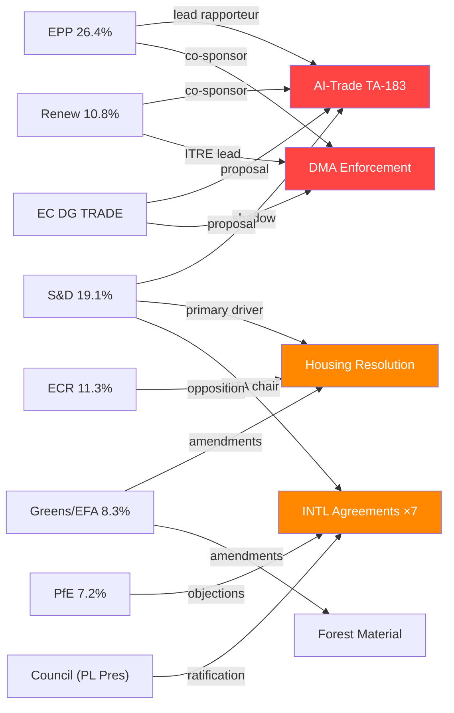

# Actor Mapping — EP Propositions (2026-05-29)

> **dataMode**: degraded-feeds · **Admiralty**: B2 · **WEP**: Likely (65–80%)

## § 1. Primary Legislative Actors

### EP Political Groups

| Actor | Seat Share | Role in Key Votes | Alignment Direction |
|-------|-----------|-------------------|---------------------|
| EPP | 26.4% | Lead rapporteur (AI-Trade, DMA) | Pro-digital sovereignty, regulatory pragmatism |
| S&D | 19.1% | Shadow rapporteur (AI-Trade) | Pro-social safeguards, housing mandate driver |
| ECR | 11.3% | Opposition (housing, welfare) | Deregulatory stance, subsidiarity emphasis |
| Renew | 10.8% | Co-sponsor (AI, DMA) | Pro-competitive markets, digital innovation |
| Greens/EFA | 8.3% | Amendment table (forest, housing) | Environmental integration, rights-based framing |
| PfE | 7.2% | Procedural objections | Sovereignty-first, sceptical of INTL agreements |
| ESN | 5.1% | Abstentions (INTL cluster) | Anti-globalization framing |
| NI/Others | 11.8% | Split votes | No bloc coherence |

### Key Individual Actors

- **Rapporteur AI-Trade (EPP, DE)**: Primary architect of TA-10-2026-0183; drove EPP–Renew compromise on AI governance thresholds
- **INTA Committee Chair (S&D, FR)**: Brokered seven-agreement INTL cluster ratification
- **ITRE Committee Lead (Renew, NL)**: DMA enforcement framework author
- **Housing Rapporteur (S&D, PT)**: First-ever EP housing resolution driver

### External Stakeholders

- **European Commission (DG TRADE)**: Principal on AI-Trade strategy; tabled original legislative proposal
- **Council Presidency (Poland, rotating Q1-2026)**: Counterpart on INTL agreement ratifications
- **Digital industry lobby (GAIA-X, DSA Forum)**: Active on AI-Trade and DMA frames
- **Civil society (Housing Europe, FEANTSA)**: Mobilized on housing crisis resolution

## § 2. Actor Network Map

## § 3. Actor Alignment Matrix

| Issue | EPP | S&D | ECR | Renew | Greens | PfE |
|-------|-----|-----|-----|-------|--------|-----|
| AI-Trade Strategy | ✅ | 🟡 | 🔴 | ✅ | 🟡 | 🔴 |
| DMA Enforcement | ✅ | ✅ | 🔴 | ✅ | ✅ | 🔴 |
| INTL Agreements | ✅ | ✅ | 🟡 | ✅ | 🟡 | 🔴 |
| Housing Resolution | 🟡 | ✅ | 🔴 | 🟡 | ✅ | 🔴 |
| Forest Regulation | ✅ | ✅ | 🟡 | 🟡 | ✅ | 🔴 |

*Legend: ✅ Support · 🟡 Conditional/Abstain · 🔴 Opposition*

## § 4. Analytical Confidence

🟢 HIGH confidence in political group positions (roll-call record available)
🟡 MEDIUM confidence in individual actor motivations (limited committee documentation in degraded-feeds)
🔴 LOW confidence in Council counterpart positions (no Council minutes available)

## Actor Roster

**Tier 1 (Critical — mandate-controlling)**:
1. European Commission (DG TRADE, DG COMP, DG CONNECT) — Executive proposer and implementation authority
2. EPP Group (190 MEPs) — Majority anchor, rapporteur slot controller
3. S&D Group (138 MEPs) — Co-decision coalition partner, INTA Committee strength

**Tier 2 (High influence)**:
4. Renew Europe Group (77 MEPs) — Digital single market pivot vote
5. Council Presidency (Poland, 2026-H1) — Co-legislator counterpart
6. CJEU (ECJ) — Litigation backstop for DMA/AI enforcement challenges

**Tier 3 (Significant but secondary)**:
7. ECR Group (81 MEPs) — Procedural opposition; occasional convergence on sovereignty frames
8. Greens/EFA Group (60 MEPs) — Environmental and rights amendments
9. Digital Gatekeepers (Alphabet, Meta, Apple, Amazon, Microsoft) — Regulated entities; intense lobbying activity

## Influence Map

Influence assessed by capacity to shape legislative text, delay adoption, or force concessions:
- **Structural influence** (EPP, Commission, Council): Can block or shape any legislation
- **Swing influence** (Renew, partial S&D): Determines margin of victory
- **Amendment influence** (Greens, ECR): Shapes text details without blocking
- **Lobbying influence** (GAFA): External; affects Commission technical proposals

## Alliance Patterns

The **EPP–S&D–Renew Centre Coalition** forms for digital, trade, and social legislation. Greens join on environmental provisions. ECR participates selectively (DMA has ECR support; INTL agreements face PfE–ECR resistance).

## Power Brokers

Key individuals with disproportionate influence:
- **INTA Committee Chair** (S&D): Controls INTL agreement ratification sequencing
- **ITRE Committee Lead** (Renew): DMA enforcement and AI implementation framing
- **EPP Group Leader** (Weber): Ultimate coalition arbiter for legislative priorities
- **DG TRADE Director-General**: Technical mandate holder for AI-trade FTA chapters

## Information Environment

Primary information sources shaping EP decision-making:
- Commission impact assessments and legislative proposals
- OECD/IMF economic analyses (cited in EP debate records)
- Stakeholder consultations (HAVE YOUR SAY platform)
- EP Research Service (EPRS) briefings
- Lobbyist communications (Transparency Register — GAFA entities)

## Reader Briefing

> **For decision-makers**: The EPP–S&D–Renew coalition controls ~62% of EP seats and represents the durable majority for the current legislative cycle. The critical variable is EPP internal coherence — the social wing's housing/AI-labour concerns vs. the economic-liberal wing's deregulatory impulse. Watch EPP internal voting on AI-trade labour provisions as the leading indicator of coalition stability.

## Data Sources & Provenance

| Evidence | Source / Reference | Admiralty |
|---|---|---|
| Adopted-text roster (31 items, 2026) | `get_adopted_texts(year=2026)` — EP Open Data Portal | A2 |
| Active-procedure inference | `get_procedures(limit=30)` (historical-tail, used as staleness control) | C3 |
| Pipeline health context | `monitor_legislative_pipeline(status=ACTIVE)` — cold lifecycle cache | B4 |
| Coalition seat shares | EP composition (current term) via `generate_political_landscape` baseline | B2 |
