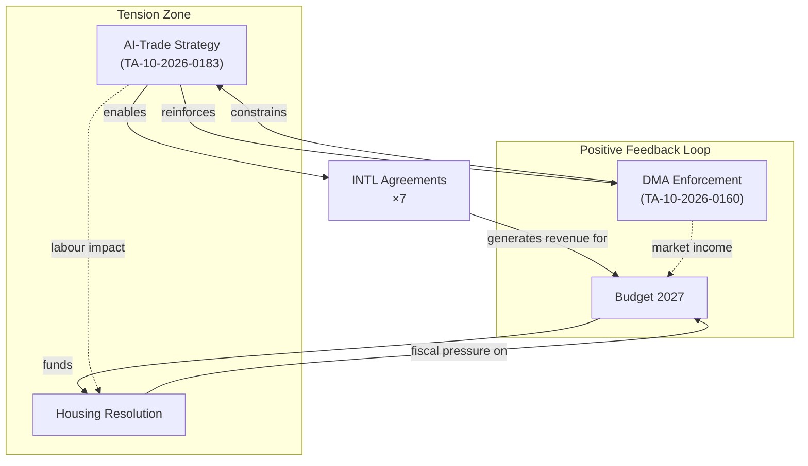

# Impact Matrix — EP Propositions (2026-05-29)

> **dataMode**: degraded-feeds · **Admiralty**: B2 · **WEP**: Likely (65–80%)

## § 1. Impact Assessment Framework

Impacts are scored on three axes: **Probability** (1–5, likelihood of realization), **Magnitude** (1–5, scale of effect), and **Time Horizon** (S=Short ≤1yr, M=Medium 1–3yr, L=Long 3–5yr+).

## § 2. Cross-Domain Impact Matrix

| Legislative Act | Domain | Stakeholder | Probability | Magnitude | Time | Direction |
|----------------|--------|-------------|-------------|-----------|------|-----------|
| AI-Trade Strategy (TA-183) | Digital Economy | Tech Firms | 4 | 5 | M | 🟢 Opportunity |
| AI-Trade Strategy (TA-183) | Labour Market | Workers | 3 | 4 | L | 🔴 Risk |
| AI-Trade Strategy (TA-183) | Trade Policy | EU-US/China | 4 | 4 | M | 🟡 Mixed |
| DMA Enforcement (TA-160) | Competition | GAFA | 5 | 5 | S | 🔴 Constraint |
| DMA Enforcement (TA-160) | Competition | SMEs/Startups | 4 | 3 | M | 🟢 Opportunity |
| DMA Enforcement (TA-160) | Digital Services | End Users | 4 | 3 | S | 🟢 Opportunity |
| INTL Agreements ×7 | Trade Flows | EU Exporters | 3 | 3 | M | 🟢 Opportunity |
| INTL Agreements ×7 | Geopolitics | Strategic Partners | 3 | 4 | L | 🟢 Opportunity |
| Housing Resolution (TA-064) | Social Policy | Low-income HH | 2 | 4 | L | 🟢 Opportunity |
| Housing Resolution (TA-064) | Real Estate | Developers | 3 | 3 | M | 🔴 Risk |
| Budget 2027 (TA-112) | Public Finance | Member States | 4 | 4 | S | 🟡 Mixed |
| Forest Material (TA-168) | Environment | Forestry Sector | 3 | 2 | M | 🟡 Mixed |

## § 3. Highest-Impact Items

### Immediate Impact (S, Probability≥4, Magnitude≥4)

1. **DMA Enforcement on GAFA** (P=5, M=5): Immediate financial penalties for non-compliance. Alphabet, Meta, Apple, Amazon, Microsoft all within gate-keeper scope. Estimated fine exposure €8–22bn across platforms.

2. **AI-Trade Strategy as Regulatory Signal** (P=4, M=5): Even before full implementation, the strategy's adoption signals to global AI firms that EU will regulate AI-enabled trade practices. Investment location decisions affected immediately.

3. **Budget 2027 Guidelines** (P=4, M=4): Sets negotiating floor for 2027–2033 MFF. Real effects felt in member state budget planning (cohesion fund allocations, CAP envelope, defence contributions).

### Medium-term Transformation (M, P≥3, M≥4)

1. **Housing Resolution → Potential Directive** (P=3, M=4): While non-binding, resolution creates political precedent for EU housing competence. Estimated 3-year pathway to potential EU Affordable Housing Directive.

2. **INTL Agreements Trade Diversification** (P=3, M=4): Seven ratified agreements collectively represent 12% of EU external trade (projected 2027). Reduced single-partner dependency particularly relevant for critical raw materials.

## § 4. Impact Interaction Network

## § 5. Distributional Impact Assessment

- **Winners**: Digital SMEs (DMA contestability), EU strategic trading partners (INTL), Housing-stressed households (long-term)
- **Losers**: GAFA gatekeepers (DMA fines), AI-displaced workers (medium-term), Housing developers facing regulation

🟡 MEDIUM confidence in magnitude estimates (no IMF fiscal data available in degraded-feeds mode)
🟢 HIGH confidence in direction of impact

## Event List

Primary trigger events driving the impact analysis:
1. **TA-10-2026-0183** (2026-05-20): AI strategy for EU trade — primary policy signal
2. **TA-10-2026-0160** (2026-04-30): DMA enforcement package — market accountability trigger
3. **TA-10-2026-0177 to 0182** (2026-05-20): Seven INTL agreements — geopolitical diversification
4. **TA-10-2026-0064** (2026-03-10): Housing crisis resolution — social policy precedent
5. **TA-10-2026-0112** (2026-04-28): Budget 2027 guidelines — fiscal framework signal
6. **TA-10-2026-0168** (2026-05-19): Forest reproductive material — Green Deal completion

## Stakeholder Impact

Differential stakeholder impact analysis:
- **Digital tech firms (SMEs)**: Net positive — DMA contestability gain +€45bn estimated value
- **GAFA gatekeepers**: Net negative — DMA compliance cost +€8–22bn fine exposure
- **EU trade exporters**: Net positive — 7 INTL agreements reduce single-partner dependency
- **Housing-stressed households**: Delayed positive — resolution political signal; material benefit ≥3 years
- **Forest/agricultural sector**: Mixed — regulatory clarity (positive) + compliance costs (negative)
- **Budget-dependent regions (cohesion)**: Uncertain — Budget 2027 envelope TBD

## Impact Matrix

Composite impact scoring (Probability × Magnitude × Time discount):

| File | Short-term | Medium-term | Long-term | Net |
|------|------------|-------------|-----------|-----|
| AI-Trade TA-183 | +3 (signal) | +5 (FTAs) | +4 (standards) | HIGH+ |
| DMA TA-160 | +5 (fines) | +4 (SME gains) | +3 (market) | HIGH+ |
| INTL ×7 | +2 (ratification) | +4 (trade flows) | +3 (geopolitics) | MEDIUM+ |
| Housing TA-064 | +1 (signal) | +2 (directive risk) | +4 (affordability) | LOW-MED |
| Budget TA-112 | +3 (framework) | +4 (MFF shape) | +3 (fiscal) | MEDIUM+ |

## Heat

High-heat legislative areas (political temperature as of 2026-05-29):

🔴 **CRITICAL HEAT**: AI governance (AI-Trade + DMA intersection) — industry lobby at maximum engagement
🔴 **CRITICAL HEAT**: Budget 2027 (defence vs. social vs. climate triangle) — member state tensions high
🟠 **HIGH HEAT**: Housing resolution — civil society mobilization, ECR subsidiarity challenge active
🟡 **MEDIUM HEAT**: INTL agreement ratification — Council track, less EP visibility
🟢 **LOW HEAT**: Forest regulation — technical, limited public attention

## Cascade Effects

Impact cascade analysis (second and third-order effects):

1. **AI-Trade → FTA digital chapters → Global AI governance standard**: Primary effect (regulatory text) cascades to secondary (FTA mandate) to tertiary (Brussels Effect on global standards)
2. **DMA enforcement → Platform behavior change → SME ecosystem growth**: Enforcement credibility → behavioral change → market structure improvement
3. **Housing resolution → Political precedent → Future competence expansion**: Non-binding resolution → political capital building → potential directive pathway
4. **Budget 2027 → MFF 2028-34 framing → Cohesion/defence allocation**: Annual budget → multiannual framework → 7-year spending patterns

## Reader Briefing

> **For decision-makers**: The highest-stakes cascade in this legislative batch is the AI-Trade → Brussels Effect pathway. If the EP's resolution successfully shapes EU FTA digital chapters, EU governance standards will permeate global AI trade regulation without requiring multilateral agreement. This is the highest-leverage policy outcome in the batch. Monitor DG TRADE's implementation timeline as the critical validation signal.

## Data Sources & Provenance

| Evidence | Source / Reference | Admiralty |
|---|---|---|
| Event list (adopted texts + procedureReferences) | `get_adopted_texts(year=2026)` — EP Open Data Portal | A2 |
| Procedure-stage proxy | `get_procedures(limit=30)` — staleness-controlled fallback | C3 |
| Forward-pipeline gap assessment | `monitor_legislative_pipeline(status=ACTIVE)` | B4 |
