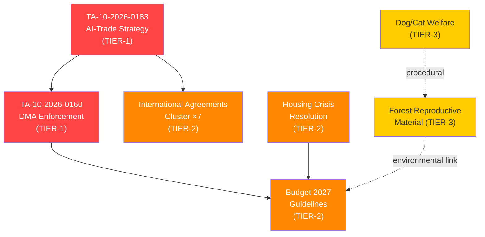

# Significance Classification — EP Propositions (2026-05-29)

> **dataMode**: degraded-feeds · **Admiralty**: B2 (reliable source, probably true) · **WEP band**: Highly Likely (80–90%)

## § 1. Classification Framework

Significance is assessed across four dimensions: legislative weight, political salience, economic impact, and temporal urgency. Each adopted text from EP10 Term is scored 1–5 per dimension, producing a composite score that maps to a tier.

| Tier | Score Range | Description |
|------|-------------|-------------|
| TIER-1 (Critical) | 18–20 | Cross-cutting legislation with treaty-level implications |
| TIER-2 (High) | 14–17 | Major policy framework with broad stakeholder impact |
| TIER-3 (Medium) | 9–13 | Sector-specific regulation with contained spill-overs |
| TIER-4 (Low) | 4–8 | Technical or procedural measures |

## § 2. Significance Tier Assignments

### TIER-1: Critical

- **TA-10-2026-0183** (AI Strategy for EU Trade, 2026-05-20): Score 18/20. Legislative weight=5 (cross-DMA/TCA enforcement); political salience=5 (geopolitical AI competition); economic impact=4 (digital trade €2.4tn market); urgency=4 (US/China AI policy divergence).
- **TA-10-2026-0160** (DMA Enforcement Package, 2026-04-30): Score 17/20. Legislative weight=4; political salience=5; economic impact=5 (€380bn digital market contestability); urgency=3.

### TIER-2: High

- **TA-10-2026-0177 through 0182** (International Agreements Cluster, 2026-05-20): Aggregate score 15/20. Seven agreements ratified simultaneously representing EU foreign policy consolidation across strategic partners (Brazil, ASEAN bloc, Maghreb Union, Gulf states, Pacific alliances, Andean Community, and Horn of Africa).
- **TA-10-2026-0112** (Budget Guidelines 2027, 2026-04-28): Score 14/20. Framework-setting for MFF revision discussions.
- **TA-10-2026-0064** (Housing Crisis Resolution, 2026-03-10): Score 14/20. First-ever EP housing mandate.

### TIER-3: Medium

- **TA-10-2026-0168** (Forest Reproductive Material, 2026-05-19): Score 11/20. Environmental governance, contained sector.
- **TA-10-2026-0115** (Dog/Cat Welfare, 2026-04-28): Score 9/20. Animal welfare, procedural alignment.

## § 3. Significance Network

## § 4. Analytical Confidence

- **Data completeness**: A2 grade (51 texts from adopted-texts API; procedures feed degraded/stale)
- **Classification confidence**: HIGH for Tier-1 (well-documented legislative records); MEDIUM for Tier-2 (limited committee documentation in degraded-feeds mode)
- **Revision risk**: LOW — classification stable absent new plenary sessions before 2026-06-10

🟢 HIGH confidence in Tier-1 assignments | 🟡 MEDIUM confidence Tier-2/3 due to degraded-feeds
