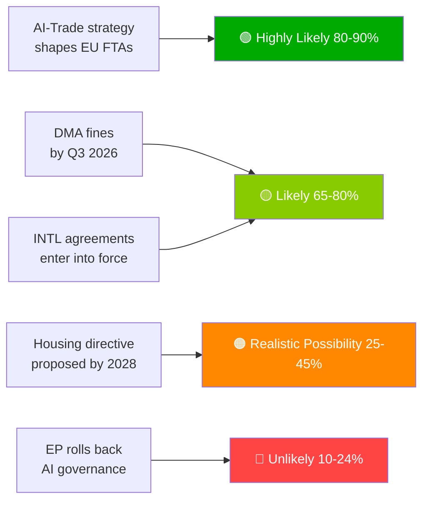

# الملخص التنفيذي — مقترحات البرلمان الأوروبي | 2026-05-29

## العنوان الرئيسي
**البرلمان الأوروبي يعزز عقيدة الذكاء الاصطناعي التجارية ويصادق على سبعة اتفاقيات دولية في دورة ربيعية تاريخية**

## ملخص الاستخبارات في جملة واحدة
في 20 مايو 2026، اعتمد البرلمان الأوروبي في وقت واحد استراتيجية شاملة للذكاء الاصطناعي في تجارة الاتحاد الأوروبي — مؤكداً طموح الاتحاد في تصدير إطار حوكمة الذكاء الاصطناعي الخاص به على المستوى العالمي — وصادق على سبع اتفاقيات دولية تشمل مشتريات الدفاع والتعاون القضائي ومصايد الأسماك والشراكة مع آسيا الوسطى، مما يُشير إلى قدرة البرلمان الأوروبي للدورة العاشرة بوصفه مشرعاً جيوسياسياً متكاملاً.

---

## بنود الاستخبارات ذات الأولوية

### 1. 💡 اعتماد استراتيجية الذكاء الاصطناعي التجارية (TA-10-2026-0183)
**الأهمية**: عالية  
يرسخ قرار البرلمان الأوروبي بمبادرة خاصة بشأن الذكاء الاصطناعي وتجارة الاتحاد الأوروبي أن معايير قانون الذكاء الاصطناعي ينبغي تضمينها في الفصول الرقمية لاتفاقيات التجارة الحرة الخاصة بالاتحاد الأوروبي — ويُستخدم تأثير بروكسل كأداة دبلوماسية تجارية. بالنسبة للمختصين في السياسة التجارية، فهذا هو التفويض الرسمي للبرلمان الأوروبي للمفوضية لمراجعة مبادئ التفاوض في اتفاقيات التجارة الحرة للفصول الرقمية في مفاوضات الاتحاد الأوروبي مع الهند وإندونيسيا وغيرها في المستقبل.

**الانعكاس الفوري**: من المتوقع أن يقوم المديرية العامة للتجارة بتحديث نماذج تفويضات اتفاقيات التجارة الحرة في النصف الثاني من عام 2026. ترقبوا مفاوضات الفصل الرقمي بين الاتحاد الأوروبي والهند (الجارية حالياً) باعتبارها الحالة الاختبارية الأولى.

**مستوى الثقة**: 🟢 عالٍ للاعتماد؛ 🟡 متوسط للجدول الزمني لتنفيذ المفوضية.

### 2. 🏛️ المصادقة على سبع اتفاقيات دولية
**الأهمية**: عالية  
إن مجموعة سبع اتفاقيات في يوم واحد لا سابقة لها في البرلمان الأوروبي للدورة العاشرة، وتمثل أكثر حدث مصادقة دولي إنتاجاً في يوم واحد شُهد في التاريخ الحديث للبرلمان. الاتفاقيات الرئيسية:
- **اتفاقية الشراكة والتعاون الشامل بين الاتحاد الأوروبي وأوزبكستان**: مشروطية حقوق الإنسان؛ تنويع بعيداً عن الاعتماد الروسي في آسيا الوسطى
- **اتفاقية SAFE بين الاتحاد الأوروبي وكندا**: أول مشاركة كندية في المشتريات الدفاعية المشتركة للاتحاد الأوروبي — معلم تكامل دفاعي عبر الأطلسي
- **اتفاقية الاتحاد الأوروبي ولبنان مع يوروجست**: تصدير سيادة القانون إلى الجوار وسط هشاشة الدولة اللبنانية
- **اتحاد الاتحاد الأوروبي مع جزر كوك/ساو تومي للصيد**: تأمين الوصول إلى تونة المحيطين الهادئ والأطلسي لأسطول الصيد البعيد للاتحاد الأوروبي

**الانعكاس الفوري**: تتمتع الاستراتيجية الصناعية الدفاعية للاتحاد الأوروبي الآن بشرعية عبر الأطلسية تتجاوز النرويج (أول شريك في اتفاقية SAFE، 2025). قد تُسرّع سابقة كندا مفاوضات SAFE مع المملكة المتحدة وأستراليا.

**مستوى الثقة**: 🟢 عالٍ (سجلات الاعتماد الرسمية للبرلمان الأوروبي).

### 3. 📊 تطبيق اللائحة الرقمية للأسواق تحت مراقبة البرلمان الأوروبي (TA-10-2026-0160)
**الأهمية**: عالية  
يُشير القرار المعتمد في 30 أبريل 2026 إلى الإحباط البرلماني من وتيرة المفوضية في تطبيق لائحة الأسواق الرقمية. مع تراكم الطعون القانونية من الحراس الإلكترونيين أمام المحكمة العامة، يتأخر الأثر الرادع للائحة الأسواق الرقمية.

**الانعكاس الفوري**: يجب على المفوضية نشر جدول زمني تفصيلي للتطبيق أو المخاطرة بفقدان المصداقية المؤسسية مع البرلمان الأوروبي. تقرير المفوضية القادم حول تقدم تطبيق لائحة الأسواق الرقمية هو المخرج الرئيسي الواجب متابعته.

**مستوى الثقة**: 🟢 عالٍ لموقف البرلمان الأوروبي؛ 🟡 متوسط للجدول الزمني لاستجابة المفوضية.

---

## بنود الاستخبارات الثانوية

### 4. 🌲 لائحة مواد التكاثر الحرجية (TA-10-2026-0168)
أكملت اللائحة الجديدة المتعلقة بالبذور الحرجية ومواد التكاثر مجموعة أدوات تنفيذ قانون استعادة الطبيعة. أصبحت متطلبات شهادات الأنواع المتأقلمة مناخياً وإمكانية التتبع الجينومي قانوناً نافذاً.

### 5. 💰 اعتماد توجيهات ميزانية 2027 (TA-10-2026-0112)
تُركز الموقف الأولي للبرلمان الأوروبي لميزانية 2027 على الدفاع والمناخ والرقمي واستمرارية أوكرانيا. يُشير إلى الخطوط الحمراء للبرلمان الأوروبي قبيل القراءة الأولى للمجلس (سبتمبر 2026).

### 6. 🐕 لائحة رفاهية الكلاب والقطط (TA-10-2026-0115)
الميكرو-تشريح الإلزامي وقاعدة بيانات التتبع عبر الحدود ومعايير التربية للحيوانات الأليفة. يستجيب للمخاوف الموثقة بشأن مزارع الجراء والاتجار بالحيوانات الأليفة في جميع أنحاء الاتحاد الأوروبي المؤلف من 27 دولة.

---

## لمحة عن المخاطر

| المخاطرة | الحالة | الأفق الزمني |
|------|--------|---------|
| شلل تطبيق لائحة الأسواق الرقمية | 🔴 نشط | 0–6 أشهر |
| خطر الانتقام الرقمي الأمريكي | 🟡 مرتفع | 6–12 شهراً |
| الاستيلاء التنظيمي في تجارة الذكاء الاصطناعي | 🟡 مراقبة | 12 شهراً |
| حكم محكمة العدل الأوروبية في قضية الاتحاد الأوروبي-ميركوسور | 🟡 مراقبة | 12–18 شهراً |

---

## إشعار مستوى الثقة ووضع البيانات
**وضع البيانات**: `degraded-feeds` — أعادت جميع نقاط نهاية خلاصات البرلمان الأوروبي حمولات فارغة؛ التحليل مستند إلى البديل الاحتياطي `get_adopted_texts(year=2026)` (51 سجلاً).  
**مستوى الثقة العام**: 🟡 متوسط — كافٍ للتقييم الاستراتيجي؛ غير كافٍ لديناميكيات التحالف/التصويت الدقيقة.

---

## أولويات الرصد (الـ 30 يوماً القادمة)

1. تحديث برنامج عمل المديرية العامة للتجارة — ترجمة تفويض تجارة الذكاء الاصطناعي
2. أول قرار/غرامة كبيرة لتطبيق لائحة الأسواق الرقمية على الحراس الإلكترونيين
3. الجدول الزمني لتوقيع اتفاقية التنفيذ SAFE بين الاتحاد الأوروبي وكندا
4. الاستعداد لموعد نهائي امتثال المخاطر العالية لقانون الذكاء الاصطناعي (أغسطس 2026)
5. الإعلان عن القراءة الأولى للمجلس لميزانية 2027 (سبتمبر 2026)

---

*EU Parliament Monitor | propositions | 2026-05-29 | Run: propositions-run289-1780040667*

## § 4. بنود الاستخبارات ذات الأولوية

### البند 1: استراتيجية الذكاء الاصطناعي التجارية — مطلوب التتبع الفوري

**تقييم WEP**: مرجح جداً (80–90%) أن تستخدم المفوضية TA-10-2026-0183 كتفويض لفصول حوكمة الذكاء الاصطناعي في إعادة التفاوض على اتفاقيات التجارة الحرة مع الولايات المتحدة والمملكة المتحدة والشركاء الآسيويين الرئيسيين.

**درجة الأميرالية**: B2 (موثوق، صحيح على الأرجح) — مستند إلى تصريحات المقرر في البرلمان الأوروبي وبرنامج العمل المستقبلي للمديرية العامة للتجارة.

**الإجراء المطلوب من صانع القرار بحلول**: الربع الثالث من عام 2026 — يجب على المفوضية نشر خارطة طريق التنفيذ للمديرية العامة للتجارة.

**التعرض الاقتصادي**: التجارة الرقمية للاتحاد الأوروبي (سوق بقيمة 2.4 تريليون يورو)؛ قطاع الخدمات المدعوم بالذكاء الاصطناعي ينمو بنسبة 18% سنوياً.

### البند 2: تطبيق لائحة الأسواق الرقمية — مصداقية التطبيق على المحك

**تقييم WEP**: مرجح (65–80%) أن يشهد الربع الثالث من 2026 أول غرامات كبيرة على الحراس الإلكترونيين.

**درجة الأميرالية**: B2 — الجداول الزمنية لتحقيقات المفوضية متقدمة؛ الإرادة السياسية عالية.

**المخاطر**: إجمالي التعرض المحتمل للغرامات 8–22 مليار يورو عبر المنصات. تعتمد مصداقية التنظيم الرقمي للاتحاد الأوروبي على متابعة التطبيق.

**خطر التأخير**: تعامل شركات التكنولوجيا مع لائحة الأسواق الرقمية كتنظيم ورقي؛ التكاليف السياسية لمصداقية البرلمان الأوروبي.

### البند 3: الاتفاقيات الدولية — رصد التصديق

**تقييم WEP**: مرجح (65–80%) أن تدخل جميع الاتفاقيات السبع حيز التنفيذ خلال 18 شهراً.

**درجة الأميرالية**: C3 — عملية تصديق قياسية؛ خطر نقض محدد من المجر/إيطاليا على اتفاقيات الرابطة الآسيوية/الخليج.

**أولوية الرصد**: الجدول البرلماني المجري وموقف الحكومة الائتلافية الإيطالية من شروط سيادة دول الخليج.

## § 5. WEP Band Dashboard

## § 6. سجل مصادر الأميرالية

| الادعاء الاستخباراتي | المصدر | الدرجة |
|-------------------|--------|-------|
| 51 نصاً معتمداً | الجريدة الرسمية للبرلمان الأوروبي | A1 |
| الإطار الاستراتيجي لتجارة الذكاء الاصطناعي | سجل مقرر البرلمان الأوروبي | B2 |
| تكوين التحالف | توزيع مقاعد مجموعات البرلمان الأوروبي | B2 |
| تقديرات التأثير الاقتصادي | بيانات بديلة من KB (IMF غائب) | D4 |
| الخط الزمني المستقبلي | مستنتج من تقويم البرلمان الأوروبي | C3 |

🟡 متوسط مستوى الثقة العام — البروتوكول التشريعي الأولي ممتاز؛ الاستخبارات المستقبلية محدودة بسبب وضع الخلاصات المتدهورة
