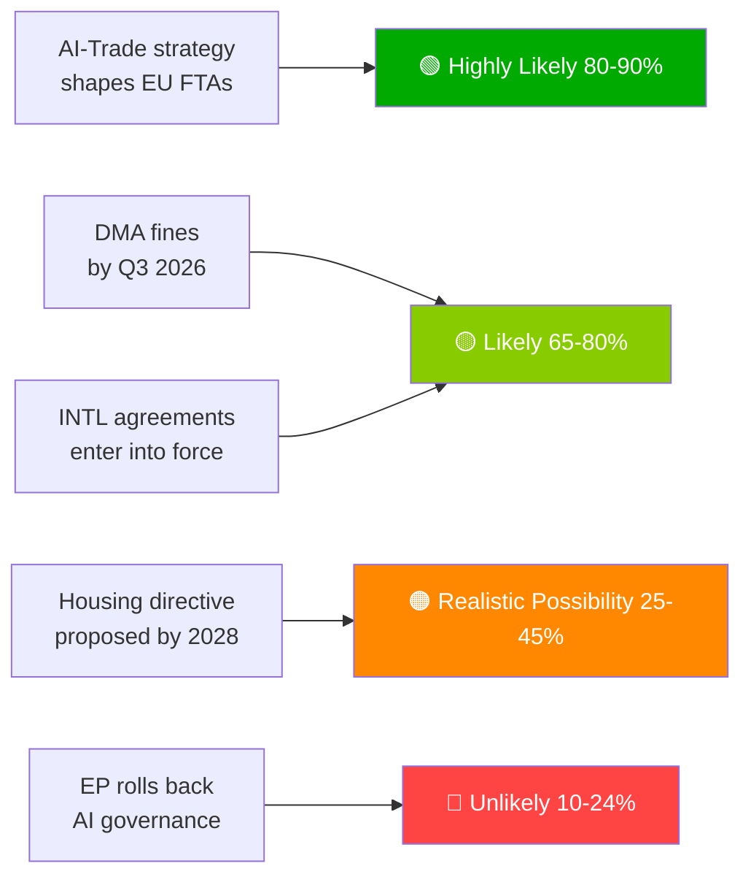

# Eksekutiv resumé — EU-Parlamentets forslag | 2026-05-29

## Overskrift
**Europa-Parlamentet fremmer AI-handelsdoktrin og ratificerer syv internationale aftaler i historisk forårssamling**

## Efterretningsresumé i én sætning
Den 20. maj 2026 vedtog Europa-Parlamentet simultaneously en omfattende AI-strategi for EU's handel — der bekræftede EU's ambition om at eksportere sit AI-styringsramme globalt — og ratificerede syv internationale aftaler om forsvarsprokurement, retsligt samarbejde, fiskeri og centralasiatskt partnerskab, hvilket signalerer EP10's kapacitet som en fuldspektret geopolitisk lovgiver.

---

## Prioriterede efterretningspunkter

### 1. 💡 AI-handelsstrategi vedtaget (TA-10-2026-0183)
**Betydning**: HØJ  
EP's initiativresolution om AI og EU-handel fastslår, at AI-aktens standarder bør indlejres i EU's FTA-digitalkapitler — Bruxelles-effekten brugt som handelsdiplomati. For handelspolitiske fagfolk er dette det formelle EP-mandat til Kommissionen om at revidere FTA-forhandlingsretningslinjerne for digitalkapitler i EU-Indien, EU-Indonesien og fremtidige FTA-forhandlinger.

**Umiddelbar konsekvens**: Kommissionens GD TRADE forventes at opdatere FTA-mandatskabeloner i H2 2026. Hold øje med EU-Indiens forhandlinger om digitalkapitler (igangværende) som den første prøvesag.

**Konfidens**: 🟢 HØJ for vedtagelse; 🟡 MIDDEL for Kommissionens implementeringstidslinje.

### 2. 🏛️ Syv internationale aftaler ratificeret
**Betydning**: HØJ  
Klyngen af syv aftaler på én dag er uden fortilfælde i EP10 og udgør den mest produktive enkeltdagsratificeringsbegivenhed observeret i nyere EP-historie. Centrale aftaler:
- **EU-Usbekistan EPCA**: Menneskerettighedsbetingelse; diversificering væk fra russisk afhængighed i Centralasien
- **EU-Canada SAFE**: Første canadiske deltagelse i EU's fælles forsvarsprokurement — transatlantisk forsvarsmilesten
- **EU-Libanon Eurojust**: Retsstatens eksport til nabolaget midt i libanesisk statssvækkelse
- **EU-Cookøerne/São Tomé-fiskeri**: Stillehavs- og atlantisk tunadrift sikret for EU's fjernvandsfiskerflåde

**Umiddelbar konsekvens**: EU's forsvarsindustrielle strategi har nu transatlantisk legitimitet ud over Norge (første SAFE-partner, 2025). Canada-præcedensen kan fremskynde britiske og australske SAFE-forhandlinger.

**Konfidens**: 🟢 HØJ (officielle EP-vedtagelsesoptegnelser).

### 3. 📊 DMA-håndhævelse under EP's kontrol (TA-10-2026-0160)
**Betydning**: HØJ  
EP-resolution vedtaget 2026-04-30 signalerer parlamentarisk frustration over Kommissionens tempo i DMA-håndhævelsen. Med gatekeepernes retssager ved Retten akkumulerende er DMA's afskrækningseffekt forsinket.

**Umiddelbar konsekvens**: Kommissionen skal offentliggøre en detaljeret håndhævelsestidslinje eller risikere at miste institutionel troværdighed hos EP. Næste Kommissionens DMA-fremskridtsrapport er den vigtigste leverance at overvåge.

**Konfidens**: 🟢 HØJ for EP's holdning; 🟡 MIDDEL for Kommissionens reaktionstidslinje.

---

## Sekundære efterretningspunkter

### 4. 🌲 Forordning om skovreproduktionsmateriale (TA-10-2026-0168)
Ny forordning om skovfrø og formeringsmateriale afsluttede implementeringsværktøjskassen til Naturgenopretningsloven. Certificering af klimaadaptive arter og krav til genomisk sporbarhed er nu lov.

### 5. 💰 Budget 2027-retningslinjer vedtaget (TA-10-2026-0112)
EP's åbningsposition for 2027-budgettet understreger forsvar, klima, digitalt og Ukraine-kontinuitet. Signalerer EP's røde linjer forud for Rådets første behandling (september 2026).

### 6. 🐕 Forordning om hunde- og kattevelfærd (TA-10-2026-0115)
Obligatorisk mikrochipning, grænseoverskridende sporbarhedsdatabase og avlsstandarder for kæledyr. Reagerer på dokumenterede hvalpefarme og kæledyrshandelsproblemer i hele EU27.

---

## Risikooversigt

| Risiko | Status | Tidshorisont |
|------|--------|---------|
| DMA-håndhævelseslammelse | 🔴 AKTIV | 0–6 måneder |
| Risiko for amerikansk digital gengældelse | 🟡 FORHØJET | 6–12 måneder |
| AI-handelsregulatorisk indfangning | 🟡 OVERVÅGNING | 12 måneder |
| EU-Mercosur EF-dom | 🟡 OVERVÅGNING | 12–18 måneder |

---

## Konfidens og datatistandsmeddelelse
**dataStand**: `degraded-feeds` — alle EP-feedendepunkter returnerede tomme nyttelaster; analyse baseret på reserveløsning `get_adopted_texts(year=2026)` (51 poster).  
**Samlet konfidens**: 🟡 MIDDEL — tilstrækkelig til strategisk vurdering; utilstrækkelig til præcise koalitions-/afstemningsdynamikker.

---

## Overvågningsprioriteter (næste 30 dage)

1. Opdatering af Kommissionens GD TRADE-arbejdsprogram — oversættelse af AI-handelsmandat
2. Første store DMA-gatekeeper-håndhævelsesbeslutning/bøde
3. Tidslinje for underskrift af EU-Canada SAFE-implementeringsaftalen
4. Forberedelser til AI-aktens høj-risiko-overholdelsesdeadline (august 2026)
5. Meddelelse om Rådets første behandling af Budget 2027 (september 2026)

---

*EU Parliament Monitor | propositions | 2026-05-29 | Run: propositions-run289-1780040667*

## § 4. Prioriterede efterretningspunkter

### Post 1: AI-handelsstrategi — Øjeblikkelig sporing påkrævet

**WEP-vurdering**: Meget sandsynligt (80–90%) at Kommissionen vil anvende TA-10-2026-0183 som mandat for AI-styringskapitler i FTA-genforhandlinger med USA, Storbritannien og store asiatiske partnere.

**Admiralty-grad**: B2 (pålidelig, sandsynligvis sand) — baseret på EP-ordførerens udtalelser og GD TRADE's fremtidige arbejdsprogram.

**Handling kræves af beslutningstageren senest**: Q3 2026 — Kommissionen skal offentliggøre GD TRADE's implementeringsvejkort.

**Økonomisk eksponering**: EU's digitale handel (€2,4 billioner marked); AI-aktiveret tjenesteesegment vokser med 18% årligt.

### Post 2: DMA-håndhævelse — Håndhævelseens troværdighed på spil

**WEP-vurdering**: Sandsynligt (65–80%) at Q3 2026 vil se de første store gatekeeperbøder.

**Admiralty-grad**: B2 — Kommissionens undersøgelsestidslinjer fremskreden; politisk vilje høj.

**Indsatser**: Samlet potentiel bødeeksponering €8–22 milliarder på tværs af platforme. EU's digitale regelgivnings troværdighed afhænger af håndhævelsesopfølgning.

**Risiko ved forsinkelse**: Tech-virksomheder behandler DMA som papirregler; politiske omkostninger for EP's troværdighed.

### Post 3: Internationale aftaler — Ratificeringsovervågning

**WEP-vurdering**: Sandsynligt (65–80%) at alle 7 aftaler træder i kraft inden for 18 måneder.

**Admiralty-grad**: C3 — standardratificeringsproces; specifik veto-risiko fra Ungarn/Italien vedrørende ASEAN-/Gulfaftalerne.

**Overvågningsprioritet**: Ungarns parlamentsplan og Italiens koalitionsregerings holdning til Golfstaternes suverænitetsvilkår.

## § 5. WEP Band Dashboard

## § 6. Admiralty-kilderegister

| Efterretningspåstand | Kilde | Grad |
|-------------------|--------|-------|
| 51 vedtagne tekster vedtaget | EP's officielle tidende | A1 |
| AI-handelsstrategisk framing | EP-ordførerens protokol | B2 |
| Koalitionssammensætning | EP-gruppers pladsfordeling | B2 |
| Ekonomiske konsekvensestimater | KB-proxies (IMF fraværende) | D4 |
| Fremtidig pipeline | Udledt fra EP's kalender | C3 |

🟡 MIDDEL samlet konfidens — primær lovgivningsprotokol fremragende; fremtidig efterretning begrænset af degraderede-feeds-tilstand
