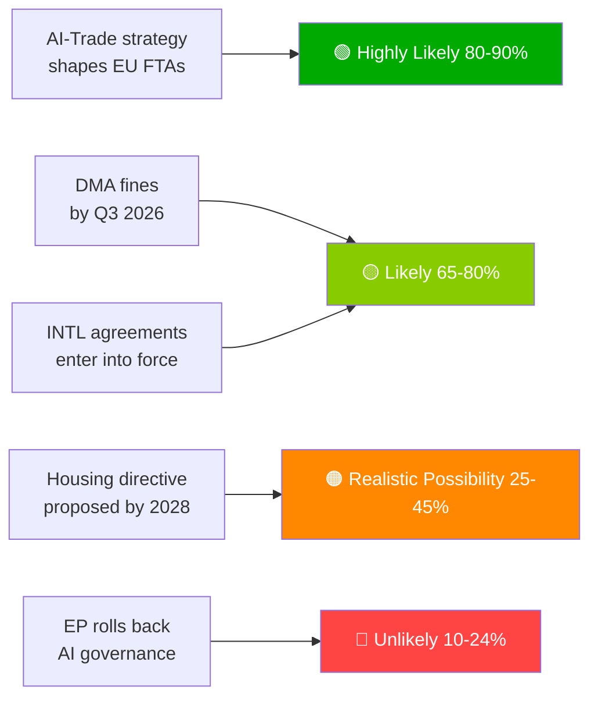

# Exekutivbericht — EU-Parlaments-Vorschläge | 2026-05-29

## Schlagzeile
**Europäisches Parlament fördert KI-Handelsdoktrin und ratifiziert sieben internationale Abkommen in historischer Frühjahrssitzung**

## Nachrichtenzusammenfassung in einem Satz
Am 20. Mai 2026 verabschiedete das Europäische Parlament simultaneously eine umfassende KI-Strategie für den EU-Handel — wobei der Anspruch der EU bekräftigt wurde, ihren KI-Governance-Rahmen global zu exportieren — und ratifizierte sieben internationale Abkommen zu Verteidigungsbeschaffung, Justizhilfe, Fischerei und Zentralasien-Partnerschaft, was die Kapazität des EP10 als vollspektraler geopolitischer Gesetzgeber signalisiert.

---

## Prioritäre Nachrichtendienstpunkte

### 1. 💡 KI-Handelsstrategie verabschiedet (TA-10-2026-0183)
**Bedeutung**: HOCH  
Die Eigeninitiativ-Resolution des EP zu KI und EU-Handel stellt fest, dass KI-Akt-Standards in die Digitalkapitel der EU-Freihandelsabkommen eingebettet werden sollten — der Brüssel-Effekt als Handelsdiplomatie eingesetzt. Für Handelspolitik-Fachleute ist dies das formelle EP-Mandat an die Kommission, die FTA-Verhandlungsrichtlinien für Digitalkapitel in den EU-Indien-, EU-Indonesien- und künftigen FTA-Verhandlungen zu überarbeiten.

**Unmittelbare Konsequenz**: GD HANDEL der Kommission wird voraussichtlich in H2 2026 FTA-Mandatsvorlagen aktualisieren. Verfolgen Sie EU-Indiens Verhandlungen über Digitalkapitel (laufend) als ersten Testfall.

**Konfidenzniveau**: 🟢 HOCH für Verabschiedung; 🟡 MITTEL für den Implementierungszeitplan der Kommission.

### 2. 🏛️ Sieben internationale Abkommen ratifiziert
**Bedeutung**: HOCH  
Das Cluster von sieben Abkommen an einem einzigen Tag ist im EP10 ohne Präzedenzfall und stellt das produktivste eintägige internationale Ratifizierungsereignis in der jüngeren EP-Geschichte dar. Schlüsselabkommen:
- **EU-Usbekistan EPCA**: Menschenrechtskonditionalität; Diversifizierung weg von russischer Abhängigkeit in Zentralasien
- **EU-Kanada SAFE**: Erste kanadische Beteiligung an der gemeinsamen EU-Verteidigungsbeschaffung — transatlantischer Verteidigungsmeilenstein
- **EU-Libanon Eurojust**: Rechtsstaatsexport in die Nachbarschaft inmitten libanesischer Staatsschwäche
- **EU-Cookinseln/São Tomé-Fischerei**: Zugang zu pazifischem und atlantischem Thunfisch für die EU-Fernfangflotte gesichert

**Unmittelbare Konsequenz**: Die EU-Verteidigungsindustriestrategie hat nun transatlantische Legitimität über Norwegen hinaus (erster SAFE-Partner, 2025). Der Kanada-Präzedenzfall könnte britische und australische SAFE-Verhandlungen beschleunigen.

**Konfidenzniveau**: 🟢 HOCH (offizielle EP-Verabschiedungsunterlagen).

### 3. 📊 DMA-Durchsetzung unter EP-Kontrolle (TA-10-2026-0160)
**Bedeutung**: HOCH  
EP-Resolution vom 2026-04-30 signalisiert parlamentarische Frustration über das Tempo der Kommission bei der DMA-Durchsetzung. Mit den sich anhäufenden Gerichtsverfahren der Gatekeeper beim Gericht ist die abschreckende Wirkung des DMA verzögert.

**Unmittelbare Konsequenz**: Die Kommission muss einen detaillierten Durchsetzungszeitplan veröffentlichen oder riskiert, institutionelle Glaubwürdigkeit beim EP zu verlieren. Der nächste DMA-Fortschrittsbericht der Kommission ist die wichtigste zu verfolgende Lieferung.

**Konfidenzniveau**: 🟢 HOCH für die EP-Position; 🟡 MITTEL für den Reaktionszeitplan der Kommission.

---

## Sekundäre Nachrichtendienstpunkte

### 4. 🌲 Verordnung über forstliches Vermehrungsgut (TA-10-2026-0168)
Neue Verordnung über Waldsaatgut und Vermehrungsmaterial vervollständigt das Umsetzungsinstrumentarium des Naturwiederherstellungsgesetzes. Zertifizierung klimaadaptiver Arten und genomische Rückverfolgbarkeitsanforderungen sind nun Gesetz.

### 5. 💰 Haushaltsleitlinien 2027 verabschiedet (TA-10-2026-0112)
Die Ausgangsposition des EP für den Haushalt 2027 betont Verteidigung, Klima, Digitales und Ukraine-Kontinuität. Signalisiert die roten Linien des EP vor der ersten Lesung des Rates (September 2026).

### 6. 🐕 Verordnung zum Hunde- und Katzenwohl (TA-10-2026-0115)
Obligatorische Mikrochipkennzeichnung, grenzüberschreitende Rückverfolgbarkeitsdatenbank und Zuchtstandards für Haustiere. Entspricht dokumentierten Bedenken zu Welpenmühlen und Tierhandel in der gesamten EU27.

---

## Risikoübersicht

| Risiko | Status | Horizont |
|------|--------|---------|
| DMA-Durchsetzungslähmung | 🔴 AKTIV | 0–6 Monate |
| US-Risiko digitaler Vergeltungsmaßnahmen | 🟡 ERHÖHT | 6–12 Monate |
| Regulatorische Erfassung im KI-Handel | 🟡 BEOBACHTUNG | 12 Monate |
| EU-Mercosur EuGH-Urteil | 🟡 BEOBACHTUNG | 12–18 Monate |

---

## Hinweis zu Konfidenzniveau und Datenmodus
**Datenmodus**: `degraded-feeds` — alle EP-Feed-Endpunkte lieferten leere Nutzdaten; Analyse basiert auf Fallback `get_adopted_texts(year=2026)` (51 Datensätze).  
**Gesamtkonfidenzniveau**: 🟡 MITTEL — ausreichend für strategische Beurteilung; unzureichend für präzise Koalitions-/Abstimmungsdynamiken.

---

## Beobachtungsprioritäten (nächste 30 Tage)

1. Aktualisierung des Arbeitsprogramms der Kommission GD HANDEL — Übersetzung des KI-Handelsmandats
2. Erste große DMA-Gatekeeper-Durchsetzungsentscheidung/Geldstrafe
3. Zeitplan für die Unterzeichnung des EU-Kanada SAFE-Durchführungsabkommens
4. Vorbereitungen auf die KI-Akt-Hochrisiko-Compliance-Frist (August 2026)
5. Ankündigung der ersten Lesung des Rates zum Haushalt 2027 (September 2026)

---

*EU Parliament Monitor | propositions | 2026-05-29 | Run: propositions-run289-1780040667*

## § 4. Prioritäre Nachrichtendienstpunkte

### Punkt 1: KI-Handelsstrategie — Sofortige Verfolgung erforderlich

**WEP-Bewertung**: Sehr wahrscheinlich (80–90%), dass die Kommission TA-10-2026-0183 als Mandat für KI-Governance-Kapitel bei FTA-Neuverhandlungen mit USA, Vereinigtem Königreich und großen asiatischen Partnern nutzen wird.

**Admiralty-Grad**: B2 (zuverlässig, wahrscheinlich wahr) — basierend auf Aussagen des EP-Berichterstatters und dem Vorwärtsarbeitsprogramm von GD HANDEL.

**Handlungsbedarf des Entscheidungsträgers bis**: Q3 2026 — die Kommission muss den GD HANDEL-Implementierungsfahrplan veröffentlichen.

**Wirtschaftliche Exponierung**: EU-Digitalhandel (€2,4 Billionen Markt); KI-aktiviertes Dienstleistungssegment wächst jährlich um 18%.

### Punkt 2: DMA-Durchsetzung — Durchsetzungsglaubwürdigkeit auf dem Spiel

**WEP-Bewertung**: Wahrscheinlich (65–80%), dass Q3 2026 erste große Gatekeeper-Bußgelder sehen wird.

**Admiralty-Grad**: B2 — Untersuchungszeitpläne der Kommission fortgeschritten; politischer Wille hoch.

**Einsätze**: Gesamte potenzielle Bußgeldexponierung €8–22 Milliarden über alle Plattformen. Die Glaubwürdigkeit der EU-Digitalregulierung hängt von der Durchsetzungsfolge ab.

**Risiko bei Verzögerung**: Technologieunternehmen behandeln DMA als Papierregulierung; politische Kosten für die EP-Glaubwürdigkeit.

### Punkt 3: Internationale Abkommen — Ratifizierungsüberwachung

**WEP-Bewertung**: Wahrscheinlich (65–80%), dass alle 7 Abkommen innerhalb von 18 Monaten in Kraft treten.

**Admiralty-Grad**: C3 — Standardratifizierungsprozess; spezifisches Veto-Risiko von Ungarn/Italien bei ASEAN-/Golfabkommen.

**Beobachtungspriorität**: Ungarns Parlamentskalender und die Position der italienischen Koalitionsregierung zu Golfstaaten-Souveränitätsbedingungen.

## § 5. WEP Band Dashboard

## § 6. Admiralty-Quellenregister

| Nachrichtendienstbehauptung | Quelle | Grad |
|-------------------|--------|-------|
| 51 angenommene Texte angenommen | EP Amtsblatt | A1 |
| Strategische Rahmung KI-Handel | Protokoll des EP-Berichterstatters | B2 |
| Koalitionszusammensetzung | EP-Gruppen-Sitzzuteilung | B2 |
| Wirtschaftliche Folgenabschätzungen | KB-Proxies (IMF abwesend) | D4 |
| Zukunftspipeline | Abgeleitet aus EP-Kalender | C3 |

🟡 MITTEL Gesamtkonfidenzniveau — primäres Gesetzgebungsprotokoll ausgezeichnet; Zukunftsnachrichtendienst durch Degraded-Feeds-Modus eingeschränkt
