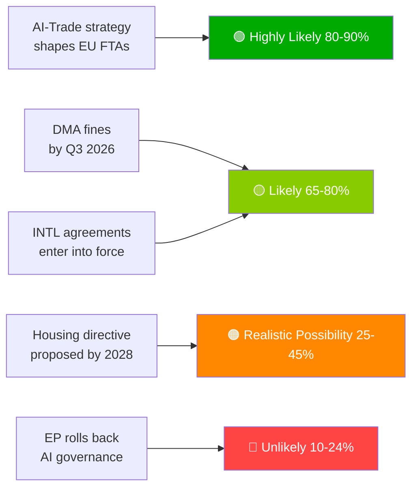

# Resumen ejecutivo — Propuestas del Parlamento Europeo | 2026-05-29

## Titular
**El Parlamento Europeo impulsa la doctrina comercial en materia de IA y ratifica siete acuerdos internacionales en una histórica sesión de primavera**

## Resumen de inteligencia en una frase
El 20 de mayo de 2026, el Parlamento Europeo adoptó simultáneamente una estrategia integral de IA para el comercio de la UE —afirmando la ambición de la UE de exportar su marco de gobernanza de la IA a escala mundial— y ratificó siete acuerdos internacionales en materia de adquisiciones de defensa, cooperación judicial, pesca y asociación con Asia Central, lo que señala la capacidad del PE10 como legislador geopolítico de espectro completo.

---

## Puntos de inteligencia prioritarios

### 1. 💡 Estrategia comercial de IA adoptada (TA-10-2026-0183)
**Relevancia**: ALTA  
La resolución de iniciativa propia del PE sobre IA y comercio de la UE establece que los estándares de la Ley de IA deben integrarse en los capítulos digitales de los TLC de la UE —el efecto Bruselas utilizado como diplomacia comercial—. Para los profesionales de política comercial, este es el mandato formal del PE a la Comisión para revisar las directrices de negociación de los TLC para los capítulos digitales en las negociaciones UE-India, UE-Indonesia y futuras negociaciones de TLC.

**Implicación inmediata**: Se espera que la DG COMERCIO de la Comisión actualice las plantillas de mandato de TLC en el segundo semestre de 2026. Esté pendiente de las negociaciones UE-India sobre los capítulos digitales (en curso) como primer caso de prueba.

**Nivel de confianza**: 🟢 ALTO para la adopción; 🟡 MEDIO para el calendario de implementación de la Comisión.

### 2. 🏛️ Siete acuerdos internacionales ratificados
**Relevancia**: ALTA  
El conjunto de siete acuerdos en un solo día no tiene precedentes en el PE10 y representa el evento de ratificación internacional en un solo día más productivo observado en la historia reciente del PE. Acuerdos clave:
- **UE-Uzbekistán EPCA**: Condicionalidad de derechos humanos; diversificación alejándose de la dependencia rusa en Asia Central
- **UE-Canadá SAFE**: Primera participación canadiense en la contratación conjunta de defensa de la UE —hito de integración defensiva transatlántica—
- **UE-Líbano Eurojust**: Exportación del Estado de derecho al vecindario en medio de la fragilidad estatal libanesa
- **UE-Islas Cook/São Tomé pesca**: Acceso asegurado al atún del Pacífico y el Atlántico para la flota pesquera de aguas lejanas de la UE

**Implicación inmediata**: La estrategia industrial de defensa de la UE cuenta ahora con legitimidad transatlántica más allá de Noruega (primer socio SAFE, 2025). El precedente canadiense podría acelerar las negociaciones SAFE del Reino Unido y Australia.

**Nivel de confianza**: 🟢 ALTO (registros oficiales de adopción del PE).

### 3. 📊 Aplicación del DMA bajo escrutinio del PE (TA-10-2026-0160)
**Relevancia**: ALTA  
La resolución del PE adoptada el 2026-04-30 señala la frustración parlamentaria ante el ritmo de aplicación del DMA por parte de la Comisión. Con la acumulación de impugnaciones legales de los guardianes de acceso ante el Tribunal General, el efecto disuasorio del DMA se ve retrasado.

**Implicación inmediata**: La Comisión debe publicar un calendario detallado de aplicación o arriesgarse a perder credibilidad institucional ante el PE. El próximo informe de progreso del DMA de la Comisión es el entregable clave a vigilar.

**Nivel de confianza**: 🟢 ALTO para la posición del PE; 🟡 MEDIO para el calendario de respuesta de la Comisión.

---

## Puntos de inteligencia secundarios

### 4. 🌲 Reglamento sobre material forestal de reproducción (TA-10-2026-0168)
El nuevo reglamento sobre semillas y material de reproducción forestal completó el conjunto de herramientas de implementación de la Ley de Restauración de la Naturaleza. La certificación de especies con adaptación climática y los requisitos de trazabilidad genómica son ahora ley.

### 5. 💰 Directrices presupuestarias 2027 adoptadas (TA-10-2026-0112)
La posición inicial del PE para el presupuesto 2027 enfatiza defensa, clima, digital y continuidad Ucrania. Señala las líneas rojas del PE antes de la primera lectura del Consejo (septiembre 2026).

### 6. 🐕 Reglamento sobre bienestar de perros y gatos (TA-10-2026-0115)
Microchipado obligatorio, base de datos de trazabilidad transfronteriza y estándares de cría para mascotas. Responde a las preocupaciones documentadas sobre criaderos ilegales y tráfico de animales en toda la EU27.

---

## Panorama de riesgos

| Riesgo | Estado | Horizonte |
|------|--------|---------|
| Parálisis en la aplicación del DMA | 🔴 ACTIVO | 0–6 meses |
| Riesgo de represalias digitales de EE.UU. | 🟡 ELEVADO | 6–12 meses |
| Captura regulatoria en el comercio de IA | 🟡 VIGILANCIA | 12 meses |
| Sentencia UE-Mercosur TJUE | 🟡 VIGILANCIA | 12–18 meses |

---

## Aviso sobre nivel de confianza y modo de datos
**modoDatos**: `degraded-feeds` — todos los puntos finales de flujo del PE devolvieron cargas útiles vacías; análisis basado en el recurso de respaldo `get_adopted_texts(year=2026)` (51 registros).  
**Nivel de confianza general**: 🟡 MEDIO — suficiente para evaluación estratégica; insuficiente para dinámicas precisas de coalición/votación.

---

## Prioridades de seguimiento (próximos 30 días)

1. Actualización del programa de trabajo de la DG COMERCIO de la Comisión — traducción del mandato comercial de IA
2. Primera gran decisión de aplicación/multa del DMA a un guardián de acceso
3. Calendario de firma del acuerdo de implementación UE-Canadá SAFE
4. Preparativos para la fecha límite de cumplimiento de alto riesgo de la Ley de IA (agosto 2026)
5. Anuncio de la primera lectura del Consejo del Presupuesto 2027 (septiembre 2026)

---

*EU Parliament Monitor | propositions | 2026-05-29 | Run: propositions-run289-1780040667*

## § 4. Puntos de inteligencia prioritarios

### Punto 1: Estrategia comercial de IA — Seguimiento inmediato requerido

**Evaluación WEP**: Muy probable (80–90%) que la Comisión utilice TA-10-2026-0183 como mandato para los capítulos de gobernanza de IA en las renegociaciones de TLC con EE.UU., Reino Unido y los principales socios asiáticos.

**Grado Almirantazgo**: B2 (fiable, probablemente cierto) — basado en declaraciones del ponente del PE y el programa de trabajo prospectivo de la DG COMERCIO.

**Acción requerida del decisor antes de**: T3 2026 — la Comisión debe publicar la hoja de ruta de implementación de la DG COMERCIO.

**Exposición económica**: Comercio digital de la UE (mercado de 2,4 billones de euros); segmento de servicios habilitados por IA creciendo un 18% anual.

### Punto 2: Aplicación del DMA — Credibilidad de la aplicación en juego

**Evaluación WEP**: Probable (65–80%) que el T3 2026 verá las primeras grandes multas a guardianes de acceso.

**Grado Almirantazgo**: B2 — calendarios de investigación de la Comisión avanzados; voluntad política alta.

**Apuestas**: Exposición total potencial a multas de 8 a 22 mil millones de euros en todas las plataformas. La credibilidad de la regulación digital de la UE depende del seguimiento de la aplicación.

**Riesgo en caso de retraso**: Las empresas tecnológicas tratan el DMA como regulación en papel; coste político para la credibilidad del PE.

### Punto 3: Acuerdos internacionales — Seguimiento de la ratificación

**Evaluación WEP**: Probable (65–80%) que los 7 acuerdos entren en vigor en 18 meses.

**Grado Almirantazgo**: C3 — proceso de ratificación estándar; riesgo de veto específico de Hungría/Italia en los acuerdos ASEAN/Golfo.

**Prioridad de seguimiento**: Calendario parlamentario húngaro y posición del gobierno de coalición italiano sobre las condiciones de soberanía de los estados del Golfo.

## § 5. WEP Band Dashboard

## § 6. Registro de fuentes del Almirantazgo

| Afirmación de inteligencia | Fuente | Grado |
|-------------------|--------|-------|
| 51 textos adoptados | Diario Oficial del PE | A1 |
| Encuadre estratégico comercio IA | Registro del ponente del PE | B2 |
| Composición de la coalición | Asignación de escaños por grupo del PE | B2 |
| Estimaciones de impacto económico | Proxies KB (IMF ausente) | D4 |
| Cartera prospectiva | Inferido del calendario del PE | C3 |

🟡 MEDIO nivel de confianza general — protocolo legislativo primario excelente; inteligencia prospectiva limitada por el modo de flujos degradados
