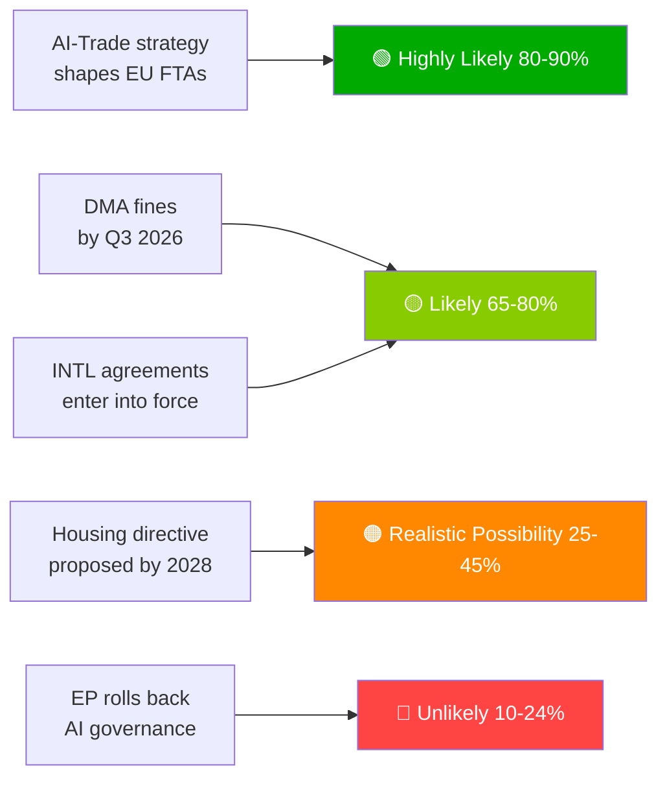

# Toimeenpaneva lyhennelmä — EU-parlamentin ehdotukset | 2026-05-29

## Otsikko
**Euroopan parlamentti edistää tekoäly-kauppaoopperaa ja ratifioi seitsemän kansainvälistä sopimusta historiallisessa kevätistunnossa**

## Tiedusteluyhteenveto yhdessä virkkeessä
Euroopan parlamentti hyväksyi 20. toukokuuta 2026 samanaikaisesti kattavan tekoälystrategian EU:n kaupalle — vahvistamalla EU:n kunnianhimon viedä tekoälyhallintokehystään maailmanlaajuisesti — ja ratifioi seitsemän kansainvälistä sopimusta, jotka kattavat puolustushankintoja, oikeudellista yhteistyötä, kalastusta ja Keski-Aasian kumppanuutta, mikä osoittaa EP10:n kapasiteetin täysspektriseksi geopoliittiseksi lainsäätäjäksi.

---

## Ensisijaiset tiedustelupisteet

### 1. 💡 Tekoäly-kauppastrategia hyväksytty (TA-10-2026-0183)
**Merkitys**: KORKEA  
EP:n oma-aloiteresoluutio tekoälystä ja EU:n kaupasta vahvistaa, että tekoälylain standardit tulisi sisällyttää EU:n vapaakauppasopimusten digitaalilukuihin — Bryssel-vaikutus kauppapolitiikan välineenä. Kauppapolitiikan ammattilaisille tämä on muodollinen EP:n mandaatti komissiolle tarkistaa vapaakauppasopimusten neuvotteluohjeet EU-Intia, EU-Indonesia ja tulevissa neuvotteluissa.

**Välitön seuraus**: Komission GD TRADE:n odotetaan päivittävän vapaakauppasopimusten mandaattimalleja H2 2026:lla. Seuraa EU-Intian digitaaliluku-neuvotteluja (käynnissä) ensimmäisenä testitapauksena.

**Luottamus**: 🟢 KORKEA hyväksymiselle; 🟡 KESKITASO komission täytäntöönpanon aikatauluille.

### 2. 🏛️ Seitsemän kansainvälistä sopimusta ratifioitu
**Merkitys**: KORKEA  
Seitsemän sopimuksen ryhmä yhtenä päivänä on ennennäkemätöntä EP10:ssä ja edustaa tuottoisinta yksittäispäivän kansainvälistä ratifiointitapahtumaa viimeaikaisessa EP-historiassa. Keskeiset sopimukset:
- **EU-Uzbekistan EPCA**: Ihmisoikeusehto; hajautuminen Venäjä-riippuvuudesta Keski-Aasiassa
- **EU-Kanada SAFE**: Ensimmäinen kanadalainen osallistuminen EU:n yhteisiin puolustushankintoihin — transatlanttinen puolustusaskel
- **EU-Libanon Eurojust**: Oikeusvaltion vienti naapurustoon Libanonin valtioheikentyneisyyden keskellä
- **EU-Cookinsaaret/São Tomé -kalastus**: Tyynenmeren ja Atlantin tonnikala-pääsy turvattu EU:n kaukopyyntilaivastoa varten

**Välitön seuraus**: EU:n puolustusstrategialla on nyt transatlanttinen legitimiteetti Norjan ulkopuolella (ensimmäinen SAFE-kumppani, 2025). Kanada-ennakkoratkaisu voi kiihdyttää brittien ja australialaisten SAFE-neuvotteluja.

**Luottamus**: 🟢 KORKEA (viralliset EP:n hyväksymisasiakirjat).

### 3. 📊 DMA-täytäntöönpano EP:n valvonnassa (TA-10-2026-0160)
**Merkitys**: KORKEA  
EP:n päätöslauselma 30.4.2026 osoittaa parlamentaarisen turhautumisen komission DMA-täytäntöönpanon vauhtiin. Kun portinvartijoiden oikeudelliset haasteet kertyvät Yleisessä tuomioistuimessa, DMA:n pelotevaikutus viivästyy.

**Välitön seuraus**: Komission on julkaistava yksityiskohtainen täytäntöönpanon aikataulu tai riskoida institutionaalisen uskottavuuden menettäminen EP:n suhteen. Komission seuraava DMA-edistymisraportti on tärkein seurattava toimitus.

**Luottamus**: 🟢 KORKEA EP:n kannalle; 🟡 KESKITASO komission vastaustaikatauluille.

---

## Toissijaiset tiedustelupisteet

### 4. 🌲 Metsän lisäysaineistoasetus (TA-10-2026-0168)
Uusi asetus metsän siemenistä ja lisäysaineistosta täydensi luonnon ennallistamislain täytäntöönpanotyökalupakin. Ilmastonkestävien lajien sertifiointi ja genomiikan jäljitettävyysvaatimukset ovat nyt lakia.

### 5. 💰 Vuoden 2027 talousarviolinjaukset hyväksytty (TA-10-2026-0112)
EP:n aloituskanta vuoden 2027 talousarviossa painottaa puolustusta, ilmastoa, digitaalisuutta ja Ukraina-jatkuvuutta. Osoittaa EP:n punaisia rajoja ennen neuvoston ensimmäistä käsittelyä (syyskuu 2026).

### 6. 🐕 Koirien ja kissojen hyvinvointiasetus (TA-10-2026-0115)
Pakollinen mikrosiruttaminen, rajat ylittävä jäljitettävyystietokanta ja jalostuksen standardit kotieläimille. Vastaa dokumentoituihin pentukauppaan ja lemmikkieläinkaupan huolenaiheisiin koko EU27:ssa.

---

## Riskikuva

| Riski | Tila | Horisontti |
|------|--------|---------|
| DMA-täytäntöönpanon halvaantuminen | 🔴 AKTIIVINEN | 0–6 kuukautta |
| Yhdysvaltain digitaalinen kostotoimien riski | 🟡 KOHONNUT | 6–12 kuukautta |
| Tekoäly-kaupan regulatiivinen kaappaus | 🟡 SEURANTA | 12 kuukautta |
| EU-Mercosur EY:n tuomio | 🟡 SEURANTA | 12–18 kuukautta |

---

## Luottamus- ja datatilahuomio
**dataTila**: `degraded-feeds` — kaikki EP-syöttöpisteet palauttivat tyhjiä hyötykuormia; analyysi perustuu varajärjestelmään `get_adopted_texts(year=2026)` (51 tietoa).  
**Kokonaisluottamus**: 🟡 KESKITASO — riittävä strategiseen arviointiin; riittämätön tarkkoihin koalitio-/äänestystrendeihin.

---

## Seurantaprioriteetit (seuraavat 30 päivää)

1. Komission GD TRADE -työohjelman päivitys — tekoäly-kauppamandaatin käännös
2. Ensimmäinen suuri DMA-portinvartija-täytäntöönpanopäätös/sakko
3. EU-Kanada SAFE -täytäntöönpanosopimuksen allekirjoituksen aikataulu
4. Tekoälylain korkean riskin vaatimustenmukaisuusrajan valmistelut (elokuu 2026)
5. Neuvoston vuoden 2027 talousarvion ensimmäisen käsittelyn ilmoitus (syyskuu 2026)

---

*EU Parliament Monitor | propositions | 2026-05-29 | Run: propositions-run289-1780040667*

## § 4. Ensisijaiset tiedustelupisteet

### Kohde 1: Tekoäly-kauppastrategia — Välitön seuranta vaaditaan

**WEP-arvio**: Erittäin todennäköistä (80–90%), että komissio käyttää TA-10-2026-0183:a mandaattina tekoälyhallinnon luvuille vapaakauppasopimusten uudelleenneuvotteluissa Yhdysvaltojen, Yhdistyneen kuningaskunnan ja suurten aasialaisten kumppanien kanssa.

**Admiralty-aste**: B2 (luotettava, todennäköisesti totta) — perustuu EP:n esittelijän lausuntoihin ja GD TRADE:n tulevaan työohjelmaan.

**Päättäjän tarvittava toimenpide viimeistään**: Q3 2026 — komission on julkaistava GD TRADE:n täytäntöönpanosuunnitelma.

**Taloudellinen altistuminen**: EU:n digitaalikauppa (€2,4 biljoonan markkinat); tekoäly-palvelusektori kasvaa 18% vuosittain.

### Kohde 2: DMA-täytäntöönpano — Täytäntöönpanon uskottavuus uhattuna

**WEP-arvio**: Todennäköistä (65–80%), että Q3 2026 näkee ensimmäiset suuret portinvartijaosakot.

**Admiralty-aste**: B2 — komission tutkintataulukot edistyneet; poliittinen tahto korkea.

**Panokset**: Kokonais sakkoaltistuminen €8–22 miljardia eri alustoilla. EU:n digitaalisen sääntelyn uskottavuus riippuu täytäntöönpanon seurannasta.

**Riski viivästymisestä**: Teknologiayritykset kohtelevat DMA:ta paperisääntelynä; poliittiset kustannukset EP:n uskottavuudelle.

### Kohde 3: Kansainväliset sopimukset — Ratifioinnin seuranta

**WEP-arvio**: Todennäköistä (65–80%), että kaikki 7 sopimusta tulevat voimaan 18 kuukauden sisällä.

**Admiralty-aste**: C3 — vakio-ratifiointiprosessi; erityinen veto-riski Unkarilta/Italialta ASEAN-/Persianlahden sopimuksista.

**Seurantaprioriteetti**: Unkarin parlamentin aikataulu ja Italian koalitiohalituksen kanta Persianlahden valtioiden suvereniteettiehdoihin.

## § 5. WEP Band Dashboard

## § 6. Admiralty-lähderekisteri

| Tiedusteluväite | Lähde | Aste |
|-------------------|--------|-------|
| 51 hyväksyttyä tekstiä hyväksytty | EP:n virallinen lehti | A1 |
| Tekoäly-kaupan strateginen kehys | EP-esittelijän protokolla | B2 |
| Koalitiorakenne | EP-ryhmien paikkajakautuma | B2 |
| Taloudelliset vaikutusarviot | KB-välityspalvelut (IMF poissa) | D4 |
| Tuleva putkilinja | Johdettu EP:n kalenterista | C3 |

🟡 KESKITASO kokonaisluottamus — ensisijainen lainsäädäntöprotokolla erinomainen; tulevaisuuden tiedustelu rajoittunut hajonneisiin-syöttöihin-tilaan
