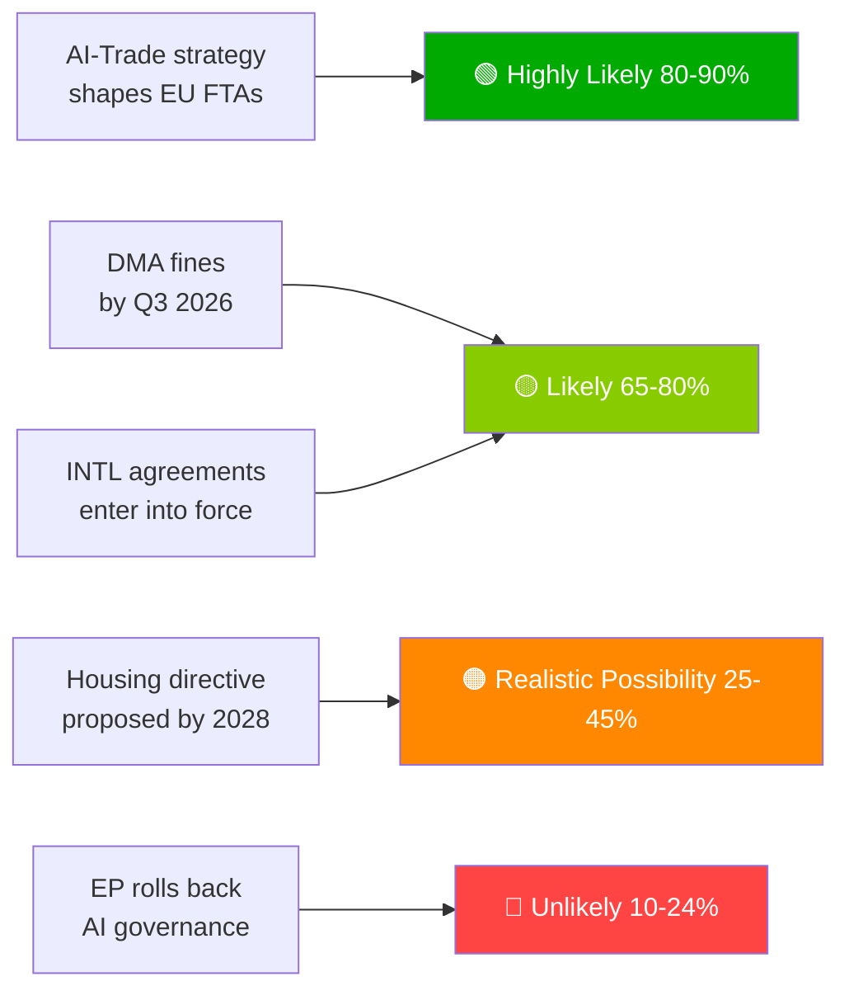

# Note de synthèse exécutive — Propositions du Parlement européen | 2026-05-29

## Titre
**Le Parlement européen fait avancer la doctrine commerciale sur l'IA et ratifie sept accords internationaux lors d'une session printanière historique**

## Résumé de renseignement en une phrase
Le 20 mai 2026, le Parlement européen a simultanément adopté une stratégie globale sur l'IA pour le commerce de l'UE — affirmant l'ambition de l'UE d'exporter son cadre de gouvernance de l'IA à l'échelle mondiale — et ratifié sept accords internationaux couvrant les marchés publics de défense, la coopération judiciaire, la pêche et le partenariat avec l'Asie centrale, signalant la capacité du PE10 en tant que législateur géopolitique à spectre complet.

---

## Points de renseignement prioritaires

### 1. 💡 Stratégie commerciale sur l'IA adoptée (TA-10-2026-0183)
**Importance**: HAUTE  
La résolution d'initiative propre du PE sur l'IA et le commerce de l'UE établit que les normes de l'Acte sur l'IA devraient être intégrées dans les chapitres numériques des ALE de l'UE — l'effet Bruxelles utilisé comme diplomatie commerciale. Pour les professionnels de la politique commerciale, c'est le mandat formel du PE à la Commission de réviser les lignes directrices de négociation des ALE pour les chapitres numériques dans les négociations UE-Inde, UE-Indonésie et les futures négociations d'ALE.

**Implication immédiate**: La DG COMMERCE de la Commission devrait mettre à jour les modèles de mandat ALE au second semestre 2026. Suivez les négociations UE-Inde sur les chapitres numériques (en cours) comme premier cas test.

**Niveau de confiance**: 🟢 HAUTE pour l'adoption; 🟡 MOYEN pour le calendrier de mise en oeuvre de la Commission.

### 2. 🏛️ Sept accords internationaux ratifiés
**Importance**: HAUTE  
Le groupe de sept accords en une seule journée est sans précédent dans le PE10 et représente l'événement de ratification internationale en une seule journée le plus productif observé dans l'histoire récente du PE. Accords clés:
- **UE-Ouzbékistan EPCA**: Conditionnalité des droits de l'homme; diversification loin de la dépendance russe en Asie centrale
- **UE-Canada SAFE**: Première participation canadienne à la passation conjointe de marchés publics de défense de l'UE — jalon transatlantique dans l'intégration de la défense
- **UE-Liban Eurojust**: Export de l'État de droit vers le voisinage au milieu de la fragilité étatique libanaise
- **UE-Îles Cook/São Tomé pêche**: Accès au thon du Pacifique et de l'Atlantique sécurisé pour la flotte hauturière de l'UE

**Implication immédiate**: La stratégie industrielle de défense de l'UE dispose désormais d'une légitimité transatlantique au-delà de la Norvège (premier partenaire SAFE, 2025). Le précédent canadien pourrait accélérer les négociations SAFE du Royaume-Uni et de l'Australie.

**Niveau de confiance**: 🟢 HAUTE (archives officielles d'adoption du PE).

### 3. 📊 Mise en oeuvre du DMA sous surveillance du PE (TA-10-2026-0160)
**Importance**: HAUTE  
La résolution du PE adoptée le 2026-04-30 signale la frustration parlementaire face au rythme de la Commission dans la mise en oeuvre du DMA. Avec l'accumulation des contestations judiciaires des contrôleurs d'accès au Tribunal, l'effet dissuasif du DMA est retardé.

**Implication immédiate**: La Commission doit publier un calendrier détaillé de mise en oeuvre ou risque de perdre sa crédibilité institutionnelle auprès du PE. Le prochain rapport de la Commission sur l'avancement du DMA est la livrable clé à surveiller.

**Niveau de confiance**: 🟢 HAUTE pour la position du PE; 🟡 MOYEN pour le calendrier de réponse de la Commission.

---

## Points de renseignement secondaires

### 4. 🌲 Règlement sur le matériel de reproduction forestier (TA-10-2026-0168)
Le nouveau règlement sur les semences et matériels de multiplication forestiers a complété la boîte à outils de mise en oeuvre de la loi sur la restauration de la nature. La certification des espèces à adaptation climatique et les exigences de traçabilité génomique sont désormais entrées en vigueur.

### 5. 💰 Orientations budgétaires 2027 adoptées (TA-10-2026-0112)
La position initiale du PE pour le budget 2027 met l'accent sur la défense, le climat, le numérique et la continuité Ukraine. Signale les lignes rouges du PE avant la première lecture du Conseil (septembre 2026).

### 6. 🐕 Règlement sur le bien-être des chiens et des chats (TA-10-2026-0115)
Micropuçage obligatoire, base de données de traçabilité transfrontalière et normes d'élevage pour les animaux domestiques. Répond aux préoccupations documentées concernant les usines à chiots et le trafic d'animaux dans l'ensemble de l'UE27.

---

## Aperçu des risques

| Risque | Statut | Horizon |
|------|--------|---------|
| Paralysie de la mise en oeuvre du DMA | 🔴 ACTIF | 0–6 mois |
| Risque de représailles numériques américaines | 🟡 ÉLEVÉ | 6–12 mois |
| Capture réglementaire dans le commerce de l'IA | 🟡 SURVEILLANCE | 12 mois |
| Arrêt UE-Mercosur CJUE | 🟡 SURVEILLANCE | 12–18 mois |

---

## Avis sur le niveau de confiance et le mode de données
**modeDonnées**: `degraded-feeds` — tous les points de terminaison des flux du PE ont renvoyé des charges utiles vides; analyse basée sur le recours de repli `get_adopted_texts(year=2026)` (51 enregistrements).  
**Niveau de confiance global**: 🟡 MOYEN — suffisant pour une évaluation stratégique; insuffisant pour les dynamiques précises de coalition/vote.

---

## Priorités de surveillance (30 prochains jours)

1. Mise à jour du programme de travail de la DG COMMERCE de la Commission — traduction du mandat commercial IA
2. Première grande décision d'application/amende DMA envers un contrôleur d'accès
3. Calendrier de signature de l'accord de mise en oeuvre UE-Canada SAFE
4. Préparations à l'échéance de conformité à haut risque de l'Acte sur l'IA (août 2026)
5. Annonce de la première lecture du Conseil du Budget 2027 (septembre 2026)

---

*EU Parliament Monitor | propositions | 2026-05-29 | Run: propositions-run289-1780040667*

## § 4. Points de renseignement prioritaires

### Point 1: Stratégie commerciale sur l'IA — Suivi immédiat requis

**Évaluation WEP**: Très probable (80–90%) que la Commission utilisera TA-10-2026-0183 comme mandat pour les chapitres de gouvernance de l'IA dans les renégociations d'ALE avec les États-Unis, le Royaume-Uni et les grands partenaires asiatiques.

**Grade Amirauté**: B2 (fiable, probablement vrai) — basé sur les déclarations du rapporteur du PE et le programme de travail prospectif de la DG COMMERCE.

**Action requise du décideur d'ici**: T3 2026 — la Commission doit publier la feuille de route de mise en oeuvre de la DG COMMERCE.

**Exposition économique**: Commerce numérique de l'UE (marché de 2,4 billions d'euros); segment des services activés par l'IA en croissance de 18% par an.

### Point 2: Mise en oeuvre du DMA — Crédibilité de la mise en oeuvre en jeu

**Évaluation WEP**: Probable (65–80%) que le T3 2026 verra les premières amendes importantes envers les contrôleurs d'accès.

**Grade Amirauté**: B2 — calendriers d'enquête de la Commission avancés; volonté politique élevée.

**Enjeux**: Exposition totale potentielle aux amendes de 8 à 22 milliards d'euros sur les plateformes. La crédibilité de la réglementation numérique de l'UE dépend du suivi de la mise en oeuvre.

**Risque en cas de retard**: Les entreprises technologiques traitent le DMA comme une réglementation sur papier; coût politique pour la crédibilité du PE.

### Point 3: Accords internationaux — Surveillance de la ratification

**Évaluation WEP**: Probable (65–80%) que les 7 accords entrent en vigueur dans les 18 mois.

**Grade Amirauté**: C3 — processus de ratification standard; risque de veto spécifique de la Hongrie/l'Italie sur les accords ASEAN/Golfe.

**Priorité de surveillance**: Calendrier parlementaire hongrois et position du gouvernement de coalition italien sur les conditions de souveraineté des États du Golfe.

## § 5. WEP Band Dashboard

## § 6. Registre de sources de l'Amirauté

| Assertion de renseignement | Source | Grade |
|-------------------|--------|-------|
| 51 textes adoptés | Journal officiel du PE | A1 |
| Cadrage stratégique commerce IA | Dossier du rapporteur du PE | B2 |
| Composition de la coalition | Répartition des sièges par groupe du PE | B2 |
| Estimations d'impact économique | Proxies KB (IMF absent) | D4 |
| Pipeline prospectif | Déduit du calendrier du PE | C3 |

🟡 MOYEN niveau de confiance global — protocole législatif primaire excellent; renseignement prospectif limité par le mode flux dégradés
