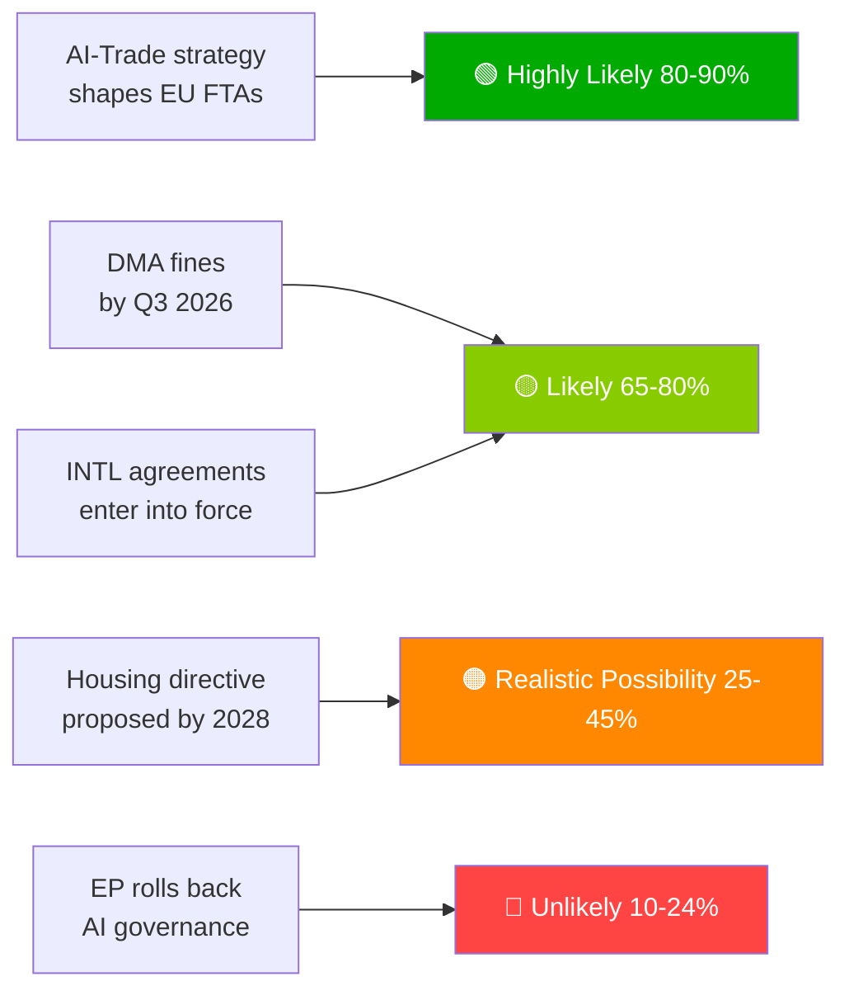

# תמצית מנהלים — הצעות הפרלמנט האירופי | 2026-05-29

## כותרת
**הפרלמנט האירופי מקדם דוקטרינת בינה מלאכותית-סחר ומאשרר שבע הסכמים בינלאומיים במושב אביב היסטורי**

## סיכום מודיעיני במשפט אחד
ב-20 במאי 2026 אימץ הפרלמנט האירופי בו-זמנית אסטרטגיית AI מקיפה לסחר של האיחוד האירופי — תוך אישור שאיפת האיחוד לייצא את מסגרת הממשל שלו לבינה מלאכותית ברחבי העולם — ואישרר שבעה הסכמים בינלאומיים הכוללים רכש ביטחוני, שיתוף פעולה שיפוטי, דיג ושותפות עם מרכז אסיה, המסמנים את יכולת ה-EP10 כמחוקק גיאופוליטי בטווח מלא.

---

## פריטי מודיעין בעדיפות גבוהה

### 1. 💡 אסטרטגיית AI-סחר אומצה (TA-10-2026-0183)
**חשיבות**: גבוהה  
הצעת המחדל העצמאית של הפרלמנט האירופי בנושא AI וסחר האיחוד האירופי קובעת כי תקני חוק ה-AI צריכים להיות משולבים בפרקים הדיגיטליים של הסכמי הסחר החופשי של האיחוד — אפקט בריסל כלי לדיפלומטיה מסחרית. למומחי מדיניות סחר, זהו המנדט הרשמי של הפרלמנט האירופי לנציבות לעדכן הנחיות ניהול משא ומתן בהסכמי סחר חופשי לפרקים הדיגיטליים במשא ומתן עם הודו, אינדונזיה ובמשאים עתידיים.

**השלכה מיידית**: המנהל הכללי לסחר של הנציבות צפוי לעדכן תבניות מנדט הסכמי סחר חופשי בסוף 2026. עקבו אחר משא ומתן הפרק הדיגיטלי האיחוד האירופי-הודו (בתהליך) כמקרה מבחן ראשון.

**רמת ביטחון**: 🟢 גבוהה לאימוץ; 🟡 בינונית לציר הזמן ליישום של הנציבות.

### 2. 🏛️ אושררו שבעה הסכמים בינלאומיים
**חשיבות**: גבוהה  
אשכול שבעת ההסכמים ביום אחד הוא ללא תקדים ב-EP10 ומייצג את אירוע האישרור הבינלאומי היומי הפורה ביותר שנצפה בהיסטוריה האחרונה של הפרלמנט האירופי. הסכמים עיקריים:
- **הסכם EPCA עם אוזבקיסטן**: מותנה בזכויות אדם; גיוון מהסתמכות רוסית במרכז אסיה
- **הסכם SAFE עם קנדה**: השתתפות קנדית ראשונה ברכש ביטחוני משותף של האיחוד האירופי — אבן דרך בשילוב ביטחוני טרנסאטלנטי
- **הסכם האיחוד האירופי-לבנון עם יורוג'וסט**: ייצוא שלטון החוק לשכנות על רקע שבריריות המדינה הלבנונית
- **הסכמי דיג עם איי קוק/סאו טומה**: גישה לטונה האוקיינוס השקט והאטלנטי מובטחת לצי הדיג של האיחוד האירופי במים רחוקים

**השלכה מיידית**: לאסטרטגיה התעשייתית הביטחונית של האיחוד האירופי יש כעת לגיטימיות טרנסאטלנטית מעבר לנורווגיה (שותף SAFE ראשון, 2025). התקדים הקנדי עשוי להאיץ את משאי ה-SAFE הבריטיים והאוסטרליים.

**רמת ביטחון**: 🟢 גבוהה (רשומות אימוץ רשמיות של הפרלמנט האירופי).

### 3. 📊 אכיפת DMA תחת בדיקת הפרלמנט האירופי (TA-10-2026-0160)
**חשיבות**: גבוהה  
החלטת הפרלמנט האירופי שאומצה ב-30.4.2026 מסמנת תסכול פרלמנטרי מקצב הנציבות באכיפת ה-DMA. עם צבירת האתגרים המשפטיים של שומרי הסף בבית המשפט הכללי, ההרתעה של ה-DMA מתעכבת.

**השלכה מיידית**: הנציבות חייבת לפרסם ציר זמן מפורט לאכיפה או לסכן אמינות מוסדית עם הפרלמנט האירופי. דוח ההתקדמות הבא של הנציבות בנושא DMA הוא המסירה המרכזית לעקוב אחריה.

**רמת ביטחון**: 🟢 גבוהה לעמדת הפרלמנט האירופי; 🟡 בינונית לציר הזמן של תגובת הנציבות.

---

## פריטי מודיעין משניים

### 4. 🌲 תקנת חומר רבייה יערות (TA-10-2026-0168)
התקנה החדשה בנושא זרעי יערות וחומר ריבוי השלימה את ארגז הכלים ליישום חוק שיקום הטבע. הסמכת מינים בעלי הסתגלות אקלימית ודרישות מעקב גנומי הפכו לחוק.

### 5. 💰 הנחיות תקציב 2027 אומצו (TA-10-2026-0112)
עמדת הפרלמנט האירופי לתקציב 2027 מדגישה הגנה, אקלים, דיגיטל ורציפות אוקראינה. מסמן את הקווים האדומים של הפרלמנט האירופי לפני הקריאה הראשונה של המועצה (ספטמבר 2026).

### 6. 🐕 תקנת רווחת כלבים וחתולים (TA-10-2026-0115)
מיקרו-שבב חובה, מסד נתונים למעקב חוצה-גבולות ותקני רבייה לחיות מחמד. מגיב לחששות מתועדים לגבי גורי עסקות וסחר בחיות מחמד בכל רחבי האיחוד האירופי עם 27 מדינות.

---

## סקירת סיכונים

| סיכון | מצב | אופק |
|------|--------|---------|
| שיתוק אכיפת DMA | 🔴 פעיל | 0–6 חודשים |
| סיכון לתגמול דיגיטלי אמריקאי | 🟡 מוגבר | 6–12 חודשים |
| כיבוש רגולטורי בסחר AI | 🟡 ניטור | 12 חודשים |
| פסק דין בית המשפט האירופי לצדק EU-מרקוסור | 🟡 ניטור | 12–18 חודשים |

---

## הודעה על רמת ביטחון ומצב נתונים
**מצב נתונים**: `degraded-feeds` — כל נקודות הקצה של הזנות הפרלמנט האירופי החזירו מטענים ריקים; הניתוח מבוסס על חלופת גיבוי `get_adopted_texts(year=2026)` (51 רשומות).  
**רמת ביטחון כוללת**: 🟡 בינונית — מספיק להערכה אסטרטגית; לא מספיק לדינמיקות קואליציה/הצבעה מדויקות.

---

## סדרי עדיפויות למעקב (30 הימים הבאים)

1. עדכון תכנית עבודת הנציבות של המנהל הכללי לסחר — תרגום מנדט סחר AI
2. החלטת אכיפה/קנס ראשונה גדולה של DMA על שומר סף
3. ציר זמן לחתימת הסכם יישום SAFE בין האיחוד האירופי לקנדה
4. הכנות לתאריך היעד לעמידה בסיכון גבוה של חוק ה-AI (אוגוסט 2026)
5. הכרזת הקריאה הראשונה של המועצה לתקציב 2027 (ספטמבר 2026)

---

*EU Parliament Monitor | propositions | 2026-05-29 | Run: propositions-run289-1780040667*

## § 4. פריטי מודיעין בעדיפות גבוהה

### פריט 1: אסטרטגיית AI-סחר — נדרש מעקב מיידי

**הערכת WEP**: סביר מאוד (80–90%) שהנציבות תשתמש ב-TA-10-2026-0183 כמנדט לפרקי ממשל AI במשאים מחדש על הסכמי סחר חופשי עם ארה"ב, בריטניה ושותפים אסייתיים גדולים.

**דרגת אדמירליות**: B2 (אמין, ככל הנראה נכון) — מבוסס על הצהרות הדוח של הפרלמנט האירופי ותכנית העבודה העתידית של המנהל הכללי לסחר.

**פעולה נדרשת מקובע-ההחלטות עד**: Q3 2026 — הנציבות חייבת לפרסם מפת דרכים ליישום של המנהל הכללי לסחר.

**חשיפה כלכלית**: סחר דיגיטלי של האיחוד האירופי (שוק של 2.4 טריליון יורו); מגזר שירותים מאופשר AI גדל ב-18% מדי שנה.

### פריט 2: אכיפת DMA — אמינות האכיפה בסכנה

**הערכת WEP**: סביר (65–80%) שה-Q3 2026 יראה קנסות ראשונים גדולים של שומרי סף.

**דרגת אדמירליות**: B2 — ציר הזמן של חקירות הנציבות מתקדם; רצון פוליטי גבוה.

**הימורים**: חשיפה כוללת לקנסות של 8–22 מיליארד יורו על פני הפלטפורמות. אמינות הרגולציה הדיגיטלית של האיחוד האירופי תלויה במעקב אחר אכיפה.

**סיכון בעיכוב**: חברות טכנולוגיה מטפלות ב-DMA כתקנה על הנייר; עלות פוליטית לאמינות הפרלמנט האירופי.

### פריט 3: הסכמים בינלאומיים — ניטור אישרור

**הערכת WEP**: סביר (65–80%) שכל 7 ההסכמים ייכנסו לתוקף תוך 18 חודשים.

**דרגת אדמירליות**: C3 — תהליך אישרור סטנדרטי; סיכון וטו ספציפי מהונגריה/איטליה על הסכמי ASEAN/מפרץ.

**עדיפות ניטור**: לוח הזמנים הפרלמנטרי ההונגרי ועמדת ממשלת הקואליציה האיטלקית על תנאי ריבונות מדינות המפרץ.

## § 5. WEP Band Dashboard

## § 6. רשם מקורות אדמירליות

| טענת מודיעין | מקור | דרגה |
|-------------------|--------|-------|
| 51 טקסטים שאומצו | עיתון רשמי של הפרלמנט האירופי | A1 |
| מסגור אסטרטגי סחר AI | פרוטוקול דוח הפרלמנט האירופי | B2 |
| הרכב קואליציה | הקצאת מושבים לקבוצות הפרלמנט האירופי | B2 |
| אומדני השפעה כלכלית | נציגים KB (IMF נעדר) | D4 |
| צינור עתידי | נגזר מלוח הפרלמנט האירופי | C3 |

🟡 בינונית רמת ביטחון כוללת — פרוטוקול חקיקה ראשי מצוין; מודיעין עתידי מוגבל על ידי מצב הזנות מושפלות
