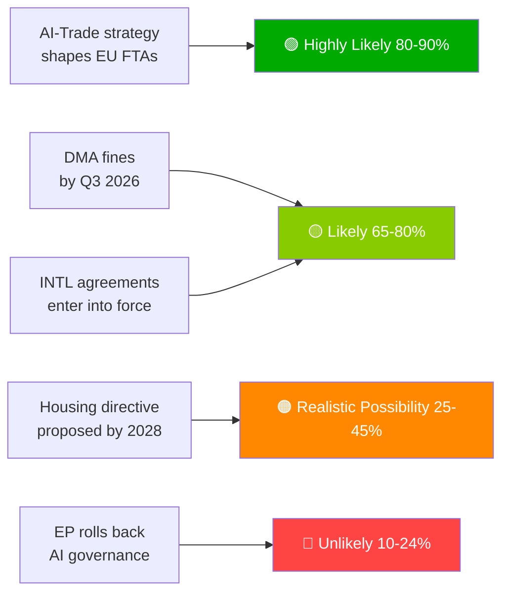

# エグゼクティブ・ブリーフ — 欧州議会提案 | 2026-05-29

## 見出し
**欧州議会、AI貿易ドクトリンを推進し、歴史的春季会期に7件の国際協定を批准**

## 一文インテリジェンス要約
2026年5月20日、欧州議会はEU貿易向けの包括的AI戦略を同時採択し——EUのAIガバナンス枠組みをグローバルに輸出するという欧州の野望を確認——防衛調達、司法協力、漁業、中央アジア・パートナーシップにわたる7件の国際協定を批准した。これにより、EP10が全スペクトルの地政学的立法機関としての能力を持つことが示された。

---

## 優先インテリジェンス項目

### 1. 💡 AI貿易戦略の採択 (TA-10-2026-0183)
**重要度**: 高  
EUの貿易に関するAIについての欧州議会の独自決議は、AI法の基準をEUのFTAデジタル章に組み込むべきとしており——ブリュッセル効果を貿易外交として活用するものです。貿易政策の専門家にとって、これはEU-インド、EU-インドネシアおよび将来のFTA交渉におけるデジタル章のFTA交渉ガイドラインを改訂するよう欧州委員会に求める公式なEP委任です。

**直接的含意**: 欧州委員会のDG TRADEは、2026年下半期にFTA委任テンプレートを更新する見通しです。最初のテストケースとしてEU-インドのデジタル章交渉（進行中）に注目してください。

**信頼度**: 🟢 高（採択について）；🟡 中（欧州委員会の実施スケジュールについて）。

### 2. 🏛️ 7件の国際協定の批准
**重要度**: 高  
1日に7件の協定がまとまったのはEP10では前例がなく、最近のEP史で観測された最も生産的な単日の国際批准イベントを代表しています。主要協定：
- **EU-ウズベキスタンEPCA**: 人権条件付き；中央アジアにおけるロシア依存からの多様化
- **EU-カナダSAFE**: EU共同防衛調達への初のカナダ参加 — 大西洋横断防衛統合の節目
- **EU-レバノン・ユーロジャスト**: レバノン国家脆弱性の中での近隣への法の支配の輸出
- **EU-クック諸島/サントメ漁業**: EU遠洋漁業船団のための太平洋・大西洋マグロアクセスの確保

**直接的含意**: EUの防衛産業戦略は、ノルウェー（2025年の最初のSAFEパートナー）を超えた大西洋横断の正当性を持つようになりました。カナダの前例は英国とオーストラリアのSAFE交渉を加速させる可能性があります。

**信頼度**: 🟢 高（EPの公式採択記録）。

### 3. 📊 EP監視下でのDMA執行 (TA-10-2026-0160)
**重要度**: 高  
2026年4月30日に採択されたEP決議は、DMA執行における欧州委員会のペースに対する議会の不満を示しています。一般裁判所にゲートキーパーの法的異議申し立てが蓄積する中、DMAの抑止効果は遅延しています。

**直接的含意**: 欧州委員会は詳細な執行タイムラインを公表するか、EPとの制度的信頼性を失うリスクを負う必要があります。次の欧州委員会のDMA進捗報告書が注目すべき主要な成果物です。

**信頼度**: 🟢 高（EP立場について）；🟡 中（欧州委員会の対応タイムラインについて）。

---

## 二次インテリジェンス項目

### 4. 🌲 森林繁殖材料規則 (TA-10-2026-0168)
森林種子および繁殖材料に関する新規則が、自然回復法の実施ツールキットを完成させました。気候適応型種の認証とゲノムトレーサビリティ要件が法制化されました。

### 5. 💰 2027年予算ガイドラインの採択 (TA-10-2026-0112)
2027年予算に対するEPの当初立場は、防衛、気候、デジタル、ウクライナ継続性を重視しています。理事会の第一読会（2026年9月）を前にEPのレッドラインを示しています。

### 6. 🐕 犬と猫の福祉規則 (TA-10-2026-0115)
ペットに対する義務的マイクロチップ挿入、国境を越えたトレーサビリティデータベース、繁殖基準。EU27全体でのパピーミルおよびペット取引に関する懸念に対応しています。

---

## リスク概要

| リスク | 状況 | 期間 |
|------|--------|---------|
| DMA執行の麻痺 | 🔴 活発 | 0–6か月 |
| 米国のデジタル報復リスク | 🟡 高まっている | 6–12か月 |
| AI貿易の規制上の囲い込み | 🟡 監視 | 12か月 |
| EU-メルコスールECJ判決 | 🟡 監視 | 12–18か月 |

---

## 信頼度とデータモードに関するお知らせ
**データモード**: `degraded-feeds` — すべてのEPフィードエンドポイントが空のペイロードを返しました；分析は`get_adopted_texts(year=2026)`フォールバック（51件）に基づいています。  
**全体的信頼度**: 🟡 中 — 戦略的評価には十分；正確な連立/投票動態には不十分。

---

## 監視優先事項（今後30日間）

1. 欧州委員会DG TRADE作業プログラムの更新 — AI貿易委任の翻訳
2. 最初の大規模DMAゲートキーパー執行決定/罰金
3. EU-カナダSAFE実施合意の署名タイムライン
4. AI法の高リスクコンプライアンス締め切りの準備（2026年8月）
5. 2027年予算に関する理事会の第一読会発表（2026年9月）

---

*EU Parliament Monitor | propositions | 2026-05-29 | Run: propositions-run289-1780040667*

## § 4. 優先インテリジェンス項目

### 項目1: AI貿易戦略 — 即時追跡が必要

**WEP評価**: 欧州委員会がTA-10-2026-0183を米国、英国、主要アジアパートナーとのFTA再交渉におけるAIガバナンス章の委任として使用する可能性が非常に高い（80–90%）。

**海軍省グレード**: B2（信頼性あり、おそらく真実）— EPの報告者の発言とDG TRADEの前向き作業プログラムに基づく。

**意思決定者に必要な行動の期限**: 2026年Q3 — 欧州委員会はDG TRADEの実施ロードマップを公表する必要があります。

**経済的エクスポージャー**: EU デジタル貿易（2.4兆ユーロ市場）；AI活用サービスセグメントは年間18%成長中。

### 項目2: DMA執行 — 執行信頼性が問われる

**WEP評価**: 2026年Q3に初の大規模ゲートキーパー罰金が科される可能性が高い（65–80%）。

**海軍省グレード**: B2 — 欧州委員会の調査タイムラインが進んでいる；政治的意志は高い。

**賭けられているもの**: プラットフォーム全体の潜在的罰金エクスポージャー総額80億〜220億ユーロ。EUのデジタル規制の信頼性は執行フォローアップに依存しています。

**遅延のリスク**: テクノロジー企業がDMAを紙上の規制として扱う；EPの信頼性に対する政治的コスト。

### 項目3: 国際協定 — 批准モニタリング

**WEP評価**: 7件すべての協定が18か月以内に発効する可能性が高い（65–80%）。

**海軍省グレード**: C3 — 標準的な批准プロセス；ASEAN/湾岸諸国の協定に関するハンガリー/イタリアからの特定の拒否権リスク。

**監視優先事項**: ハンガリーの議会スケジュールと湾岸諸国の主権条件に関するイタリアの連立政権の立場。

## § 5. WEP Band Dashboard

## § 6. 海軍省情報源レジスター

| インテリジェンス主張 | 情報源 | グレード |
|-------------------|--------|-------|
| 51件の採択テキスト | EP官報 | A1 |
| AI貿易の戦略的フレーミング | EP報告者記録 | B2 |
| 連立構成 | EPグループ議席配分 | B2 |
| 経済影響推計 | KBプロキシ（IMF不在） | D4 |
| 先行パイプライン | EPカレンダーから推定 | C3 |

🟡 中 全体的信頼度 — 主要立法プロトコルは優秀；デグレードフィードモードにより先行インテリジェンスは制限
