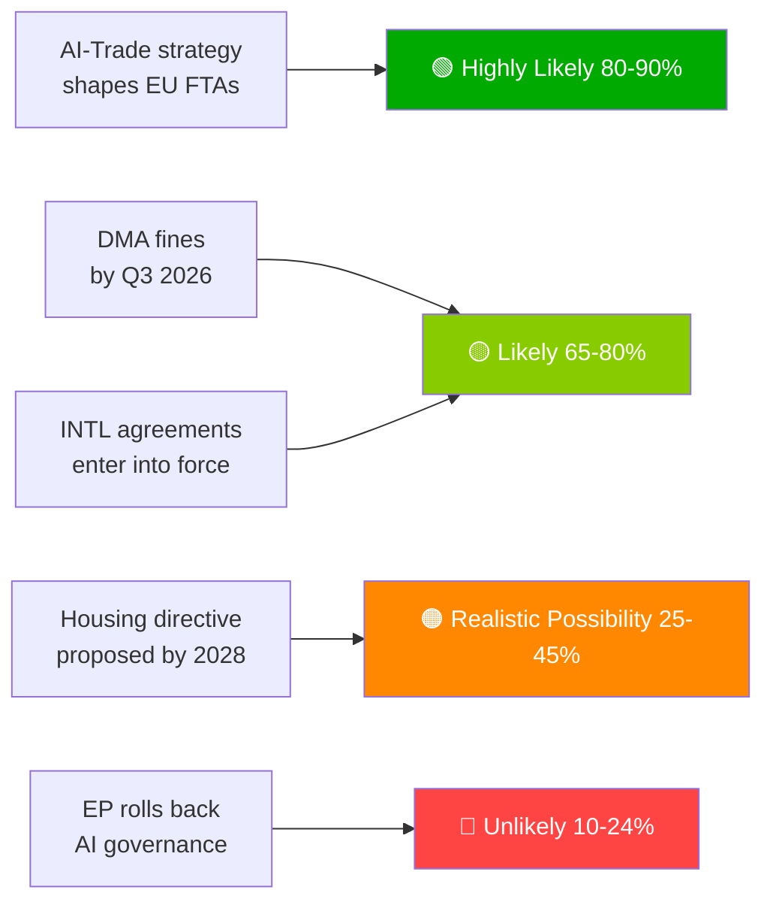

# 집행 브리핑 — 유럽의회 제안 | 2026-05-29

## 헤드라인
**유럽의회, 역사적 봄 회기에서 AI 무역 독트린 추진 및 7개 국제 협정 비준**

## 한 문장 인텔리전스 요약
2026년 5월 20일, 유럽의회는 EU 무역을 위한 포괄적인 AI 전략을 동시 채택하고 — EU의 AI 거버넌스 프레임워크를 전 세계적으로 수출하려는 EU의 야망을 확인하며 — 방산 조달, 사법 협력, 어업, 중앙아시아 파트너십을 아우르는 7개 국제 협정을 비준함으로써, EP10이 전 스펙트럼 지정학적 입법 기관으로서의 역량을 과시했습니다.

---

## 우선 인텔리전스 항목

### 1. 💡 AI 무역 전략 채택 (TA-10-2026-0183)
**중요도**: 높음  
EU 무역과 AI에 관한 유럽의회 자체 결의는 AI 법 기준이 EU FTA의 디지털 챕터에 포함되어야 한다고 규정하며 — 브뤼셀 효과를 무역 외교로 활용합니다. 무역 정책 전문가들에게 이는 EU-인도, EU-인도네시아 및 미래 FTA 협상의 디지털 챕터 FTA 협상 지침을 개정하도록 집행위원회에 내리는 공식 EP 위임입니다.

**즉각적 함의**: 집행위원회 통상총국(DG TRADE)은 2026년 하반기에 FTA 위임 템플릿을 업데이트할 것으로 예상됩니다. 첫 번째 테스트 케이스로 EU-인도 디지털 챕터 협상(진행 중)을 주목하세요.

**신뢰도**: 🟢 높음(채택에 대해); 🟡 중간(집행위원회 이행 일정에 대해).

### 2. 🏛️ 7개 국제 협정 비준
**중요도**: 높음  
하루에 7개 협정이 체결된 것은 EP10에서 전례 없는 일로, 최근 EP 역사에서 관찰된 가장 생산적인 단일 일 국제 비준 사례를 대표합니다. 주요 협정:
- **EU-우즈베키스탄 EPCA**: 인권 조건부; 중앙아시아에서 러시아 의존도 탈피를 위한 다각화
- **EU-캐나다 SAFE**: EU 공동 방산 조달에의 첫 캐나다 참여 — 대서양 횡단 방위 통합 이정표
- **EU-레바논 유로저스트**: 레바논 국가 취약성 속에서 이웃 지역으로 법치 수출
- **EU-쿡 제도/상투메 어업**: EU 원양 어선단을 위한 태평양 및 대서양 참치 어업권 확보

**즉각적 함의**: EU의 방산 전략은 이제 노르웨이(2025년 첫 SAFE 파트너)를 넘어 대서양 횡단 정당성을 갖게 되었습니다. 캐나다 선례는 영국과 호주의 SAFE 협상을 가속화할 수 있습니다.

**신뢰도**: 🟢 높음(EP 공식 채택 기록).

### 3. 📊 EP 감시 하의 DMA 집행 (TA-10-2026-0160)
**중요도**: 높음  
2026-04-30 채택된 EP 결의는 DMA 집행에서 집행위원회의 속도에 대한 의회의 불만을 나타냅니다. 일반법원에 게이트키퍼들의 법적 도전이 누적되면서 DMA의 억지력이 지연되고 있습니다.

**즉각적 함의**: 집행위원회는 상세한 집행 일정을 발표하거나 EP와의 제도적 신뢰성을 잃을 위험을 감수해야 합니다. 다음 집행위원회 DMA 진행 보고서가 주시해야 할 핵심 산출물입니다.

**신뢰도**: 🟢 높음(EP 입장에 대해); 🟡 중간(집행위원회 대응 일정에 대해).

---

## 부차적 인텔리전스 항목

### 4. 🌲 산림 번식 재료 규정 (TA-10-2026-0168)
산림 종자 및 번식 재료에 관한 새 규정이 자연 복원법 이행 도구 세트를 완성했습니다. 기후 적응 종의 인증 및 게놈 추적성 요건이 법제화되었습니다.

### 5. 💰 2027년 예산 지침 채택 (TA-10-2026-0112)
2027년 예산에 대한 EP의 초기 입장은 국방, 기후, 디지털 및 우크라이나 지속성을 강조합니다. 이사회 1차 독회(2026년 9월) 이전 EP의 레드라인을 시사합니다.

### 6. 🐕 개와 고양이 복지 규정 (TA-10-2026-0115)
반려동물에 대한 의무적 마이크로칩 삽입, 국경을 초월한 추적 데이터베이스, 번식 기준. EU27 전역의 강아지 공장 및 반려동물 불법 거래 우려에 대응합니다.

---

## 리스크 스냅샷

| 위험 | 상태 | 기간 |
|------|--------|---------|
| DMA 집행 마비 | 🔴 활성 | 0–6개월 |
| 미국 디지털 보복 위험 | 🟡 상승 | 6–12개월 |
| AI 무역 규제 포획 | 🟡 모니터링 | 12개월 |
| EU-메르코수르 ECJ 판결 | 🟡 모니터링 | 12–18개월 |

---

## 신뢰도 및 데이터 모드 공지
**데이터 모드**: `degraded-feeds` — 모든 EP 피드 엔드포인트가 빈 페이로드를 반환했습니다. 분석은 `get_adopted_texts(year=2026)` 폴백(51건)에 기반합니다.  
**전반적 신뢰도**: 🟡 중간 — 전략적 평가에 충분; 정확한 연립/투표 역학에는 불충분.

---

## 모니터링 우선순위 (향후 30일)

1. 집행위원회 통상총국 작업 프로그램 업데이트 — AI 무역 위임 번역
2. 첫 번째 주요 DMA 게이트키퍼 집행 결정/벌금
3. EU-캐나다 SAFE 이행 합의 서명 일정
4. AI 법 고위험 준수 마감일 준비(2026년 8월)
5. 2027년 예산에 대한 이사회 1차 독회 발표(2026년 9월)

---

*EU Parliament Monitor | propositions | 2026-05-29 | Run: propositions-run289-1780040667*

## § 4. 우선 인텔리전스 항목

### 항목 1: AI 무역 전략 — 즉각적인 추적 필요

**WEP 평가**: 집행위원회가 미국, 영국 및 주요 아시아 파트너와의 FTA 재협상에서 AI 거버넌스 챕터의 위임으로 TA-10-2026-0183을 사용할 가능성이 매우 높음(80–90%).

**해군성 등급**: B2(신뢰 가능, 아마도 사실) — EP 보고자 발언 및 DG TRADE의 전향적 작업 프로그램에 근거.

**의사결정자의 조치 필요 기한**: 2026년 Q3 — 집행위원회는 DG TRADE 이행 로드맵을 발표해야 합니다.

**경제적 노출**: EU 디지털 무역(2.4조 유로 시장); AI 지원 서비스 부문 연간 18% 성장 중.

### 항목 2: DMA 집행 — 집행 신뢰성 위기

**WEP 평가**: 2026년 Q3에 첫 번째 대규모 게이트키퍼 벌금이 부과될 가능성 높음(65–80%).

**해군성 등급**: B2 — 집행위원회 조사 일정 진행 중; 정치적 의지 높음.

**내기**: 플랫폼 전반에 걸친 잠재적 벌금 노출 총액 80억~220억 유로. EU 디지털 규제의 신뢰성은 집행 후속 조치에 달려 있습니다.

**지연 시 위험**: 기술 기업들이 DMA를 종이 규제로 취급; EP 신뢰성에 대한 정치적 비용.

### 항목 3: 국제 협정 — 비준 모니터링

**WEP 평가**: 7개 협정 모두 18개월 이내에 발효될 가능성 높음(65–80%).

**해군성 등급**: C3 — 표준 비준 절차; ASEAN/걸프 협정에 대한 헝가리/이탈리아의 특정 거부권 위험.

**모니터링 우선순위**: 헝가리 의회 일정 및 걸프 국가 주권 조건에 대한 이탈리아 연립 정부의 입장.

## § 5. WEP Band Dashboard

## § 6. 해군성 출처 등록부

| 인텔리전스 주장 | 출처 | 등급 |
|-------------------|--------|-------|
| 51개 채택 텍스트 | EP 관보 | A1 |
| AI 무역 전략적 프레이밍 | EP 보고자 기록 | B2 |
| 연립 구성 | EP 그룹 의석 배분 | B2 |
| 경제적 영향 추정 | KB 프록시(IMF 부재) | D4 |
| 선행 파이프라인 | EP 달력에서 추론 | C3 |

🟡 중간 전반적 신뢰도 — 1차 입법 프로토콜 우수; 저하된 피드 모드로 인해 선행 인텔리전스 제한
