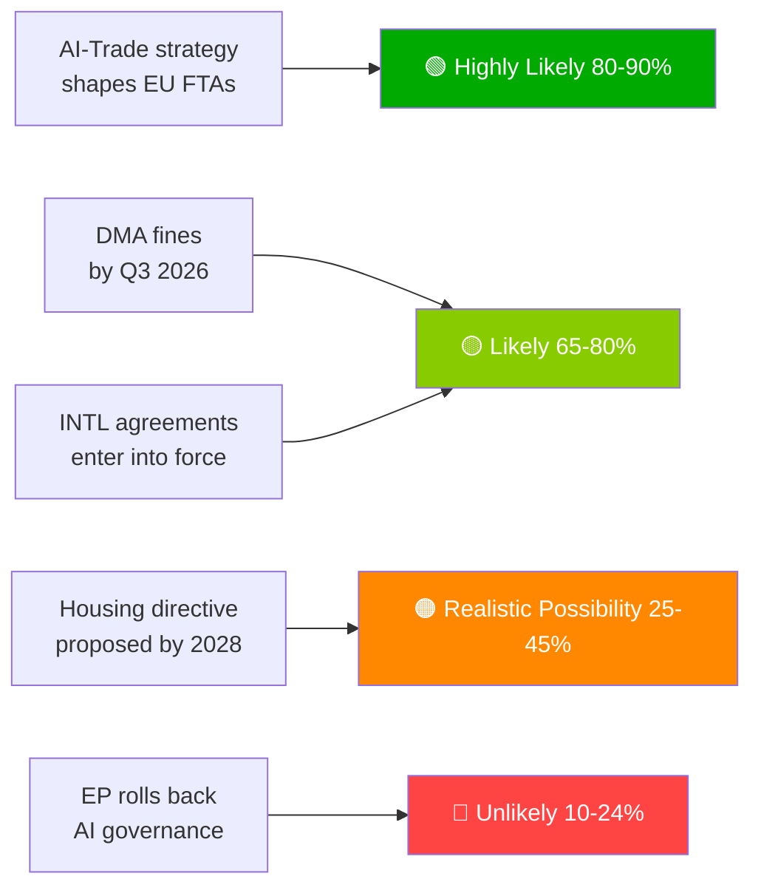

# Uitvoerend briefingdocument — Voorstellen van het Europees Parlement | 2026-05-29

## Koptekst
**Europees Parlement bevordert AI-handelsdoctrine en ratificeert zeven internationale overeenkomsten tijdens historische voorjaarssessie**

## Inlichtingensamenvatting in één zin
Op 20 mei 2026 heeft het Europees Parlement tegelijkertijd een uitgebreide AI-strategie voor de EU-handel aangenomen — waarbij de ambitie van de EU om haar AI-governance-raamwerk wereldwijd te exporteren werd bevestigd — en zeven internationale overeenkomsten geratificeerd op het gebied van defensieaankopen, justitiële samenwerking, visserij en een partnerschap met Centraal-Azië, wat de capaciteit van EP10 als een volledig-spectrum geopolitische wetgever signaleert.

---

## Prioritaire inlichtingenpunten

### 1. 💡 AI-handelsstrategie aangenomen (TA-10-2026-0183)
**Belang**: HOOG  
De eigen-initiatiefresolutie van het EP over AI en de EU-handel stelt dat AI-Actnormen moeten worden ingebed in de digitale hoofdstukken van EU-vrijhandelsovereenkomsten — het Brussel-effect ingezet als handelsdiplomatie. Voor handelsbeleidsdeskundigen is dit het formele EP-mandaat aan de Commissie om de FTA-onderhandelingsrichtsnoeren voor digitale hoofdstukken in de EU-India-, EU-Indonesie- en toekomstige FTA-onderhandelingen te herzien.

**Onmiddellijke implicatie**: DG HANDEL van de Commissie zal naar verwachting in H2 2026 FTA-mandaatsjablonen bijwerken. Volg de EU-India-onderhandelingen over digitale hoofdstukken (lopend) als eerste testgeval.

**Betrouwbaarheidsniveau**: 🟢 HOOG voor aanneming; 🟡 GEMIDDELD voor het implementatietijdplan van de Commissie.

### 2. 🏛️ Zeven internationale overeenkomsten geratificeerd
**Belang**: HOOG  
De cluster van zeven overeenkomsten op één dag is ongekend in EP10 en vertegenwoordigt de meest productieve internationale ratificatiegebeurtenis op één dag die in de recente EP-geschiedenis is waargenomen. Belangrijke overeenkomsten:
- **EU-Oezbekistan EPCA**: Conditionaliteit voor mensenrechten; diversificatie weg van Russische afhankelijkheid in Centraal-Azië
- **EU-Canada SAFE**: Eerste Canadese deelname aan gezamenlijke EU-defensieaankopen — transatlantische defensie-mijlpaal
- **EU-Libanon Eurojust**: Export van de rechtsstaat naar de buurlanden te midden van Libanese staatskwetsbaarheid
- **EU-Cookeilanden/São Tomé visserij**: Toegang tot Pacifische en Atlantische tonijn veiliggesteld voor de EU-vloottrawler op volle zee

**Onmiddellijke implicatie**: De EU-defensie-industriestrategie heeft nu transatlantische legitimiteit buiten Noorwegen (eerste SAFE-partner, 2025). Het Canada-precedent kan Britse en Australische SAFE-onderhandelingen versnellen.

**Betrouwbaarheidsniveau**: 🟢 HOOG (officiële EP-aannemingsregisters).

### 3. 📊 DMA-handhaving onder EP-toezicht (TA-10-2026-0160)
**Belang**: HOOG  
EP-resolutie aangenomen op 2026-04-30 signaleert parlementaire frustratie over het tempo van de Commissie bij de DMA-handhaving. Met de accumulation van juridische uitdagingen van poortwachters bij het Gerecht is het afschrikkende effect van de DMA vertraagd.

**Onmiddellijke implicatie**: De Commissie moet een gedetailleerd handhavingstijdplan publiceren of riskeert institutioneel geloofwaardigheid te verliezen bij het EP. Het volgende DMA-voortgangsrapport van de Commissie is de belangrijkste te volgen deliverable.

**Betrouwbaarheidsniveau**: 🟢 HOOG voor het EP-standpunt; 🟡 GEMIDDELD voor het reactietijdplan van de Commissie.

---

## Secundaire inlichtingenpunten

### 4. 🌲 Verordening betreffende bosreproductiemateriaal (TA-10-2026-0168)
Nieuwe verordening betreffende boszaden en vermeerderingsmateriaal voltooide de implementatiegereedschapskist van de Wet Natuurherstel. Certificering van klimaatadaptieve soorten en genomische traceerbaarheidsvereisten zijn nu wet.

### 5. 💰 Begrotingsrichtsnoeren 2027 aangenomen (TA-10-2026-0112)
De beginpositie van het EP voor de begroting 2027 benadrukt defensie, klimaat, digitaal en Oekraïne-continuïteit. Signaleert de rode lijnen van het EP vóór de eerste lezing van de Raad (september 2026).

### 6. 🐕 Verordening betreffende het welzijn van honden en katten (TA-10-2026-0115)
Verplichte microchipmeting, grensoverschrijdende traceerbaarheidsdatabase en fokkerijstandaarden voor huisdieren. Reageert op gedocumenteerde zorgen over puppyfarms en dierenhandel in de gehele EU27.

---

## Risicooverzicht

| Risico | Status | Horizon |
|------|--------|---------|
| DMA-handhavingsverlamming | 🔴 ACTIEF | 0–6 maanden |
| Risico op Amerikaanse digitale vergelding | 🟡 VERHOOGD | 6–12 maanden |
| Regulatoire verovering in AI-handel | 🟡 BEWAKING | 12 maanden |
| EU-Mercosur HvJEU-uitspraak | 🟡 BEWAKING | 12–18 maanden |

---

## Melding over betrouwbaarheidsniveau en datamodus
**dataModus**: `degraded-feeds` — alle EP-feedeindpunten retourneerden lege ladingen; analyse gebaseerd op fallback `get_adopted_texts(year=2026)` (51 records).  
**Algemeen betrouwbaarheidsniveau**: 🟡 GEMIDDELD — voldoende voor strategische beoordeling; onvoldoende voor precieze coalitie-/stemmingsdynamieken.

---

## Bewakingsprioriteiten (komende 30 dagen)

1. Update van het werkprogramma van DG HANDEL van de Commissie — vertaling van het AI-handelsmandat
2. Eerste grote DMA-poortwachterhandhavingsbeslissing/boete
3. Tijdplan voor ondertekening van het EU-Canada SAFE-uitvoeringsovereenkomst
4. Voorbereidingen voor de AI-Act hoog-risico nalevingsdeadline (augustus 2026)
5. Aankondiging van de eerste lezing van de Raad van Begroting 2027 (september 2026)

---

*EU Parliament Monitor | propositions | 2026-05-29 | Run: propositions-run289-1780040667*

## § 4. Prioritaire inlichtingenpunten

### Punt 1: AI-handelsstrategie — Onmiddellijke tracking vereist

**WEP-beoordeling**: Zeer waarschijnlijk (80–90%) dat de Commissie TA-10-2026-0183 zal gebruiken als mandaat voor AI-governance-hoofdstukken in FTA-heronderhandelingen met de VS, het VK en grote Aziatische partners.

**Admiralty-graad**: B2 (betrouwbaar, waarschijnlijk waar) — gebaseerd op verklaringen van de EP-rapporteur en het voorwaartse werkprogramma van DG HANDEL.

**Actie vereist van beslisser vóór**: Q3 2026 — de Commissie moet de DG HANDEL-implementatieroutekaart publiceren.

**Economische blootstelling**: EU digitale handel (€2,4 biljoen markt); AI-gestimuleerd dienstensegment groeit met 18% jaarlijks.

### Punt 2: DMA-handhaving — Handhavingsgeloofwaardigheid op het spel

**WEP-beoordeling**: Waarschijnlijk (65–80%) dat Q3 2026 de eerste grote poortwachterboetes zal zien.

**Admiralty-graad**: B2 — onderzoekstijdlijnen van de Commissie gevorderd; politieke wil hoog.

**Inzet**: Totale potentiële boeteblootstelling €8–22 miljard over platforms. De geloofwaardigheid van de EU digitale regelgeving is afhankelijk van handhavingsopvolging.

**Risico bij vertraging**: Technologiebedrijven behandelen DMA als papieren regelgeving; politieke kosten voor EP-geloofwaardigheid.

### Punt 3: Internationale overeenkomsten — Ratificatiebewaking

**WEP-beoordeling**: Waarschijnlijk (65–80%) dat alle 7 overeenkomsten binnen 18 maanden in werking treden.

**Admiralty-graad**: C3 — standaard ratificatieproces; specifiek vetorisico van Hongarije/Italië bij ASEAN-/Golfovereenkomsten.

**Bewakingsprioriteit**: Hongaars parlementair schema en standpunt van de Italiaanse coalitieregering over soevereiniteitsvoorwaarden van Golfstaten.

## § 5. WEP Band Dashboard

## § 6. Admiralty-bronnenregister

| Inlichtingenbewering | Bron | Graad |
|-------------------|--------|-------|
| 51 aangenomen teksten aangenomen | EP Publicatieblad | A1 |
| Strategische framing AI-handel | Dossier EP-rapporteur | B2 |
| Coalitiesamenstelling | EP-groepzetelstoewijzing | B2 |
| Economische impactschattingen | KB-proxies (IMF afwezig) | D4 |
| Toekomstige pipeline | Afgeleid uit EP-kalender | C3 |

🟡 GEMIDDELD algemeen betrouwbaarheidsniveau — primair wetgevingsprotocol uitstekend; toekomstige inlichtingen beperkt door degraded-feeds-modus
