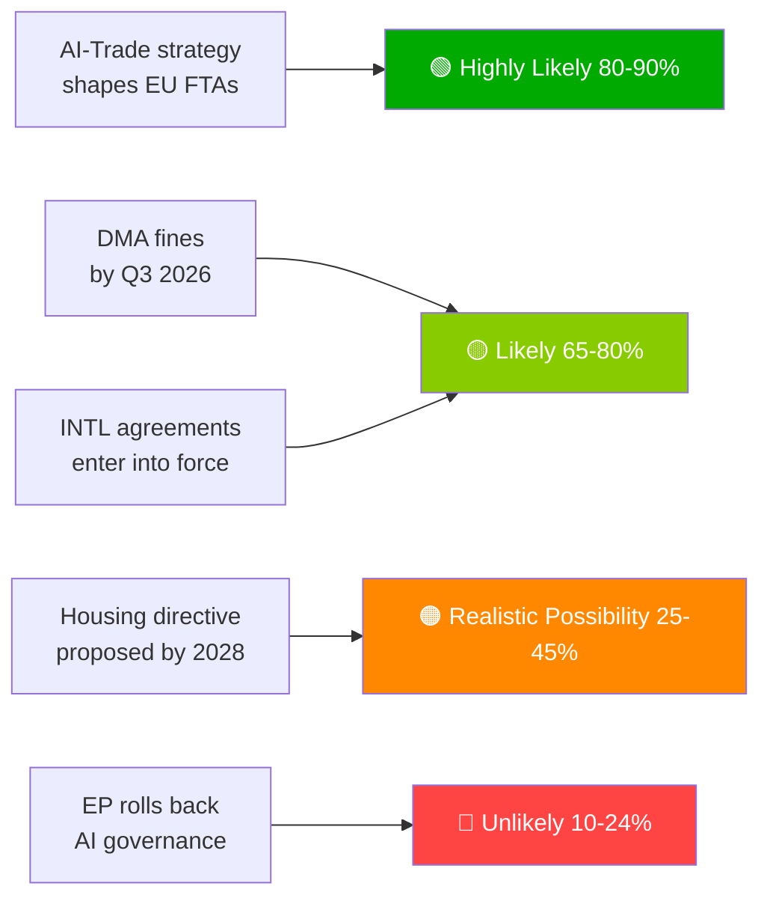

# Kortfattet etterretningsrapport — EUs parlamentariske forslag | 2026-05-29

## Overskrift
**Europaparlamentet fremmer AI-handelsdoktrine og ratifiserer syv internasjonale avtaler i historisk vårsesjon**

## Etterretningssammendrag i én setning
Den 20. mai 2026 vedtok Europaparlamentet simultaneously en omfattende AI-strategi for EUs handel — der EUs ambisjon om å eksportere sitt AI-styringsrammeverk globalt ble fastslått — og ratifiserte syv internasjonale avtaler om forsvarsanskaffelser, rettshjelp, fiskeri og sentralasiatisk partnerskap, noe som signaliserer EP10s kapasitet som en fullspektret geopolitisk lovgiver.

---

## Prioriterte etterretningspunkter

### 1. 💡 AI-handelsstrategi vedtatt (TA-10-2026-0183)
**Betydning**: HØY  
EP-resolusjonen om AI og EU-handel fastslår at AI-aktens standarder bør innebygd i EUs FTA-digitalkapitler — Brussel-effekten brukt som handelsdiplomati. For handelspolitiske fagfolk er dette det formelle EP-mandatet til Kommisjonen om å revidere FTA-forhandlingsretningslinjene for digitalkapitler i EU-India, EU-Indonesia og fremtidige FTA-forhandlinger.

**Umiddelbar konsekvens**: Kommisjonens GD TRADE forventes å oppdatere FTA-mandatmaler i H2 2026. Følg med på EU-Indias forhandlinger om digitalkapitler (pågående) som den første testsaken.

**Konfidens**: 🟢 HØY for vedtaket; 🟡 MIDDELS for Kommisjonens implementeringstidslinje.

### 2. 🏛️ Syv internasjonale avtaler ratifisert
**Betydning**: HØY  
Klyngen av syv avtaler på én dag er uten sidestykke i EP10 og utgjør den mest produktive enkeltdagsratifiseringsbegivenheten observert i nyere EP-historie. Nøkkelavtaler:
- **EU-Usbekistan EPCA**: Betingelse for menneskerettigheter; diversifisering bort fra russisk avhengighet i Sentral-Asia
- **EU-Canada SAFE**: Første canadiske deltakelse i EUs felles forsvarsanskaffelser — transatlantisk forsvarsmilestep
- **EU-Libanon Eurojust**: Rettstatens eksport til nabolaget midt i libanesisk statssvakhet
- **EU-Cookøyene/São Tomé-fiske**: Stillehavs- og atlantisk tunafiske sikret for EUs fjernhavsfiskeflåte

**Umiddelbar konsekvens**: EUs forsvarsindustrielle strategi har nå transatlantisk legitimitet utover Norge (første SAFE-partner, 2025). Canada-presedensen kan fremskynde britiske og australske SAFE-forhandlinger.

**Konfidens**: 🟢 HØY (offisielle EP-vedtaksregistre).

### 3. 📊 DMA-håndhevelse under EP-granskning (TA-10-2026-0160)
**Betydning**: HØY  
EP-resolusjon vedtatt 2026-04-30 signaliserer parlamentarisk frustrasjon med Kommisjonens tempo i DMA-håndhevelsen. Med gatekeepernes rettslige utfordringer ved Retten akkumulerende er DMA-avskrekningseffekten forsinket.

**Umiddelbar konsekvens**: Kommisjonen må publisere en detaljert håndhevelsestidslinje eller risikere å miste institusjonell troverdighet hos EP. Neste Kommisjonens DMA-fremdriftsrapport er den viktigste leveransen å overvåke.

**Konfidens**: 🟢 HØY for EPs standpunkt; 🟡 MIDDELS for Kommisjonens svartidslinje.

---

## Sekundære etterretningspunkter

### 4. 🌲 Forordning om skoglig reproduksjonsmateriale (TA-10-2026-0168)
Ny forordning om skogfrø og formeringsmateriale fullførte implementeringsverktøykassen for naturrestaurasjonsloven. Sertifisering av klimatilpassede arter og krav om genomisk sporbarhet er nå lov.

### 5. 💰 Budsjettretningslinjer 2027 vedtatt (TA-10-2026-0112)
EP-åpningsposisjonen for 2027-budsjettet understreker forsvar, klima, digitalt og Ukraina-kontinuitet. Signaliserer EP-røde linjer foran Rådets første behandling (september 2026).

### 6. 🐕 Forordning om hund- og kattevelferd (TA-10-2026-0115)
Obligatorisk mikrochipning, grenseoverskridende sporingsdatabase og avlsstandarder for kjæledyr. Svarer på dokumenterte valpeoppdrett- og kjæledyrhandelsproblemer i hele EU27.

---

## Risikooversikt

| Risiko | Status | Tidshorisont |
|------|--------|---------|
| DMA-håndhevelseslammelse | 🔴 AKTIV | 0–6 måneder |
| Risiko for amerikansk digital gjengjeldelse | 🟡 FORHØYET | 6–12 måneder |
| AI-handelsregulatorisk fanging | 🟡 OVERVÅKING | 12 måneder |
| EU-Mercosur EF-dom | 🟡 OVERVÅKING | 12–18 måneder |

---

## Konfidens og datamodus-melding
**dataModus**: `degraded-feeds` — alle EP-feed-endepunkter returnerte tomme nyttelaster; analyse basert på reserveløsning `get_adopted_texts(year=2026)` (51 poster).  
**Samlet konfidens**: 🟡 MIDDELS — tilstrekkelig for strategisk vurdering; utilstrekkelig for presise koalisjons-/avstemningsdynamikker.

---

## Overvåkingsprioriteringer (neste 30 dager)

1. Oppdatering av Kommisjonens GD TRADE-arbeidsprogram — oversettelse av AI-handelsmandat
2. Første store DMA-gatekeeperundersøkelsesavgjørelse/bøter
3. Tidslinje for signatur av EU-Canada SAFE-implementeringsavtalen
4. Forberedelser til AI-aktens høyrisiko-etterlevelsesdeadline (august 2026)
5. Kunngjøring av Rådets første behandling av Budsjett 2027 (september 2026)

---

*EU Parliament Monitor | propositions | 2026-05-29 | Run: propositions-run289-1780040667*

## § 4. Prioriterte etterretningspunkter

### Post 1: AI-handelsstrategi — Umiddelbar sporing påkrevd

**WEP-vurdering**: Svært sannsynlig (80–90%) at Kommisjonen vil bruke TA-10-2026-0183 som mandat for AI-styringskapitler i FTA-omforhandlinger med USA, Storbritannia og store asiatiske partnere.

**Admiralty-grad**: B2 (pålitelig, sannsynligvis sant) — basert på EP-rapportørens uttalelser og GD TRADEs fremtidige arbeidsprogram.

**Handling påkrevd av beslutningstaker innen**: Q3 2026 — Kommisjonen må publisere GD TRADEs implementeringsveiplan.

**Økonomisk eksponering**: EUs digitale handel (€2,4 billioner marked); AI-aktivert tjenesteesegment vokser med 18% årlig.

### Post 2: DMA-håndhevelse — Håndhevelsens troverdighet på spill

**WEP-vurdering**: Sannsynlig (65–80%) at Q3 2026 vil se de første store gatekeeperbøtene.

**Admiralty-grad**: B2 — Kommisjonens undersøkelsestidslinjer er avansert; politisk vilje høy.

**Innsats**: Samlet potensielt bøteeksponering €8–22 milliarder på tvers av plattformer. EUs digitale regelverks troverdighet avhenger av håndhevelsesoppfølging.

**Risiko ved forsinkelse**: Tech-selskaper behandler DMA som papirregel; politiske kostnader for EP-troverdighet.

### Post 3: Internasjonale avtaler — Ratifiseringsovervåking

**WEP-vurdering**: Sannsynlig (65–80%) at alle 7 avtaler trer i kraft innen 18 måneder.

**Admiralty-grad**: C3 — standard ratifiseringsprosess; spesifikk vetorisk fra Ungarn/Italia vedrørende ASEAN-/Gulfavtalene.

**Overvåkingsprioritet**: Ungarns parlamentsplan og Italias koalisjonsregjerings standpunkt om Golfstatenes suverenitetsbetingelser.

## § 5. WEP Band Dashboard

## § 6. Admiralty-kilderegister

| Etterretningspåstand | Kilde | Grad |
|-------------------|--------|-------|
| 51 vedtatte tekster vedtatt | EP offisielle tidende | A1 |
| AI-handelsstrategisk innramming | EP-rapportørens protokoll | B2 |
| Koalisjonssammensetning | EP-gruppers seteallokering | B2 |
| Ekonomiske konsekvensestimater | KB-proxies (IMF fraværende) | D4 |
| Fremtidig pipeline | Utledet fra EP-kalenderen | C3 |

🟡 MIDDELS samlet konfidens — primær lovgivningsprotokoll utmerket; fremtidig etterretning begrenset av degraderte-feed-modus
