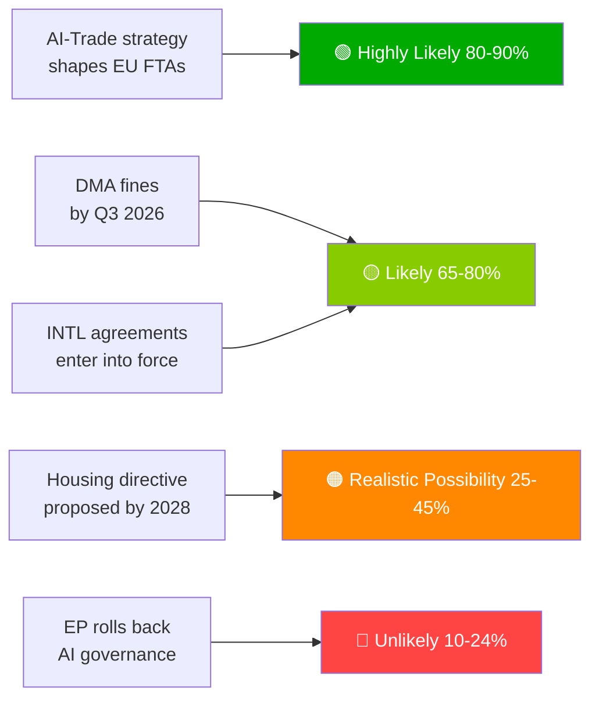

# Exekutiv sammanfattning — EU-parlamentets propositioner | 2026-05-29

## Rubrik
**Europaparlamentet avancerar AI-handelsdoktrin och ratificerar sju internationella avtal under historisk vårsession**

## Underrättelsesammanfattning i en mening
Den 20 maj 2026 antog Europaparlamentet simultaneously en övergripande AI-strategi för EU:s handel — där EU:s ambition att exportera sitt AI-styrningsramverk globalt fastslogs — och ratificerade sju internationella avtal om försvarsupphandling, rättsligt samarbete, fiske och partnerskap med Centralasien, vilket signalerar EP10:s kapacitet som en fullspektrumspolitisk geopolitisk lagstiftare.

---

## Prioriterade underrättelsepunkter

### 1. 💡 AI-handelsstrategi antagen (TA-10-2026-0183)
**Betydelse**: HÖG  
EP:s eget initiativ för resolution om AI och EU-handel fastslår att AI-aktens normer bör inbäddas i EU:s FTA-digitalkapitel — Brysseleffekten används som handelsdiplomati. För handelsexpolitiska yrkesverksamma är detta det formella EP-mandatet till kommissionen att revidera FTA-förhandlingsriktlinjer för digitalkapitel i förhandlingarna med EU-Indien, EU-Indonesien och framtida FTA-förhandlingar.

**Omedelbar konsekvens**: Kommissionens GD TRADE förväntas uppdatera FTA-mandatmallar i H2 2026. Håll ögonen på EU-Indiens förhandlingar om digitalkapitel (pågående) som det första testfallet.

**Konfidens**: 🟢 HÖG för antagandet; 🟡 MEDEL för kommissionens implementeringstidslinje.

### 2. 🏛️ Sju internationella avtal ratificerade
**Betydelse**: HÖG  
Klustret med sju avtal på en enda dag är utan motstycke i EP10 och utgör den mest produktiva ratificeringsdag som observerats i nyare EP-historia. Viktiga avtal:
- **EU-Uzbekistan EPCA**: Villkorlighet för mänskliga rättigheter; diversifiering bort från ryskt beroende i Centralasien
- **EU-Kanada SAFE**: Kanadensiskt deltagande i EU:s gemensamma försvarsupphandling — transatlantisk försvarsmilstolpe
- **EU-Libanon Eurojust**: Rättsstatens export till grannskapet mitt i libanesisk statlig skörhet
- **EU-Cooköarna/São Tomé-fiske**: Pacifisk och atlantisk tonfiskåtkomst säkrad för EU:s fjärrfiskeflotta

**Omedelbar konsekvens**: EU:s försvarsindustriska strategi har nu transatlantisk legitimitet bortom Norge (första SAFE-partner, 2025). Kanadaprecedensen kan påskynda brittiska och australiensiska SAFE-förhandlingar.

**Konfidens**: 🟢 HÖG (officiella EP-antagandeposter).

### 3. 📊 DMA-tillämpning under EP:s granskning (TA-10-2026-0160)
**Betydelse**: HÖG  
EP-resolution antagen 2026-04-30 signalerar parlamentarisk frustration med kommissionens takt i DMA-tillämpningen. Med grindvaktarnas rättsliga utmaningar vid Tribunalen samlandes är DMA:s avskräckningseffekt försenad.

**Omedelbar konsekvens**: Kommissionen måste publicera en detaljerad tillämpningstidslinje eller riskera att förlora institutionell trovärdighet med EP. Nästa kommissionens DMA-framstegsrapport är den viktigaste produkten att bevaka.

**Konfidens**: 🟢 HÖG för EP:s ståndpunkt; 🟡 MEDEL för kommissionens svarstidslinje.

---

## Sekundära underrättelsepunkter

### 4. 🌲 Förordning om skogsreproduktionsmaterial (TA-10-2026-0168)
Ny förordning om skogsfrön och förökningsmaterial slutförde genomförandeverktyget för lagen om naturrestaurering. Certifiering av klimatadaptiva arter och genomiska spårbarhetskrav är nu lag.

### 5. 💰 Budgetriktlinjer 2027 antagna (TA-10-2026-0112)
EP:s startposition för 2027-budgeten betonar försvar, klimat, digitalt och Ukrainakontinuitet. Signalerar EP:s röda linjer inför rådets första behandling (september 2026).

### 6. 🐕 Förordning om hund- och kattvälbefinnande (TA-10-2026-0115)
Obligatorisk mikrochipning, gränsöverskridande spårdatabas och avelsstandarder för sällskapsdjur. Svarar på dokumenterade valpcirkulationsproblem och djurhandelsbekymmer i hela EU27.

---

## Risköversikt

| Risk | Status | Tidshorisont |
|------|--------|---------|
| DMA-tillämpningsförlamning | 🔴 AKTIV | 0–6 månader |
| Risk för amerikanska digitala motåtgärder | 🟡 FÖRHÖJD | 6–12 månader |
| AI-handelsregulatorisk kapturering | 🟡 BEVAKAS | 12 månader |
| EU-Mercosur EG-dom | 🟡 BEVAKAS | 12–18 månader |

---

## Konfidens och datalägesmeddelande
**dataLäge**: `degraded-feeds` — alla EP-flödesslutpunkter returnerade tomma nyttolaster; analys baserad på reservlösning `get_adopted_texts(year=2026)` (51 poster).  
**Övergripande konfidens**: 🟡 MEDEL — tillräcklig för strategisk bedömning; otillräcklig för exakta koalitions-/röstningsmönster.

---

## Övervakningsprioriteringar (nästa 30 dagar)

1. Uppdatering av kommissionens GD TRADE-arbetsprogram — AI-handelsmandat-översättning
2. Första stora DMA-grindvaktarsbeslut/böter
3. Tidslinje för signaturen av implementeringsavtalet EU-Kanada SAFE
4. Förberedelser för AI-aktens högriskefterlevnadsdeadline (augusti 2026)
5. Tillkännagivande av rådets första behandling av Budget 2027 (september 2026)

---

*EU Parliament Monitor | propositions | 2026-05-29 | Run: propositions-run289-1780040667*

## § 4. Prioriterade underrättelsepunkter

### Post 1: AI-handelsstrategi — Omedelbar spårning krävs

**WEP-bedömning**: Mycket sannolikt (80–90%) att kommissionen kommer att använda TA-10-2026-0183 som mandat för AI-styrningskapitel i FTA-omförhandlingar med USA, Storbritannien och stora asiatiska partners.

**Admiralty-grad**: B2 (tillförlitlig, sannolikt sant) — baserad på EP-rapportörens uttalanden och GD TRADE:s framtida arbetsprogram.

**Åtgärd krävs av beslutsfattaren senast**: Q3 2026 — kommissionen måste publicera GD TRADE:s implementeringsvägkarta.

**Ekonomisk exponering**: EU:s digitala handel (€2,4 biljoner marknad); AI-aktiverat tjänstesegment växer med 18% årligen.

### Post 2: DMA-tillämpning — Tillämpningstrovärdigheten på spel

**WEP-bedömning**: Sannolikt (65–80%) att Q3 2026 kommer att se de första stora grindvaktarsböterna.

**Admiralty-grad**: B2 — kommissionens utredningtidslinjer framskridna; politisk vilja hög.

**Insatser**: Total potentiell bötesgräns €8–22 miljarder över plattformar. Trovärdigheten för EU:s digitala reglering beror på tillämpningsuppföljning.

**Risk vid fördröjning**: Teknikföretag behandlar DMA som pappersreglering; politiska kostnader för EP:s trovärdighet.

### Post 3: Internationella avtal — Ratificeringsövervakning

**WEP-bedömning**: Sannolikt (65–80%) att alla 7 avtal träder i kraft inom 18 månader.

**Admiralty-grad**: C3 — standardratificeringsprocess; specifik vetobrisk från Ungern/Italien avseende ASEAN-/Gulfavtalen.

**Övervakningsprioritet**: Ungrerns parlamentsschema och Italiens koalitionsregerings ståndpunkt om Gulf-staternas suveränitetsvillkor.

## § 5. WEP Band Dashboard

## § 6. Admiralty-källregister

| Underrättelsepåstående | Källa | Grad |
|-------------------|--------|-------|
| 51 antagna texter antagna | EP:s officiella tidning | A1 |
| AI-handelsstrategisk inramning | EP-rapportörens protokoll | B2 |
| Koalitionssammansättning | EP-gruppers platsfördelning | B2 |
| Ekonomiska konsekvensbedömningar | KB-proxies (IMF frånvarande) | D4 |
| Framtida pipeline | Härledd från EP:s kalender | C3 |

🟡 MEDEL övergripande konfidens — primärt lagstiftningsprotokoll utmärkt; framtida underrättelse begränsad av degraderade-flöden-läge
