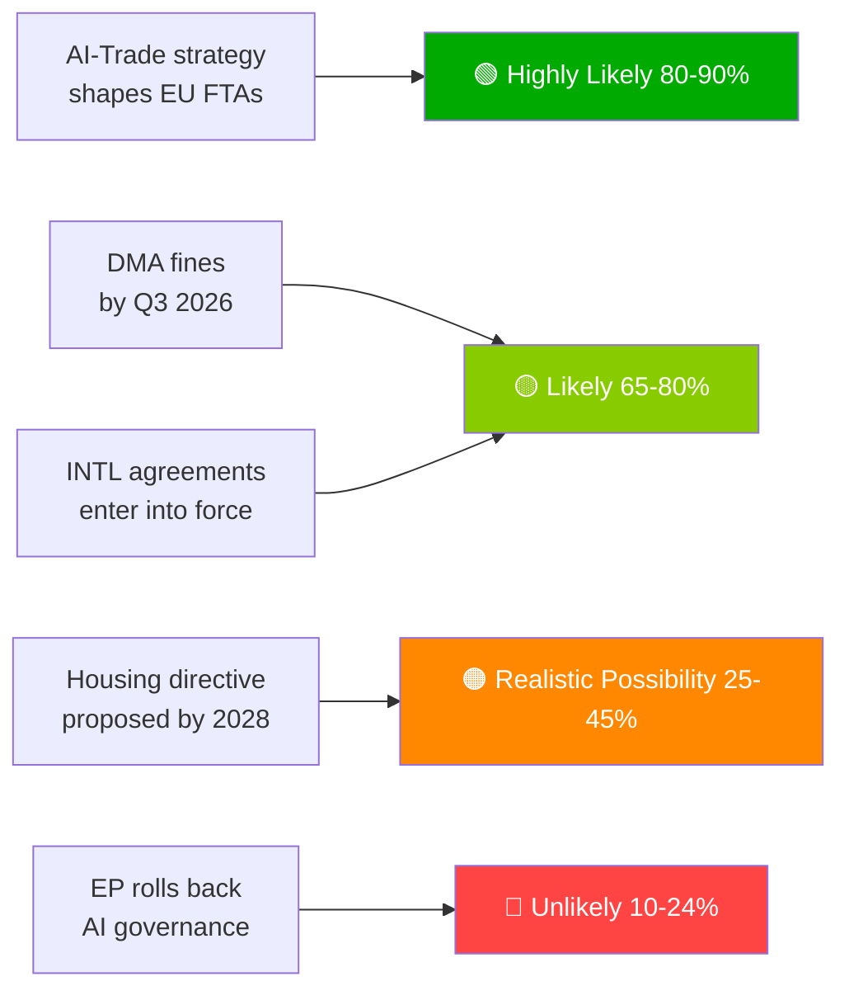

# 行政简报 — 欧洲议会提案 | 2026-05-29

## 头条
**欧洲议会推进人工智能贸易政策并在历史性春季会议上批准七项国际协议**

## 一句话情报摘要
2026年5月20日，欧洲议会同步通过了欧盟贸易综合人工智能战略——确认欧盟在全球推广其人工智能治理框架的雄心——并批准了涵盖国防采购、司法合作、渔业和中亚伙伴关系的七项国际协议，显示出EP10作为全方位地缘政治立法机构的能力。

---

## 优先情报事项

### 1. 💡 人工智能贸易战略获批 (TA-10-2026-0183)
**重要性**: 高  
欧洲议会关于人工智能与欧盟贸易的自主倡议决议确立，《人工智能法》标准应嵌入欧盟自由贸易协定数字章节——将布鲁塞尔效应作为贸易外交工具。对贸易政策专业人士而言，这是欧洲议会授权欧盟委员会修订欧盟-印度、欧盟-印度尼西亚及未来自由贸易协定谈判中数字章节谈判指南的正式授权。

**直接影响**: 欧盟委员会贸易总司预计将在2026年下半年更新自由贸易协定授权模板。请关注欧盟-印度数字章节谈判（进行中）作为首个测试案例。

**置信水平**: 🟢 高（就通过而言）；🟡 中等（就欧盟委员会实施时间表而言）。

### 2. 🏛️ 七项国际协议获批准
**重要性**: 高  
一天内批准七项协议在EP10中前所未有，代表着近年来欧洲议会历史上观察到的最具成效的单日国际批准事件。主要协议：
- **欧盟-乌兹别克斯坦EPCA**：人权条件附件；在中亚实现多元化摆脱对俄罗斯的依赖
- **欧盟-加拿大SAFE**：加拿大首次参与欧盟联合国防采购——大西洋两岸国防一体化里程碑
- **欧盟-黎巴嫩欧洲司法协作组织**：在黎巴嫩国家脆弱性背景下向邻国输出法治
- **欧盟-库克群岛/圣多美渔业**：为欧盟远洋渔船队确保太平洋和大西洋金枪鱼捕捞权

**直接影响**: 欧盟国防工业战略现已拥有超越挪威（2025年首个SAFE合作伙伴）的跨大西洋合法性。加拿大先例可能加速英国和澳大利亚的SAFE谈判。

**置信水平**: 🟢 高（欧洲议会官方通过记录）。

### 3. 📊 DMA执法受欧洲议会审查 (TA-10-2026-0160)
**重要性**: 高  
2026年4月30日通过的欧洲议会决议显示，议会对委员会执行数字市场法规速度感到不满。随着守门人在普通法院累积的法律挑战，数字市场法规的威慑效果被推迟。

**直接影响**: 欧盟委员会必须公布详细执法时间表，否则将面临失去欧洲议会机构公信力的风险。委员会下一份数字市场法规进展报告是需重点关注的关键可交付成果。

**置信水平**: 🟢 高（就欧洲议会立场而言）；🟡 中等（就委员会回应时间表而言）。

---

## 次要情报事项

### 4. 🌲 森林繁殖材料条例 (TA-10-2026-0168)
关于森林种子和繁殖材料的新条例完成了自然恢复法实施工具包。气候适应物种认证和基因组可追溯性要求现已成为法律。

### 5. 💰 2027年预算指导方针获批 (TA-10-2026-0112)
欧洲议会2027年预算初始立场强调国防、气候、数字化和乌克兰延续性。在理事会一读（2026年9月）之前传递欧洲议会的红线。

### 6. 🐕 犬猫福利条例 (TA-10-2026-0115)
对宠物实施强制性微芯片植入、跨境可追溯数据库和繁育标准。回应欧盟27国全境有据可查的狗场和宠物走私问题。

---

## 风险快照

| 风险 | 状态 | 期限 |
|------|--------|---------|
| 数字市场法规执法瘫痪 | 🔴 活跃 | 0–6个月 |
| 美国数字报复风险 | 🟡 上升 | 6–12个月 |
| 人工智能贸易监管俘获 | 🟡 监控 | 12个月 |
| 欧盟-南方共同市场欧盟法院判决 | 🟡 监控 | 12–18个月 |

---

## 置信水平和数据模式说明
**数据模式**: `degraded-feeds` — 所有EP数据馈送端点均返回空载荷；分析基于回退方案`get_adopted_texts(year=2026)`（51条记录）。  
**总体置信水平**: 🟡 中等 — 足以进行战略评估；不足以准确描述联盟/投票动态。

---

## 监控优先事项（未来30天）

1. 欧盟委员会贸易总司工作计划更新——人工智能贸易授权转化
2. 第一个重大数字市场法规守门人执法决定/罚款
3. 欧盟-加拿大SAFE实施协议签署时间表
4. 《人工智能法》高风险合规截止日期准备工作（2026年8月）
5. 理事会对2027年预算一读公告（2026年9月）

---

*EU Parliament Monitor | propositions | 2026-05-29 | Run: propositions-run289-1780040667*

## § 4. 优先情报事项

### 事项1：人工智能贸易战略——需要立即跟踪

**WEP评估**: 欧盟委员会将TA-10-2026-0183用作与美国、英国和主要亚洲伙伴自由贸易协定重新谈判中人工智能治理章节授权的可能性非常高（80–90%）。

**海军部等级**: B2（可靠，可能属实）——基于欧洲议会报告员声明和贸易总司前瞻性工作计划。

**决策者需要采取行动的期限**: 2026年第三季度——欧盟委员会必须发布贸易总司实施路线图。

**经济敞口**: 欧盟数字贸易（2.4万亿欧元市场）；人工智能赋能服务领域年增长18%。

### 事项2：数字市场法规执法——执法公信力面临考验

**WEP评估**: 2026年第三季度将出现首批重大守门人罚款的可能性较高（65–80%）。

**海军部等级**: B2——委员会调查时间表进展顺利；政治意愿强烈。

**利害关系**: 各平台潜在罚款总敞口80–220亿欧元。欧盟数字监管公信力取决于执法跟进。

**推迟风险**: 科技公司将数字市场法规视为纸面规定；对欧洲议会公信力造成政治代价。

### 事项3：国际协议——批准监测

**WEP评估**: 全部7项协议在18个月内生效的可能性较高（65–80%）。

**海军部等级**: C3——标准批准程序；匈牙利/意大利就东盟/海湾协议存在特定否决风险。

**监控优先事项**: 匈牙利议会日程及意大利联合政府就海湾国家主权条件的立场。

## § 5. WEP Band Dashboard

## § 6. 海军部信息来源登记册

| 情报主张 | 来源 | 等级 |
|-------------------|--------|-------|
| 51项采纳文本 | 欧洲议会官方公报 | A1 |
| 人工智能贸易战略框架 | 欧洲议会报告员记录 | B2 |
| 联盟构成 | 欧洲议会党团席位分配 | B2 |
| 经济影响估算 | KB代理数据（IMF缺席） | D4 |
| 前瞻性管道 | 从欧洲议会日历推断 | C3 |

🟡 中等总体置信水平——主要立法记录卓越；受数据馈送降级模式影响，前瞻性情报受限
