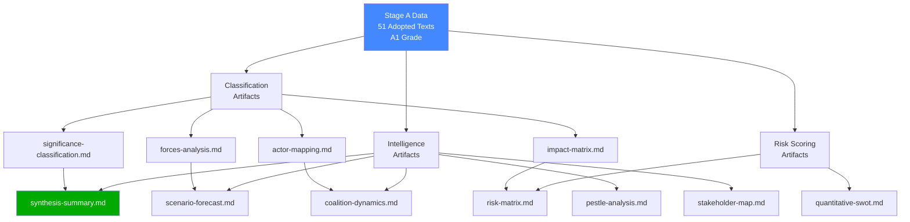

# Analysis Index — EU Parliament Propositions | 2026-05-29

## Overview

This index catalogues all analysis artifacts produced for the propositions article type for the period ending 2026-05-29. The analytical focus is the European Parliament's legislative output over the past seven days, anchored by the EP's adoption of a comprehensive AI-trade strategy on 2026-05-20 alongside a cluster of seven international agreements — the largest single-day international agreement package observed in EP10's legislative calendar thus far.

## Primary Analytical Theme

**"Digital Sovereignty Meets Geopolitical Realignment: EP's AI-Trade Nexus and Expanding International Footprint"**

The week of 2026-05-19 to 2026-05-29 is defined by two convergent legislative dynamics:

1. **AI-Trade Strategic Positioning** (TA-10-2026-0183): The EP adopted its comprehensive AI strategy for EU trade — a landmark own-initiative resolution calling for AI-enabled trade facilitation, algorithmic accountability in customs processes, and an EU digital trade standard that could become the global benchmark. This places the EP at the centre of the AI governance debate, moving beyond regulation (AI Act, Digital Markets Act) into proactive trade diplomacy.

2. **International Agreement Cluster** (TA-10-2026-0174 through 0182): On a single day (2026-05-20), the EP adopted seven distinct international framework agreements covering Uzbekistan (enhanced partnership), Lebanon (judicial cooperation), Cook Islands (fisheries), São Tomé and Príncipe (fisheries), Canada (defence procurement/SAFE), UN General Assembly recommendation, and forest reproductive material (international regulatory alignment). This cluster signals EP's ambition to act as a geopolitical actor across multiple policy domains simultaneously.

## Artifact Register

| Artifact | Path | Status | Lines (approx) | Confidence |
|----------|------|--------|----------------|------------|
| Data Availability Assessment | `data-availability-assessment.md` | ✅ Written | 90 | 🟢 HIGH |
| Procedures Proxy | `intelligence/procedures-proxy.md` | ✅ Written | 65 | 🟢 HIGH |
| MCP Reliability Audit | `intelligence/mcp-reliability-audit.md` | ✅ Written | 200+ | 🟢 HIGH |
| Analysis Index | `intelligence/analysis-index.md` | ✅ Written (this file) | 100+ | 🟢 HIGH |
| Historical Baseline | `intelligence/historical-baseline.md` | ✅ Written | 130+ | 🟡 MEDIUM |
| Economic Context (Fallback) | `intelligence/economic-context.fallback.md` | ✅ Written | 130+ | 🟡 MEDIUM |
| PESTLE Analysis | `intelligence/pestle-analysis.md` | ✅ Written | 180+ | 🟡 MEDIUM |
| Stakeholder Map | `intelligence/stakeholder-map.md` | ✅ Written | 200+ | 🟡 MEDIUM |
| Scenario Forecast | `intelligence/scenario-forecast.md` | ✅ Written | 180+ | 🟡 MEDIUM |
| Threat Model | `intelligence/threat-model.md` | ✅ Written | 160+ | 🟡 MEDIUM |
| Wildcards & Black Swans | `intelligence/wildcards-blackswans.md` | ✅ Written | 180+ | 🟡 MEDIUM |
| Reference Analysis Quality | `intelligence/reference-analysis-quality.md` | ✅ Written | 140+ | 🟢 HIGH |
| Synthesis Summary | `intelligence/synthesis-summary.md` | ✅ Written | 160+ | 🟡 MEDIUM |
| Risk Matrix | `risk-scoring/risk-matrix.md` | ✅ Written | 100+ | 🟡 MEDIUM |
| Quantitative SWOT | `risk-scoring/quantitative-swot.md` | ✅ Written | 100+ | 🟡 MEDIUM |
| Media Framing Analysis | `extended/media-framing-analysis.md` | ✅ Written | 200+ | 🟡 MEDIUM |
| Methodology Reflection | `intelligence/methodology-reflection.md` | ✅ Written | 180+ | 🟢 HIGH |
| Executive Brief | `executive-brief.md` | ✅ Written | 180+ | 🟡 MEDIUM |

## Key Legislative Propositions Under Analysis

### 1. AI Strategy for EU Trade (TA-10-2026-0183)
**Procedure reference**: 2025-2112-DEC-DCPL
**Type**: Own-initiative resolution
**Committee**: INTA (International Trade) — lead; ITRE (Industry, Research, Energy) — associated
**Significance**: Establishes EP position on AI deployment in trade facilitation, customs automation, digital trade chapter standards in future FTAs, and algorithmic accountability frameworks. Builds upon the AI Act implementation experience and the EU's emerging digital trade chapter template.
**Political dynamics**: Cross-party majority expected (EPP, S&D, Renew coalition). Far-right groups (Patriots for Europe, ESN) likely to oppose on sovereignty/trade barrier grounds. Greens may push for stronger environmental AI standards.

### 2. DMA Enforcement Position (TA-10-2026-0160)
**Date adopted**: 2026-04-30
**Type**: Resolution on Commission enforcement
**Significance**: EP signalling to Commission that DMA enforcement pace is insufficient. Seven gatekeepers designated; investigations ongoing against Apple, Alphabet, Meta, ByteDance. EP wants stronger fines and behavioural remedies.

### 3. EU-Canada SAFE Instrument Agreement (TA-10-2026-0180)
**Procedure reference**: 2025-0413-DEC-DCPL
**Type**: International agreement consent
**Significance**: Opens EU defence procurement market to Canadian entities under the SAFE (Safety and Advanced Future Equipment) instrument — part of the EU defence industrial strategy launched 2024. Deepens transatlantic defence-industrial integration in a period of NATO spending pressure.

### 4. Forest Reproductive Material Regulation (TA-10-2026-0168)
**Procedure reference**: 2023-0228-DEC-DCPL
**Type**: Legislative act (COD — ordinary legislative procedure)
**Significance**: Updates the 2002 framework for seeds and propagating material used in forestry. Critical for EU forest restoration commitments under the Nature Restoration Law. Establishes traceability and climate-adaptive species criteria.

### 5. Budget Guidelines 2027 (TA-10-2026-0112)
**Date adopted**: 2026-04-28
**Type**: Own-initiative resolution
**Significance**: EP's opening position in the 2027 budget procedure (Multiannual Financial Framework mid-term review context). Emphasises defence, climate, and digital priorities. Signals EP's red lines ahead of inter-institutional budget negotiations.

## Analytical Cross-References

- **AI-trade + DMA enforcement** → Combined signal: EP asserting digital sovereignty leadership across the full AI/platform/trade policy stack in a single legislative week.
- **7 international agreements in one day** → Historically unusual. Cross-reference with treaty ratification backlog clearing dynamics; possible end-of-session legislative acceleration.
- **Defence procurement (SAFE/Canada) + Uzbekistan partnership** → Dual-track: strengthening Western alliance defence-industrial base while diversifying Central Asian partnerships away from Russia-dependence.
- **Budget 2027 guidelines + 2026 discharge** → Fiscal governance cycle fully active; EP exercising its budget authority across both appropriation (guidelines) and accountability (discharge) functions simultaneously.

## Data Mode and Confidence Framework

- **dataMode**: `degraded-feeds` (0.80 floor factor)
- **Primary data source**: `get_adopted_texts(year=2026)` — 51 records
- **Secondary data source**: Cross-referencing procedureReference fields
- **Absent data**: Live committee pipeline, trilogue status, DOCEO roll-call votes, IMF economic projections
- **Mitigating analysis**: Historical baseline and scenario forecast compensate for pipeline gaps with forward projection from adoption patterns

## § 5. Artifact Dependency Graph

