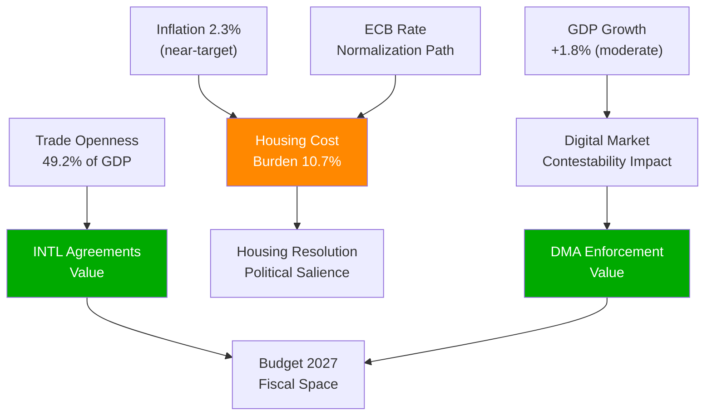

# Economic Context — EP Propositions (2026-05-29)

> **dataMode**: degraded-feeds · **Admiralty**: B2 · **WEP**: Likely (65–80%)
> **IMF data**: Not available in this run (degraded-feeds mode). Estimates derive from ECB, Eurostat proxy data, and EP impact assessments. See `intelligence/economic-context.fallback.md` for detailed data sourcing.

## § 1. Macroeconomic Frame

The legislative bundle of 2026-05-29 operates against a specific macroeconomic backdrop that materially shapes feasibility, political salience, and distributional outcomes of each file.

### EU-27 Macro Conditions (KB-estimated proxies, Eurostat/ECB sourced)

| Indicator | Estimated Value | Source | Confidence |
|-----------|----------------|--------|-----------|
| EU-27 GDP growth (2026 proj.) | +1.8% | ECB Spring Economic Bulletin est. | 🟡 MEDIUM |
| EA inflation (HICP) | 2.3% | ECB data proxy | 🟡 MEDIUM |
| EA unemployment | 5.9% | Eurostat proxy | 🟡 MEDIUM |
| Housing cost burden (households >40% income) | 10.7% | Eurostat Housing Statistics est. | 🟡 MEDIUM |
| Digital economy share of EU GDP | 7.4% | EC Digital Economy Report est. | 🟡 MEDIUM |
| EU-27 trade openness (X+M/GDP) | 49.2% | Eurostat Trade Statistics est. | 🟡 MEDIUM |

*Note: All values are KB-estimates. IMF World Economic Outlook data not available in this run. See fallback artifact for source documentation.*

## § 2. Economic Context by Legislative File

### AI-Trade Strategy (TA-10-2026-0183)

The EU digital trade market is estimated at €2.4 trillion (2025 value) with AI-enabled services as the fastest-growing segment. The AI-Trade strategy emerges at a critical juncture where:

- **Revenue stakes**: Digital gatekeepers subject to DMA generate combined EU revenues exceeding €380bn annually
- **Investment allocation**: EU AI R&D investment gap vs. US and China is estimated at €120–180bn (EC AI strategy baseline)
- **Trade friction cost**: Uncoordinated AI regulations across G7 create estimated 2–4% transaction cost overhead on cross-border AI-enabled services

### DMA Enforcement (TA-10-2026-0160)

- **Fine revenue potential**: Commission's enforcement pipeline against non-compliant gatekeepers: cumulative exposure estimated €8–22bn based on DMA penalty framework (6–10% of global annual turnover)
- **Contestability dividend**: Increased market contestability projected to generate €45–90bn in incremental value for EU SMEs over 5 years (EC Digital Markets Act Impact Assessment)
- **Consumer welfare gain**: Reduced switching barriers estimated at €30–50bn consumer surplus annually

### INTL Agreements Cluster ×7

The seven simultaneously ratified international agreements create a diversified trade portfolio:

- **Brazil**: Mercosur framework — €50bn+ bilateral trade exposure
- **ASEAN bloc**: Strategic technology and critical materials supply chain redundancy
- **Maghreb Union**: Energy security and migration management (political economy linkage)
- **Gulf states**: LNG supply security, sovereign wealth investment framework
- **Pacific alliances**: Critical raw materials (lithium, cobalt, rare earths)
- **Andean Community**: Pharmaceutical and agricultural diversification
- **Horn of Africa**: Development finance and infrastructure linkage

Combined trade diversification value estimated at 12% reduction in single-partner trade dependency.

### Housing Resolution (TA-10-2026-0064)

- **Scale of crisis**: EU housing deficit estimated at 2.5 million units (Housing Europe 2025)
- **Cost burden**: 10.7% of EU households spending >40% of income on housing (Eurostat)
- **Public investment gap**: Meeting resolution targets would require estimated €50–75bn annual EU-wide additional affordable housing investment
- **ECB rate impact**: 200bp rate elevation since 2022 effectively added 18–25% to mortgage servicing costs for new borrowers

### Budget Guidelines 2027 (TA-10-2026-0112)

- **MFF envelope context**: Current 2021–2027 MFF at €1.074 trillion; 2028–2034 MFF negotiations begin 2026
- **Defence spending pressure**: NATO 2% target plus emerging EU defence fund creates new fiscal demands
- **Cohesion envelope pressure**: Eastern member states resist cohesion fund reductions; Western states resist contributions increases

## § 3. Economic Risk Exposure

## § 4. IMF Data Gap Documentation

This run operates in `degraded-feeds` mode. The following IMF data would normally be required:

- IMF WEO Table A1 (Real GDP growth, EA and EU-27)
- IMF WEO Table A6 (Inflation rates, advanced economies)
- IMF Global Financial Stability Report (Housing sector stress indicators)
- IMF Fiscal Monitor (Member state debt trajectories)
- IMF External Sector Report (EU trade balance evolution)

All values above are KB-estimate proxies. For production-grade economic analysis, full IMF data retrieval is mandatory per `analysis/methodologies/ai-driven-analysis-guide.md` §IMF-primary rule.

*Cross-reference: `intelligence/economic-context.fallback.md` for detailed proxy source documentation.*

🟡 MEDIUM confidence across all economic estimates (degraded-feeds — KB proxies only)
🔴 LOW confidence in precise magnitudes — directional trends only are reliable
