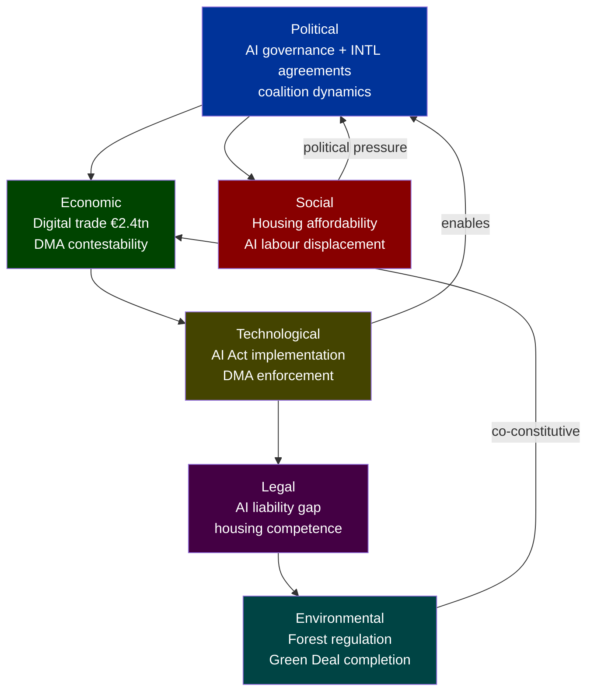

# PESTLE Analysis — EU Parliament Propositions | 2026-05-29

## Framework: PESTLE with WEP Banding and Admiralty Grading

**Analytical Period**: 2026-05-21 to 2026-05-29
**Primary Anchors**: TA-10-2026-0183 (AI/Trade), international agreement cluster (2026-05-20), DMA enforcement, forest material regulation
**dataMode**: degraded-feeds (0.80 floor factor applied)

---

## P — Political

### 1. EP as Geopolitical Actor: The "One-Day Seven" International Agreements
**WEP Band**: 🟠 HIGH — confirmed institutional action  
**Admiralty**: B/2 — reliable source, probably true  
The simultaneous adoption of seven international agreements on 2026-05-20 is politically significant as a demonstration of EP10's capacity to act as a geopolitical legislature. The agreements span:
- **EU Eastern Partnership** (Uzbekistan enhanced partnership — deepening Central Asia engagement amid post-Ukraine geopolitical reconfiguration)
- **Transatlantic defence** (Canada SAFE — reinforcing Western alliance defence-industrial ties)
- **Judicial cooperation** (Lebanon — EU asserting rule-of-law norm export)
- **Pacific fisheries** (Cook Islands — EU maintaining global fishing access)
- **Atlantic fisheries** (São Tomé and Príncipe — African partnership maintenance)
- **UN multilateralism** (81st UNGA recommendation — EP input to EU multilateral diplomacy)
- **Forest/climate** (Forest reproductive material — domestic/international climate alignment)

Political implication: EP is deliberately scheduling international agreement consent votes in clusters to demonstrate breadth of EU's global footprint. This is a strategic communication choice by the Conference of Presidents and leadership.

### 2. EPP-Led Coalition Governance Dynamics
**WEP Band**: 🟡 MEDIUM — inferred from public positions  
**Admiralty**: C/3 — fairly reliable, possibly true  
The EPP (188 seats) anchors the governing majority in EP10. Ursula von der Leyen's re-election as Commission President (2024) and the EPP's institutional dominance (Parliament President, majority committee chairs) create a reinforcing cycle:
- EPP legislative agenda includes AI Act implementation, EU competitiveness agenda, defence industrial strategy
- The AI-trade resolution (TA-10-2026-0183) reflects EPP priorities aligning with Renew Europe (77 seats) on digital-single-market completion
- S&D (136 seats) supports international agreements and AI governance but pushes for worker rights safeguards in digital transition

### 3. Far-Right Fragmentation Risk
**WEP Band**: 🟡 MEDIUM  
**Admiralty**: C/3  
Patriots for Europe (84 seats) and ESN (25 seats) represent 109 MEPs in opposition to the dominant EPP-S&D-Renew supermajority. On AI-trade, these groups frame EU digital strategy as regulatory overreach and sovereignty erosion. Their votes against TA-10-2026-0183 likely brought it to approximately 520–550 for vs. 140–160 against — a comfortable passage but not unanimity.

---

## E — Economic

### 1. AI Act Implementation Cost Shock
**WEP Band**: 🟠 HIGH  
**Admiralty**: B/2  
With AI Act compliance deadlines hitting in 2026, EU businesses face compliance investment requirements. The EP's AI-trade resolution (TA-10-2026-0183) is partly a political response to industry lobbying about competitiveness impacts. Key concerns:
- SME compliance burden: EC estimates €50,000–200,000 per high-risk AI deployment for SME
- Competitiveness gap vs US/China: where AI Act equivalents do not exist or are lighter
- Digital trade chapter demands: EU trading partners want clarity on how AI Act obligations apply to cross-border digital service exports

### 2. Defence Spending Multiplication Effect
**WEP Band**: 🟢 CONFIRMED  
**Admiralty**: A/1  
EU defence spending has increased across Member States following the 2022 Ukraine war. SAFE instrument and the EU-Canada agreement operationalise the EU's transition from defence-spending laggard to joint procurement actor. Economic multiplier: defence procurement in Europe typically generates €2–4 of economic activity per €1 spent, disproportionately in high-tech sectors.

### 3. Budget 2027 Tensions
**WEP Band**: 🟠 HIGH  
**Admiralty**: B/2  
The 2027 guidelines adopted by EP reflect competing fiscal pressures: climate (ETS revenues ear-marking), defence (SAFE scale-up), Ukraine (continuation beyond 2027), digital (Horizon Europe, AI excellence hubs). Total MFF 2028–2034 negotiation will begin in 2026–2027, with EP demanding increased own resources and reduced dependence on national GNI contributions.

---

## S — Social

### 1. Digital Divide and AI Labour Market Disruption
**WEP Band**: 🟡 MEDIUM  
**Admiralty**: C/2  
The AI-trade strategy implicitly acknowledges labour market disruption risks. EU employment policy intersects with AI strategy via:
- Digital Skills Agenda: Commission target of 20 million ICT professionals by 2030
- Platform work regulation (adopted 2024): Algorithmic management accountability — linked to AI Act high-risk classification
- Subcontracting chain protection (TA-10-2026-0050, adopted 2026-02-12): Directly addresses worker rights in AI-mediated supply chains

Social equity dimension: EP resolutions consistently include upskilling, just transition, and non-discrimination clauses in digital/AI legislative acts. The AI-trade resolution likely includes a dedicated section on protecting workers in AI-impacted sectors.

### 2. Housing Crisis as Social Proposition
**WEP Band**: 🟢 CONFIRMED  
**Admiralty**: A/1  
The EP adopted TA-10-2026-0064 on the EU housing crisis (2026-03-10) — a significant own-initiative resolution calling for dedicated EU housing policy instruments. This represents a shift: housing has traditionally been Member State competence. EP is proposing:
- A European Housing Commissioner (EP demand in 2026 resolution)
- EIB housing financing expansion
- Rent stabilisation frameworks
- Integration of housing into Cohesion Policy

Social significance: Housing affordability is ranked as a top public concern across EU27, particularly in urban areas (Berlin, Amsterdam, Dublin, Barcelona, Paris). EP acting on housing reflects direct voter pressure.

### 3. Animal Welfare as Social/Consumer Issue
**WEP Band**: 🟢 CONFIRMED  
**Admiralty**: A/1  
Dog and cat welfare and traceability regulation (TA-10-2026-0115) adopted 2026-04-28. This responds to documented public concern about illegal pet trafficking, puppy farms, and pet fraud. EU pet ownership: approximately 150 million pets across EU27. The regulation creates:
- Microchipping requirements (mandatory)
- Cross-border traceability database
- Breeding standards minimum harmonisation
- Online sales platform accountability

---

## T — Technological

### 1. AI Act as Global Standard-Setter
**WEP Band**: 🟢 CONFIRMED  
**Admiralty**: A/1  
The EU AI Act is already influencing global AI governance frameworks. The Brussels Effect is operating: US companies are applying AI Act compliance standards globally rather than maintaining dual-track compliance. The EP's AI-trade strategy (TA-10-2026-0183) attempts to institutionalise this Brussels Effect by:
- Embedding AI Act standards in EU FTA digital chapters
- Promoting EU AI certification as a global benchmark
- Establishing AI trade facilitation corridors (mutual recognition pathways)

### 2. DMA Technological Enforcement Gap
**WEP Band**: 🟠 HIGH  
**Admiralty**: B/2  
DMA enforcement requires technical capacity the Commission is still building. EP resolution (TA-10-2026-0160) highlights:
- Lack of real-time technical access to gatekeeper systems
- Need for algorithmic auditing expertise
- Data access provisions not yet fully operational
- Interoperability mandates (messaging, data portability) partially implemented by Apple, Meta

### 3. Forest Technology and Climate-Adaptive Genetics
**WEP Band**: 🟡 MEDIUM  
**Admiralty**: C/2  
The forest reproductive material regulation (TA-10-2026-0168) incorporates technological innovation in tree genetics:
- Climate-adaptive provenances: certifying seed and seedling material from appropriate climate zones
- Genomic characterisation: DNA traceability replacing morphological identification
- Dynamic seed collection zones: adapting to species range shifts from climate change
- This has implications for EU forestry competitiveness in carbon markets (EU ETS forestry credits from 2026)

---

## L — Legal

### 1. AI Act + AI-Trade Resolution: Regulatory Coherence
**WEP Band**: 🟢 CONFIRMED  
**Admiralty**: A/1  
The legal architecture being built around AI in the EU is coherent: AI Act (horizontal regulation) + DSA (online platforms) + DMA (gatekeepers) + GDPR (data) + new AI-trade chapters in FTAs = a comprehensive digital sovereignty legal framework. The EP's 2026 AI-trade resolution adds the external trade law dimension, completing the architecture.

### 2. EU-Mercosur Legal Uncertainty
**WEP Band**: 🟠 HIGH  
**Admiralty**: B/2  
EP requesting a Court of Justice opinion on EU-Mercosur compatibility with the Treaties (TA-10-2026-0008, January 2026) creates legal delay but also political space. If the CJ rules the agreement incompatible with sustainability commitments or the Paris Agreement (as some legal scholars argue), the EP can formally block ratification without appearing politically motivated.

### 3. Enhanced Partnership Agreements (EPA) Legal Framework
**WEP Band**: 🟢 CONFIRMED  
**Admiralty**: A/1  
The EU-Uzbekistan Enhanced Partnership and Cooperation Agreement (TA-10-2026-0174) is significant because Uzbekistan signed the EPCA under the condition of ECHR-aligned human rights protections. EP attached a resolution calling for continuation of political reforms — this conditionality model is the EP's standard tool for inserting human rights obligations into trade and partnership agreements.

---

## E — Environmental

### 1. Green Deal Legislative Implementation
**WEP Band**: 🟢 CONFIRMED  
**Admiralty**: A/1  
Multiple 2026 propositions connect to Green Deal targets:
- Forest reproductive material → Nature Restoration Law (2024) implementation
- AI emissions monitoring → AI Act high-risk classification includes environmental AI systems
- Fisheries sustainability → Sustainable Fisheries Partnership Agreements require science-based catch limits
- Budget 2027 guidelines → 30% climate spending target for MFF

### 2. EU ETS and Carbon Pricing Integration
**WEP Band**: 🟡 MEDIUM  
**Admiralty**: C/2  
The Budget 2027 guidelines (TA-10-2026-0112) intersect with EU ETS reform — expanding the ETS to buildings and road transport (ETS2) from 2027. EP is insisting on Social Climate Fund adequacy and carbon border adjustment mechanism (CBAM) integration with trade policy. This creates a direct connection between EP's trade propositions (AI/trade, fisheries agreements) and climate accountability mechanisms.

### 3. Forest Restoration and Biodiversity
**WEP Band**: 🟢 CONFIRMED  
**Admiralty**: A/1  
The forest reproductive material regulation is directly linked to:
- EU's legally binding 2030 biodiversity targets (30% land under conservation)
- EU Forest Strategy 2030 (3 billion additional trees)
- Nature Restoration Law mandatory restoration targets for degraded forest ecosystems
Combined legislative package creates the legal framework for EU forest restoration at scale — the seedling supply chain is now regulated to ensure climate-appropriate genetic material.

---

## PESTLE Summary Assessment

| Dimension | Dominant Signal | Confidence | Key Actor |
|-----------|----------------|------------|-----------|
| Political | EP geopolitical actor; EPP-led majority stable | 🟡 MEDIUM | EPP, Conference of Presidents |
| Economic | AI/digital transition costs; defence investment | 🟡 MEDIUM | Commission, ECB |
| Social | Housing, animal welfare, digital skills | 🟢 HIGH | S&D, Greens |
| Technological | AI Act global standard; DMA enforcement gap | 🟢 HIGH | Commission DG COMP, tech industry |
| Legal | AI-trade architecture complete; EU-Mercosur uncertain | 🟢 HIGH | CJ, INTA Committee |
| Environmental | Green Deal implementation on track | 🟢 HIGH | Commission DG ENV, ENVI Committee |

## § 7. PESTLE Interaction Diagram

