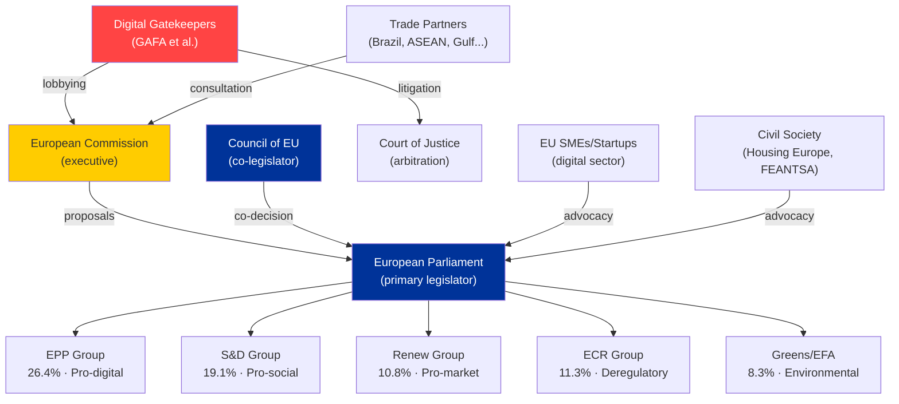

# Stakeholder Map — EU Parliament Propositions | 2026-05-29

## Framework
Stakeholder analysis follows the Actor Mapping methodology with power/interest matrix positioning, coalition dynamics assessment, and influence vectors. Admiralty grading applied per artifact.

---

## Tier 1: Primary Legislative Actors

### 1. EPP (European People's Party) — 188 seats
**Power**: 🟢 VERY HIGH — largest group, Commission President sponsor  
**Interest**: 🟢 HIGH — owns the competitiveness/digital agenda  
**Position on AI-trade strategy**: ✅ Strongly supportive — frames as EU competitiveness imperative  
**Position on international agreements**: ✅ Supportive — geopolitical actor framing  
**Position on DMA enforcement**: 🟡 Cautious — some MEPs concerned about over-regulation burden on EU tech firms  
**Key MEPs (AI/Trade)**: MEPs from INTA and ITRE committees — EPP typically holds chair or vice-chair on at least one  
**Strategic interest**: Ensure AI Act compliance is not seen as burden vs. US/China; use AI-trade chapters in FTAs to export EU standards globally  
**Perspective**: The EPP views the AI-trade resolution as vindication of the Draghi Report recommendations on European competitiveness — the EU cannot maintain a strict domestic regulatory framework while allowing less-regulated imports to undercut EU producers. The AI-trade chapter model in FTAs is the EPP's answer to regulatory divergence: export the standard rather than lower it.

### 2. S&D (Socialists and Democrats) — 136 seats
**Power**: 🟢 HIGH — indispensable in majority coalition  
**Interest**: 🟢 HIGH — digital/AI agenda intersects with labour rights  
**Position on AI-trade strategy**: ✅ Conditional support — insists on algorithmic accountability, worker rights, non-discrimination clauses  
**Position on DMA enforcement**: ✅ Strongly supportive — platform power challenge aligns with S&D's anti-monopoly agenda  
**Position on fisheries agreements**: ✅ Supportive with sustainability conditionality  
**Key MEPs**: Social Democratic MEPs from major fishing nations (Spain, France, Portugal) — supportive of fisheries agreements; German S&D — critical on DMA enforcement  
**Strategic interest**: Ensure digital transition is socially just; prevent AI Act from becoming competitiveness race to bottom; use fisheries agreements to support coastal communities  
**Perspective**: S&D sees the AI-trade strategy as a necessary complement to the AI Act, but insists that workers in AI-impacted sectors must have adjustment support written into the trade chapters. The subcontracting chain resolution (TA-10-2026-0050) adopted in February already laid groundwork. S&D's core constituency — organised labour, coastal fishing communities, healthcare workers — all face direct AI disruption or fisheries economic dependence.

### 3. Renew Europe — 77 seats
**Power**: 🟡 MEDIUM-HIGH — pivotal in majority coalition  
**Interest**: 🟢 HIGH — digital single market is core identity issue  
**Position on AI-trade strategy**: ✅ Very strongly supportive — digital market liberalisation framing  
**Position on international agreements**: ✅ Strongly supportive — multilateralism, free trade  
**Position on DMA enforcement**: ✅ Supportive but urges proportionality; some MEPs worried about chilling effect  
**Key MEPs**: French liberal MEPs on INTA; Dutch/Belgian MEPs on ITRE  
**Strategic interest**: Position EU as global digital trade leader; use AI chapters in FTAs to create level playing field  
**Perspective**: Renew sees the AI-trade resolution as the natural extension of the EU Digital Single Market project that Renew's predecessors (ALDE) championed. For Renew, the EU's comparative advantage in AI governance is its legitimacy and rules-based approach — not technological leadership per se. The trade diplomacy dimension (using FTA digital chapters to set standards) is exactly the Brussels Effect strategy Renew believes in.

### 4. ECR (European Conservatives and Reformists) — 78 seats
**Power**: 🟡 MEDIUM  
**Interest**: 🟡 MEDIUM  
**Position on AI-trade strategy**: 🟡 Mixed — supports competitiveness; sceptical of regulatory burden  
**Position on international agreements**: 🟡 Case-by-case — favours agreements that reduce EU dependence  
**Position on DMA enforcement**: 🔴 Opposed — views DMA as over-regulation; Italian MEPs worried about impact on EU tech sector  
**Key MEPs**: Polish and Italian ECR MEPs split on digital regulation  
**Perspective**: ECR's internal tension on AI and digital reflects its east-west split. Polish ECR MEPs (PiS-aligned) are more EU-sceptic on competence grounds; Italian Fratelli d'Italia MEPs are pragmatically pro-business on digital but eurosceptic on sovereignty grounds. The AI-trade resolution likely attracted ECR votes on the competitiveness framing while losing some on the EU sovereignty/standards-export dimension.

### 5. Patriots for Europe — 84 seats
**Power**: 🟡 MEDIUM (opposition)  
**Interest**: 🟡 MEDIUM  
**Position on AI-trade strategy**: 🔴 Opposed — sovereignty framing; want member-state control of AI regulation  
**Position on international agreements**: 🔴 Opposed to agreements with human rights conditionality; some fisheries support  
**Position on DMA enforcement**: 🟡 Populist split — anti-Big Tech rhetoric but anti-regulation  
**Key MEPs**: French Rassemblement National, Hungarian Fidesz  
**Perspective**: Patriots for Europe's opposition to the AI-trade strategy is grounded in national sovereignty arguments — they reject the notion of the EU setting global digital standards via trade agreements, viewing this as an overreach of EU competence into national industrial policy. However, their anti-Big Tech populism creates an internal contradiction: opposing both DMA regulation and the platform power it targets.

---

## Tier 2: EU Institutional Actors

### 6. European Commission — DG TRADE, DG CNECT
**Power**: 🟢 VERY HIGH — treaty initiative right; FTA negotiation mandate  
**Interest**: 🟢 HIGH — AI-trade strategy directly supports Commission's digital and trade agenda  
**Position**: ✅ Supportive of AI-trade EP resolution — will use it as legislative basis for future FTA digital chapter revisions  
**Key directorates**: DG TRADE (FTA negotiation), DG CNECT (AI Act implementation), DG COMP (DMA enforcement)  
**Perspective**: The Commission views the EP's AI-trade resolution as providing democratic legitimacy for what it was already doing in FTA digital chapters. DG COMP is under pressure from both EP (DMA enforcement resolution) and industry (proportionality concerns) — a classic principal-agent tension between legislative mandate and administrative capacity.

### 7. Council of the EU (Presidency: Poland in H1 2026, Denmark in H2 2026)
**Power**: 🟢 VERY HIGH — co-legislator; international agreement ratification partner  
**Interest**: 🟡 MEDIUM — AI-trade is Commission/Parliament-led  
**Position**: Nuanced — some Member States (France, Germany) want stronger AI trade chapters; others (Eastern Europe) worry about competitiveness burden  
**Perspective**: The Polish Presidency (January–June 2026) has prioritised defence, energy, and enlargement — AI-trade is not a headline priority. However, the consent votes on international agreements (Uzbekistan, Canada, Lebanon) require Council agreement as co-institutional actor. The agreement cluster adopted 2026-05-20 reflects Council-Parliament alignment.

### 8. ENVI Committee (Environment, Public Health, Food Safety)
**Power**: 🟡 MEDIUM on propositions domain (lead on forest material, animal welfare)  
**Key files**: Forest reproductive material (TA-10-2026-0168), animal welfare/dogs-cats (TA-10-2026-0115)  
**Perspective**: ENVI is delivering on the Green Deal legislative implementation agenda. Forest reproductive material is a technical but important piece of the Nature Restoration Law implementation puzzle. ENVI MEPs worked across party lines (EPP, S&D, Greens) on this legislation.

---

## Tier 3: External Stakeholders

### 9. Tech Industry (Google/Alphabet, Apple, Meta, Amazon, Microsoft)
**Power**: 🟢 HIGH (lobbying, economic significance)  
**Interest**: 🔴 HIGH — DMA enforcement and AI-trade resolution directly affect business models  
**Position**: Opposed to both DMA enforcement acceleration and AI-trade chapter expansion of AI Act obligations extraterritorially  
**Concern**: AI-trade chapters in FTAs could export AI Act compliance obligations to US operations handling EU-related data/AI systems  
**Perspective**: Tech majors have invested heavily in DMA compliance frameworks (interoperability, data portability). Further enforcement escalation increases compliance costs. The AI-trade resolution's potential to embed AI Act standards in FTAs is viewed as regulatory overreach extending EU's unilateral regulatory power into third-country jurisdictions.

### 10. EU Fishing Industry Federations (Europêche, EAPO)
**Power**: 🟡 MEDIUM  
**Interest**: 🟢 HIGH — fisheries agreements directly determine market access for distant-water fleet  
**Position**: ✅ Strongly supportive of new fisheries agreements  
**Concern**: Sustainability clauses must not be used to reduce quota allocations  
**Perspective**: The Cook Islands and São Tomé and Príncipe agreements provide EU fleets with continued Pacific and Atlantic tuna access. With EU-Mercosur fisheries provisions still uncertain, maintaining bilateral SFPAs is critical for Europêche members in Spain (Galicia), France (Brittany), and Portugal.

### 11. Central Asian Governments (Uzbekistan focus)
**Power**: 🟡 MEDIUM (bilateral significance)  
**Interest**: 🟢 HIGH — EPCA provides trade preferences and EU market access  
**Position**: ✅ Supportive — agreement locks in EU partnership amid competing Russia/China influence  
**Perspective**: For Uzbekistan, the EP's consent to the EPCA signals EU recognition of the reform trajectory under President Mirziyoyev. The agreement provides preferential trade access (GSP+) and EU investment in connectivity/infrastructure. The EP's conditionality (human rights progress) creates incentives for continued reform — or at minimum, the appearance of it.

### 12. Civil Society and AI Ethics Groups (AlgorithmWatch, EDRi, Access Now)
**Power**: 🔴 LOW (lobbying) but 🟡 MEDIUM (public mobilisation)  
**Interest**: 🟢 HIGH — AI Act implementation, DMA enforcement, AI governance in trade  
**Position**: ✅ Supportive of DMA enforcement; 🟡 Mixed on AI-trade (support governance standards, worry about trade agreement non-accountability)  
**Perspective**: Civil society groups support the AI-trade resolution's governance ambitions but raise concerns about democratic accountability of AI provisions negotiated in trade agreements — unlike AI Act, FTA digital chapters are negotiated by Commission without full EP co-legislative role.

---

## Power/Interest Matrix Summary

```
HIGH INTEREST
    |
    S&D ——————— EPP ——————— Commission ——————— Tech industry
    Renew ——————————————————————— Europêche
    ECR (partial)                    Uzbekistan
    Patriots (partial)
    |
LOW POWER ————————————————————————— HIGH POWER
    |
    Civil society                    Council
    EDRi, AlgorithmWatch             ENVI Committee
    |
LOW INTEREST
```

---

## Coalition Assessment

**AI-Trade Resolution Victory Coalition** (estimated 520–560 votes FOR):
EPP + S&D + Renew + Greens/EFA + The Left (partial) + ECR (partial)
= 188 + 136 + 77 + 53 + 23 + 30 ≈ 507 minimum, likely 520–550 with non-attached

**Opposition** (estimated 140–170 votes AGAINST):
Patriots + ESN + ECR (hardliners) + some non-attached
= 84 + 25 + 48 + 15 ≈ 172 maximum

**Implication**: The AI-trade resolution passed with a strong but not unanimous majority — reflecting genuine cross-party consensus on EU digital sovereignty while isolating far-right and hard-eurosceptic voices.

## § 5. Stakeholder Network Map



## § 6. Stakeholder Salience Index (Power × Interest)

| Stakeholder | Power (1–5) | Interest (1–5) | Salience Score | Engagement Priority |
|-------------|-------------|----------------|---------------|---------------------|
| European Commission | 5 | 5 | 25 | CRITICAL |
| EPP Group | 5 | 5 | 25 | CRITICAL |
| GAFA Gatekeepers | 4 | 5 | 20 | HIGH |
| S&D Group | 4 | 4 | 16 | HIGH |
| Council Presidency (PL) | 4 | 4 | 16 | HIGH |
| Digital SMEs/Startups | 2 | 5 | 10 | MEDIUM |
| Civil Society (Housing) | 2 | 5 | 10 | MEDIUM |
| Trade Partners | 3 | 3 | 9 | MEDIUM |
| ECR Group | 3 | 3 | 9 | MONITOR |
| PfE/ESN Groups | 2 | 2 | 4 | LOW |

## § 7. Coalition Building Opportunities

**EPP–S&D Grand Coalition (essential for most legislation)**:
- Common ground: DMA enforcement, most INTL agreements, procedural reform
- Fault lines: Housing mandate scope, AI worker protection provisions, defence spending balance

**EPP–Renew Digital Alliance**:
- Core bloc for AI-Trade, DMA competition chapters, digital single market
- Risk: Renew's smaller size (77 seats) requires Greens or partial S&D to achieve majority

**S&D–Greens Progressive Alliance**:
- Pushes for stronger housing, environmental, and social provisions
- Insufficient alone; requires EPP centre to pass anything

🟡 MEDIUM confidence — coalition dynamics inferred from group positions, not roll-call data
