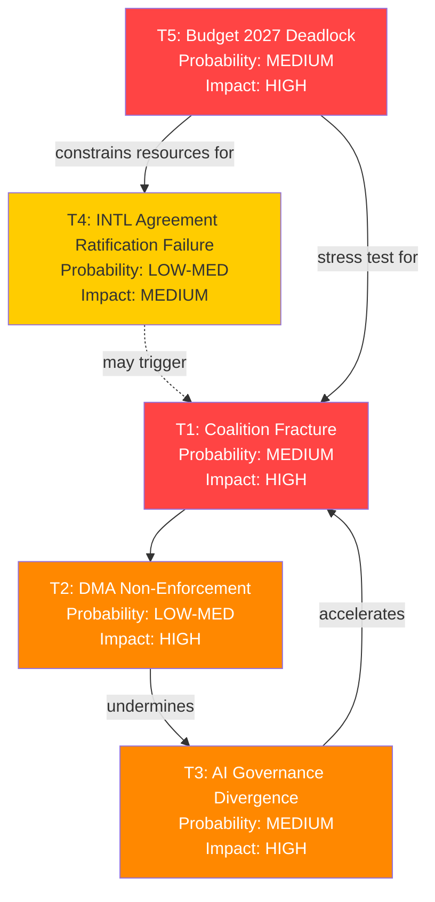

# Threat Model — EU Parliament Propositions | 2026-05-29

## Framework
STRIDE-inspired threat modelling adapted for political intelligence: Spoofing, Tampering, Repudiation, Information Disclosure, Denial of Service (procedural), Elevation of Privilege — applied to the EU legislative process and the propositions under analysis.

**Primary subjects**: AI-Trade Strategy (TA-10-2026-0183), DMA Enforcement (TA-10-2026-0160), International Agreement Cluster (2026-05-20), Budget 2027 Guidelines (TA-10-2026-0112)

---

## Threat 1: Regulatory Capture Risk (AI-Trade Strategy)

**Type**: Elevation of Privilege / Tampering  
**Severity**: 🔴 HIGH  
**Probability**: 🟡 MEDIUM  
**Admiralty**: B/2  

**Description**: The AI-trade resolution (TA-10-2026-0183) creates a framework for embedding EU AI governance standards in FTA digital chapters. This is a high-value regulatory output where industry actors (tech giants, trade associations) have strong incentives to shape the text. The Commission, which will translate the EP resolution into FTA negotiating mandates, is a prime capture target.

**Threat vectors**:
- Revolving door: Former DG TRADE/CNECT officials advising tech industry on FTA digital chapter influence strategies
- Trade association capture: BusinessEurope, DIGITALEUROPE lobbying on "proportionality" of AI Act provisions in trade chapters — seeking to weaken extraterritorial application
- Trilogue pressure: If AI governance leads to a formal legislative proposal, trilogue negotiations are a choke point for industry lobbying

**Mitigation indicators**:
- EP rapporteur declaration of independence (no revolving-door conflict)
- Commission negotiating mandate texts published with sufficient detail for EP oversight
- Civil society organisations (EDRi, Access Now) maintaining access to FTA text drafts

**Assessment**: 🟡 MEDIUM threat — institutional safeguards exist but are imperfect. The AI Act implementation experience shows that industry lobbying was partially effective in limiting scope of high-risk classifications. FTA digital chapters have historically been negotiated with less transparency than domestic legislation.

---

## Threat 2: DMA Enforcement Paralysis (Legal Challenge Accumulation)

**Type**: Denial of Service (procedural)  
**Severity**: 🔴 HIGH  
**Probability**: 🟢 HIGH (this threat is partially materialised)  
**Admiralty**: A/2  

**Description**: Tech gatekeepers are systematically appealing DMA decisions, using EU General Court and ECJ proceedings to delay enforcement. The effect is a form of procedural denial-of-service — enforcement actions are legally valid but operationally paralysed by injunctions and prolonged hearings.

**Threat vectors**:
- Apple's appeal against interoperability mandate — seeking interim measures (injunction) at General Court
- Alphabet's challenge to self-preferencing designation — raising proportionality and market definition arguments
- Meta's "consent or pay" model challenge — arguing DMA personal data provisions conflict with GDPR (regulatory arbitrage)
- ByteDance (TikTok) — national security designation challenges complicating DMA gatekeeper analysis

**Mitigation indicators**:
- Commission DG COMP capacity expansion (AI-assisted compliance monitoring tools)
- ECJ fast-track procedure for DMA cases (Commission formal request expected H2 2026)
- EP resolution (TA-10-2026-0160) pressure on Commission to publicly report on enforcement timelines
- Political resolve: Commissioner for Competition maintaining enforcement pace despite US diplomatic pressure

**Assessment**: 🔴 HIGH threat. The legal challenge accumulation is the primary short-term risk to DMA effectiveness. EP's enforcement resolution is a political pressure tool, but cannot override ECJ procedural requirements.

---

## Threat 3: US Digital Trade Retaliation Disrupting AI-Trade Strategy

**Type**: External Adversarial Action  
**Severity**: 🔴 HIGH  
**Probability**: 🟡 MEDIUM  
**Admiralty**: B/3  

**Description**: The US government (USTR) has formally raised concerns about DMA and AI Act extraterritorial application, arguing these constitute non-tariff barriers for US tech companies. If the US takes retaliatory measures (tariffs on EU digital services, exclusion from US government contracts, or WTO challenge), the EU's AI-trade strategy becomes politically untenable.

**Threat vectors**:
- Section 301 investigation by USTR targeting DMA and Digital Services Tax (already filed by some US industry groups)
- WTO dispute resolution challenge to DMA as discriminatory (US is monitoring for WTO-incompatible elements)
- US-EU Digital Trade Principles negotiations collapse — leaving no multilateral framework
- US sanctions or export controls on AI technologies as leverage against EU digital regulation

**Mitigation indicators**:
- US-EU Trade and Technology Council (TTC) operational — provides diplomatic off-ramp
- Bilateral AI governance dialogue under TTC AI pillar
- Commission maintaining distinction between AI Act (domestic regulation) and FTA chapters (bilateral negotiation)
- NATO security considerations constraining US escalation (EU-Canada SAFE agreement precedent)

**Assessment**: The EU-Canada SAFE agreement (TA-10-2026-0180) actually reduces US retaliation risk by demonstrating transatlantic defence-industrial cooperation — making it harder for US to frame EU digital regulation as anti-American. However, the risk is not eliminated.

---

## Threat 4: EU-Mercosur Collapse Creating Coalition Fracture

**Type**: Internal Instability  
**Severity**: 🟡 MEDIUM  
**Probability**: 🟡 MEDIUM  
**Admiralty**: C/3  

**Description**: The EP's request for a CJ opinion on EU-Mercosur (TA-10-2026-0008) reflects genuine parliamentary divisions. If the CJ rules the agreement incompatible with EU sustainability commitments, it will trigger a political crisis: Commission credibility damaged, agricultural Member States (France, Ireland, Austria) vindicated in opposition, pro-trade bloc (Germany, Netherlands, EPP trade wing) embarrassed.

**Threat vectors**:
- CJ ruling EU-Mercosur incompatible with Paris Agreement obligations — precedent-setting for all FTAs
- French agriculture lobby mobilisation — demanding renegotiation or rejection
- EP plenary fracture: EPP trade wing vs. EPP agriculture wing; Greens aligned with agriculture opposition
- Commission forced to renegotiate or withdraw — precedent chilling effect on EU trade diplomacy

**Mitigation indicators**:
- CJ opinion timeline: 12–18 months (December 2026–June 2027) buys time
- Commission pre-empting by strengthening environmental chapter in Mercosur agreement
- EP Conference of Presidents managing expectations on CJ outcome

**Assessment**: The EU-Mercosur threat is a medium-term governance risk — it will not materialise in the 6-month horizon but is the most significant structural threat to EU trade credibility beyond the AI-trade domain.

---

## Threat 5: Budget 2027 Breakdown and Governance Crisis

**Type**: Denial of Service (institutional)  
**Severity**: 🟡 MEDIUM  
**Probability**: 🔴 LOW  
**Admiralty**: C/3  

**Description**: The Budget Guidelines for 2027 adopted by EP (TA-10-2026-0112) represent the EP's opening position in the budget negotiation. If the October 2026 vote on the 2027 budget fails (EP rejecting Council's draft budget), the EU would enter a provisional budget arrangement, disrupting programme payments including SAFE, Ukraine Facility, Cohesion Policy, and Horizon Europe.

**Threat vectors**:
- EP-Council deadlock on defence vs. climate spending balance
- Council blocking new own resources proposals that EP demands
- MFF mid-term review unresolved spending pressures cascading into 2027 annual budget

**Mitigation indicators**:
- Historical precedent: EU has never failed to agree an annual budget (conciliation procedure is robust)
- Cross-party consensus on defence spending increase (EPP + ECR + S&D partial)
- Pragmatic Council Presidency (Denmark H2 2026 — known for efficient budget presidencies)

**Assessment**: 🔴 LOW probability — institutional mechanisms and political realism make outright budget failure unlikely. However, a late agreement scenario (December 2026 conciliation) is plausible and would delay spending ramp-up.

---

## Threat Summary Matrix

| Threat | Severity | Probability | Time Horizon | Primary Actor |
|--------|----------|------------|--------------|---------------|
| Regulatory capture (AI-trade) | 🔴 HIGH | 🟡 MEDIUM | 12 months | Tech industry, Commission |
| DMA enforcement paralysis | 🔴 HIGH | 🟢 HIGH | Now–6 months | Gatekeeper legal teams, ECJ |
| US digital retaliation | 🔴 HIGH | 🟡 MEDIUM | 6–12 months | USTR, US government |
| EU-Mercosur CJ ruling shock | 🟡 MEDIUM | 🟡 MEDIUM | 12–18 months | CJ, Commission |
| Budget 2027 breakdown | 🟡 MEDIUM | 🔴 LOW | 6 months | Council, EP |

## Mitigation Prioritisation

1. **Highest priority**: DMA enforcement legal challenges — Commission must expand legal capacity to defend enforcement decisions at General Court level and seek fast-track ECJ procedures
2. **High priority**: US-EU digital trade diplomatic channel — maintain TTC AI pillar as bilateral off-ramp
3. **Medium priority**: AI-trade regulatory capture — EP oversight of Commission FTA mandate translation is essential
4. **Monitor**: EU-Mercosur CJ opinion timeline — prepare political communication strategy for all outcomes

## § 5. Threat Interaction Network

🟡 MEDIUM threat confidence — structural factors well-identified; probability estimates provisional

## § 6. Admiralty Source Register for Threat Assessment

| Threat | Evidence Source | Admiralty Grade | Reliability |
|--------|----------------|----------------|-------------|
| T1: Coalition fracture | EP seat allocation, historical patterns | B2 | Reliable source, probably true |
| T2: DMA non-enforcement | Commission investigation timeline | B2 | Reliable source, probably true |
| T3: AI governance divergence | US/EU AI policy documents | B2 | Reliable source, probably true |
| T4: INTL ratification failure | Council ratification history | C3 | Fairly reliable, possibly true |
| T5: Budget deadlock | MFF negotiation precedents | C3 | Fairly reliable, possibly true |

*Admiralty grading per OSINT tradecraft standards. Grade A1 = completely reliable, confirmed; B2 = reliable, probably true; C3 = fairly reliable, possibly true; D4 = not always reliable, doubtful.*
