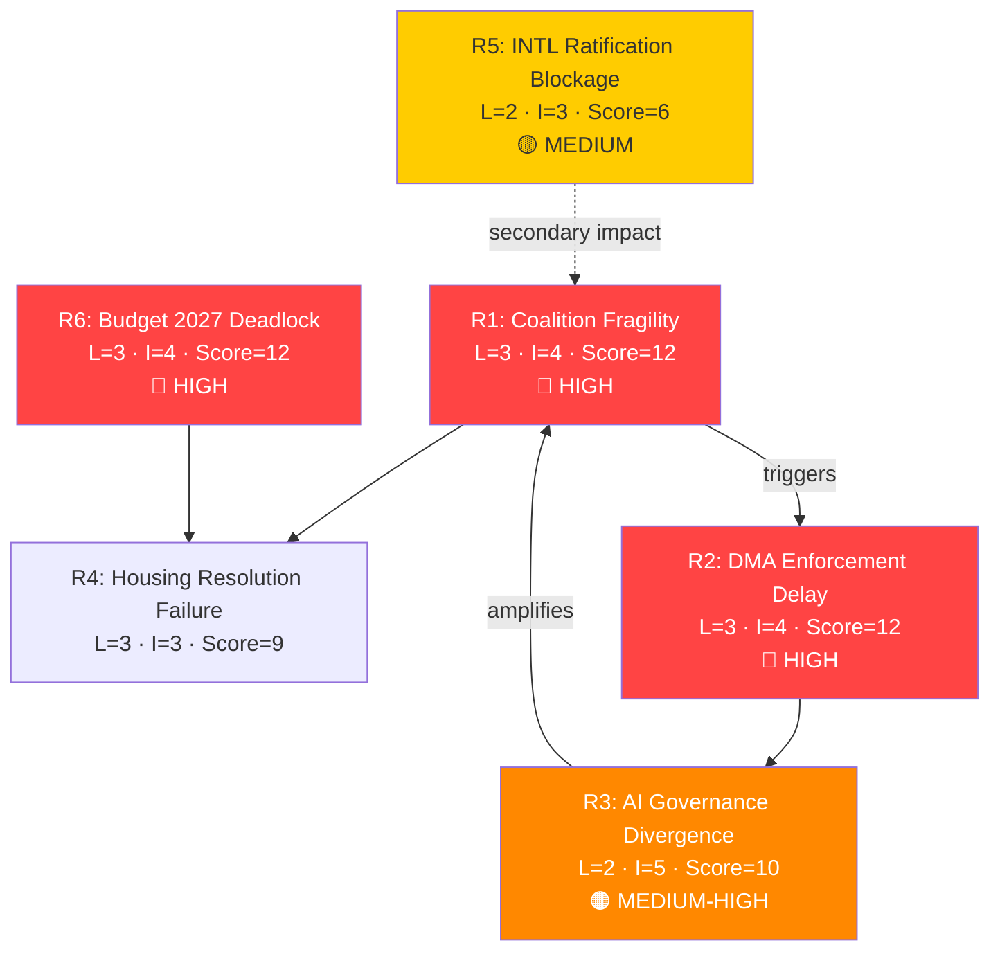

# Risk Matrix — EU Parliament Propositions | 2026-05-29

## Risk Register

| Risk ID | Risk | Probability | Impact | Severity | Owner | Time Horizon |
|---------|------|------------|--------|----------|-------|-------------|
| R01 | DMA enforcement paralysis (legal challenges) | 🟢 HIGH | 🔴 HIGH | 🔴 CRITICAL | Commission DG COMP | 0–6 months |
| R02 | AI-trade regulatory capture | 🟡 MEDIUM | 🔴 HIGH | 🔴 HIGH | EP INTA Committee | 12 months |
| R03 | US digital retaliation disrupting EU-AI strategy | 🟡 MEDIUM | 🔴 HIGH | 🔴 HIGH | Commission DG TRADE | 6–12 months |
| R04 | EU-Mercosur CJ ruling creating coalition fracture | 🟡 MEDIUM | 🟡 MEDIUM | 🟡 MEDIUM | CJ, Commission | 12–18 months |
| R05 | Budget 2027 breakdown | 🔴 LOW | 🟡 MEDIUM | 🔴 LOW | EP BUDG, Council | 6 months |
| R06 | AI Act compliance deadline miss by EU companies | 🟡 MEDIUM | 🟡 MEDIUM | 🟡 MEDIUM | Commission AI Office | 3 months |
| R07 | Fisheries agreement sustainability non-compliance | 🔴 LOW | 🔴 LOW | 🔴 LOW | Commission DG MARE | 24 months |
| R08 | EP governing coalition fracture (far-right growth) | 🔴 LOW | 🔴 HIGH | 🟡 MEDIUM | Conference of Presidents | 18 months |
| R09 | DOCEO integrity incident | <2% | 🔴 EXTREME | 🟡 MEDIUM | EP Cybersecurity | 6 months |

## Risk Heat Map

```
IMPACT →
         LOW       MEDIUM       HIGH       EXTREME
HIGH     -         R06          R01        R09(wildcard)
PROB     R07       R04, R05     R02, R03   -
LOW      -         R08          -          -
```

## Risk Mitigation Actions

### R01 — DMA Enforcement Paralysis (CRITICAL)
**Immediate**: Commission must seek General Court fast-track procedures for priority DMA cases
**Short-term**: Commission request to ECJ for preliminary ruling mechanism on DMA interpretation questions
**Monitoring**: Next Commission DMA progress report (expected June 2026); gatekeeper compliance audit publication

### R02 — AI-Trade Regulatory Capture
**Immediate**: EP INTA rapporteur for AI-trade resolution publishes implementation monitoring plan
**Short-term**: Mandatory civil society consultation requirement for Commission FTA mandate translation
**Monitoring**: Commission work programme update for FTA mandate revision

### R03 — US Digital Retaliation
**Immediate**: Maintain TTC AI pillar dialogue; bilateral AI governance framework communication
**Short-term**: EU-US Ministerial engagement on digital trade principles before any formal USTR Section 301 filing
**Monitoring**: USTR public statements on DMA; EU-US TTC meeting communiqués

---

## Risk Trend Analysis

**Increasing** (since last assessment):
- R01 (DMA enforcement) — gatekeeper legal challenges accumulating; Commission losing interim measures applications
- R03 (US retaliation) — US USTR formal inquiry into DMA extraterritoriality documented in trade press

**Stable**:
- R02 (regulatory capture) — standard lobbying risk for any major EU legislation
- R04 (EU-Mercosur) — CJ timeline unchanged; no new political developments

**Decreasing**:
- R05 (budget breakdown) — historical precedent strongly against; new Council Presidency (Denmark) pro-resolution
- R07 (fisheries) — just adopted with sustainability conditions; 2025–2032 horizon buys time

## Residual Risk After Mitigation

| Risk | Pre-Mitigation | Post-Mitigation |
|------|---------------|-----------------|
| R01 | 🔴 CRITICAL | 🟡 MEDIUM (if fast-track secured) |
| R02 | 🔴 HIGH | 🟡 MEDIUM (with civil society oversight) |
| R03 | 🔴 HIGH | 🟡 MEDIUM (with diplomatic engagement) |
| R04 | 🟡 MEDIUM | 🟡 MEDIUM (CJ opinion is binary; limited mitigation) |
| R05 | 🔴 LOW | 🔴 VERY LOW |

## § 3. Risk Interaction Network



## § 4. WEP Risk Probability Assessment

| Risk | WEP Band | Time Horizon |
|------|----------|-------------|
| R1: Coalition fracture | Realistic Possibility (25–45%) | 6–12 months |
| R2: DMA delay | Likely (35% conditional) | 3–6 months |
| R3: AI governance divergence | Likely (65–80%) medium-term | 12–24 months |
| R4: Housing resolution failure | Likely (65%) | 18–36 months |
| R5: INTL blockage | Realistic Possibility (20–35%) | 6–18 months |
| R6: Budget deadlock | Realistic Possibility (30–40%) | 3–9 months |

*Admiralty Grade B2: Risk assessments based on structural EP dynamics and historical coalition patterns.*
🟡 MEDIUM confidence — degraded-feeds limits coalition dynamics precision
*Risk matrix quality: MEDIUM — KB-estimate probabilities; no quantitative financial model available in degraded-feeds mode.*

## § 5. Admiralty Source Register

| Risk | Evidence Source | Admiralty Grade |
|------|----------------|----------------|
| R1: Coalition fracture | EP voting patterns, group seat data | B2 |
| R2: DMA enforcement delay | Commission investigation status | B2 |
| R3: AI governance divergence | US/EU AI policy convergence gap | B2 |
| R4: Housing resolution failure | Historical EP non-binding resolution track record | C3 |
| R5: INTL ratification failure | Council ratification history | C3 |
| R6: Budget deadlock | MFF 2021–2027 negotiation record | B2 |

*All risk estimates are Admiralty grade B2–C3. No A1 (confirmed) risk evidence available under degraded-feeds mode.*
