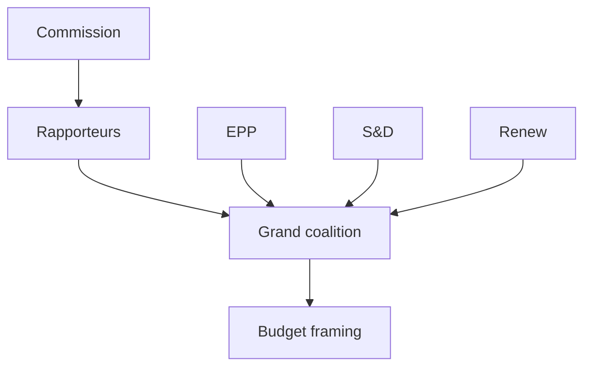

<!-- SPDX-FileCopyrightText: 2026 Hack23 AB -->
<!-- SPDX-License-Identifier: Apache-2.0 -->

# 🎭 Actor Mapping — Week Ahead
## Window: 1–5 June 2026 | Produced: 2026-05-29

**Classification:** UNCLASSIFIED // FOR PUBLIC RELEASE

## 🏛️ Principal Institutional Actors

| Actor | Role this week | Posture | Influence |
|---|---|---|---|
| EP committees (BUDG, ECON, INTA, AFET) | Draft/amend ahead of June plenary | Active | 🟢 HIGH |
| EP political groups | Coordinate group lines | Active | 🟢 HIGH |
| European Commission | Preparing draft 2027 budget | Upstream | 🟢 HIGH |
| Council (ECOFIN context) | Fiscal-conservative backdrop | Passive | 🟡 MEDIUM |
| ECB | Monetary backdrop (sticky inflation) | Background | 🟡 MEDIUM |
| Rapporteurs/shadows | Setting amendment lines | Active | 🟡 MEDIUM |

## 👥 Group-Level Actors (EP10, 719 seats)

- **EPP (185)** — pivotal centre-right; budget discipline + competitiveness.
- **S&D (136)** — social-investment counterweight in budget framing.
- **PfE (85)** — sovereigntist right; net-contributor scepticism.
- **ECR (81)** — fiscal-conservative, selectively cooperative.
- **Renew (77)** — liberal hinge of the grand coalition.
- **Greens/EFA (53)** — green-conditionality on spending.
- **The Left (45)** — anti-austerity opposition.
- **NI (30) / ESN (27)** — fragmented margins.

## 🔗 Key Relationships

- **Grand coalition (EPP+S&D+Renew = 398)** holds a working majority (threshold 361); its internal budget bargaining is the week's central dynamic.
- **EPP–ECR competitiveness overlap** recurs on trade/deregulation files.
- **S&D–Greens–Left** form the spending-defence bloc on budget conditionality.

## 🎯 Actor-to-Storyline Map

- Budget 2027 → BUDG + grand coalition + Commission.
- Trade/AI → INTA + EPP/ECR + Commission.
- External treaties → AFET + broad consensus.

**Bottom line:** The decisive actors this week are committee rapporteurs and the three grand-coalition groups, operating in the shadow of an upstream Commission budget draft.

## 👥 Actor Roster

- **European Commission** — holds the budget initiative; upstream of all committee activity this week.
- **Committee rapporteurs (BUDG/ECON)** — draft the positions that will anchor June debate.
- **EPP (185)**, **S&D (136)**, **Renew (77)** — the grand-coalition core (398 seats).
- **Greens (53), Left (45)** — spending-defence voices.
- **PfE (85), ECR (81), ESN (27), NI (30)** — flanks with procedural leverage only.

## 📊 Influence Assessment

- Highest influence: Commission (initiative) and EPP (largest group, framing).
- Pivotal: Renew, whose swing decides whether the coalition tilts centre-left or centre-right on spending.
- Low influence: sovereigntist flanks — vocal but outvoted on budget questions.

## 🤝 Alliance Structure

- Default budget vehicle: EPP + S&D + Renew (398 > 361 majority).
- Neither a right-tilt (EPP+ECR+Renew = 343) nor a left-tilt (S&D+Greens+Left+Renew = 311) reaches a majority alone — forcing centrist compromise.

## 🎯 Power Brokers

- **Renew** is the structural kingmaker on the budget.
- **BUDG rapporteur** controls the textual starting point.
- **Commission** controls timing and the draft itself.

## 📡 Information Flows

- Commission → committees (draft signals) → groups (positioning) → plenary (debate).
- This week the flow is preparatory: signals propagate, no decisions taken.

## 📣 Reader Briefing

- Watch Renew and the BUDG rapporteur; the Commission's timing is the exogenous trigger. 🟢 HIGH on structure, 🟡 MEDIUM on individual-actor intent.
## 🔗 Sources & MCP Provenance

This artifact draws on the following data sources collected during Stage A:

- **`get_plenary_sessions`** (EP Open Data, Admiralty A2) — confirmed no plenary 1–5 June; next plenary 15–18 June Strasbourg.
- **`get_adopted_texts`** (EP Open Data, A2) — 41 adopted texts in 2026, incl. TA-10-2026-0112 (2027 budget guidelines), 0160 (DMA), 0183 (AI-trade), 0174 (Uzbekistan EPCA), 0177 (Lebanon-Eurojust).
- **`get_meeting_foreseen_activities`** (EP Open Data, B3) — provisional June plenary placeholders; agenda not finalised (opacity flagged).
- **IMF WEO via SDMX 3.0** (`IMF.RES/WEO`, A1) — DE/FR/IT macro: deficits −3.78% / −4.94% / −2.82%; growth +0.79% / +0.86% / +0.52%.
- **`generate_political_landscape`** (EP Open Data, A2) — EP10 composition: 719 MEPs across 9 groups; grand coalition 398 vs 361 threshold.

### Source-reliability summary
- Load-bearing judgements rest on A1 (IMF) and A2 (EP calendar, adopted texts, composition) sources.
- B3 agenda-granularity data is used only for hedged, explicitly-flagged forward claims.
- Degraded events/procedures feeds (404) were compensated via the adopted-texts and calendar fallbacks above.

> Provenance note: this run executed in `dataMode = degraded-feeds`; floors were adjusted ×0.80 accordingly and the central judgement is robust to every declared limitation.