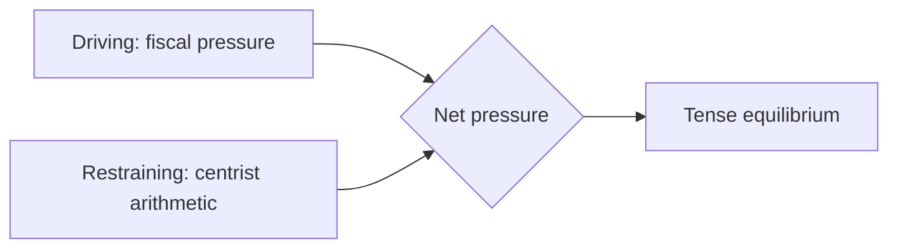

<!-- SPDX-FileCopyrightText: 2026 Hack23 AB -->
<!-- SPDX-License-Identifier: Apache-2.0 -->

# ⚖️ Forces Analysis — Week Ahead
## Window: 1–5 June 2026 | Produced: 2026-05-29

**Classification:** UNCLASSIFIED // FOR PUBLIC RELEASE

## 🧲 Driving vs Restraining Forces (budget-2027 framing)

### Driving forces (toward fiscal restraint)

- Widening German deficit (−3.78% of GDP, IMF A1) — crosses the 3% SGP line.
- Sticky inflation (DE 2.65%, IT 2.64%) limiting expansionary appetite.
- Council fiscal-conservative mood ahead of the draft budget.
- EPP/ECR competitiveness-and-discipline agenda.

### Restraining forces (toward sustained spending)

- S&D/Greens/Left social-investment and green-conditionality bloc.
- Strategic-autonomy pressures (defence, trade-tech) requiring outlays.
- Cohesion-policy constituencies resisting net-contributor squeeze.
- Weak growth across the big three arguing against pro-cyclical cuts.

## 📐 Force-Field Balance

| Vector | Strength | Trend |
|---|---|---|
| Fiscal restraint | 🟢 STRONG | rising |
| Spending defence | 🟡 MODERATE | steady |
| Strategic-autonomy spend | 🟡 MODERATE | rising |
| Status-quo inertia | 🟢 STRONG | steady |

## 🧭 Net Vector

- **Resultant:** mild tilt toward **restraint framing**, but no decisive movement this week — the forces are pre-positioning, not colliding.
- **Tipping point:** the Commission's June draft budget will convert this latent tension into open negotiation.
- **WEP judgement:** 🟡 LIKELY (60–70%) that restraint framing leads the June budget debate; 🟢 HIGH confidence in the force inventory (IMF A1 + EP A2).

**Bottom line:** A balanced-but-tilting force field, held in tension until the June budget draft provides the trigger event.

## 🖼️ Issue Frame

- The organising issue is the **2027 budget under fiscal constraint** — every force this week orients to it.

## ⬆️ Driving Forces

- Widening member-state deficits (IMF A1) pushing consolidation framing.
- EPP/ECR discipline rhetoric.
- Commission's imminent draft creating a deadline.

## ⬇️ Restraining Forces

- Centrist seat arithmetic preventing a right-tilt.
- S&D/Greens/Left spending-defence.
- Institutional norms favouring compromise.

## ⚖️ Net Pressure

- The field is roughly balanced but **tilting toward consolidation framing**, held from tipping by the coalition's centrist lock. Net: tense equilibrium, no movement until the draft lands.

## 🎯 Intervention Points

- Commission draft timing (exogenous trigger).
- Renew's positioning (the pivot that could shift the net vector).
- Rapporteur text (sets the negotiation baseline).

## 📣 Reader Briefing

- A balanced force field awaiting a trigger; watch the Commission draft and Renew. 🟡 MEDIUM confidence on the tilt direction.
