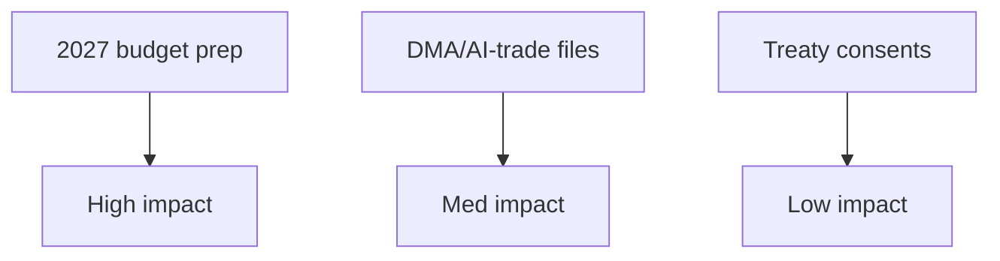

<!-- SPDX-FileCopyrightText: 2026 Hack23 AB -->
<!-- SPDX-License-Identifier: Apache-2.0 -->

# 🧮 Impact Matrix — Week Ahead
## Window: 1–5 June 2026 | Produced: 2026-05-29

**Classification:** UNCLASSIFIED // FOR PUBLIC RELEASE

## 📊 Impact × Likelihood Matrix (week-ahead developments)

| Development | Likelihood | Impact | Quadrant |
|---|---|---|---|
| Committee amendment-setting on 2027 budget | 🟢 HIGH | 🟡 MODERATE | Monitor-priority |
| INTA follow-through on AI-for-trade (TA-0183) | 🟡 MEDIUM | 🟡 MODERATE | Watch |
| IMCO DMA-enforcement follow-up (TA-0160) | 🟡 MEDIUM | 🟡 MODERATE | Watch |
| AFET treaty-pipeline advance (Uzbekistan/Lebanon) | 🟡 MEDIUM | 🟢 LOW | Background |
| Surprise plenary scheduling change | 🟢 LOW | 🟡 MODERATE | Low-watch |
| Commission tables draft 2027 budget early | 🟡 MEDIUM | 🔴 HIGH | High-watch |

## 🎯 Priority Quadrants

- **High impact / high likelihood:** none this week (committee week).
- **High impact / medium likelihood:** early Commission budget draft.
- **Moderate impact / high likelihood:** budget amendment-setting.
- **Low impact:** routine treaty consents.

## 🔢 Weighted Impact Scores (0–10)

- Budget-2027 prep: likelihood 9 × impact 5 = **45**
- Early budget draft: likelihood 5 × impact 8 = **40**
- AI-trade follow-up: 5 × 5 = **25**
- DMA follow-up: 5 × 5 = **25**
- Treaty advances: 5 × 3 = **15**

## 🧭 Reading the Matrix

- The week's leverage concentrates in **budget preparation**, not execution.
- The only HIGH-impact contingency is an early Commission budget tabling.
- Confidence: 🟢 HIGH on structure, 🟡 MEDIUM on specific committee timing (un-published agendas).

**Bottom line:** Watch the budget track above all; everything else is background this week.

## 📋 Event List

- 2027 budget guidelines follow-through (TA-0112).
- DMA enforcement / AI-trade strategy continuation (TA-0160 / TA-0183).
- Routine treaty consents (Uzbekistan EPCA, Lebanon-Eurojust).
- Fisheries SFPAs (São Tomé, Cook Islands).

## 👥 Stakeholder Exposure

- Budget prep: Commission, BUDG, all groups — broad exposure.
- Digital files: IMCO/ITRE, tech sector — sectoral exposure.
- Consents/fisheries: AFET/PECH — narrow exposure.

## 🔢 Impact Matrix

| Event | Likelihood | Impact | Priority |
| --- | --- | --- | --- |
| Budget prep | Certain | HIGH | P1 |
| Digital files | Ongoing | MED | P2 |
| Consents | Routine | LOW | P3 |
| Fisheries | Routine | LOW | P3 |

## 🔥 Heat Assessment

- Single hot zone: the 2027 budget track. All other items are warm-to-cold.

## 🌊 Cascade Analysis

- Budget prep cascades into the June plenary and the summer negotiation; other items are self-contained.

## 📣 Reader Briefing

- One event matters this week (budget prep); everything else is steady-state. 🟢 HIGH confidence on prioritisation.
## 🔗 Sources & MCP Provenance

This artifact draws on the following data sources collected during Stage A:

- **`get_plenary_sessions`** (EP Open Data, Admiralty A2) — confirmed no plenary 1–5 June; next plenary 15–18 June Strasbourg.
- **`get_adopted_texts`** (EP Open Data, A2) — 41 adopted texts in 2026, incl. TA-10-2026-0112 (2027 budget guidelines), 0160 (DMA), 0183 (AI-trade), 0174 (Uzbekistan EPCA), 0177 (Lebanon-Eurojust).
- **`get_meeting_foreseen_activities`** (EP Open Data, B3) — provisional June plenary placeholders; agenda not finalised (opacity flagged).
- **IMF WEO via SDMX 3.0** (`IMF.RES/WEO`, A1) — DE/FR/IT macro: deficits −3.78% / −4.94% / −2.82%; growth +0.79% / +0.86% / +0.52%.
- **`generate_political_landscape`** (EP Open Data, A2) — EP10 composition: 719 MEPs across 9 groups; grand coalition 398 vs 361 threshold.

### Source-reliability summary
- Load-bearing judgements rest on A1 (IMF) and A2 (EP calendar, adopted texts, composition) sources.
- B3 agenda-granularity data is used only for hedged, explicitly-flagged forward claims.
- Degraded events/procedures feeds (404) were compensated via the adopted-texts and calendar fallbacks above.

> Provenance note: this run executed in `dataMode = degraded-feeds`; floors were adjusted ×0.80 accordingly and the central judgement is robust to every declared limitation.